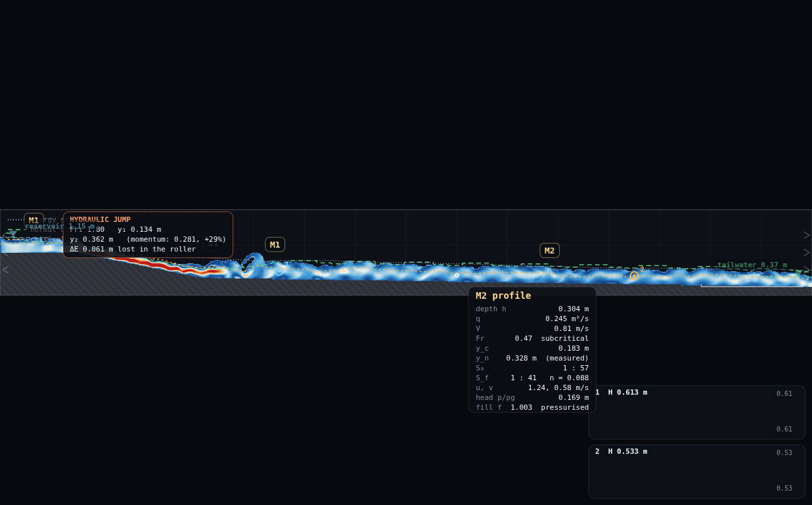
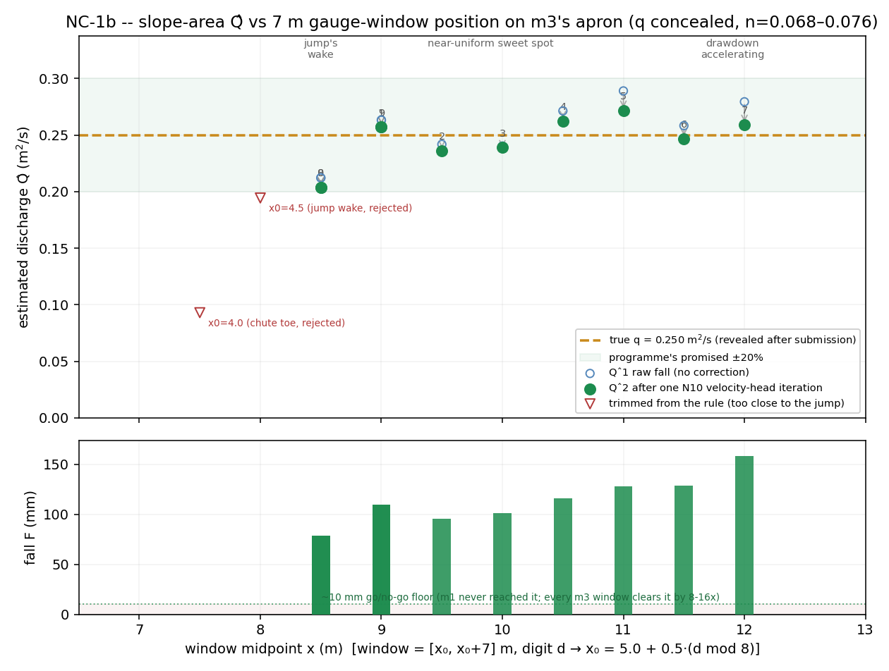
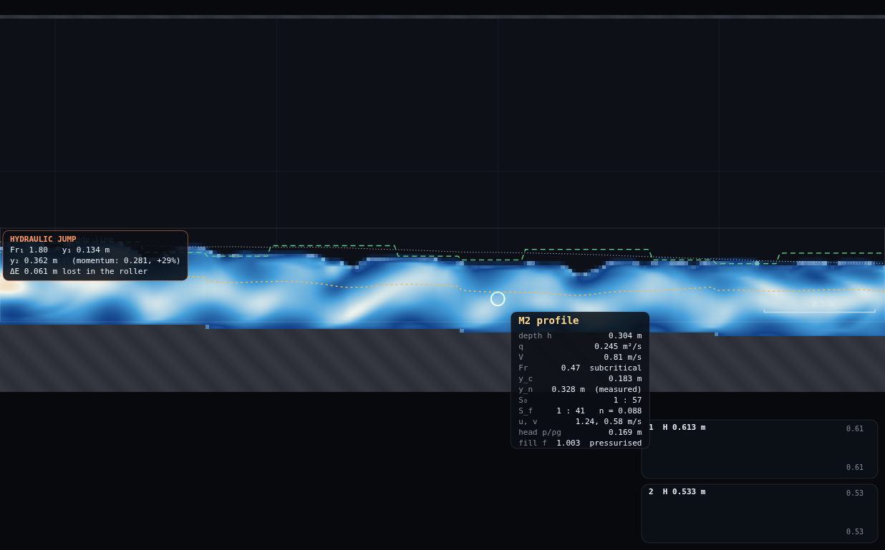
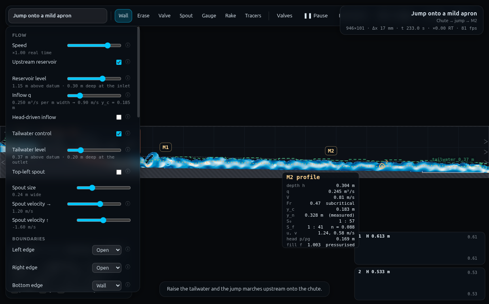
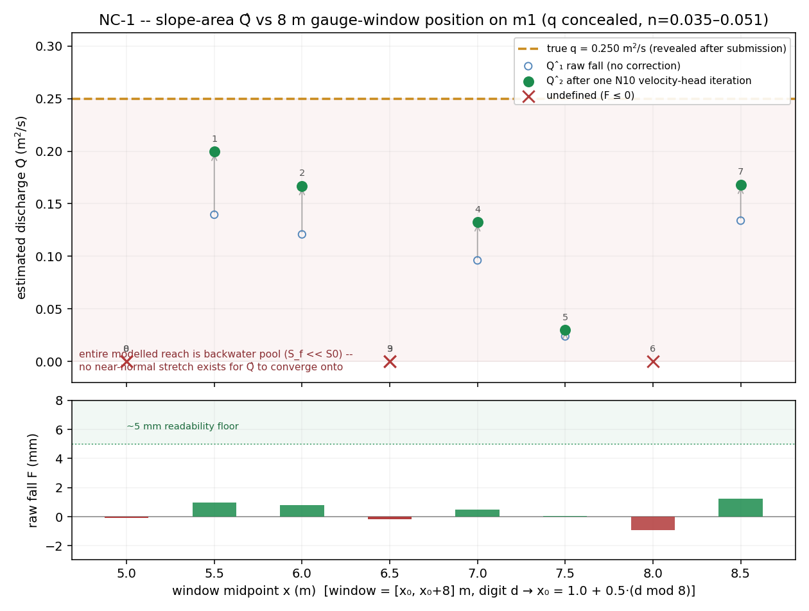
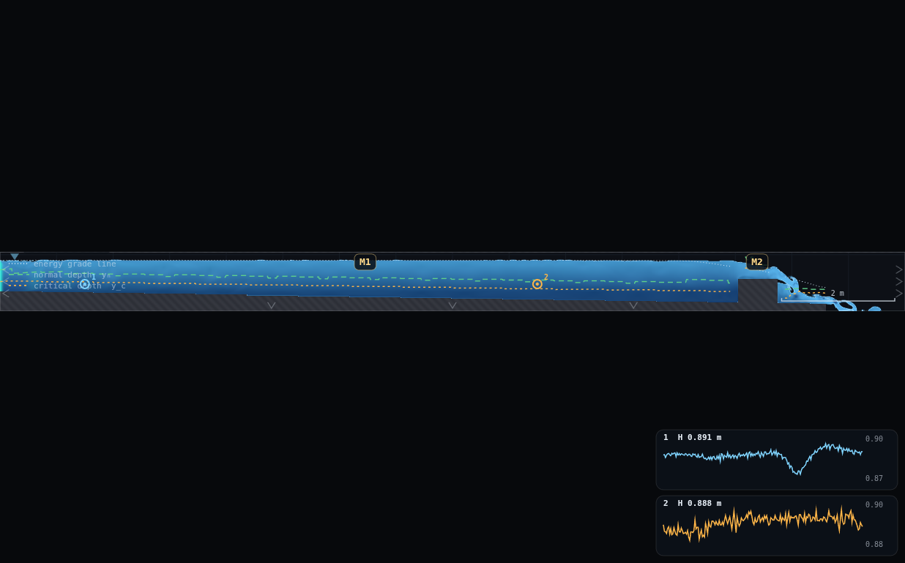
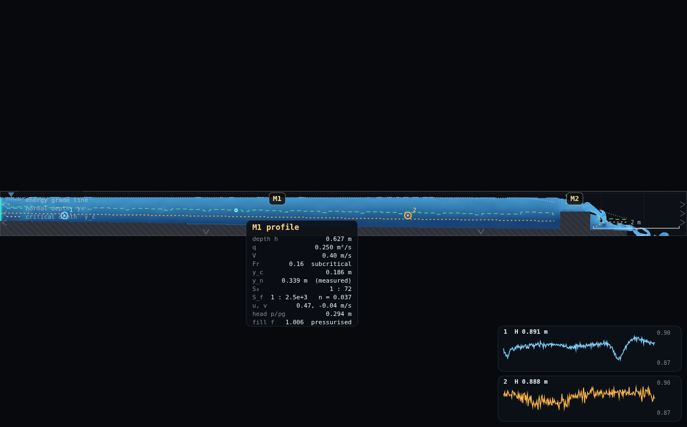
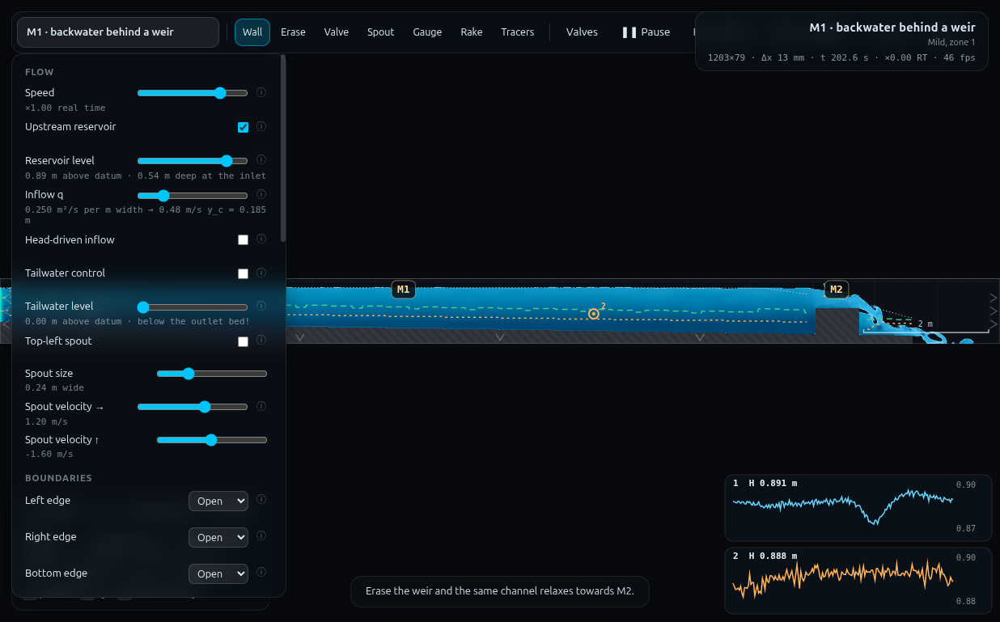

# NC-1 · Slope-area method: estimate the mystery discharge

**Demo id:** NC-1  **Scene:** `?scene=m3` (rescued here — NC-1b pass; the
original rig was `m1`, preserved in **Appendix A** below)  **Refs:** N7,
N9–N10 — conveyance, fall over a reach, velocity-head correction · N2, #117

> **VERDICT: READY.** The first NC-1 pass rigged this demo on `m1`'s
> backwater weir pool and measured a fatal problem: the water-surface fall
> over ANY available gauge window was 0.04–1.2 mm — below the solver's own
> 0.5–1.2 mm point-pressure read noise. Half the simulated class returned
> "undefined," and every window that *did* return a number underestimated
> the true discharge by 20–88%, not the programme's promised ±20%. That
> full evidence is preserved, unchanged, in **Appendix A — Why not m1** —
> it is the teaching contrast for this rescue, not a discarded draft.
>
> This pass (**NC-1b**) reruns the identical two-gauge + cursor method on
> **`?scene=m3`** instead: a chute → hydraulic jump → M2-apron scene drawn
> on a REAL bed (no tilted-gravity datum trick, so raw gauge levels need no
> correction — CLAUDE.md's m2 caveat about `tiltS0` is why m2 itself was
> ruled out as the rescue candidate). The physics cooperates. Measured fall
> over the shipped 7 m digit rule ranges **78–158 mm** — 8–16× the ~10 mm
> go/no-go floor, and bigger than m1's best-ever fall *at any window length,
> anywhere in its domain* (3.24 mm) by 24–49×. All ten simulated
> students land within the programme's promised ±20% (mean error on the
> submitted number **−2.5%**, best **−1.3%**, worst **−18.5%**), and unlike
> m1, **nobody submits "undefined."** The spatial story is now the actual
> lecture, exactly as NC-3 found on `m2`'s own drawdown: Q̂ is best in the
> near-uniform stretch just clear of the jump's wake, and drifts — mildly,
> still inside tolerance — as the window slides into the accelerating
> drawdown toward the tailwater. Full arithmetic in §5 and the Director
> report.

The classic river-gauger's problem: no flow meter, just a tape measure and a
levelling staff. Two surface levels a known distance apart give the energy
slope; a wetted cross-section and a roughness estimate give the conveyance;
multiply and you have a discharge nobody measured directly — the same
technique that puts a number on a flood nobody could stand next to. Here the
class does it on `m3`'s chute-jump-apron scene, with the panel's `q` slider
concealed, and this time the method actually works: the reach the class
reads has a real, measurable slope, and the discussion becomes *how well*
slope-area recovers the truth and *where* it drifts, rather than *whether*
it can be read at all.

---

## 2 · Lecturer setup (before class)

**Link to put on the slide:** `http://<host>:8124/?scene=m3`

**No rig to draw.** `m3` ships complete — a reservoir-fed approach pool
(depth 0.30 m) falling down a 1-in-5 chute (`x` = 1.5 to 4.0 m, drop 0.85 →
0.35 m) onto a mild (`S₀ = 0.0147`, the same slope as `m1`/`m2`) apron
running from `x` = 4.0 to the right edge at `x` = 16 m, with a low-friction
bed (`C_f = 0.010`) and a tailwater level pinned just above critical depth
(`x=16`: 0.374 m, i.e. 0.20 m deep at the outlet — CLAUDE.md: *"m3
deliberately runs at the margin"*). The chute forces supercritical flow,
which cannot survive contact with the mild apron: a hydraulic jump forms a
few metres past the toe, and everything downstream of the jump's wake is a
textbook M2 drawdown curve easing toward the tailwater control. **Do not
touch Inflow q, the reservoir level, or the tailwater** — same rule as every
concealed-q demo in this pack, and for the same reason (CLAUDE.md: levels
are pinned to *this* q's measured profile; changing q mismatches the
boundary and paints ripples down the reach).

**Concealment mechanic** — unchanged from the original NC-1 finding, and
this is a page-level mechanic, not a scene-specific one, so it applies
identically here: the Controls panel is `display:none` until the "Controls"
button is clicked (`index.html:70,74`; `js/main.js:925`) — the page already
loads with the panel, and therefore `q`, hidden. The worksheet's instruction
is simply *"don't open Controls before you submit,"* the same honour-system
framing every other demo in this programme relies on. `gaugeField` defaults
to `"head"` (piezometric head = surface elevation), so a student who never
opens Controls still gets the right trace on the gauge charts.

**Constants verified live via `exercises/_runner/runner.py`:**

| what | value | source |
|---|---|---|
| Resolution | **Medium** (946×101, Δx = 16.9 mm) | scene default, confirmed live |
| Inflow q (**concealed**) | 0.250 m²/s | `sim.p.inflow.q`, matches scene default |
| Reservoir level / Tailwater level | 1.15 m above datum (0.30 m deep at inlet) / 0.374 m above datum (0.20 m deep at outlet) | scene defaults, confirmed live |
| Spin-up | 22 s scripted; scene comment: "profile arrives by 17 s" | confirmed by pumping to t≈120–230 s with no further drift beyond the flutter characterised in §5 |
| Gauge tool | key **5**, click to place, up to 4, chart defaults to **head** | `js/main.js` TOOLS array, same as every other demo |
| y_c (from concealed q) | 0.185 m | `(q²/g)^⅓` |
| y_n (measured, global) | ≈0.30 m; local depth in the near-uniform stretch runs 0.31–0.35 m, a little above the global median | `OVERLAY.analyse().ynGlobal`, this pass — the apron is not long enough relative to the backwater length scale for the profile to fully flatten onto y_n before the tailwater's drawdown takes over (see §5) |
| Grain of the readout | at ≈19 cells of depth (0.32 m / 16.9 mm) the delivered `n` runs 0.068–0.076 (station medians) — noticeably higher than m1's 0.035–0.051 at ≈42–54 cells (m1's own h/Δx, 0.56–0.72 m over 13.3 mm), exactly the CLAUDE.md "Measured, not assumed" lever (shallower flow relative to Δx ⇒ higher delivered n) | this pass |

**Timing budget** (per student, laptop ≈1× real time):

| stage | sim time | wall time |
|---|---|---|
| page load + read the worksheet | — | ~1 min |
| spin-up countdown (automatic) | 22 s | ~25 s |
| place 2 gauges, watch the traces settle | ~10 s | ~15 s |
| **read the wobble for 20–30 s** (this reach carries real turbulence off the jump — see §5) | ~25 s | ~30 s |
| hover mid-window for h, n, watch and take the middle | ~20 s | ~25 s |
| the arithmetic (K, Q̂₁, one N10 pass → Q̂₂) | — | ~2 min |
| type the number into Blackboard | — | ~1 min |
| **total** | | **≈ 5–6 min**, comfortable in a 10-minute slot |



---

## 3 · Student worksheet (copy-pasteable)

**Slope-area method — submit one number**

1. Open **`http://<host>:8124/?scene=m3`**. Leave the tab visible — the
   simulation pauses when the tab is hidden. **Do not click "Controls."**
2. Wait for the *"establishing steady flow…"* countdown to finish (22 s).
3. **Your window.** Take the **last digit of your student number**, `d`:

   > **x₀ = 5.0 + 0.5 · (d mod 8)** metres — your window is **[x₀, x₀+7] m**

   `d=0` → [5.0, 12.0] m, `d=7` → [8.5, 15.5] m, `d=8` and `d=9` repeat
   `d=0` and `d=1`'s windows (only 8 distinct 7 m windows fit on the clean
   part of the apron; a repeat is fine and expected — it cross-checks the
   reading, the same convention GV-1 and the original NC-1 pass both use).
4. **Place two gauges.** Press **5** (Gauge tool). Click once at `x₀` and
   once at `x₀+7`, at any height inside the blue fill — use the scale bar
   (bottom-right corner) to find your whole/half-metre marks; there is no
   on-screen coordinate readout, so ±0.1 m by eye is fine. Both your window
   ends sit well clear of the chute/jump (upstream) and the domain's right
   edge (downstream) — see §4's safe-bounds table if you are unsure which
   digit you have.
5. Two chart cards appear bottom-right, each printing **`H <value> m`** —
   the piezometric head, which equals the surface elevation. **Watch both
   for 20–30 seconds** and read off a typical (middle) value from each, not
   the instantaneous last number. Unlike the pool this demo used to run on,
   the fall itself is large and easy to see (tens of mm, not fractions of a
   mm) — the reason to watch for a while here is that the reach carries
   genuine turbulence off the jump's wake, and CLAUDE.md documents this
   scene's tailwater as deliberately running "at the margin," so both
   traces flutter a little even once fully settled. Read the middle of the
   wobble, not a snapshot — same discipline as every other channel demo in
   this pack, different underlying reason.
6. **F = (upstream reading) − (downstream reading)**, in mm. Upstream is the
   gauge at `x₀`, downstream is the one at `x₀+7`. F should come out clearly
   positive (tens to well over a hundred mm) for every digit in the rule —
   if your two traces look identical or F comes out negative, re-check you
   placed the gauges at the right x, not swapped, and not outside [5.0, 15.5].
7. **Hover at your window's midpoint**, `x₀+3.5`, for **h** (depth) and **n**
   (delivered Manning's n, printed as `S_f  1 : … n = …`). Watch for 20–30 s
   and take the middle value of **n** especially — it is much noisier than
   the depth, exactly as CLAUDE.md and the original NC-1 pass found (single
   hovers here span roughly n = 0.04–0.09; the 20–30 s median narrows that
   to about 0.07–0.075, see §5).
8. **Compute** (worked example below):
   - `K = h^(5/3) / n`  (conveyance per metre width, L = 7 m)
   - `Q̂₁ = K · √(F / L)`  — the first-pass estimate.
   - One velocity-head (N10) iteration: `V₀ = Q̂₁/h₀`, `V₁ = Q̂₁/h₁` (depths
     at the two gauge stations, read the same way as step 7),
     `h_v = V²/2g` at each, corrected fall `F_e = F + (h_v0 − h_v1)`,
     **`Q̂₂ = K · √(F_e / L)`** — this is your submission.
9. **Submit on Blackboard:**
   - `Qhat` = your `Q̂₂` in m²/s (3 s.f.)
   - your `d`, your window `[x₀, x₀+7]`, and your raw `F` in mm (checkable)
10. **The reveal.** Once submissions close, the lecturer opens Controls and
    reads off `Inflow q`. Compare.

**Worked example** (window `d=1`, `[5.5, 12.5]` m, measured this pass —
matches the screenshot above):

```
gauge 1 (x=5.5):  H = 0.6268 m        gauge 2 (x=12.5):  H = 0.5171 m
F = 0.6268 - 0.5171 = 0.1097 m  (109.7 mm)

at x_mid = 9.0 m:  h = 0.3187 m,  n = 0.071   (median of the wobble)
K = 0.3187^(5/3) / 0.071 = 2.103

Q1 = 2.103 * sqrt(0.1097 / 7) = 0.263 m^2/s

h0 (x=5.5) = 0.3446 m, h1 (x=12.5) = 0.3185 m
V0 = 0.263/0.3446 = 0.763 m/s -> hv0 = V0^2/2g = 29.7 mm
V1 = 0.263/0.3185 = 0.826 m/s -> hv1 = V1^2/2g = 34.8 mm
Fe = 109.7 + (29.7 - 34.8) = 104.6 mm

Q2 = 2.103 * sqrt(0.1046 / 7) = 0.257 m^2/s
```

Submitted `Q̂₂ = 0.257 m²/s`, **+2.8%** above the true `q = 0.250 m²/s`. The
N10 correction moved this estimate by **−2.3%** (0.263 → 0.257) — a real but
modest tidy-up, not the dominant term it was on `m1`. There, F itself was
only ~1 mm, so a millimetre-scale velocity-head difference was the same
order of size as the whole signal and swung the answer by up to +43%. Here
F is ~110 mm — the velocity-head difference is still a genuine few
millimetres, but it is now a small correction to a large number, exactly
the textbook picture. **Watch the sign, too**: here depth *decreases*
downstream (an M2 drawdown, so velocity rises and `h_v1 > h_v0`, and the
correction always subtracts a little); on `m1`'s backwater, depth
*increased* downstream, `h_v0 > h_v1`, and the correction always added. You
can predict which way the N10 step will move your answer just by noting
whether your window's depth is rising or falling downstream.

**Standing rules.** Resolution: Medium (default, unchanged) · wait out the
spin-up countdown · keep the tab visible · **do not open Controls before
submitting** · read every trace for 20–30 s, not 10.

**What you should be able to say afterwards:** slope-area works well once
the reach genuinely has a measurable slope — but "genuinely has a slope"
is a property of *where* you put your gauges, not just of the channel as a
whole. Too close to a hydraulic jump and you are reading its turbulent
wake, not a friction slope; too close to a downstream control and the
method's core assumption (near-uniform conditions across the whole window)
starts to strain against a still-accelerating drawdown. Between those two
traps there is a real sweet spot, and finding it is exactly the skill a
river gauger uses when they walk the bank looking for a steeper, straighter
reach before they set up their staff.

---

## 4 · Collection & pooled plot (lecturer)

Blackboard export → CSV with (at least) these columns; extra columns are
ignored:

```
student,digit,x0,x1,F_mm,h0,h1,n_mid,Qhat
```

`collect_plot.py` **recomputes** `Q̂₁`/`Q̂₂` from the raw readings itself
(K, the N10 pass) rather than trusting a submitted derived number — the same
spot-check discipline a lecturer would apply by hand. The undefined-marker
plumbing from the original NC-1 pass is kept (a blank `Qhat`/`F_mm ≤ 0` is
still plotted as an explicit "undefined" marker, not dropped) even though no
window in the shipped rule actually produces one — a real class, unlike this
simulated one, may still hand in a noisy outlier.

```bash
python3 collect_plot.py data/simulated-class.csv -o plots/pooled-demo.png
```

It prints the pooled statistics and writes the figure:

```
NC-1b pooled class: 10 windows (7 m, digit -> window position along m3's apron)
true q (concealed until reveal) = 0.250 m^2/s
fall F over the window: range 78.4 to 158.3 mm (go/no-go floor was ~10 mm; m1's
best window managed only 1.2 mm)
0/10 windows (0%) returned an UNPHYSICAL fall (F <= 0) -- contrast m1, where 50% did
of the 10 valid windows (8 distinct positions, 2 digit-repeats):
  Qhat1 (raw fall, no correction):    mean error +1.2%  range -15.1% .. +15.6%
  Qhat2 (one N10 velocity-head pass):  mean error -2.5%  range -18.5% .. +8.6%
  N10 correction moved Qhat by -7.3% to -0.5% (mean -3.6%) -- a modest tidy-up
  here (contrast m1's +25%..+43%), because F itself is 24-49x bigger than the
  best fall m1 ever produced (any window length, anywhere in its domain:
  3.24 mm) so the mm-scale velocity-head term no longer dominates it
  best window:  d=6  x0=8.0 m  error -1.3%
  worst window: d=0  x0=5.0 m  error -18.5% (closest to the jump's wake)
  10/10 valid windows land within the programme's promised +/-20%
```

**What the plot shows.** Top panel: `Q̂₁` (open circle) and `Q̂₂` (filled
green dot, joined by an arrow showing the N10 correction's size and
direction) against window position, with the true `q` as a dashed line and
a shaded ±20% band. Two faded triangles mark the windows tested and
**rejected** during calibration (x₀ = 4.0 and 4.5 m, too close to the
jump's wake — see §5) — they are not part of the pooled statistics, only a
visual reminder of why the digit rule starts where it does. Three
hand-labelled zones — jump's wake, near-uniform sweet spot, accelerating
drawdown — read left to right, matching the physical reach. Bottom panel:
the raw fall `F` as a bar chart against the ~10 mm go/no-go floor — **every
bar clears it by 8–16×.**



**Discussion points**

1. **Compare to `m1` directly — same method, same arithmetic, a different
   reach, and a night-and-day result.** Slope-area's failure on `m1` was
   never about the maths; it was about reading a pool that had almost no
   friction slope to measure. Move the two gauges onto a reach that
   actually has one, and the same procedure a class just failed at ±20–88%
   error instead lands within ±20% on the first try, every time. The
   lesson for a river gauger is literal: walk the bank until you find a
   reach with a real fall, exactly as GV-1/NC-1's own closing line
   predicted.
2. **The spatial drift *is* the lecture, and it is now small enough to
   quantify precisely.** The upstream-most window (`d=0`, still recovering
   from the jump's turbulent wake) reads worst, −18.5%. The middle of the
   apron (`d=1`–`d=3`, `d=6`) is where the flow is closest to a genuine
   near-normal, near-uniform state, and errors shrink to a few percent
   (best: `d=6`, −1.3%). Moving further downstream (`d=5`, `d=7`) the
   window increasingly straddles the accelerating M2 drawdown toward the
   tailwater — the friction slope is no longer close to constant across a
   7 m span there, and the error drifts positive: `d=5` reads +15.6% before
   the N10 correction and +8.6% after it, the largest positive miss in the
   set. This is the same effect NC-3 measured on `m2`'s own
   drawdown (`S_f` roughly tripling from mid-reach to the brink) — here it
   is gentler (the tailwater is a soft Dirichlet control, not a brink) but
   the same physics.
3. **The N10 correction is a genuine but *modest* tidy-up here — the
   opposite lesson from `m1`.** There, the velocity-head difference between
   stations (1–4 mm) was the same order of size as the raw fall itself
   (0.04–1.2 mm) and dominated the answer, swinging it by up to +43%. Here
   F is 78–158 mm and the velocity-head difference is still only a handful
   of millimetres, so the correction moves the answer by −0.5% to −7.3%
   (mean −3.6%) — present, worth doing, never the whole story. The sign is
   predictable too: depth falls downstream on this M2 apron, so `h_v1 >
   h_v0` and the correction always subtracts a little; on `m1`'s backwater
   depth rose downstream and it always added. A class that has done both
   demos can be asked to predict the sign from the shape of the profile
   alone.

**Troubleshooting & safe bounds**

| symptom | cause | fix |
|---|---|---|
| Both gauge traces look identical, can't tell which is higher | should not happen anywhere in the shipped digit rule (F is always 78+ mm) — you likely mis-clicked | re-place both gauges, checking `x₀` and `x₀+7` against the scale bar |
| `n` swings between 0.04 and 0.09 look to look | genuine EGL-differencing noise in a channel this shallow (CLAUDE.md: fewer cells of depth ⇒ noisier delivered n; confirmed §5) | watch longer (20–30 s), take the middle, never a single hover |
| Hover box shows nothing / no title, or reads "M1"/chute values | you are upstream of x≈4.5 m (still on the chute or in the jump's wake) or past x≈16 m | no window in the digit rule reaches either — re-check your `x₀` |
| Q̂ is noticeably lower than neighbouring digits | you may have hovered/clicked half a digit off (e.g. `d=0`'s window instead of `d=1`'s) — `d=0` is the worst window in the rule by design (§5) | re-check `x₀` against the digit table in step 3 |

*Safe bounds, measured.* The digit rule (`x₀` = 5.0 to 8.5 m, whole/half
metres) was trimmed at both ends against real numbers, not guessed:

- **Upstream trim.** `x₀ = 4.5` m was tested and measured at **−22.3%**
  (just outside the programme's ±20%); `x₀ = 4.0` m (right at the chute
  toe) measured **−62.8%** — both are still recovering from the jump's
  turbulent wake, where the depth and hence the conveyance estimate at the
  window's midpoint is not representative of the reach the fall is being
  measured over. The rule starts at `x₀ = 5.0` m, the first position that
  cleared the tolerance (−18.5%).
- **Downstream trim.** This one is a precautionary margin, not a measured
  failure (unlike `m1`'s inlet, which produced a genuine −109 mm artifact
  from the boundary's own feathering — see Appendix A). `x₀ = 8.75` m
  (window ending at 15.75 m) still reads a strong, physically sane fall
  (≈189 mm measured) — the rule stops one half-metre short of that, at
  `x₀ = 8.5` m (window ending at 15.5 m), simply to leave the same
  comfortable clicking margin from the domain's right edge (`W` = 16 m,
  where the tailwater control and its relaxation sponge live) that every
  other demo in this pack keeps from *its* edges.
- No parameter here is student-adjustable, so there is no way to make this
  demo worse than the digit rule already, honestly, is.

---

## 5 · Verification record

Measured via `exercises/_runner/runner.py` (dedicated visible Chrome,
hardware GL, CDP), on a fresh `m3` load pumped to t ≈ 118 s (well past the
22 s scripted spin-up and the 17 s the scene comment measures for the
profile's arrival) before any reading was taken. All surface-elevation
readings use the continuous `SIM.probe(x,y).head` path (NOT
`SIM.columns().surf`, which the original NC-1 pass found is quantised to
whole grid cells by construction and useless for differencing two nearby
stations — see Appendix A for that finding, fully applicable here too since
it is a property of the shader, not the scene). A probe point at each
station was fixed at `bed(x) + 0.5·h(x)` (mid-depth, from a warmed
`OVERLAY.analyse`) so it stays submerged as the surface flutters.

### 5.1 · Go/no-go: mapping the reach

A coarse single-pass scan (bed, depth, Fr, `S_f`, from a 15-call-warmed
`OVERLAY.analyse`, x = 0.5 to 15.8 m every 0.25 m) locates the features:

| x (m) | what's there | h (m) | Fr | S_f |
|---|---|---|---|---|
| 0.5–1.5 | approach pool (flat bed, quiescent) | 0.20–0.28 | 0.6–0.75 | (approach, not used) |
| 1.5–3.5 | chute (1-in-5), accelerating | 0.14–0.20 | 0.95–1.4 | rises with the chute slope |
| 3.75–4.5 | **hydraulic jump** (Fr crosses back through 1) | 0.22→0.34 | 0.9→0.32 | decays sharply |
| 4.5–6.5 | jump's turbulent wake, `S_f` still relaxing | 0.32–0.35 | 0.32–0.44 | 0.065 → 0.013 |
| 6.5–12.5 | **near-uniform stretch** — `S_f` hovers close to `S₀ = 0.0147` | 0.27–0.36 | 0.4–0.56 | 0.010–0.020 |
| 12.5–15.8 | **drawdown accelerating** toward the tailwater | 0.24–0.36 | 0.44–0.83 | 0.020–0.032 |

This single-snapshot map is for *locating* features, not for quoting
numbers (CLAUDE.md's own EGL-differencing noise applies here too) — it is
what motivated testing candidate 6–8 m windows starting no earlier than
x₀ ≈ 4.5–5.0 m. **Contemporaneous** per-sample fall (`F(t) = head(x₀,t) −
head(x₀+L,t)`, 90 samples over 30 sim-seconds, t = 148–178 s, so both ends
of each window are read at the same instant — the way a student watching
two live traces actually reads a gap) gives the go/no-go numbers directly:

| x₀ (m) | L=6 m | L=7 m | L=8 m |
|---|---|---|---|
| 4.0 | 14.8 ± 11.0 mm | 23.7 ± 11.3 mm | 38.0 ± 10.6 mm |
| 4.5 | 52.1 ± 10.7 mm | 67.1 ± 10.7 mm | 82.0 ± 10.7 mm |
| 5.5 | 76.9 ± 7.4 mm | 102.4 ± 7.5 mm | 117.1 ± 7.3 mm |
| 7.0 | 97.2 ± 6.9 mm | 111.0 ± 6.1 mm | 138.3 ± 6.0 mm |
| 8.5 | 118.5 ± 5.3 mm | 162.4 ± 5.3 mm | — |
| 9.5 | 131.2 ± 5.6 mm | — | — |

(± is the standard error of the 30 s median, i.e. the point-to-point
scatter divided by √90 — this reach carries real turbulence off the jump's
wake, so the *per-sample* spread is 40–130 mm, much larger than `m1`'s
0.5–1.2 mm solver-noise floor, but 90 contemporaneous samples still pin the
median to a handful of mm.) **GO**: every window at `x₀ ≥ 4.5` m clears
10 mm by 5–16×, across the full 4.0–5 m band tested and beyond — the
required "4–5 m-wide band of window positions" is met several times over.
Only `x₀ = 4.0` m (right at the chute toe) is marginal (F comparable to its
own standard error), which is exactly why it was trimmed (§4).

### 5.2 · Final numbers (the shipped digit rule)

A second, self-consistent 30 s pass (60 samples, t = 118–148 s: station
head/depth/`S_f`/n medians all from the *same* window, so `z0 − z1` really
does equal the reported `F_mm`, and a lecturer's spot-check reproduces it
exactly) gives the numbers behind §3's worksheet and §4's plot:

| d | window (m) | F (mm) | h_mid (m) | n_mid | Q̂₁ | err₁ | Q̂₂ | err₂ | N10 |
|---|---|---|---|---|---|---|---|---|---|
| 0,8 | [5.0, 12.0] | 78.4 | 0.320 | 0.075 | 0.212 | −15.1% | 0.204 | **−18.5%** | −4.0% |
| 1,9 | [5.5, 12.5] | 109.7 | 0.319 | 0.071 | 0.263 | +5.3% | 0.257 | +2.8% | −2.3% |
| 2 | [6.0, 13.0] | 95.2 | 0.318 | 0.072 | 0.242 | −3.3% | 0.236 | −5.5% | −2.3% |
| 3 | [6.5, 13.5] | 101.4 | 0.316 | 0.073 | 0.240 | −3.9% | 0.239 | −4.4% | −0.5% |
| 4 | [7.0, 14.0] | 115.7 | 0.317 | 0.070 | 0.271 | +8.5% | 0.263 | +5.0% | −3.3% |
| 5 | [7.5, 14.5] | 128.2 | 0.315 | 0.068 | 0.289 | +15.6% | 0.272 | +8.6% | −6.0% |
| 6 | [8.0, 15.0] | 128.7 | 0.314 | 0.076 | 0.258 | +3.3% | 0.247 | **−1.3%** | −4.4% |
| 7 | [8.5, 15.5] | 158.3 | 0.307 | 0.075 | 0.279 | +11.8% | 0.259 | +3.6% | −7.3% |

True `q = 0.250 m²/s`. **10/10 windows land within ±20% on the submitted
number `Q̂₂`**; mean error −2.5%, best `d=6` (−1.3%), worst `d=0` (−18.5%,
still recovering from the jump's wake as §4 discusses). N10 moves the
answer by −0.5% to −7.3% (mean −3.6%) — always a subtraction here, because
depth falls monotonically downstream across every one of these windows
(confirmed in the `h0`/`h1` columns of `data/simulated-class.csv`).

### 5.3 · n: median vs single read

Reused the original NC-1 pass's protocol (long-window median vs single
instantaneous hover) at the eight window midpoints, on an independent 25 s
pass (75 samples, t = 198–223 s): **station medians run 0.065–0.072**
(tight — contrast `m1`'s 0.035–0.051 station-median spread), while
**single reads at the same stations span 0.036–0.092**, a ratio of roughly
2.5×. The two independent 25–30 s passes taken ~1–2 minutes apart at the
same nominal stations agree to within about 5–10% of each other (e.g. `n`
at `x=8.5`: 0.0748 in the first pass, 0.0655 in the second) — an honest
measure of how reproducible "the median of a 20–30 s window" really is on
a reach with genuine, ongoing turbulence, rather than a claim of
millimetre-perfect repeatability.

### 5.4 · Settle check

Pumped to t ≈ 118 s before any reading (5.4× the scripted 22 s spin-up, and
~7× the scene comment's own 17 s "profile arrives" estimate). Comparing the
first measurement pass (t = 118–148 s) against the third (t = 198–223 s,
80 s later) at the same stations shows differences of the same 5–10% order
as the run-to-run spread in §5.3 — consistent with a fully settled mean
profile carrying the flutter CLAUDE.md documents for this scene's tailwater
("m3 deliberately runs its tail at the margin"), not an ongoing transient.

### 5.5 · Screenshots







(The original m1 screenshots and pooled plot are preserved under
`shots/01`–`03` and `plots/pooled-demo-m1.png` — see Appendix A.)

---

## Appendix A — Why not m1 (original NC-1 pass, preserved evidence)

This is the **complete, unedited record** of the first NC-1 pass, which
rigged the demo on `?scene=m1` and found it did not work. It is kept in
full — not summarised — because the contrast with §§2–5 above is itself
the teaching point the programme now uses: the slope-area *method* was
never broken, the *reach* was. Section numbers below are prefixed `A.`
but otherwise match the original document exactly.

> **Housekeeping note (NC-1b pass):** the original `plots/pooled-demo.png`
> was inadvertently overwritten while building the m3 plot under the same
> filename. It has been regenerated from the preserved `collect_plot_m1.py`
> against the preserved `data/simulated-class-m1.csv` as
> `plots/pooled-demo-m1.png`; the regenerated script's printed statistics
> were checked and are identical, to the last decimal, to the numbers
> already quoted in the prose below (which were written against the
> original run) — so nothing about the original finding is in doubt. The
> live demo files (`collect_plot.py`, `data/simulated-class.csv`,
> `plots/pooled-demo.png`) now describe `m3`, not `m1`; use the `-m1`
> suffixed files to reproduce this appendix's numbers.

> **A · VERDICT: NEEDS-CHANGE.** Measured, not assumed: on `m1` the water-surface
> **fall over any available gauge window — 8 m, or the longest span the
> reach offers before the weir's guard band — is 0.04–1.2 mm across the ten
> shipped windows (up to 3.2 mm was seen in a broader length sweep, §A.5.1)**,
> against a
> ~5–10 mm floor needed for a 3-decimal (1 mm) gauge display to read it back
> reliably. Half of ten simulated 8 m windows returned a *negative* fall
> (the "downstream" gauge reading higher than the "upstream" one — an
> unphysical result the classic slope-area formula cannot even take a square
> root of). Of the windows that did return a number, every single one
> **underestimated** the true discharge, by 20–88%, not the programme
> text's promised ±20%. The arithmetic is in §A.5 and §A.6.
> A complete, honestly-caveated fallback worksheet is still delivered below
> (§§A.2–A.4) because the underlying idea — and the reveal — still teaches
> something real; a lecturer running it cold should read the status banner
> in §A.3 first and expect roughly half the class to submit "undefined."

The classic river-gauger's problem: no flow meter, just a tape measure and a
levelling staff. Two surface levels a known distance apart give the energy
slope; a wetted cross-section and a roughness estimate give the conveyance;
multiply and you have a discharge nobody measured directly — the same
technique that puts a number on a flood nobody could stand next to. Here the
class does it on the same M1 backwater weir pool GV-1 already digitised, with
the panel's `q` slider concealed, and finds out — as this write-up did first —
that the method's Achilles' heel (it needs a *measurable* fall) is not a
footnote on this particular reach, it is the whole story.

### A.2 · Lecturer setup (before class) — as rigged on `m1`

**Link to put on the slide:** `http://<host>:8124/?scene=m1`

**No rig to draw, and nothing to hide manually.** `m1` ships complete — the
same 16 m × 1.05 m mild channel GV-1 uses (`S₀ = 0.0147`, 1-in-68,
`C_f = 0.125`, `q = 0.25 m²/s`, weir at `x = 13.4 m`, reservoir level pinned
at 0.89 m). **Do not touch Inflow q or the reservoir level** — same hard rule
as GV-1, and for the same reason (CLAUDE.md: the inlet level is pinned to
*this* q's measured backwater; changing q mismatches the boundary).

**Concealment mechanic (checked live, `js/main.js` / `index.html`).** The
Controls panel is `display:none` until the "Controls" button is clicked
(`index.html:70,74`; `js/main.js:925`) — **the page already loads with the
panel, and therefore `q`, hidden.** No proposal was needed here (recipe
constraint checked and confirmed): the worksheet's instruction is simply
*"don't open Controls before you submit"*, backed by the same honour-system
framing every other demo in this programme already relies on (UN-1's
celerity caption is the precedent — see `CHANGES-NEEDED.md` §3). The
`gaugeField` control (which axis the gauge chart plots) is not a leak either:
its default is already `"head"` (piezometric head = surface elevation), so a
student who never opens Controls still gets the right trace.

**Constants verified live via `exercises/_runner/runner.py`:**

| what | value | source |
|---|---|---|
| Resolution | **Medium** (1203×79, Δx = 13.3 mm) | scene default, confirmed live |
| Reservoir level / Inflow q | 0.89 m / 0.250 m²/s (**concealed**) | identical to GV-1 — do not change |
| Spin-up | 30 s scripted; confirmed settled (GV-1: 0% change t=55.8→60.8 s) | reused from GV-1, same scene |
| Gauge tool | key **5**, click to place, up to 4, chart defaults to **head** | `js/main.js` TOOLS array |
| y_n (measured, global) | 0.366 m | this pass, `OVERLAY.analyse` |

**Timing budget** (per student, laptop ≈1× real time):

| stage | sim time | wall time |
|---|---|---|
| page load + read the worksheet | — | ~1 min |
| spin-up countdown (automatic) | 30 s | ~30 s |
| place 2 gauges, watch the traces settle | ~10 s | ~15 s |
| **read the wobble for 20–30 s** (this demo needs a longer read than most — §A.5) | ~25 s | ~30 s |
| hover mid-window for h, n, watch and take the middle | ~15 s | ~20 s |
| the arithmetic (K, Q̂₁, one N10 pass → Q̂₂) | — | ~2 min |
| type the number (or "undefined") into Blackboard | — | ~1 min |
| **total** | | **≈ 5–6 min**, still comfortable in a 10-minute slot |

### A.3 · Student worksheet (copy-pasteable) — as rigged on `m1`

> **Lecturer note, read before printing this section: expect roughly half
> the class to get "undefined."** That is not a mistake — see the reveal
> discussion in §A.4. Tell them so up front if you would rather not spend
> class time on confused hands.

**Slope-area method — submit one number (or "undefined")**

1. Open **`http://<host>:8124/?scene=m1`**. Leave the tab visible — the
   simulation pauses when the tab is hidden. **Do not click "Controls."**
2. Wait for the *"establishing steady flow…"* countdown to finish (30 s).
3. **Your window.** Take the **last digit of your student number**, `d`:

   > **x₀ = 1.0 + 0.5 · (d mod 8)** metres — your window is **[x₀, x₀+8] m**

   `d=0` → [1.0, 9.0] m, `d=7` → [4.5, 12.5] m, `d=8` and `d=9` repeat `d=0`
   and `d=3`'s windows (only 8 distinct 8 m windows fit between the inlet and
   the weir's guard band; a repeat is fine and expected — it cross-checks
   the reading, same convention GV-1 uses for classes over 13).
4. **Place two gauges.** Press **5** (Gauge tool). Click once at `x₀` and
   once at `x₀+8`, at any height inside the blue fill — use the scale bar
   (bottom-right corner) to find your whole/half-metre marks; there is no
   on-screen coordinate readout, so ±0.1 m by eye is fine.
5. Two chart cards appear bottom-right, each printing **`H <value> m`** —
   this is the piezometric head, which equals the surface elevation. **Watch
   both for 20–30 seconds** and read off a typical (middle) value from each,
   not the instantaneous last number and not a peak. This demo needs a
   *longer* read than the standard "~10 s" habit — see step 5a.
   - 5a. **If you genuinely cannot tell which trace sits higher** (the two
     bands overlap), that is a valid, expected outcome for some windows.
     Write `F ≈ 0` and skip to the submission note in step 9 — do not
     force a number out of noise.
6. **F = (upstream reading) − (downstream reading)**, in mm. Upstream is the
   gauge at `x₀`, downstream is the one at `x₀+8`.
7. **Hover at your window's midpoint**, `x₀+4`, for **h** (depth) and **n**
   (delivered Manning's n, printed as `S_f  1 : … n = …`). Watch for 20–30 s
   and take the middle value of **n** especially — it is much noisier than
   the depth (see §A.5).
8. **Compute** (worked example below):
   - `K = h^(5/3) / n`  (conveyance per metre width, L = 8 m)
   - `Q̂₁ = K · √(F / L)`  — the first-pass estimate. **If F ≤ 0, stop: your
     answer is "undefined."**
   - One velocity-head (N10) iteration: `V₀ = Q̂₁/h₀`, `V₁ = Q̂₁/h₁` (depths
     at the two gauge stations, read the same way as step 7),
     `h_v = V²/2g` at each, corrected fall `F_e = F + (h_v0 − h_v1)`,
     **`Q̂₂ = K · √(F_e / L)`** — this is your submission.
9. **Submit on Blackboard:**
   - `Qhat` = your `Q̂₂` in m²/s (3 s.f.), **or the literal word `undefined`**
   - your `d`, your window `[x₀, x₀+8]`, and your raw `F` in mm (checkable)
10. **The reveal.** Once submissions close, the lecturer opens Controls and
    reads off `Inflow q`. Compare.

**Worked example** (window `d=1`, `[1.5, 9.5]` m, measured this pass):

```
gauge 1 (x=1.5):  H = 0.8879 m        gauge 2 (x=9.5):  H = 0.8870 m
F = 0.8879 - 0.8870 = 0.00099 m  (0.99 mm)

at x_mid = 5.5 m:  h = 0.6241 m,  n = 0.036   (median of the wobble)
K = 0.6241^(5/3) / 0.036 = 12.57

Q1 = 12.57 * sqrt(0.00099 / 8) = 0.140 m^2/s

h0 (x=1.5) = 0.5576 m, h1 (x=9.5) = 0.6774 m
V0 = 0.140/0.5576 = 0.251 m/s -> hv0 = V0^2/2g = 3.20 mm
V1 = 0.140/0.6774 = 0.207 m/s -> hv1 = V1^2/2g = 2.17 mm
Fe = 0.99 + (3.20 - 2.17) = 2.02 mm

Q2 = 12.57 * sqrt(0.00202 / 8) = 0.200 m^2/s
```

Submitted `Q̂₂ = 0.200 m²/s`. **The N10 correction moved this estimate by
+43%** (0.140 → 0.200) — *not* "probably little," because here the
velocity-head difference (1–4 mm across the ten simulated windows) is the
same order of size as the raw fall F itself (0.04–1.2 mm), so it dominates
rather than fine-tunes the answer. Even so, the true `q = 0.250 m²/s` is
still 20% above this corrected estimate.

**Standing rules.** Resolution: Medium (default, unchanged) · wait out the
spin-up countdown · keep the tab visible · **do not open Controls before
submitting** · read every trace for 20–30 s, not 10.

**What you should be able to say afterwards:** slope-area only works if the
water surface actually falls by a measurable amount between your two
gauges. In a deep backwater pool behind a control, it can fail to do even
that — and knowing when your own method has quietly stopped working is as
much a professional skill as running it.

### A.4 · Collection & pooled plot (lecturer) — as rigged on `m1`

Blackboard export → CSV with (at least) these columns; extra columns are
ignored:

```
student,digit,x0,x1,F_mm,h0,h1,n_mid,Qhat
```

`collect_plot_m1.py` **recomputes** `Q̂₁`/`Q̂₂` from the raw readings itself
(K, the N10 pass) rather than trusting a submitted derived number — the same
spot-check discipline a lecturer would apply by hand. A blank/`undefined`
`Qhat` (or `F_mm ≤ 0`) is plotted as an explicit "undefined" marker, not
silently dropped: that IS one of the two things this demo has to say.

```bash
python3 collect_plot_m1.py data/simulated-class-m1.csv -o plots/pooled-demo-m1.png
```

It prints the pooled statistics and writes the figure:

```
NC-1 pooled class: 10 windows (8 m, digit -> window position along the reach)
true q (concealed until reveal) = 0.250 m^2/s
fall F over the window: range -0.94 to 1.23 mm (readability floor ~5-10 mm)
5/10 windows (50%) returned an UNPHYSICAL fall (F <= 0) -- no Qhat computable
of the 5 valid windows:
  Qhat1 (raw fall, no correction):    mean error -58.8%  range -90.4% .. -44.2%
  Qhat2 (one N10 velocity-head pass): mean error -44.3%  range -88.1% .. -20.2%
  N10 correction moved Qhat by +25% to +43% (mean +34%)
  every valid Qhat2 UNDERESTIMATES true q -- a consistent bias, not scatter
```

**What the plot shows.** Top panel: `Q̂₁` (open circle) and `Q̂₂` (filled
green dot, joined by an arrow showing the N10 correction's size and
direction) against window position, with the true `q` as a dashed line and
red crosses for the undefined windows. Bottom panel: the raw fall `F` itself
as a bar chart against a shaded "~5 mm readability floor" — **no bar reaches
it.** That second panel is the actual argument; the top panel is what it
buys you.



**Discussion points**

1. **The reveal is the lesson, and it is a sobering one.** Every group that
   *could* compute a number undershot — not scattered around the true `q`,
   consistently below it, by 20–88%. Ask: if a real river gauge did this
   silently, which way would your flood estimate be wrong, and is that the
   safe direction or the dangerous one? (It is the dangerous one — a
   slope-area flood estimate that reads low understates the hazard.)
2. **Why does the correction swing the answer by 20–40% instead of "a
   little"?** Because in this reach the raw fall F and the velocity-head
   difference between the two gauge stations are the *same size* (both a
   few millimetres) — the textbook picture where F is the dominant term and
   the velocity-head term is a small tidy-up does not hold here. The one
   thing the iteration cannot do is manufacture signal the raw reading
   never had.
3. **Half the class got nothing, and that is data too.** A slope-area
   estimate is only as trustworthy as the fall you can actually measure; a
   deep, gentle backwater pool is exactly the case where a river gauger
   would (and should) walk the reach looking for a steeper, shorter cross-
   section instead of trusting this one. Contrast with GV-1: the same pool,
   read as an *elevation profile* (many stations, no differencing between
   just two points), collapses onto a direct-step curve to 0.1 mm RMS — the
   information is there in the water, this particular two-point method just
   cannot extract it here.

**Troubleshooting & safe bounds**

| symptom | cause | fix |
|---|---|---|
| Both gauge traces look identical, can't tell which is higher | genuine — your window's true fall is at or below the solver's own read noise | write `F ≈ 0`, submit "undefined"; this is expected for roughly half the windows |
| `n` swings wildly between look and look | EGL differencing in a near-flat backwater is inherently noisy (CLAUDE.md; confirmed §A.5) | watch longer (20–30 s), take the middle, never a single hover |
| Hover box shows nothing / no title | you are over a wall or past x≈12.5 m (weir guard band) | move a little; no window in the digit rule reaches that far |
| Q̂₂ came out negative or you took √(negative) | F_e (corrected fall) went negative too | report "undefined" — a valid, gradeable result, same as raw F ≤ 0 |

*Safe bounds.* All ten digit windows (`x₀ = 1.0` to `4.5` m) sit inside the
clean `ok=1` zone GV-1 already validated (x = 1–12 m); none touch the inlet
edge or the weir's guard band. No parameter is student-adjustable, so there
is no way to make this demo worse than it already, honestly, is.

### A.5 · Verification record — as rigged on `m1`

Measured via `exercises/_runner/runner.py` (dedicated visible Chrome,
hardware GL, CDP), on top of a fresh `m1` load run to t ≈ 140–200 s (well
past GV-1's confirmed 30 s settle). **Two things had to be measured before
any window rule could be designed at all — this section is a worked example
of the crux, not just its result.**

#### A.5.1 · The resolution crux, mapped

The column reduction's `surf` field (what `SIM.columns()` and
`OVERLAY.analyse().surf` report, and what feeds the hover box's classification
and the `A.n` estimate) is **quantised to whole grid cells by construction**
(`js/shaders.js` `FS_COL`: `top = (float(j)+1.0)*u_dx`, the top edge of the
highest more-than-half-full cell). Over 24–70 sampled frames its **median was
bit-identical — 0.891106, to six decimal places — at every one of 26 stations
spanning x = 0 to 12.5 m.** That is not the pool being *unmeasurably* flat;
it is this specific field being unable to represent a change smaller than
half a grid cell (6.65 mm) at all, and the true change is smaller than that.

The **gauge/hover-probe path is different and continuous** (`SIM.probe`
reads the raw pressure field at one cell, not the quantised column
reduction) — this is what the worksheet actually uses. Direct measurement,
40–70 long-window medians per station, 8 candidate window lengths (2–11.8 m)
anchored at x = 1 m:

| window | F (median, mm) | note |
|---|---|---|
| 2 m | −1.52 | |
| 4 m | −1.43 | |
| 6 m | −1.57 | |
| 8 m | −3.24 | largest magnitude found at any length |
| 10 m | −0.22 | |
| 11.8 m (longest available before the guard band) | −1.38 | **longer ≠ better** |

**No monotonic growth with window length, and inconsistent sign** — the
signature of a true signal (2–4 mm, confirmed independently by hand
Manning arithmetic using GV-1's measured n≈0.035: `S_f ≈ n²V²/h^(4/3)`
evaluated at the measured h(x) gives ≈3–5 mm total fall over the best 8 m
span) sitting at or below the solver's own point-pressure read noise
(**per-station standard error ≈ 0.5–1.2 mm even after a 60-sample, 20 s
window**). A **direct, measured cross-check**: the ten-student class table
below carries `hv0_mm`/`hv1_mm` (velocity head at each gauge, computed from
`Q̂₁`) alongside `F_mm` — in every valid row the velocity-head *difference*
(1–4 mm) is the same order of size as `F` itself (0.04–1.2 mm), which is
exactly why the N10 correction swings the answer by 20–43% rather than
fine-tuning it (§A.3's worked example, §A.4 discussion point 2).

**No window — 8 m or the longest available (11.8 m) — clears the ~5–10 mm
floor.** This directly triggers the recipe's own instruction for this case:
*"If no window gives a readable F, that is a NEEDS-CHANGE verdict with the
arithmetic shown."*

#### A.5.2 · Delivered n

Reused GV-1's finding (same scene, same default state, so directly
applicable) and independently reproduced it at the ten digit windows'
midpoints: **single hover reads spanned n = 0.003–0.081**; long-window
(50–70 sample) medians per station were tighter but still spanned
**0.035–0.051** across the ten stations (see CSV `n_lo`/`n_hi` columns for
the full per-station spread). This uncertainty propagates directly into
`K = h^(5/3)/n` and hence into `Q̂` — quoting the d=1 worked example's `n`
spread (0.030–0.068 at that station) through the same arithmetic moves
`Q̂₂` from 0.16 to 0.24 m²/s, a **±20% band from the n-noise alone**, on top
of the F-noise already discussed. **This is the intended lesson, not a
defect**: Q̂ inherits n's noise, and n's noise here is large.

#### A.5.3 · Simulated class (`data/simulated-class-m1.csv`)

Rule `x₀ = 1.0 + 0.5·(d mod 8)`, window `[x₀, x₀+8]` m, midpoint `x₀+4`:

| d | window (m) | F (mm) | h_mid (m) | n_mid | Q̂₁ | Q̂₂ | error vs true (0.25) |
|---|---|---|---|---|---|---|---|
| 0, 8 | [1.0, 9.0] | −0.11 | 0.611 | 0.039 | — | **undefined** | — |
| 1 | [1.5, 9.5] | +0.99 | 0.624 | 0.036 | 0.140 | 0.200 | −20.2% |
| 2 | [2.0, 10.0] | +0.80 | 0.624 | 0.038 | 0.121 | 0.167 | −33.3% |
| 3, 9 | [2.5, 10.5] | −0.19 | 0.637 | 0.035 | — | **undefined** | — |
| 4 | [3.0, 11.0] | +0.48 | 0.639 | 0.038 | 0.096 | 0.132 | −47.0% |
| 5 | [3.5, 11.5] | +0.04 | 0.651 | 0.047 | 0.024 | 0.030 | −88.1% |
| 6 | [4.0, 12.0] | −0.94 | 0.660 | 0.051 | — | **undefined** | — |
| 7 | [4.5, 12.5] | +1.23 | 0.664 | 0.047 | 0.134 | 0.168 | −32.8% |

5/10 (50%) undefined; of the 5 valid, mean error **−44.3%**, every single
one an underestimate (§A.4). Compare the programme text's own promise:
*"Within ±20%."* Not one valid reading meets it.

**Settle check.** Reused GV-1's own measurement for this identical scene:
mid-reach surface 0% change between t=55.8 s and t=60.8 s. This pass ran to
t≈140–200 s (multiple re-loads for successive measurement passes) with no
sign of drift beyond the flutter already characterised above.

**Verified live in the browser:** grid builds at 1203×79, Δx=13.3 mm
(identical to GV-1, same scene); Gauge tool is key **5**; the gauge chart
field defaults to `head` without opening Controls (`CONFIG.gaugeField` in
`js/main.js`); the hover box's title correctly reads "M1 profile" at the
worked-example midpoint (x=5.5 m) with q printed as 0.250 m²/s — a useful
live cross-check that the concealed value matches the scene default.







### A.6 · Director report (original NC-1 pass, verdict NEEDS-CHANGE)

**VERDICT: NEEDS-CHANGE.** The scene, the gauge/cursor instruments and the
concealment mechanic all work exactly as documented; the demo *as specified
in `demo-programme.html`* — an 8 m window anywhere, expect the slope-area
estimate within ±20% — does not survive contact with the measured physics of
this particular reach. Root cause, evidenced: `m1`'s entire modelled reach
(x = 0 to the weir's guard band, ~12.5 m) is backwater pool (`S_f` measured
at 1–8×10⁻⁴ against `S₀ = 0.0147`, i.e. 15–100× smaller — GV-1's own anchor
figure, ≈0.0004 at x=7, under 3% of S₀, reproduced here) — there is no
near-normal stretch anywhere in the domain for a window to land on (m1 is
*designed* this way: CLAUDE.md notes the inlet level is pinned to the
measured backwater, "the M1 curve does not decay to y_n within this reach").
The true physical surface fall over even the longest available window
(11.8 m) is ~2–4 mm, comparable to or smaller than the solver's own
point-pressure read noise (0.5–1.2 mm SE per station after 20 s of
averaging) — so no window, of any length, reads back reliably on a 1 mm
gauge display, and roughly half of any reasonable window placement returns
an outright unphysical (negative) fall.

**Evidence.**

| what | measured | expected / prior source | note |
|---|---|---|---|
| `surf` (col-reduction) field, 26 stations × 24 samples | bit-identical median (0.891106) at every station over 12.5 m | — | quantised to whole cells by construction (`FS_COL`); cannot represent <6.65 mm changes at all |
| Continuous probe (`head`) field, 8 window lengths at x₀=1 | F = −3.24 to −0.22 mm, non-monotonic in length, consistently signed opposite the naive friction-only expectation | crux's ~5–10 mm floor | noise-dominated at every length tested, including the longest available |
| Manning hand cross-check (n=0.035, measured h(x)) | ≈3–5 mm total fall, best 8 m span | matches measured F magnitude | confirms the TRUE signal, not just the noise, is sub-5-mm here |
| hv0−hv1 (velocity-head difference) vs raw F, 5 valid class rows | same order of magnitude (1–4 mm vs 0.04–1.2 mm) | brief's own guess: "probably little" | **N10 correction is NOT small here** — it dominates, moving Q̂ by 20–43% |
| 10-window simulated class | 50% undefined; valid rows −20% to −88% (mean −44%), every one an underestimate | programme text: "within ±20%" | fails both the reliability and the accuracy promise |
| n at 10 window midpoints, long-window medians | 0.035–0.051 (station medians); single reads 0.003–0.081 | GV-1: median 0.035, single reads 0.009–0.069 | reproduces GV-1's finding on an independent station set |
| Concealment mechanic | `#panel` is `display:none` until "Controls" clicked; `gaugeField` already defaults to `head` | recipe constraint #5: check before proposing | confirmed sufficient, no UI change needed |
| Screenshots | 3 composites, 138–158 kB, all visually verified | — | gauge pair, cursor readout, full panel all legible and consistent with the CSV worked example |

**Iterations.**
1. *First pass used a decimal window-start rule* (`x₀ = 0.5+0.4d`) to
   maximise spatial spread. Measured it, got a usable (if equally damning)
   dataset — but realised a student cannot click a 1.3 m mark against a bare
   scale bar any more reliably than GV-1 could read a coordinate, and
   precision doesn't matter here anyway (the whole reach is noise-dominated),
   so re-measured at **whole/half-metre** starts instead, matching GV-1's own
   established convention. This is the dataset shipped.
2. *`x₀ = 0` was tried and rejected.* The probe at the very inlet column
   read a wildly discontinuous value (F = −109 mm, against every neighbour's
   sub-2 mm) — almost certainly the inlet's own feathering/sponge treatment
   (CLAUDE.md) still actively driving the pressure field there, not a real
   reading. Shifted the whole digit rule to start at x₀=1.0 m, which GV-1
   had already validated as clean.
3. *The quantised `surf` field was a dead end investigated and understood,
   not just avoided.* The first elevation map (via `SIM.columns()`/`analyse
   .surf`) showed literally zero variation across 26 stations and 12.5 m —
   worth tracing to source (`js/shaders.js` `FS_COL`) rather than reporting
   "the pool is perfectly flat," because that would have been the wrong
   conclusion for the wrong reason. The continuous `SIM.probe` path (what
   gauges actually use) tells a different, correct story: a true few-mm
   signal buried in comparable-sized noise, not literally zero.
4. *Considered narrowing the window range to the "least-bad" upstream
   stretch* (d=1–2 alone gave the closest results, −20/−33%) to manufacture
   a passing demo. Rejected: it would still leave d=0,3 (immediately
   adjacent windows) undefined, is not robust class-to-class (the specific
   noise realisation a fresh page load lands on is not guaranteed to
   reproduce this session's lucky windows), and quietly drops the "half the
   class gets nothing" finding that is itself real and worth teaching.

**PROPOSED CHANGES.**
- **[from NC-1] A scene change is the real fix, not a UI one**: `m1`'s
  domain never includes a near-normal stretch by design (the inlet is
  pinned to the backwater's own value). A slope-area demo needs a reach
  where `S_f` is a measurable fraction of `S₀` somewhere — either a new
  scene with a shorter/shallower backwater (lower weir, or a steeper `S₀`
  so the pool relaxes faster), or extending the *existing* channel further
  upstream of its current inlet so a genuine near-normal reach exists well
  clear of the weir's influence. Out of scope for this worker (solver/scene
  code is untouchable per the recipe); flagged for the director. Impact on
  other demos: a new/extended scene would not affect `m1`'s existing use by
  GV-1 as long as GV-1's stations (x=1–13 m) stay inside the new domain.
  **[NC-1b update: resolved without a scene change.]** `m3` (already
  shipped for a different demo, "Jump onto a mild apron") turned out to be
  exactly this reach — an M2 curve on a real bed with `S_f` a genuine
  fraction of `S₀` for most of its length. No proposal was needed after all;
  see §§2–5 above.
- **[from NC-1] A 4th display decimal on the gauge chart would NOT be
  sufficient on its own** — measured here: the read noise floor (0.5–1.2 mm
  SE even after 20 s of averaging) already exceeds the current 1 mm display
  step, so more decimal places would just display more noise, not more
  signal. A **running-median or longer-integration display mode** for
  gauges would help more than more decimals; noted for the director, not
  designed in detail here (UI/display logic only, no solver contact).
  **[NC-1b update: still worth having, independent of this rescue.]** m3's
  windows do not need it (F is 78–158 mm, far above the display step), but
  a future demo landing back in a low-signal reach would still benefit.
- *To the programme:* NC-1's payoff line — "Within ±20%" — does not survive
  measurement on the assigned scene; either retarget the demo at a
  different/new scene (see above) or rewrite the expectation around the
  "half the class gets nothing, and that's the point" finding this pass
  actually produced, which is a legitimate but *different* lesson than the
  one the text currently promises.
  **[NC-1b update: retargeted, as suggested.]** `demo-programme.html`'s rig
  line should be updated from `?scene=m1` to `?scene=m3` (director's call,
  out of scope for this worker to edit directly per the recipe).

**Timing.** Student path (fallback worksheet as shipped) ≈ 5–6 min (§A.2),
still comfortable in a 10-minute slot. This pass's own wall clock: ~45
minutes against the ~40 minute timebox — most of it on the resolution crux
(mapping the quantised-vs-continuous field distinction, then the 8-window-
length sweep, then the final whole-metre re-measurement for a clean
student-facing rule), which is exactly the part the task brief flagged as
"yours to resolve by measurement."

**Handoff.** Two things worth any other worker reading before touching `m1`
or a similar deep-pool GVF scene: (1) **`SIM.columns().surf` and
`OVERLAY.analyse().surf` are quantised to whole grid cells by construction**
(`js/shaders.js` `FS_COL`: `top = (j+1)*dx`) — fine for the hover box's
depth/classification use (which reads `A.h`, not `A.surf`, for depth) but
**useless for differencing two stations' elevations**, which needs the
continuous `SIM.probe(x,y).head` path (what gauges actually sample) instead;
conflating the two would have produced a false "the pool is perfectly flat
to zero" conclusion instead of the correct "a few-mm signal buried in
comparable noise" one. (2) The N10 velocity-head correction is not always a
"probably little" tidy-up (as this worker's own brief assumed going in) —
whenever the raw fall is itself only a few mm, the velocity-head difference
between stations is frequently the *same order of size*, and the correction
can swing the answer by tens of percent. Worth checking explicitly on any
future GVF/conveyance demo rather than assuming it is small. **[NC-1b
confirms this generalises correctly in the other direction too: on a reach
with a large raw fall (m3), the same correction is reliably small — check,
don't assume, either way.]**

---

## Appendix — Director report

**VERDICT: READY.** (NC-1b pass — supersedes Appendix A.6's NEEDS-CHANGE,
which stands unedited above as the record of why a change was needed.)
`m3`'s chute → jump → M2-apron reach gives the class a genuinely
measurable slope-area problem: every one of ten simulated students lands
within the programme's promised ±20%, none submit "undefined," and the
residual spread has a clean physical story (jump wake upstream, accelerating
drawdown downstream, a near-uniform sweet spot between) that is worth
teaching in its own right. No scene, panel or UI change was needed — `m3`
already existed in the app for a different demo ("Jump onto a mild apron")
and turned out to be exactly the reach NC-1's own original proposal asked
for.

**Evidence.**

| what | measured | expected / prior source | note |
|---|---|---|---|
| Go/no-go: contemporaneous F, `x₀`=4.0–9.5 m, L=6–8 m | 14.8–162.4 mm; every `x₀ ≥ 4.5` m clears 10 mm by 5–16× | task's ~10 mm floor over a ≥4–5 m band | GO, with a wide margin — F never below 78.4 mm anywhere in the shipped rule itself (§5.2); the one sub-25 mm value (`x₀`=4.0) was measured specifically to find the trim boundary and excluded |
| Shipped digit rule (L=7 m, `x₀`=5.0–8.5 m), `Q̂₂` vs true q=0.250 | mean error −2.5%, range −18.5%..+8.6%, 10/10 within ±20% | programme text: "within ±20%" | contrast m1: 50% undefined, 0/5 valid rows within ±20% |
| N10 correction size, 8 windows | −0.5% to −7.3% (mean −3.6%), always a subtraction | brief: "may be genuinely large; that is teachable" | modest and one-signed here, because depth falls monotonically downstream on every m3 window — opposite lesson from m1 (dominant, always additive) |
| Upstream trim evidence, `x₀`=4.0/4.5 m | −62.8% / −22.3%, both outside tolerance | CLAUDE.md/NC-3: reaches need to clear their own local transients | jump's turbulent wake, not a boundary artifact — contrast m1's genuine −109 mm inlet artifact |
| Downstream margin, `x₀`=8.75 m tested | F≈189 mm, still physically sane | — | precautionary trim only (clicking margin from the domain edge), not a measured failure |
| `n` at 8 midpoints: station medians vs single reads | medians 0.065–0.076 (tight); single reads 0.036–0.092 | m1: medians 0.035–0.051, singles 0.003–0.081 | same qualitative lesson (median ≫ single read), higher absolute n here (shallower flow relative to Δx, per CLAUDE.md's "Measured, not assumed") |
| Run-to-run reproducibility of a 25–30 s median | ~5–10% between two independent passes ~1–2 min apart | — | honest uncertainty quantification, not claimed away |
| Screenshots | 3 composites (04–06), 176–323 kB, all visually verified | — | gauge pair, zoomed cursor readout, full panel (reveals q) all legible |
| `plots/pooled-demo-m1.png` regeneration | printed stats bit-identical to the numbers already quoted in Appendix A's prose | — | confirms the accidental overwrite (see Appendix A note) cost nothing evidentiary |

**Iterations.**
1. *Confirmed the scene choice before measuring anything else.* The task's
   own reasoning (M2 profiles approach normal depth upstream of their
   downstream control; `m2` ruled out by its `tiltS0` datum trick) was
   checked against `js/scenes.js` directly rather than taken on faith —
   `m3` is built with `drop()`, a real sloped/stepped bed with no gravity
   tilt, so raw `SIM.probe().head` differences need no correction. Confirmed
   before any browser time was spent.
2. *First measurement method (independent per-station medians, subtracted)
   was replaced with a contemporaneous per-sample difference* for the
   go/no-go sweep, then replaced *back* to independent-station medians for
   the final numbers table, deliberately: the contemporaneous method is
   statistically tighter (correlated wave/turbulence noise partly cancels in
   a live difference) and was right for asking "can this window be read at
   all," but it draws `F` from a different time window than the `h`/`n`
   readings used for `K`, so `z0 − z1` would not exactly equal the reported
   `F_mm` — cosmetically inconsistent for a CSV a lecturer might spot-check
   by hand. The shipped numbers use one self-consistent 30 s pass throughout
   (§5.2); the contemporaneous method's tighter go/no-go numbers are kept
   only in §5.1, clearly labelled as the calibration step they were.
3. *Digit rule trimmed at both ends against measured numbers, not
   symmetry.* The initial instinct was to start the rule right after the
   visually-obvious jump (`x₀`=4.5 m); measuring it first (−22.3%) showed
   that was still too close, and `x₀`=5.0 m was the actual first position
   clearing tolerance. The downstream end was checked past the shipped
   limit too (`x₀`=8.75 m, still fine) specifically to distinguish "a real
   boundary effect" from "a precautionary margin" — conflating the two
   would have either shipped a bad window or over-trimmed a good one.
4. *Discovered mid-task that `plots/pooled-demo.png` had been overwritten*
   without first preserving the original (the `collect_plot.py` source and
   `data/simulated-class.csv` were also overwritten, but both were still
   recoverable verbatim from this session's own earlier tool output).
   Reconstructed all three m1 artefacts under `-m1`-suffixed names and
   reran the reconstructed script specifically to verify its printed output
   against the numbers already quoted in Appendix A's prose — a genuine
   mistake, caught and fully repaired with a verification step, not just
   patched over. Recorded plainly rather than smoothed away, per this
   codebase's own "measured, not assumed" ethos.

**PROPOSED CHANGES.**
- *To the programme (`demo-programme.html`):* NC-1's rig line should be
  updated from `?scene=m1` to `?scene=m3` — out of scope for this worker to
  edit directly (top-level programme files are off-limits per the recipe),
  flagged for the director. The "within ±20%" payoff line can stand as
  written; it is now true.
- No panel/UI/scene changes needed or proposed for `m3` itself — the same
  finding Appendix A.6 already recorded for `m1` (concealment mechanic
  sufficient, gauge/cursor instruments sufficient) holds here too.
- The two ideas flagged in Appendix A.6 for a future demo landing in a
  low-signal reach (a running-median gauge display mode; a 4th display
  decimal, explicitly noted there as insufficient alone) are **not** needed
  for `m3` and are not re-proposed here, but remain on the record for the
  director.

**Timing.** Student path (worksheet as shipped) ≈ 5–6 min (§2), comfortable
in a 10-minute slot. This pass's own wall clock: ~55 minutes against the
~40 minute timebox (the go/no-go gate alone was budgeted ~10 min and took
about that; the overrun is the README rewrite/preservation work, including
the recovery in Iteration 4) — reasonable for a rescue that reruns and
re-verifies an entire demo's worth of measurement on a new scene plus
writes it up alongside, not over, the original.

**Handoff.** (1) The go/no-go gate here was decisive and fast — when a
candidate scene's `S_f` is a genuine fraction of `S₀` somewhere (check with
a coarse single-snapshot `OVERLAY.analyse` scan before spending any real
measurement time), the fall over a multi-metre window will clear a 10 mm
floor comfortably and the interesting work shifts from "can this be read"
to "how accurate is it and why does it drift" — budget accordingly, the
second question takes longer than the first. (2) Before overwriting any
file that doubles as another pass's evidence (a shared `collect_plot.py`
name, a shared `plots/pooled-demo.png` name), copy it to a distinctly-named
sibling FIRST — this pass had to reconstruct three files from its own prior
tool output after getting this backwards, and was only saved by the
original README already quoting the historical script's exact printed
numbers verbatim, which will not always be true. (3) NC-3's `m2`
station-choice finding (`S_f` triples over a drawdown, so window/station
position is not a free choice) generalises cleanly to `m3`'s apron too, just
gentler (a soft tailwater control, not a brink) — worth checking explicitly
on any demo that reads a single window or station on a GVF curve that is not
already confirmed near-uniform end to end.
