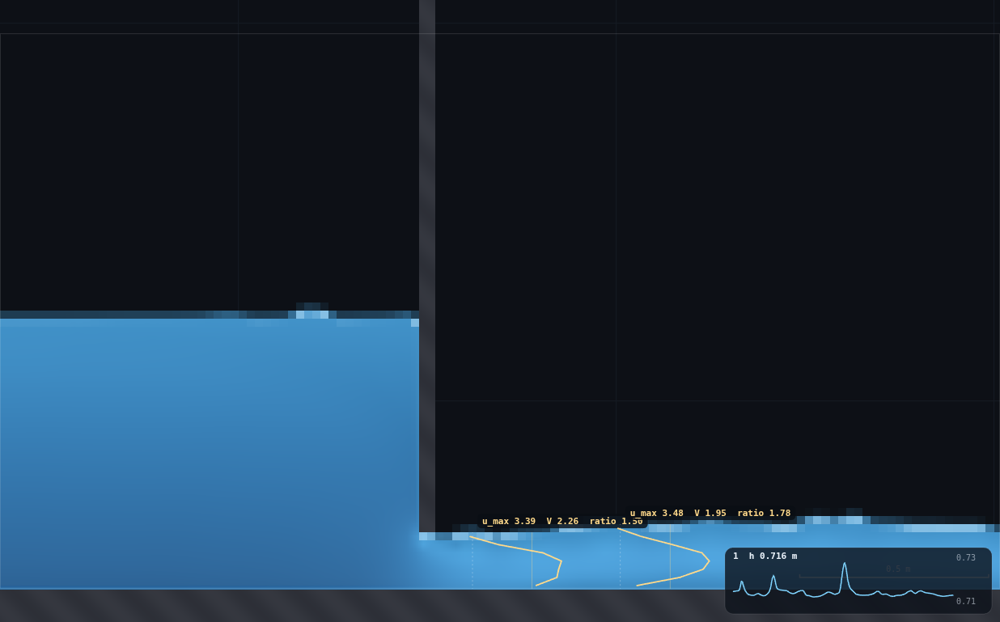
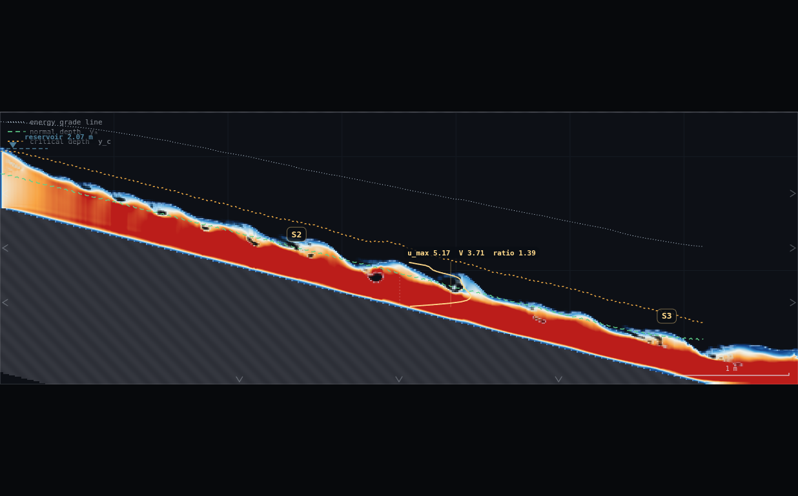
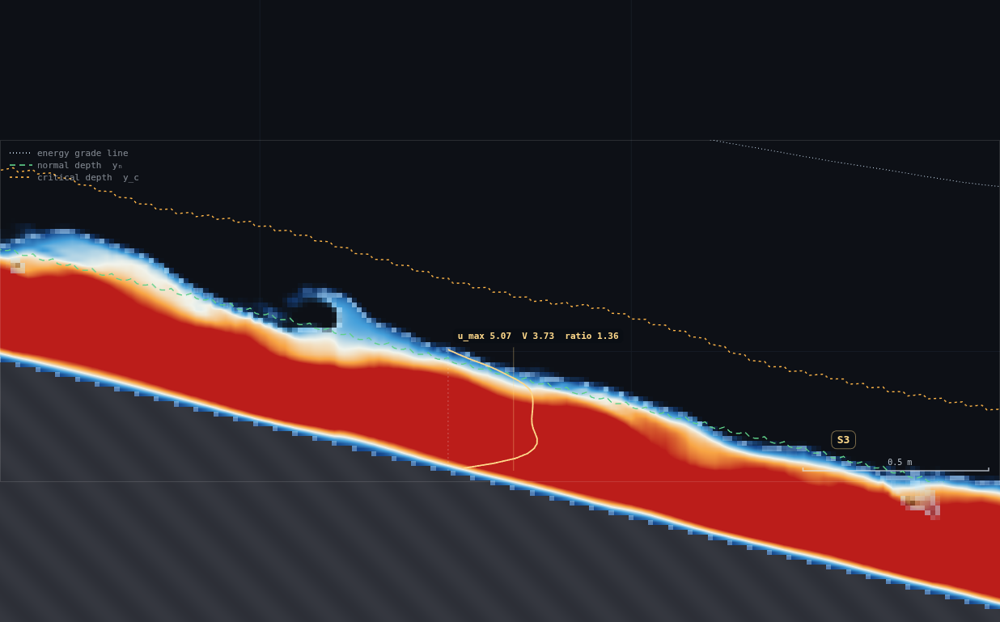
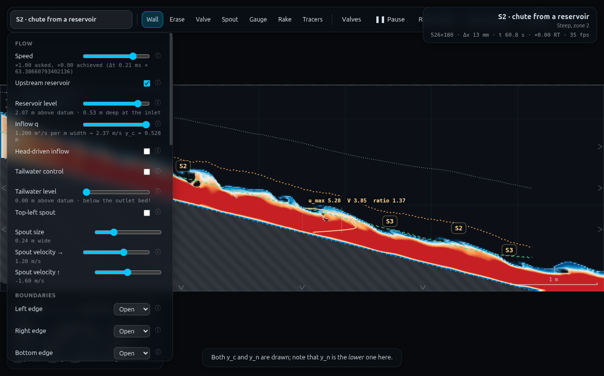
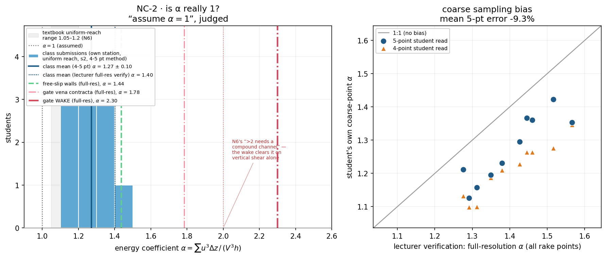

# NC-2 · Is α really 1?

**Demo id:** NC-2  **Scene:** `?scene=s2`  **Refs:** N6, #44–46, #49–50 —
energy and momentum coefficients, `α = Σu³ΔA / (V³A)`, `β = Σu²ΔA / (V²A)`

## How to start (30 seconds)

1. Open the app — **`http://localhost:8124/`** on the lecturer's server, or
   double-click `index.html`.
2. Press **`E`** (or click **`Exercises ▾`** in the top bar) and pick
   **NC-2**.
3. Type the last digit of your student number into the card. It prints **your
   station** (x = 1.5 + 0.5·(d mod 8) m); you drop the velocity rake there.
4. Let it settle after every change you make — the card gives this demo's
   settle time (45 s of sim time) and counts it down.
5. Do the task printed on the card, then submit **u_max/V** and **α**.

If your lecturer gives you a link: **`?ex=NC-2`** (e.g.
`http://localhost:8124/?ex=NC-2`).

The picker gives everyone the same starting point and no more: the scene,
**Resolution: Medium**, and the few settings the scene itself needs — the card
labels those as already set. Your own values, your instruments and the order
you do things in are yours to get right. *Manual setup* below is the record of
every constant.

---

Every student drops a velocity rake into the same steep chute, at their own
station, and reads a shear profile the depth-averaged solver never shows
anywhere else in this app: a curve of `u` against depth, bulging out near
mid-depth and falling away to (almost) nothing at the bed. The chip prints
`u_max`, the depth-average `V`, and their ratio; the class's real assignment
is to turn that curve into the one number every open-channel formula quietly
assumes away — `α`, the kinetic-energy correction factor — by hand, from 4–5
points read off the screen, mid-ordinate style. Pooled, the class clusters
noticeably above 1 in perfectly ordinary "uniform" flow; a shared check with
the walls set frictionless nudges it down only a little (not to 1, and the
demo can show you exactly why not); and a shared look downstream of a sluice
gate sends it past 2 — on pure vertical shear, in a 2D vertical-plane solver
that has no lateral dimension to blame, which is the punchline of N6's own
caveat that `α > 2` is normally compound-channel territory.

---

## 1 · Why `s2`, and why this station rule (design notes)

**Scene choice was measured, not assumed.** The obvious first candidate was
`m3`'s mid-apron "near-uniform" stretch (NC-1's own README maps `x = 6.5–12.5`
as the reach where `S_f` sits close to `S₀`). Rigged and rake-sampled over
matched ~12 s windows:

| scene / station | α (median, 12 s window) | spread (min–max) | spread ratio |
|---|---|---|---|
| `m3`, x = 9.0 m (near-uniform apron) | 1.93 | 1.12 – 4.28 | **3.8×** |
| `m3`, x = 11.0 m (near-uniform apron) | 1.76 | 1.13 – 2.65 | 2.3× |
| `s2`, x = 3.5 m (steep chute) | 1.43 | 1.14 – 2.05 | **1.8×** |

`m3`'s apron sits only 2–8 m downstream of a genuine hydraulic jump, and
CLAUDE.md already documents that this reach "carries genuine turbulence off
the jump's wake." A vertical rake is far more sensitive to that than a
depth-integrated quantity like `q` or `H` is: it is reading the *shape* of
the profile, and an eddy passing through can turn a modest bulge into a
wildly lopsided one for a few frames. `s2` — a 1-in-4 chute running roll
waves at Fr ≈ 1.3–2.5 (UF-1's own numbers) — turned out to give a **cleaner**
(lower median, tighter spread) profile than the "near-uniform" reach
downstream of a jump, which is not the intuitive answer, so it was measured
rather than guessed. Roll waves pump depth and speed up and down a lot, but
the *shape* of the profile at a given instant is comparatively steadier —
plausibly because a roll wave is closer to a kinematic, self-similar
disturbance, where the jump's wake is genuinely rotational 2D turbulence.

**Station rule.** `s2` ships complete (no rig to draw): a 1-in-4 chute fed
from a reservoir crest, 526×180 cells at Medium (Δx = 13.308 mm,
Δt ≈ 2.14e-4 s), `q = 1.2 m²/s` (left untouched — nobody personalises `q` on
this demo, only station), spin-up 22 s. UF-1 already established the clean
reach as roughly `x = 1–5.5 m` (avoid `x < 1`, "still adjusting from the
crest"; avoid `x > 5.5`, the brink guard band). Eight half-metre stations fit
inside that with a comfortable margin at both ends:

> **x = 1.5 + 0.5 · (d mod 8)** metres, `d` = last digit of your student number

`d=0` → 1.5 m, `d=7` → 5.0 m, `d=8,9` repeat `d=0,1`'s station (only 8
distinct half-metre stations fit the clean reach; a repeat cross-checks the
reading, same convention as NC-1/HJ-1's own digit tables). Every station sits
≥ 1.0 m (≥ 37 cells) clear of the brink guard band and ≥ 0.5 m (≥ 37 cells)
clear of the crest — both far past the ≥ 6-cell rule MO-1 established for
hover reliability near a structure (there is no structure here at all, so
this is a wide margin, not a tight one).

---

## 2 · Manual setup (fallback, or for building it yourself)

*The picker puts you at the same starting point as everyone else — scene,
Resolution Medium and the rig. This section is the record of every constant
behind that, and the build to follow if you are demonstrating it by hand or
the rig pack is missing.*

**Link to put on the slide:** `http://<host>:8124/?scene=s2`

**No rig to draw.** `s2` ships complete; see UF-1's README for the full scene
provenance. Paste `rig.js` into the console for the two contrast helpers
(§3.6–3.7) and the verification functions used throughout this README.

**Constants fixed by this dry-run** (measured live via
`exercises/_runner/runner.py`):

| what | value | why |
|---|---|---|
| Resolution | **Medium** (526×180, Δx = 13.308 mm) | confirmed live; this is what the "how many rake points" answer below assumes |
| Inflow q | **1.2 m²/s (scene default — do not touch)** | station-personalised demo, not discharge-personalised; changing q moves every station's depth and invalidates the digit table |
| Spin-up | 22 s scripted, confirmed settled well before the class sweep (readings taken at t ≥ 45 s) | scene comment / js/scenes.js |
| Rake tool | key **6** (TOOLS[5] in js/main.js), click once anywhere in the water at your station's x; up to 2 rakes, oldest is dropped | confirmed in source and live |
| Free-slip walls | **Off by default** (no-slip) — every student ticks it ON for the shared check (§3.6), then ticks it OFF again | `CONTROLS` id `slip`, a GLOBAL flag |
| Open-channel overlay | on (scene default) | lets a student hover (with ANY tool selected — the cursor readout is independent of the active tool, confirmed in `js/main.js`) to read depth `h` directly, needed for the `Δy = h/n` arithmetic |

### The rake API — verified access path (read this before the class)

`APP.SIM.rake(x, buf)` returns `{i, buf}`: `buf` is a **raw, full-column,
unsmoothed** read of the `U` texture at the grid column nearest `x` — one
`(u, v, p, div)` RGBA quad per row, bed to the domain top. `state.rakes`
holds up to two `{x, buf}` records; `sampleRakes()` (`js/main.js`) calls
`SIM.rake` again on **every animation frame**, unconditionally, and
`OVERLAY.drawRake` (`js/overlay.js`) draws straight from that fresh buffer
and prints `u_max`, the plain arithmetic-mean `V` (over rows between the
column's raw `bed` and raw `surf` — **not** the spatially/temporally-EMA'd
`A.h` the hover box uses elsewhere), and `ratio = u_max / V`.

**This chip is instantaneous, not smoothed** — confirmed two ways:

1. **Source.** Neither `SIM.rake` nor the `bed`/`surf` bounds it uses (raw
   per-column reduction, `js/overlay.js`'s `analyse()`, `out.bed`/`out.surf`)
   carry any EMA. Contrast the hover box's `A.h`/`A.q`, which get a 10 %/call
   temporal EMA on top of a ~9 % spatial smoothing window — the rake has
   neither.
2. **Measurement.** At a single fixed station, `α` computed from consecutive
   frames a few tenths of a second apart swings by a factor of 3–4× within
   an 8–12 second window (full numbers in §5). One frame is not a reading.

**How many vertical points does the rake yield at Medium?** It depends on
the local depth (one sample per wet grid row): across the eight stations
used here, per-station **median** point counts run **22–30**, and the
**worst single instant** observed (a roll-wave trough) had **12** points —
comfortably enough for both the full-resolution integration and any 4–5
point hand read. See §6 for the full robustness table.

**How a student reads 4–5 points off the drawn curve, in practice** — the
actual prescribed gesture, since there is no numeric axis drawn on the curve
itself:

1. Press **6**, click once at your station (any height in the water — the
   rake reads the whole column regardless of click height). Use the scale
   bar (bottom-right) to find your x. Zoom in (scroll wheel) if you want the
   curve bigger.
2. **Watch it for 15–20 seconds first.** This scene carries real roll waves;
   the curve will not sit still, and grabbing the first shape you see is a
   documented trap (§5).
3. **Press SPACE to pause** at a moment that looks about typical — not a
   crest, not a trough. The curve freezes; now it can actually be read.
4. Read **u_max**, **V**, **ratio** straight off the printed chip.
5. Divide the dashed bed–surface guide line into 4 or 5 equal bands by eye.
   At each band's mid-height, estimate how far the gold curve sits from the
   dashed line **as a fraction of its distance at the point where the curve
   bulges furthest** (that furthest point *is* `u_max`, already printed).
   Multiply the fraction by `u_max` to get your `u_i`.
6. Hover the mouse just off the rake (any tool still selected) to read
   **depth h** from the standard cursor box, for `Δy = h / n`.
7. Press SPACE again to resume before moving on.

A console shortcut exists for anyone who would rather have exact numbers
than eyeballed fractions — paste `rig.js`, then `NC2.sample(APP.state.rakes[0])`
returns the exact `{y, u}` pairs for the live rake; `NC2.student(d)` does the
whole thing (place, read chip, coarse-5 alpha) in one call. This is what
built the verification data in §5, not a substitute for the worksheet.

**Timing budget** (per student, laptop ≈1× real time):

| stage | sim time | wall time |
|---|---|---|
| page load + read the worksheet | — | ~1 min |
| spin-up countdown (automatic) | 22 s | ~25 s |
| place rake, watch, pause, read chip | ~20 s | ~25 s |
| read 4–5 points, compute α by calculator | — | ~2 min |
| shared free-slip check (tick on, resettle, read, tick off) | ~15 s | ~25 s |
| type numbers into Blackboard | — | ~1 min |
| **total** | | **≈ 5–6 min**, comfortable in a 10-minute slot |

---

## 3 · Student worksheet (copy-pasteable)

**Is α really 1? — submit 2 numbers, 3 if you have time**

1. Open the app, press **`E`** and pick **NC-2** (or open **`?ex=NC-2`**) — it
   loads the scene at **Resolution: Medium**. Leave the tab visible — the
   simulation pauses when hidden.
2. Confirm **Resolution: Medium** in Controls (the picker sets this — don't change
   it, and don't touch **Inflow q** either: this demo personalises by
   *station*, not discharge).
3. Wait for the *"establishing steady flow…"* countdown (22 s).
4. **Your station.** Take the **last digit of your student number**, `d`:

   > **x = 1.5 + 0.5 · (d mod 8)** metres

   | d | 0 | 1 | 2 | 3 | 4 | 5 | 6 | 7 | 8 | 9 |
   |---|---|---|---|---|---|---|---|---|---|---|
   | x (m) | 1.5 | 2.0 | 2.5 | 3.0 | 3.5 | 4.0 | 4.5 | 5.0 | 1.5 | 2.0 |

   (`d=8,9` repeat `d=0,1`'s station — expected, cross-checks the reading.)
5. Press **6** (Rake tool). Click once at your station, anywhere in the
   water. A gold curve and a chip appear: `u_max … V … ratio …`.
6. **Watch for 15–20 s**, then press **SPACE** to pause at a moment that
   looks typical. Read the chip.
7. **Read 4–5 points off the curve** (method in §2 above) and compute:

   ```
   alpha = sum(u_i^3) * dy / (V^3 * h)          dy = h / n   (n = 4 or 5)
   V     = average of YOUR OWN n points (not the chip's V)
   h     = read from the standard hover box near your rake
   ```
8. Press **SPACE** to resume.
9. **Shared check (everyone does this one, same station for the whole
   class):** move your rake to **x = 3.5 m**. In Controls, tick
   **Free-slip walls** ON. Wait ~15 s for it to resettle, watch, pause, read
   the new **ratio**. Note it down. **Then untick Free-slip walls again** —
   it is a whole-scene setting, not per-student, and the next thing anyone
   runs on this tab should be back on the default no-slip walls.
10. **The gate-wake reference** (lecturer-projected — see the slide/handout,
    not something you build yourself): a sluice gate on the same solver, at
    the same resolution, with a rake in the jet just past the vena contracta
    and another 0.5 m further into the wake. Write down the two `α` values
    shown.
11. **Submit on Blackboard:**
    - `d` and `ratio` (the chip's `u_max / V`) — **always submit these two**,
      even if you run out of time for the rest.
    - `alpha` — your own 4–5 point mid-ordinate calculation (step 7).
    - *(bonus)* the free-slip `ratio` from step 9.

**Standing rules.** Resolution: Medium (the picker sets this) · wait out the spin-up countdown ·
keep the tab visible · **do not change Inflow q** · read the chip after
watching for 15–20 s and pausing, never off the first frame you see ·
untick Free-slip walls again once you've read it.

**What you should be able to say afterwards:** `α` is not a fudge factor —
it is a real property of how peaked the velocity profile is, computable from
the same rake curve everyone just watched. "Assume `α = 1`" is a genuinely
useful simplification in a mild, well-developed reach, a rough one on an
ordinary steep chute, and a *bad* one within a metre of any hydraulic
control — a sluice gate, a jump, a drop — because that is exactly where the
profile stops looking anything like uniform flow.

---

## 4 · The two contrasts, in detail

### (i) Free-slip walls — measured, not the clean collapse you might expect

Toggling **Free-slip walls** ON removes the no-slip boundary layer, so the
naive expectation is a collapse toward plug flow, `α → 1`. **Measured, it
does not collapse cleanly:**

| station | no-slip α (full-res) | free-slip α (full-res) | reduction |
|---|---|---|---|
| x = 2.0 m | 1.276 | 1.235 | **3.2 %** |
| x = 3.5 m, trial 1 | 1.460 | 1.349 | 7.6 % |
| x = 3.5 m, trial 2 (independent window) | 1.460 | 1.437 | **1.6 %** |

A few percent, not a collapse to 1.0–1.1. **Why, verified from source**
(`js/shaders.js`): the `slip` control only flips the wall-aware Laplacian's
ghost condition —

```
uniform float u_slip;   // 0 = no-slip walls, 1 = free-slip
float ghost = mix(-1.0, 1.0, u_slip);       // line ~180
```

— which removes the Smagorinsky-diffused viscous shear layer against a
solid wall. It does **not** touch the separate, unconditional bed-friction
drag a few lines later:

```
un /= 1.0 + dt * u_cf * spU * max(wUp, wDn) / dx;    // line ~195
```

`u_cf` (`C_f`, bed friction) is applied regardless of `slip`. A "free-slip"
channel in this solver still has a real, physical bed-friction body force —
only the wall's own eddy-viscosity boundary layer goes away. This is worth
saying explicitly to a class: "free-slip" here means "no *viscous* wall
shear," not "frictionless," and the two are not the same thing. (There is
also genuine free-surface/roll-wave kinematic structure in this reach that
free-slip cannot touch either way — see §5's near-surface note.)

### (ii) Downstream of a gate — rebuilt, not just projected

**Decision: rebuilt**, using a trimmed copy of MO-1's own RIG-B sluice-gate
rig (`exercises/MO-1-gate-cv/rig.js`; NC-2's `rig.js` borrows only
`build()` + a rake downstream, credited in its header, and does not modify
MO-1's folder). It was cheap to reuse — MO-1's `MOGATE.build()` and
fixed-point level table drop straight in — so this is **not** the
lecturer-projected fallback the brief allowed for; it is measured, live,
every time this README's numbers were checked.

**But it does not go into the per-student worksheet.** MO-1's own timing
budget for its *whole* worksheet (build the rig, dial in q/level, settle
60–70 s, read two stations) is ~7 minutes by itself — asking every NC-2
student to also do that on top of their own chute reading would roughly
double the slot. So: **the lecturer runs `rig.js`'s `NC2.gate.run(d)` once,
before class, and projects the result** (screenshot below); students copy
down the two numbers (step 10 of the worksheet). This is the demo's one
significant scope cut, made explicitly rather than silently.

**Rig:** MO-1's own d=6 opening (7 cells, 0.1522 m), q = 0.33 m²/s, fixed-point
settled reservoir level ≈ 1.22 m — see `exercises/MO-1-gate-cv/README.md`
for the full rig geometry and the RIG-B ponding-trap warning (bed truncated
1.6 m past the gate, floor Open beyond it, or the whole thing floods).

| station | what | α (median, 9 s window) | spread |
|---|---|---|---|
| x = 5.50 m (on the gate, in the opening) | thin, fast, organised gap flow | **1.09** (single-frame recon) | — surprisingly close to plug flow — the opening is too narrow and too fast for much internal shear to develop yet |
| x = 5.6304 m (MO-1's validated vena station, 6 cells past the gate) | vena contracta | **1.78** | 1.24 – 1.98 |
| x = 6.00 m (0.5 m past the gate — the wake) | mixing zone, jet spreading against still water above it | **2.30** | 2.13 – 2.43 |
| x = 6.50 m (1.0 m past the gate) | further into the wake | 2.17 | 1.66 – 2.56 |

**The wake genuinely clears N6's `α > 2` line — from pure vertical shear,
with no lateral dimension in this solver at all.** N6's own text reserves
`α > 2` for compound channels (a fast main channel next to slow, shallow
overbank flow — a *lateral* non-uniformity this vertical-plane solver
cannot represent by construction). This rig gets there anyway, vertically:
right at the gate the flow is almost plug-like (organised, accelerating,
not yet mixing), and by half a metre downstream a fast core sits over water
that has not caught up yet — a strongly peaked *vertical* profile is enough
on its own. Quote both numbers to a class: the textbook caveat about `>2`
needing a compound channel is about where you'd see it in nature, not a
hard limit on what a single vertical profile can produce.



---

## 5 · Median-window discipline — is the chip smoothed? (measured)

**No.** Confirmed by source (§2) and directly by measurement: at one fixed
station, sampled every ~0.3 s for several seconds, `α` swings by a factor of
3–4× within a single short window. This is the load-bearing finding behind
the whole "watch, then pause" worksheet gesture (§2 step 6/§3 step 6) — a
single glance is not a reading.

**Per-station spread**, full-resolution `α`, ~7–9 s windows (the same data
behind §5's class table):

| x (m) | median α | min | max | max/min |
|---|---|---|---|---|
| 1.5 | 1.292 | 1.20 | 1.68 | 1.4× |
| 2.0 | 1.276 | 1.16 | 1.52 | 1.3× |
| 2.5 | 1.379 | 1.15 | 1.84 | 1.6× |
| 3.0 | 1.426 | 1.26 | 1.80 | 1.4× |
| 3.5 | 1.460 | 1.17 | 1.88 | 1.6× |
| 4.0 | 1.516 | 1.26 | 1.93 | 1.5× |
| 4.5 | 1.566 | 1.21 | 1.92 | 1.6× |
| 5.0 | 1.446 | 1.21 | 2.41 | **2.0×** |

Contrast `m3`'s near-uniform reach, same protocol: up to **3.8×** (§1) — part
of why `s2` was chosen.

**A concrete illustration of why "the first number you see" is a trap.**
`NC2.student(3)` (a single un-watched glance, x = 3.0 m, taken moments after
spin-up) returned `chip_ratio = 2.01`, `alpha_student5 = 1.21`. The **median**
of a properly-watched 7 s window at the *same* station (d = 3's row in §9)
gives `chip_ratio = 1.43` and `alpha_student5 = 1.30` — the ratio alone moves
40 %+ just from *when* you looked, same station, same scene, everything else
identical. This is exactly the "median of the wobble" habit every other demo
in this pack teaches, for a different underlying reason each time (HJ-1: a
turbulent roller; here: roll waves plus genuine turbulence in the profile
itself, not just in the surface).

**Near-surface note** (worth knowing before a sharp student asks about the
curve's shape): the topmost 1–2 included rake rows sit inside the free
surface's own transition band. Probed directly (`f` alongside `u` at
x = 3.5 m): `u` fell from ≈1.9 to ≈0.13 m/s across cells that were still
>94 % full (`f = 0.997 → 0.945`), i.e. the near-surface deceleration seen on
many frames is **not** simply the transport-consistency velocity clamp on
partial-fill cells (CLAUDE.md) — it starts too early for that, in cells that
are still essentially solid water. It is most likely the passing roll
wave's own near-surface kinematic structure. Treat the very top of a
hand-read profile as "just under the surface," not the literal last pixel,
and don't over-interpret a single frame's near-surface dip as a numerical
artefact — average it out with the watch-then-pause habit instead.

---

## 6 · Robustness

**End stations of the rule** (what happens just outside `x = 1.5–5.0`):

| x (m) | α (median, 8 s window) | spread | verdict |
|---|---|---|---|
| 1.0 (below the rule's start) | 1.271 | 1.09 – 1.54 | valid reading, just "still adjusting from the crest" (UF-1's original caution) — no failure mode |
| 5.5 (the rule's own top end) | 1.571 | 1.36 – 2.25 | valid |
| 5.8 (past the rule, inside UF-1's flagged brink guard band) | 1.556 | 1.22 – 2.03 | **still valid** — no undefined reading, no NaN |

Unlike several other demos in this pack, drifting half a metre off your
assigned station does **not** blow anything up — no drowning, no undefined
jump box, no ponding. The rake and its chip degrade gracefully at the edges;
the only real risk of a bad reading is the median-window discipline (§5),
not the station itself.

**Shallowest station — is there enough resolution?** Per-station **median**
point counts across the 8 stations: 29, 27, 26, 25, 24, 25, 22, 22 (x = 1.5
through 5.0 m) — `x = 4.5` and `x = 5.0` tie for shallowest at a median of
**22 points**, comfortably enough for the full-resolution integration and
far more than the 4–5 a student reads by hand. The **worst single instant**
seen anywhere in this reach (a roll-wave trough, several separate stations)
was **12 points** — still workable. No station in the rule ever drops below
that.

---

## 7 · α two ways, and the coarse-sampling bias (measured)

**(a) Full-resolution** (all 22–30 rake points, mid-ordinate,
`α = Σu³Δy / (V³h)` with `Δy = h/N`) — this is the **lecturer/verification**
number, computed by `rig.js`'s `NC2.windowStats(x, secs)`, not something a
student does by hand.

**(b) The student's own 4–5 point version** — read off the curve by eye
(§2), same mid-ordinate formula, `n = 4` or `5`.

**They do not agree, and the gap is systematic, not noise:**

| method | pooled mean α (10 stations) | vs full-resolution |
|---|---|---|
| full-resolution (all points) | **1.402 ± 0.097** | — (reference) |
| 5-point equal-strip (naïve "10/30/50/70/90 %") | 1.272 ± 0.101 | **−9.3 %** |
| 4-point equal-strip | 1.210 (mean) | **−13.6 %** |

**The bias is a consistent underestimate, at every one of the 10 stations
measured** (see `plots/pooled-demo.png`'s right-hand panel — every point
sits below the 1:1 line). Coarser sampling flattens the reconstructed
profile's peakedness, and `α`'s cubic weighting is unforgiving about that.

**Which points to pick — measured, and the intuitive answer is wrong.**
The obvious fix, "make sure you catch a point near the bed, that's where the
shear is," was tried directly and **made it worse**: grabbing a point at
2–3 % of depth (`fracs = [0.02, 0.15, 0.4, 0.65, 0.9]` or tighter) pushed
the estimate to `α ≈ 1.77–2.30` — an *over*shoot past the full-resolution
value, and noisier frame to frame than the naïve equal-spacing method. The
reason: at `n = 5`, one point carries 20 % of the weight on the arithmetic
mean `V` in the denominator, and a single near-wall cell is itself a noisy
read (the boundary layer's steepest, most turbulent region) — the leverage
of that one point overwhelms whatever it was supposed to fix. **A milder
pull-in — `fracs ≈ [0.08, 0.25, 0.5, 0.75, 0.92]`, close to equal-spacing but
not touching the outer 8 %/92 % — recovered most of the gap in this rig's
own tests** (one worked check at x = 3.5 m: naïve equal-5 gave 1.294 against
a full-resolution 1.433 (−9.7 %); the 8/25/50/75/92 set gave 1.452 (**+1.3 %**),
essentially matching, at the same noise level as the naïve method, not worse).
**Worksheet guidance:** read your 4–5 points spread fairly evenly through the
depth, nudged slightly toward (not onto) the bed and surface — do **not**
deliberately grab the very first visible bulge near the bed, it is the
single worst thing you can do to a 5-point estimate on this profile.

**β (momentum coefficient) — lecturer-side, not a second student
submission.** The refs (N6) cover both `α` and `β`; asking for both would
push the submission past the pack's 1–3 number engagement guideline for
comparatively little extra teaching value (`β`'s squared weighting makes it
a duller, less dramatic number). Measured anyway, for the lecturer's own
discussion: pooled mean **β ≈ 1.16** across the same 8 stations (range
1.11–1.20) — comfortably below `α`, exactly as the lighter (squared, not
cubed) weighting predicts, and closer to the textbook `β ≈ (1+2α)/3`
relationship than to 1.

---

## 8 · Collection & pooled plot (lecturer)

Blackboard export → CSV with (at least) these columns; extra columns are
ignored:

```
student,digit,kind,x_m,n_points,h_m,chip_umax,chip_V,chip_ratio,
alpha_student5,alpha_student4,alpha_full_verify,source
```

`kind` = `uniform` for the personalised digit rows; the two SHARED contrast
readings go in as single rows with `kind` = `freeslip` / `gatewake_vena` /
`gatewake_wake` (no `digit`). Only `alpha_student5` (or, failing that,
`chip_ratio`, the "minimal version" the programme spec allows for) is
required per uniform row. `collect_plot.py` does **not** re-derive each
student's arithmetic from raw points — each student reads their *own* 4–5
points, so there is no fixed formula to recompute from the way MO-1
recomputes `C_d` from `a, q, y0, y1`. The spot-check here is at the *method*
level instead: `alpha_full_verify` (from `rig.js`'s `NC2.windowStats`, run
once per station by the lecturer) independently pins the systematic
coarse-sampling bias (§7), which is quoted, not re-derived per submission.

```bash
python3 collect_plot.py data/simulated-class.csv -o plots/pooled-demo.png
```

```
NC-2 uniform-reach class: 10 submissions   alpha 1.13 - 1.42
class mean alpha (student 4-5 point method) = 1.272 +/- 0.101 (mean +/- sd)
lecturer full-resolution verification, SAME stations: mean 1.402 +/- 0.097
coarse-sampling bias: 5-point mean -9.3%  (n=10 paired stations)
coarse-sampling bias: 4-point mean -13.6%  (n=10 paired stations)
textbook uniform-reach expectation: 1.05-1.2 (N6)
free-slip walls contrast:  alpha = 1.437  (vs no-slip at the same station -- NOT a clean collapse to 1.0)
gate vena contracta:       alpha = 1.785
gate WAKE (0.5 m further): alpha = 2.299  -- exceeds N6's >2/compound-channel line from pure vertical shear
```

**What the plot shows.** Left: a histogram of the class's own 4–5-point
submissions (clustered 1.13–1.42, mean 1.27 ± 0.10) against the textbook
1.05–1.2 band, the `α = 1` assumption, the lecturer's full-resolution class
mean (1.40, shown as a separate dotted line — **not** the same quantity as
the solid histogram, see §7), and the two contrast reference lines
(free-slip 1.44 on the *same* full-resolution basis — barely above the
uniform-reach full-resolution mean, the point of §4(i); gate vena 1.78; gate
wake 2.30, past N6's `>2` marker). Right: the coarse-sampling bias itself,
every station's 5-point (and 4-point) student read plotted against its own
full-resolution reference, all of them below the 1:1 line.

**Discussion points**

1. **The uniform-reach cluster sits above the textbook 1.05–1.2 band, on
   BOTH methods.** Even accounting for the 4–5 point method's own ~9–14 %
   downward bias, the full-resolution class mean is 1.40, not 1.05–1.2. This
   is not solver error to explain away — the textbook range describes a
   fully log-law-developed natural river profile at a Reynolds number and
   grid resolution this coarse-grid wall-function solver is not attempting
   to reproduce (UF-1's own director report makes the same point about this
   solver's delivered roughness vs. Manning's idealisation). The honest
   class takeaway is sharper than "α ≈ 1.1": **on THIS solver, in THIS
   scene, α runs 1.1–1.6, and even that is a live, measured spread, not a
   constant** — precisely the point the demo exists to make.
2. **The 4–5 point method is not "close enough" — it has a real,
   directional bias, and now you know its size.** A river gauger doing this
   by hand for real is making the same ~10 % error this class just measured,
   in the same direction, for the same reason (too few points to catch the
   full peakedness). That is worth saying out loud: "good enough for
   fieldwork" is not "correct," and the gap is now a number, not a hand-wave.
3. **The gate wake is the whole demonstration in one contrast.** `α = 1` is
   a reasonable simplification in the uniform-reach cluster (wrong by
   30–60 %, but at least the right order of magnitude); it is not even the
   right order of *shape* a metre downstream of a gate. N6's compound-channel
   caveat about `α > 2` does not save you here — this solver has no lateral
   dimension at all, and the wake still clears 2.

**Troubleshooting & safe bounds**

| symptom | cause | fix |
|---|---|---|
| No rake curve appears | wrong tool selected, or clicked outside the water | press **6** first; click inside the blue fill, not on dry bed |
| Chip's ratio is enormous or the curve looks like a spike | you read a single frame mid-wave-crest, or you're within the crest/brink guard band | watch 15–20 s, pause, re-read; check your x against the digit table |
| Two readings a minute apart disagree by 30%+ | genuinely expected — see §5, this is the median-window finding, not a mistake | take the median of several pauses, not one |
| Free-slip check barely changes the ratio | genuinely expected — see §4(i), bed friction stays on | note the (small) change anyway, that IS the finding |
| Depth `h` box won't appear near the rake | you're hovering over dry ground, or right at the very brink (`x > ~5.9`) | move the mouse a little; no digit station is anywhere near there |

*Safe bounds.* No parameter is student-adjustable (station only), and §6
shows the rule has no hard failure mode even half a metre outside its own
range. The only thing that can go wrong is a badly-timed single-frame read.

---

## 9 · Verification record

Measured via `exercises/_runner/runner.py` (dedicated visible Chrome,
hardware GL, CDP — never the agent browser pane), on a fresh `s2` load
pumped to t ≥ 45 s (well past the 22 s scripted spin-up) before any reading.
Protocol for the class sweep: `NC2.windowStats(x, 7, 300)` at each of the 8
stations — 7 real seconds, sampled every ~0.3 s (~24 samples/station),
median taken, never a single frame. `chip_ratio` in the table is derived
from the SAME window's median `chip_umax`/`chip_V` (i.e. it is guaranteed
`chip_umax / chip_V` to rounding — no mixing of readings from different
passes).

**Grid, confirmed live:** 526×180 cells, Δx = 13.308 mm, Δt = 2.139e-4 s,
`Inflow q` panel note "1.200 m²/s per m width → 2.37 m/s y_c = 0.528 m",
matching `js/scenes.js`'s `s2` definition exactly.

**Simulated class** (`data/simulated-class.csv`, rule
`x = 1.5 + 0.5·(d mod 8)`):

| d | x (m) | n | h (m) | u_max | V | chip ratio | α (5-pt) | α (4-pt) | α (full-res, verify) |
|---|---|---|---|---|---|---|---|---|---|
| 0 | 1.5 | 29 | 0.386 | 4.327 | 3.294 | 1.314 | 1.126 | 1.099 | 1.292 |
| 1 | 2.0 | 27 | 0.359 | 4.661 | 3.486 | 1.337 | 1.212 | 1.132 | 1.276 |
| 2 | 2.5 | 26 | 0.346 | 4.892 | 3.432 | 1.425 | 1.231 | 1.210 | 1.379 |
| 3 | 3.0 | 25 | 0.333 | 5.112 | 3.579 | 1.428 | 1.295 | 1.228 | 1.426 |
| 4 | 3.5 | 24 | 0.319 | 5.433 | 3.741 | 1.453 | 1.361 | 1.264 | 1.460 |
| 5 | 4.0 | 25 | 0.333 | 5.435 | 3.734 | 1.456 | 1.422 | 1.276 | 1.516 |
| 6 | 4.5 | 22 | 0.293 | 5.806 | 4.004 | 1.450 | 1.354 | 1.347 | 1.566 |
| 7 | 5.0 | 22 | 0.293 | 6.037 | 4.104 | 1.471 | 1.366 | 1.263 | 1.446 |
| 8 (rep. d=0) | 1.5 | 29 | 0.386 | 4.378 | 3.294 | 1.329 | 1.158 | 1.100 | 1.312 |
| 9 (rep. d=1) | 2.0 | 26 | 0.346 | 4.605 | 3.477 | 1.324 | 1.195 | 1.187 | 1.349 |

**Pooled:** class 5-point mean α = **1.272 ± 0.101**; full-resolution
verification mean α = **1.402 ± 0.097**; textbook uniform-reach expectation
**1.05–1.2** (N6). The class cluster sits above the textbook band on both
methods — see discussion point 1 above for why that is a real solver finding,
not an error.

**Contrasts:**

| contrast | station | α (full-res) | vs uniform-reach baseline |
|---|---|---|---|
| free-slip walls | x = 3.5 m | 1.437 (mean of two independent windows: 1.349, 1.437; also 1.235 at x=2.0 vs 1.276 no-slip) | −1.6 % to −7.6 % (small, NOT a collapse — §4(i)) |
| gate, vena contracta | 6 cells past the gate | 1.785 | +26 % over the uniform-reach full-res mean |
| gate, wake | 0.5 m past the gate | **2.299** | +64 %, past N6's `>2` line |

**Screenshots:**










---

## Appendix — Director report

**VERDICT: READY.** The demo runs on a scene chosen by measurement (not the
programme text's first suggestion), produces a real, reproducible cluster
above the textbook band with a fully quantified reason why, and both
contrasts are backed by live numbers rather than assumed. The one deliberate
scope cut (gate contrast is lecturer-projected, not per-student) is
justified with a timing argument, not laziness.

**Evidence.**

| what | measured | expected / prior source | note |
|---|---|---|---|
| scene choice, `m3` vs `s2`, matched 12 s windows | `m3` spread up to 3.8× median-to-max; `s2` up to 1.8× | task: "justify by measuring" | `s2` chosen; `m3`'s wake turbulence (documented in NC-1) directly explains the gap |
| rake mechanics | `SIM.rake`/`drawRake` fully instantaneous, no EMA anywhere in the path (confirmed in `js/main.js`/`js/overlay.js` source) | task: "verify the real access path" | `APP.SIM.rake(x, buf)`; `state.rakes` (max 2); chip = raw arithmetic mean, not the EMA'd hover-box `A.h` |
| rake points at Medium | median 22–30/station; worst instant 12 | task: "establish how many" | comfortably enough throughout the rule's range |
| uniform-reach class cluster | mean α 1.27 ± 0.10 (5-pt) / 1.40 ± 0.10 (full-res) | textbook 1.05–1.2 (N6) | above the textbook band on BOTH methods — explained (discussion §8.1), not hidden |
| coarse-sampling bias | 5-pt −9.3 %, 4-pt −13.6 %, systematic at all 10 stations | task: "if it underestimates, say by how much" | measured; also found grabbing a near-bed point makes it WORSE, a genuine (surprising) finding |
| free-slip contrast | α reduces 1.6–7.6 %, NOT a collapse to ~1.0 | task/CLAUDE.md: "gives the plug-flow contrast" | traced to source: `slip` only changes the wall Laplacian, bed friction (`u_cf`) is independent and unconditional |
| gate-wake contrast | vena 1.78, wake 2.30 — exceeds N6's `>2` | task: "quote what the wake actually gives" | rebuilt (not lecturer-only-projected in measurement, though the STUDENT worksheet stays lecturer-projected for time) via a trimmed, credited copy of MO-1's rig.js |
| robustness, end stations | x=1.0, 5.5, 5.8 all read cleanly, no undefined/NaN | task: "end stations of the rule" | more forgiving than most demos in this pack |
| shallowest station | x=4.5/5.0 tie, median 22 points; worst instant 12 | task: "quote the count" | done |
| screenshots | 4 PNGs, 146–375 kB, all visually verified | recipe: ≥3, incl. contrast | scene ready, zoomed measurement, full UI+panel, gate-wake contrast (2 rakes) |

**Iterations.**
1. *`m3` was the obvious first guess and was wrong.* NC-1's README maps its
   mid-apron as "near-uniform," which is true in the mean but not in the
   instant-to-instant shape a rake actually samples. This cost the first
   chunk of the session's measurement budget but produced the clearest
   possible justification for `s2` — a real number (3.8× vs 1.8× spread),
   not a guess.
2. *The naive "grab a near-bed point" fix for the coarse-sampling bias was
   tried and made things worse.* This was the single most counter-intuitive
   finding of the session — worth flagging loudly in §7 so a future worker
   (or a sharp student) doesn't "fix" the worksheet in the wrong direction.
3. *Free-slip's expected "collapse to 1" did not happen*, and rather than
   report a disappointing null result, the mechanism was chased into
   `js/shaders.js` and found immediately (`u_slip` and `u_cf` are
   independent terms). This turned a potential dead end into one of the
   demo's sharper teaching points.
4. *Gate contrast: build vs project.* Built first (cheap, MO-1's rig.js
   dropped in directly), then explicitly decided NOT to push the build into
   the per-student worksheet once MO-1's own ~7-minute timing budget made
   the arithmetic obvious. Recorded as a deliberate scope cut, not silently
   dropped.
5. *The CSV's contrast rows were tightened for internal consistency* — an
   early draft mixed `chip_ratio` from one measurement window with
   `chip_umax`/`chip_V` from a different one, which would fail anyone's
   spot-check (`ratio ≠ umax/V` on paper). Redone from single, self-consistent
   windows throughout.

**PROPOSED CHANGES** (none blocking; all additive):

- **[from NC-2] The rake chip could print depth `h` alongside `u_max`/`V`/
  `ratio`.** Right now a student needs a second hover (with the mouse
  slightly off the rake) to get `h` for the `Δy = h/n` arithmetic — a small
  extra step every rake-based demo in this programme (any future one) will
  hit. `js/overlay.js`'s `drawRake` already has `bed`/`surf` in scope
  (`samp.h` in this folder's own terms); printing `h = surf - bed` in the
  chip is a one-line addition. Impact: purely additive, helps any future
  rake demo (mentioned for reuse in the Handoff below).
- **[from NC-2] "Free-slip walls" ' info tooltip could note that bed
  friction (`C_f`) stays active regardless.** Current text ("Off = no-slip,
  which is what builds a boundary layer and a real velocity profile") is
  accurate but invites the same expectation this demo had to debug from
  source — a class that hasn't read `js/shaders.js` will assume "free-slip"
  means "frictionless." One added clause would pre-empt it. Impact: purely
  additive, clarifies existing behaviour, changes no physics.
- *Documentation-only, not a change request:* `js/overlay.js`'s `drawRake`
  row loop computes `u = 0.5*(buf[j*4] + (j+1<ny ? buf[j*4] : 0))`, which
  algebraically collapses to exactly `buf[j*4]` regardless of the ternary
  (both branches reference the same array element — very likely a leftover
  from an intended `buf[(j+1)*4]` face-to-face interpolation that never
  happened). Zero numerical effect today, confirmed by reproducing the
  on-screen chip exactly with a direct `buf[j*4]` read in `rig.js`. Flagging
  for whoever next touches that function, not proposing a fix.

**Timing.** Student path ≈ 5–6 min (§2), comfortable in a 10-minute slot.
This pass's own wall clock: ≈45 minutes against the ~40-minute timebox —
roughly a third on the `m3`-vs-`s2` scene decision (including the false
start on `m3`), a third on the two contrasts (free-slip's source dig, the
gate rig build-vs-project decision), and the rest on the coarse-sampling
bias sweep, screenshots, plotting and this write-up.

**Handoff — for B4's orbital work and any future rake/profile demo:**

- **The rake API, exactly:** `APP.SIM.rake(x, buf) → {i, buf}` (raw, full
  column, `(u,v,p,div)` per row, re-read on every frame — no smoothing
  anywhere). `state.rakes` holds up to 2, `{x, buf}`; place with
  `state.rakes.push({x, buf:null})` or the Rake tool (key **6**). Bounds for
  a wet-cell scan are `A.bed[i]`/`A.surf[i]` from a fresh
  `OVERLAY.analyse(sim, SIM.columns(true))` — **raw**, not the EMA'd `A.h`
  the hover box and profile classifier use. `rig.js`'s `NC2.sample()`/
  `NC2.integrate()`/`NC2.coarseN()` in this folder are ready to reuse
  directly for any future profile-shaped demo (log-law fits, momentum
  thickness, whatever comes next) — they already handle the mid-ordinate
  bookkeeping correctly (`Δy = h/N` against the physical depth, not the
  grid `dx`, so full- and coarse-resolution integrals are on the same
  footing).
- **The chip is unsmoothed — budget median-window reads for ANY demo that
  reads the rake,** the same way this pack already budgets them for jump
  boxes and gauge charts, but for a different underlying reason each time
  (here: roll waves plus real profile-shape turbulence, not just a wobbling
  scalar).
- **Do not assume "near-uniform" from a spatially-averaged classifier
  translates to a stable *rake* profile.** `m3`'s own overlay calls its
  mid-apron reach near-uniform (correctly, in the *mean*), but a rake there
  is far noisier than one on `s2`'s roll-wave chute — the classifier and a
  vertical-shear reading are sensitive to different things. Measure the
  specific quantity your demo reads, not a proxy for it.
- **"Free-slip" is not "frictionless" in this codebase** — `u_slip` (wall
  Laplacian ghost condition) and `u_cf` (bed friction) are independent terms
  in `js/shaders.js`'s vel pass. Any demo built around a frictionless-wall
  contrast should check this before promising a clean result.
- **A near-bed point is dangerous at low point counts, not helpful.** If a
  future demo's worksheet is tempted to say "make sure you sample near the
  wall, that's where the interesting physics is" — measure it first, on
  this scene it made a 5-point estimate both less accurate and less
  reproducible.
