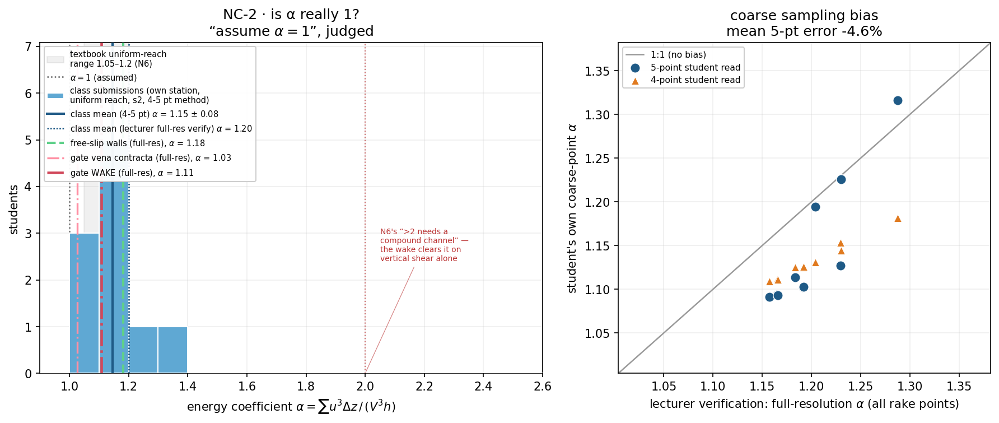

# NC-2 · Is α really 1?

Every student drops a velocity rake into the same steep chute, at their own
station, and reads a shear profile the depth-averaged solver never shows
anywhere else in this app: a curve of `u` against depth, fastest at the
surface and falling away to almost nothing at the bed — the turbulent log
profile. The real assignment is to turn that curve into the one number every
open-channel formula quietly assumes away — `α`, the kinetic-energy
correction factor — by hand, from 4–5 points read off the screen,
mid-ordinate style. Pooled, the class sits around 1.15–1.2, not 1, in
perfectly ordinary flow.

**Open it:** press **E** in the [app](https://barneydobson.github.io/hydraulician/)
and pick **NC-2**, or use the direct link
[`?ex=NC-2`](https://barneydobson.github.io/hydraulician/?ex=NC-2).
How to run any exercise: see the [teaching pack index](../INDEX.md#running-an-exercise).

## Theory

`α` is the factor by which the true kinetic-energy flux exceeds the one the
depth-averaged velocity gives you — every `V²/2g` in the module silently sets
it to 1. Its momentum counterpart is `β`:

    α = Σ u³ ΔA / (V³ A)         β = Σ u² ΔA / (V² A)

For a vertical profile of unit width ΔA is just Δz, so with n points read off
the curve:

    α = Σ u_i³ Δz / (V³ h)       Δz = h / n,   n = 4 or 5
    V = the mean of YOUR OWN n points, not the chip's V

`h` comes off the hover box's `depth d` row. The rake's chip prints `u_max`, the
depth-averaged `V` and their `ratio` — and none of it is smoothed, so a
single frame is not a reading.

## Your station

**d** is the **last digit of your student number** — your lecturer will
explain the assignment in class.

> **x = 1.5 + 0.5 · (d mod 8)** metres

| d | 0 | 1 | 2 | 3 | 4 | 5 | 6 | 7 | 8 | 9 |
|---|---|---|---|---|---|---|---|---|---|---|
| **x (m)** | 1.5 | 2.0 | 2.5 | 3.0 | 3.5 | 4.0 | 4.5 | 5.0 | 1.5 | 2.0 |

## What to do

1. Press `R` and let it reach steady state — about **15 s**; the card counts
   it down. Leave **Inflow q** alone: this demo personalises the station, not
   the discharge.
2. Place a rake — Rake (`6`) — at your station, anywhere in the water, and
   watch it run for 15–20 s.
3. Press `SPACE` to pause on a typical moment — not a crest, not a trough —
   then read `u_max`, `V` and `ratio` off the chip and `h` — the `depth d`
   row — off the hover box.
4. Read 4–5 points off the gold curve, spaced fairly evenly through the depth
   and nudged towards (not onto) bed and surface, integrate them into **α**,
   and submit **ratio** and **α**. Press `SPACE` again to resume.

Also: with the whole class on **x = 3.5 m**, tick **Free-slip walls** in
Controls, let it resettle ~15 s and read the new `ratio` — then untick it, it
is a whole-scene setting, not a per-student one.

## For the instructor — pooling the class

Collect one row per student, with `kind` = `uniform` for the digit rows and
`freeslip` / `gatewake_vena` / `gatewake_wake` for the shared contrast rows:

```
student,digit,kind,x_m,n_points,h_m,chip_umax,chip_V,chip_ratio,
alpha_student5,alpha_student4,alpha_full_verify,source
```

Export the CSV and run:

```bash
python3 collect_plot.py class.csv                # -> plots/pooled-demo.png
python3 collect_plot.py data/simulated-class.csv # the shipped dry-run class
```

The script histograms the class's own 4–5-point α against the textbook
1.05–1.2 band, the `α = 1` assumption and the two contrast lines, then plots
every station's hand read against the lecturer's full-resolution value, where
the coarse-sampling bias shows up as a systematic offset below the 1:1 line.



### Discussion points

- **The gate jet, live.** Paste this folder's `rig.js` into the console and
  run `NC2.gate.run(6)`: it rebuilds MO-1's sluice gate and rakes the jet.
  The vena contracta reads α ≈ 1.03 and the flow half a metre downstream
  1.11 — a jet that has just left an orifice is nearly a plug, and the
  shear profile that pushes α up in the chute is something the bed has to
  grow over distance. Ask which of the two a `V²/2g` at a gate gets right.
- **"Free-slip" is not "frictionless."** Ask the class to predict the
  free-slip number before anyone ticks the box. It barely moves (α 1.18
  either way at x = 3.5 m): the toggle removes the walls' viscous no-slip
  condition, while the bed's resistance is its wall-function drag `C_f`,
  which stays on regardless — two different things a channel does to the
  water touching it.

The full verification record — why s2 rather than m3's near-uniform apron, the
rake's access path and its lack of smoothing, the per-station spreads, the
coarse-sampling experiments and the gate rig — is kept locally, out of version control, at `exercises/NC-2-alpha/_archive/README-full.md`.
