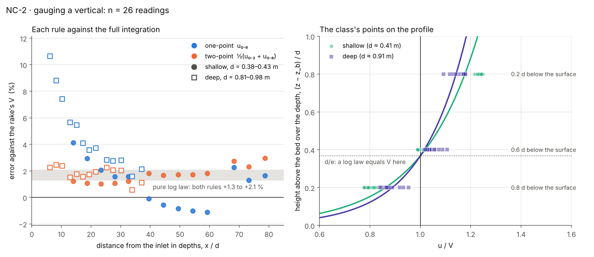

# NC-2 · Gauging a vertical: the 0.6-depth and two-point methods

## Lecturer notes

> **Being revised (WIP).** The card now uses the reservoir level as the only
> knob, a free overfall at the end of a 35 m reach, a station of the student's
> own choosing and gauges on Speed. The sections below still describe the
> earlier two-run Flow switch and are rewritten once the new reach is measured.

A quick in-class exercise, 15–20 minutes, on current-meter gauging. A
velocity-area gauging measures the mean velocity V on each vertical of a
section from one or two point velocities, never the whole profile. Field
practice takes one point at 0.6 d below the surface on a vertical shallower
than 0.75 m, and two, at 0.2 d and 0.8 d, on a deeper one. Here each student
does what a hydrographer does at one vertical, twice — on a shallow run and on
a deep one — reading all three points both times, and judges both rules
against the rake's full depth-integral, which a field gauging never has.

Students submit **d, u₀.₂, u₀.₆, u₀.₈ and V** for each run, and the class
pools them into one plot: each rule's error at the two depths, and every
student's points laid on the log law the rules are built on.

**Open it:** press **E** in the [app](https://barneydobson.github.io/hydraulician/)
and pick **NC-2**, or use the direct link
[`?ex=NC-2`](https://barneydobson.github.io/hydraulician/?ex=NC-2).
How to run any exercise: see the [teaching pack index](../INDEX.md#running-an-exercise).
It runs on the `gauging` scene; the card sets everything up.

> **The deep run is provisional.** On a 1.0 m reach at Medium, the reservoir
> inlet currently sheds a slow surface layer that the flow carries down the
> whole 24 m (an open solver problem, recorded in the engineering notes under
> "The surface is stress-free"). Under it the one-point rule reads 3–8% high,
> which would teach the right conclusion for the wrong reason. The shallow
> run is clean and measured below; the deep run's numbers will be filled in
> once the inlet is fixed. Until then, run the shallow half, and show the deep
> one as a demonstration of what the card asks.

## The reach

The `gauging` scene is a 24 m × 1.6 m slice of a straight channel, per metre
width: a flat drawn bed at z = 0.20 m with gravity tilted to a slope of
1 in 400 (the bed does not staircase), C_f = 0.25. A reservoir feeds the left
edge at a set discharge and a tailwater holds the right edge at the normal
depth, which is how a laboratory flume is set to uniform flow with its
tailgate. Controls → Geometry has one switch:

| Flow | q (m²/s) | d (m) | V (m/s) | Fr | d_c (m) |
|---|---:|---:|---:|---:|---:|
| shallow | 0.40 | 0.44 | 0.91 | 0.44 | 0.25 |
| deep | 1.70 | 1.00 | 1.70 | 0.54 | 0.67 |

Changing it refills the reach and restarts the clock, so the card's 40 s
settle runs again. The scene starts at the answer — uniform depth and a
log-law profile — and settles in about **40 s**. Cells are Δx = 20.1 mm at
Medium: 22 across the shallow depth, 50 across the deep one.

## Student-number rule

**d** is the last digit of the student number:

> **x = 13 + (d mod 8)** metres

| d | 0 | 1 | 2 | 3 | 4 | 5 | 6 | 7 | 8 | 9 |
|---|---|---|---|---|---|---|---|---|---|---|
| **x (m)** | 13 | 14 | 15 | 16 | 17 | 18 | 19 | 20 | 13 | 14 |

The stations start at x = 13 m because nearer the inlet the profile is still
developing (below). The digit is displayed, not applied.

## What the students do

1. Place a Rake (`6`) at the station and press **A** for Average. Wait until
   the legend's T passes 15 s.
2. Hover the rake's column and read **d** and **η** off the box. Put the
   cursor at z = η − 0.2 d, η − 0.6 d and η − 0.8 d in turn (the box's x, z
   row shows the height) and read u off its u, w row: u₀.₂, u₀.₆, u₀.₈.
3. Read **V** off the rake's chip. One-point V₁ = u₀.₆, two-point
   V₂ = ½(u₀.₂ + u₀.₈); each rule's error is 100·(V_rule/V − 1) %.
4. Switch Flow to deep, let it settle, and repeat at the same x.
5. Submit d, u₀.₂, u₀.₆, u₀.₈ and V for both runs.

## Why the rules work

The turbulent log law, with z − z_b the height above the bed, is

    u = (u*/κ) ln((z − z_b)/z₀),       u* = √(g S₀ d),   κ = 0.41

and its depth average is V = (u*/κ)[ln(d/z₀) − 1]. The two are equal where
ln((z − z_b)/d) = −1, at d/e = 0.37 d above the bed — 0.63 d below the
surface: the **0.6-depth rule**. The **two-point** pair sits 0.8 d and 0.2 d
above the bed, and since √(0.2 × 0.8) = 0.4 its mean is exactly the velocity
0.4 d above the bed: on a pure log law the two rules are one rule, and both
read high by the same amount,

    u₀.₆ − V = ½(u₀.₂ + u₀.₈) − V = (u*/κ)(1 + ln 0.4) = 0.084 u*/κ ≈ 0.20 u*

which is about 2% of V for the V/u* ≈ 9–11 of this reach. What separates them
in a river is everything a log law leaves out — the wake of the outer flow, a
velocity dip below the surface, weed, wind, an uneven bed — and there the
two-point mean, which brackets the outer flow, is the more robust. The 0.75 m
handover itself is about the meter: on a shallower vertical 0.2 d is too
close to the surface and 0.8 d too close to the bed for a propeller to read
dependably, so one point is taken instead of two.

## Measured answers

Average mode, 16 s window after the 30 s settle, Medium. "Hover" is what the
student reads — the cell under the cursor; "exact" reads the profile at the
exact height, to show what the cell size costs.

**Shallow run** (d = 0.442 m, V = 0.912 m/s), the same at every station from
x = 14 m to 22 m:

| | one-point u₀.₆ | two-point ½(u₀.₂ + u₀.₈) |
|---|---:|---:|
| hover | −0.1 to −0.3% | +1.9% |
| exact | +0.8% | +1.6% |
| pure log law | +2.3% | +2.3% |

u₀.₂ = 1.12, u₀.₆ = 0.91, u₀.₈ = 0.74 m/s; the surface runs at 1.32 V and is
the fastest water in the column. The hover reads the cell whose centre is
nearest the target height, up to half a cell (10 mm) off it; at 0.8 d, only
0.09 m above the bed where u changes fastest with height, that is worth about
1% of V — the app's version of a meter too big for its vertical, and the
reason the field rule drops the two-point method on shallow verticals.

**Deep run** — provisional, see the note at the top.

**Live against Average.** This flow is nearly steady: at x = 16 m the live
one-point error is −0.37 ± 0.06% and the two-point +1.85 ± 0.01% over 6 s,
so Average changes the shallow reading by less than its last digit. It is on
the card because a current meter's count IS a time mean, and because a rougher
reach — or the inlet's own wake, below — is not steady.

**Nearer the inlet.** Inside the first 12 m the profile is still developing
and its surface is slower than a log law's. The one-point rule is badly off
there and the two-point rule is not:

| x (m) | 2 | 4 | 6 | 8 | 10 | 12 | ≥ 14 |
|---|---:|---:|---:|---:|---:|---:|---:|
| one-point error | +10.3% | +4.8% | +2.7% | +1.8% | +1.2% | +0.3% | −0.2% |
| two-point error | +1.3% | +2.1% | +2.4% | +2.2% | +2.0% | +1.9% | +1.9% |

That contrast is the textbook reason to prefer two points where the profile is
not a clean log law. Part of this development region is the inlet artefact
noted above, so show it as "a profile that is not a log law", not as river
data.

## Pooling the class

Collect one row per student per run,
`student_id,digit,run,x_m,d_m,u02,u06,u08,V` (`run` = `shallow` or `deep`;
extra columns ignored), export the CSV and run:

```bash
python3 collect_plot.py class.csv                 # -> plots/pooled-demo.png
python3 collect_plot.py data/simulated-class.csv  # the shipped dry-run class
```

The left panel plots each rule's error at the class's depths against the
0.75 m handover and the log-law prediction; the right lays every student's
three points on the log law as u/V against height above the bed. The dry-run
class is the shallow run only, until the deep run is measured: one row per
digit, the measured hover readings at that digit's station, rounded to the
two decimals the box and the chip print. The developed reach is the same at
every station, so the ten rows coincide — to two decimals a student reads
u₀.₆ = V (0%) and ½(u₀.₂ + u₀.₈) = 1.02 V (+2.2%).



## Discussion points

- **Why 0.6 d?** The log law crosses its own mean at d/e above the bed. Ask
  the class to find it on their profile before telling them.
- **Two points, one answer.** √(0.2 × 0.8) = 0.4, so on a log law the
  two-point mean IS the 0.6-depth reading. The class's shallow numbers agree
  to within 2%; the rules differ only where the profile is not a log law.
- **The meter's size.** The hover reads a whole 20 mm cell. At 0.8 d on the
  shallow run that cell is a fifth of the height above the bed — where the
  field rule says not to put a second meter.

## Console spot-check

Paste [rig.js](rig.js) into the console and run `await NC2.run(0, 16)` for
the shallow run at x = 16 m: it settles, reads live and over a 20 s window,
and returns d, u₀.₂, u₀.₆, u₀.₈, V and both errors, as hover and exact reads.
`await NC2.sweep()` runs every station on the card for both flows.
