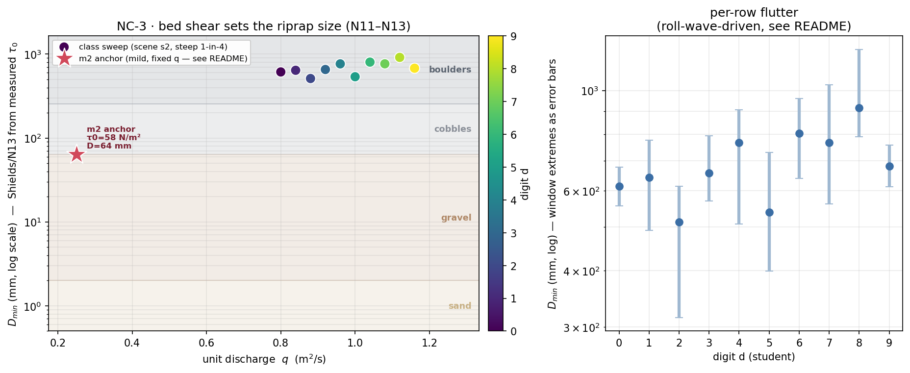

# NC-3 · Bed shear and the riprap size

Every student runs two things. First, their own personalised discharge on a
steep chute: the cursor readout prints the local depth — its `d` row, `h` in
the formulas below — and the friction slope `S_f` straight off the solver's
own energy grade line, so `τ₀ = ρg·h·S_f` is measured rather than assumed,
and on paper that stress becomes the smallest rock that would stay put.
Second, the same reading once on a mild channel at its own fixed discharge,
which gives everyone a shared second point almost for free. Nobody types in a grain size, and the change of bed slope alone
moves the answer by a factor of about 14 — coarse gravel to boulders.

**Open it:** press **E** in the [app](https://barneydobson.github.io/hydraulician/)
and pick **NC-3**, or use the direct link
[`?ex=NC-3`](https://barneydobson.github.io/hydraulician/?ex=NC-3).
How to run any exercise: see the [teaching pack index](../INDEX.md#running-an-exercise).

## Theory

The bed shear stress under a depth `h` on a friction slope `S_f`, and the
Shields threshold-of-motion grain size that resists it:

    τ₀ = ρ·g·h·S_f                     ρ = 1000 kg/m³,  g = 9.81 m/s²
    D_min = τ₀ / [0.056·(ρₛ − ρ)·g]    ρₛ = 2650 kg/m³ (quartz rock)

The cursor box prints the slope as `S_f  1 : N` — convert it, `S_f = 1/N`.
Grain classes to name your answer with: sand < 2 mm < gravel < 64 mm <
cobbles < 256 mm < boulders. The mild-channel anchor everyone reads in Part B
measures **τ₀ ≈ 60 N/m², D_min ≈ 60 mm** at x ≈ 7 m; land within about 20% of
that and you hovered in the right place.

## Your discharge

**d** is the **last digit of your student number** — your lecturer will
explain the assignment in class.

> **q = 0.80 + 0.04 · d** m²/s, set on **Inflow q**.

## What to do

1. Set **Inflow q** to your own q in Controls.
2. Press `R` and let it reach steady state — about **26 s**; the card counts
   it down.
3. Hover mid-chute at **x ≈ 3.5 m** — clear of the first metre and of the
   last 1.5 m before the brink — and read **h** — the box's `depth d` row —
   and **S_f** as the middle of ~10 s of wobble; this chute carries roll waves.
4. Compute τ₀ and D_min, and submit **τ₀ (N/m²)** and **D_min (mm)** —
   record your q, h and S_f too, the answer is checkable against them.

Also — Part B, everyone: open **m2** from the Scenes menu, touch nothing (its
reservoir level is pinned to its own discharge), wait out the 90 s spin-up and
take the same reading at **x ≈ 7 m**, halfway between reservoir and brink.

## For the instructor — pooling the class

Collect one row per student (`student,digit,scene,q,h,Sf,tau0,Dmin_mm,source`,
with `scene` = `s2` for Part A and `m2` for the anchor), export the CSV and
run:

```bash
python3 collect_plot.py class.csv                # -> plots/pooled-demo.png
python3 collect_plot.py data/simulated-class.csv # the shipped dry-run class
```

The script recomputes τ₀ and D_min from h and S_f wherever a row carries only
the raw readings, and plots D_min against q on a log axis with the grain-size
bands shaded, the mild-channel anchor as a single star an order of magnitude
below the class, and each row's measurement window as an error bar.



### Discussion points

- **Why the class cluster comes out flat — sweep it live.** Drag **Inflow q**
  from 0.80 to 1.16 on the chute and watch the cursor box: `d` creeps, `S_f`
  hardly moves, and D_min stays inside the boulders band the whole way. A 45%
  change in discharge is worth almost nothing beside one change of slope from
  1-in-4 to 1-in-68. In τ₀ = ρgRS, S is doing nearly all the work — say so
  before the plot goes up, so a flat cluster reads as the result it is.
- **τ₀ is local — show it.** On m2, hover along the reach from x = 5 m out to
  x = 11 m and watch `S_f` roughly triple into the brink: the same channel
  wants gravel mid-reach and cobbles at its lip. It also explains any Part B
  number that came back far too big.

The full verification record — the ten measured class rows, the m2
station-sensitivity table, the tiltS0 checks, per-row flutter and safe
bounds — is kept locally, out of version control, at
`exercises/NC-3-bed-shear/_archive/README-full.md`.
