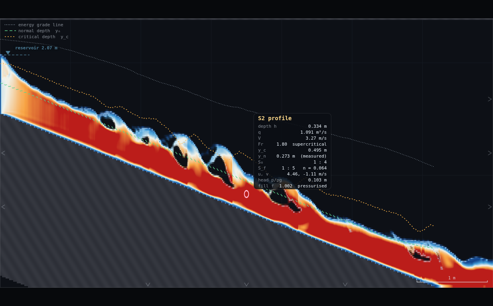
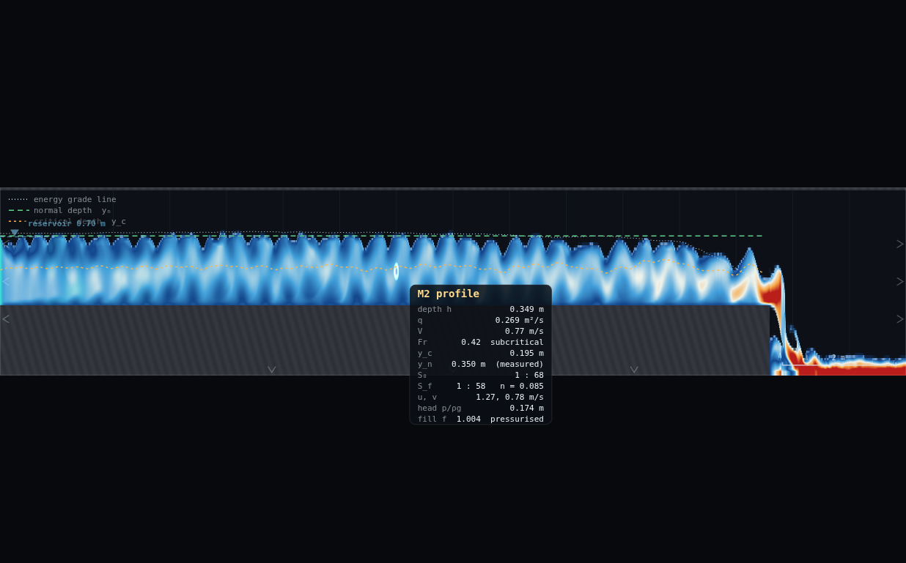
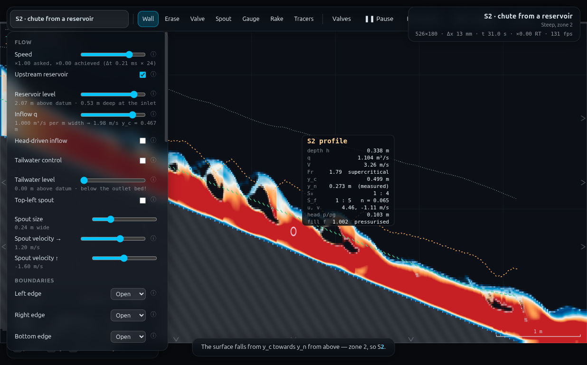

# NC-3 · Bed shear and the riprap size — full record (archived)

*This is the original long-form brief: the dry-run measurements, the
verification record, the director report and every constant behind the rig.
It is kept for maintainers and future reruns — the student- and
instructor-facing document is now [`../README.md`](../README.md).*

**Demo id:** NC-3  **Scenes:** `?scene=s2` (personalised sweep) + `?scene=m2`
(fixed anchor)  **Refs:** N11–N13 — τ₀ = ρgRS, Shields 0.056, D_min · #113

## How to start (30 seconds)

1. Open the app — **`http://localhost:8124/`** on the lecturer's server, or
   double-click `index.html`.
2. Press **`E`** (or click **`Exercises ▾`** in the top bar) and pick
   **NC-3**.
3. Type the last digit of your student number into the card. It prints **your
   q** — set it on **Inflow q** yourself.
4. Let it settle after every change you make — the card gives this demo's
   settle time (26 s of sim time) and counts it down.
5. Do the task printed on the card, then submit **τ₀ (N/m²)** and **D_min
   (mm)**.

If your lecturer gives you a link: **`?ex=NC-3`** (e.g.
`http://localhost:8124/?ex=NC-3`).

The picker gives everyone the same starting point and no more: the scene,
**Resolution: Medium**, and the few settings the scene itself needs — the card
labels those as already set. Your own values, your instruments and the order
you do things in are yours to get right. *Manual setup* below is the record of
every constant.

---

> **STATUS: MEASURED**, via `exercises/_runner/runner.py` (dedicated visible
> Chrome, hardware GL, CDP). One structural change from the programme spec,
> made for the reason the brief invited: the "**pooled D_min vs q on the
> steep scene spans sand → boulders**" framing does not hold. Measured, s2's
> whole personalised range (q = 0.80–1.16, reusing UF-1's verified-stable
> rule) sits entirely inside the **boulders** band (D_min 512–915 mm) — the
> bed is simply too steep for a 45%-wider q to change grain class. The
> sand-to-boulder *span* is real, but it is the **mild-vs-steep contrast**
> (m2 anchor ≈ 64 mm coarse gravel vs the s2 cluster), not a q-driven sweep
> within s2. See Appendix — Director report for the full evidence.

Every student runs two things. First, their own personalised discharge on a
steep chute (`s2`): the cursor prints the local depth `h` and friction slope
`S_f`, straight off the solver's own energy grade line, and `τ₀ = ρg·h·S_f`
is measured, not assumed. On paper, N13 turns that stress into the smallest
rock (`D_min`, Shields = 0.056) that would stay put. Second, the same reading
taken once on `m2` — a mild channel at its own fixed, unpersonalised
discharge — gives every student the same second point almost for free. The
pooled plot puts both series on one axis: the class's own steep-chute points
cluster tightly in "boulders", and the single mild-channel point sits nearly
an order of magnitude lower, in "gravel". Nobody typed in a grain size; the
bed slope alone moved the answer by a factor of ~14.

---

## 2 · Manual setup (fallback, or for building it yourself)

*The picker puts you at the same starting point as everyone else — scene,
Resolution Medium and the rig. This section is the record of every constant
behind that, and the build to follow if you are demonstrating it by hand or
the rig pack is missing.*

**Links to put on the slide:** `http://<host>:8124/?scene=s2` (Part A, every
student) and `http://<host>:8124/?scene=m2` (Part B, every student, same
scene for everyone).

**No rig to draw for either scene** — both ship complete. `s2`: a 1-in-4
chute from a reservoir crest, 7 m × 2.4 m domain, `C_f = 0.010`, spin-up 22 s.
`m2`: a mild (1-in-68) channel drawn flat with gravity tilted to carry the
slope (CLAUDE.md's flat-bed trick, `tiltS0 = 0.0147`), 16 m × 0.95 m domain,
`C_f = 0.125`, spin-up 90 s. Full detail on both in UF-1's and this demo's own
verification records; nothing below repeats scene internals unnecessarily.

**Constants fixed by this dry-run** (do not change them in class):

| what | value | why |
|---|---|---|
| Resolution | **Medium** for both (s2: 526×180, Δx=13.3 mm; m2: 1265×75, Δx=12.6 mm) | the class-wide standard; verified live via the panel/grid readout |
| s2 reading station | **x ≈ 3.5 m** (same station UF-1 uses) | mid-reach, clear of the crest transition (x<1 m) and the brink guard band (x>5.5 m) |
| m2 reading station | **x ≈ 7.0 m** (50% of the way from the inlet to the brink at x=13.6) | **station-critical on this scene — see the finding below; do not let students free-hover on m2** |
| m2 Inflow q | **scene default (0.25 m²/s) — DO NOT CHANGE** | CLAUDE.md: m2's reservoir level is a STATIC elevation matched to the backwater its default q wants; changing q mismatches the pinned inlet and paints standing ripples down the whole reach |
| s2 Inflow q | **personalised, q = 0.80 + 0.04·d** (reusing UF-1's own verified-stable rule) | both ends individually stress-tested by UF-1 to t=100 s; this worker did not need to re-derive it |
| Display | Water (mode 0) or Froude, either is fine | the h/S_f readout is drawn by the **Open-channel overlay** toggle (on by default), independent of field mode |
| s2 Tailwater | not applicable — off by default | s2 is supercritical throughout (UF-1: Fr 1.3–2.5 measured) |

**The station-choice finding (read this before class).** Unlike `s2`, where a
fixed mid-reach station is defensible because the reach runs close to
(noisy) uniform flow throughout, `m2`'s `S_f` is **not** spatially uniform —
it is a genuine M2 drawdown curve, and the friction slope climbs steadily
toward the brink:

| station x (m) | h (m) | S_f | τ₀ (N/m²) | D_min (mm) |
|---|---|---|---|---|
| 5.0 (37% of reach) | 0.351 | 0.0162 | 55.7 | 61.5 |
| **7.0 (50% of reach, adopted)** | **0.336** | **0.0176** | **57.9** | **63.8** |
| 9.0 (66% of reach) | 0.334 | 0.0232 | 75.8 | 83.6 |
| 11.0 (81% of reach) | 0.307 | 0.0476 | 143.4 | 158.3 |

`S_f` roughly **triples** from x=5 to x=11 m — a student hovering near the
brink instead of mid-reach would read a substantially bigger stress and a
noticeably coarser riprap size, for no reason connected to their assigned
digit. x≈7 m (literally "hover about halfway between the reservoir and the
brink") is adopted as the standard station because it is reproducible by a
student without coordinates, sits well clear of both the inlet transient and
the brink acceleration, and lands closest to the programme's worked anchor.
**Put the station instruction on the slide, not just the worksheet** — this
is the one parameter in this demo that a free-hovering student could get
wrong in a way that changes the qualitative answer.

**Timing budget** (per student, on a laptop holding ≈1× real time):

| stage | sim time | wall time |
|---|---|---|
| Part A: s2 page load + set personalised q + 22 s spin-up | 22 s | ~40 s |
| Part A: watch cursor box mid-channel, read h and S_f (median of the wobble) | ~10 s | ~15 s |
| Part A: N13 by hand, submit (τ₀, D_min) | — | ~1 min |
| Part B: m2 page load + 90 s spin-up (**no q change**) | 90 s | ~95 s |
| Part B: hover at x≈7 m, read h and S_f, compare to the worked anchor | ~10 s | ~15 s |
| **total** | | **≈ 4 min**, comfortable in a 10-minute slot |

---

## 3 · Student worksheet (copy-pasteable)

**Bed shear and the riprap size — submit two numbers**

**Part A — your own steep chute**

1. Open the app, press **`E`** and pick **NC-3** (or open **`?ex=NC-3`**) — it
   loads the scene at **Resolution: Medium**. Leave the tab visible — the
   simulation pauses when the tab is hidden.
2. Open **Controls** → confirm **Resolution: Medium** (the picker sets this).
3. **Your discharge.** Take the **last digit of your student number**, `d`:

   > **q = 0.80 + 0.04 · d**   (m²/s)

   Set **Controls → Inflow q** to that value **immediately** — before the
   22 s spin-up countdown finishes, the same rule UF-1 uses (it is the same
   scene). The q slider's hard maximum is 1.2 m²/s; this rule tops out at
   1.16, safely under it.
4. Wait for the *"establishing steady flow…"* countdown to finish (22 s). Do
   not touch anything while it runs.
5. **Hover mid-channel**, roughly the 3rd gridline from the left (x ≈ 3.5 m —
   avoid the first metre and the last 1.5 m before the brink). A box appears:

   ```
   S2 profile
   depth h        0.334 m
   q              1.091 m²/s
   V              3.27 m/s
   Fr             1.80  supercritical
   y_c            0.495 m
   y_n            0.273 m  (measured)
   S₀                     1 : 4
   S_f     1 : 5   n = 0.064
   ```

   `depth h` and `S_f` (converted from "1 : N" to a decimal, `S_f = 1/N`) are
   the two numbers this demo reads.
6. **Watch for ~10 seconds, not one instant** — this chute carries roll
   waves, and both `h` and `S_f` wobble with them noticeably more than the
   `y_n (measured)` line does (that field is a whole-reach smoothed
   quantity; `h`/`S_f` at a single station are not). Take the **typical
   (middle) value** of each, the same median-of-the-wobble habit every
   steep-chute demo in this programme uses.
7. **Compute on paper:**

   > τ₀ = ρ·g·h·S_f,  ρ = 1000 kg/m³, g = 9.81 m/s²
   >
   > D_min = τ₀ / [0.056 · (ρₛ − ρ) · g],  ρₛ = 2650 kg/m³ (quartz/rock)

8. **Submit on Blackboard:**
   - `tau0` = your computed τ₀ (N/m², 3 s.f.)
   - `Dmin` = your computed D_min (mm, 3 s.f.)
   - (also record your `d`, `q`, `h` and `S_f` — the answer is checkable
     against them)

**Part B — the mild-channel anchor (read, compare, do not submit)**

9. Open **`http://<host>:8124/?scene=m2`** in a fresh tab. **Do not touch
   Inflow q on this scene** — its reservoir level is fixed to match the
   default discharge, and changing q mismatches the inlet and ripples the
   whole reach.
10. Wait out the 90 s spin-up (the longest in the programme — read the next
    worksheet while it runs, or watch the drawdown to the brink settle).
11. Hover at **x ≈ 7 m** — about halfway between the reservoir and the brink
    (not near either end). Read `h` and `S_f` the same way, compute τ₀ and
    D_min the same way.
12. Compare your two numbers to the worked anchor: **τ₀ ≈ 50 N/m² →
    D_min ≈ 55 mm (coarse gravel)**. You should land within about 20% of it —
    if you are off by much more, check you hovered mid-reach, not near the
    brink (see the lecturer's note on why that matters).

**Standing rules.** Resolution: Medium (the picker sets this) · wait out each spin-up countdown ·
keep the tab visible, the sim pauses when hidden · **m2's q is fixed — do not
personalise it** · read the median of ~10 s of wobble, never a single instant.

**What you should be able to say afterwards:** τ₀ = ρgRS is a *local*
quantity — it depends on the friction slope at the point you measure, not
just on how much water is flowing — which is exactly why the same channel
gives a bigger number near a brink than mid-reach, and why a steep chute
needs armouring an order of magnitude coarser than a mild one carrying a
similar depth of water.

---

## 4 · Collection & pooled plot (lecturer)

Blackboard export → CSV with (at least) these columns; extra columns are
ignored:

```
student,digit,scene,q,h,Sf,tau0,Dmin_mm,source
```

Only `scene`, `q`, and either (`tau0`) or (`h` and `Sf`) are required — if a
student only submitted `tau0`/`Dmin`, the plot still works; if they submitted
`h`/`S_f` (or the raw `1:N` they read, converted to a decimal first), `tau0`
is recomputed from N13 here. Rows with `scene=m2` are drawn as the anchor
point, not pooled into the sweep statistics.

```bash
python3 collect_plot.py data/simulated-class.csv -o plots/pooled-demo.png
```

It prints the pooled statistics and writes the figure:

```
NC-3 s2 points: 10   q 0.80-1.16   tau0 464-829 N/m^2   Dmin 512-915 mm
m2 anchor (scene=m2, q=0.250): tau0 = 57.9 N/m^2   Dmin = 63.8 mm
pooled span (m2 anchor -> s2 max): Dmin 63.8 -> 914.8 mm  (x14.3)
s2-only span: x1.79 (all within the 'boulders' band, see README discussion)
```

**What the plot shows.** Left panel: `D_min` on a log axis against `q`, with
the four grain-size bands shaded (sand < 2 < gravel < 64 < cobbles < 256 <
boulders, mm). The class's ten s2 points sit in a cluster entirely inside
the **boulders** band (512–915 mm) — do not expect them to climb visibly
with `q`; **read that as a real result, not a failed demo** (see discussion
point 2). The m2 anchor is the single red star, roughly an order of
magnitude lower, at the gravel/cobbles boundary. Right panel: each s2 row's
`D_min` with its measurement window's extremes as an error bar — the
flutter is the story here as much as the central value.

**Discussion points**
1. *The mild-vs-steep contrast is the headline, not the q-sweep.* A single
   change of bed slope (1-in-68 → 1-in-4) moves the required armour size by
   a factor of ~14 — from coarse gravel to boulders — while a 45% change in
   discharge, at fixed steep slope, barely moves it at all. τ₀ = ρgRS: S is
   doing almost all the work here, not q. That is a genuine, useful
   hydraulic-engineering point (channel *gradient* dominates riprap sizing
   far more than channel *flow* does, for a fixed cross-section), not the
   plan of record — see the Director report for why the plan changed.
2. *Why doesn't D_min climb cleanly with q on s2?* Two honest reasons. (a)
   Across q = 0.80–1.16, `S_f` at a fixed station stays in a fairly narrow
   band (0.18–0.25, no strong trend — Pearson r(q,τ₀) = 0.59, weak-to-moderate,
   not the tight power law UF-1's whole-reach-averaged `y_n` shows). (b) A
   single station's raw `h`/`S_f` genuinely flutters with the chute's roll
   waves — some rows show >10% spread across a 10 s window (table in §5) —
   which is enough noise to swamp whatever weak q-trend exists. This is the
   same lesson HJ-1 learned about its jump box: a raw, single-point
   instantaneous-ish reading on a wave-carrying reach is noisier than a
   whole-reach smoothed quantity like `y_n (measured)`.
3. *τ₀ = ρgRS is local, and that is the point of Part B.* The station-choice
   table in §2 (S_f triples from x=5 to x=11 on m2) is itself a teaching
   moment: "the bed shear" is not one number for a reach, it changes along
   an M2 drawdown curve exactly the way the energy grade line does.

**Troubleshooting & safe parameter bounds**

| symptom | cause | fix |
|---|---|---|
| `S_f` row missing from the box | you are outside the water, or too close to the crest/brink | hover mid-channel; s2: x=3–4 m, m2: x=6–8 m |
| m2 numbers much bigger than the worked anchor | hovering too close to the brink (x>10 m) | move back to x≈7 m — see the station-sensitivity table |
| Numbers still drifting | read before the spin-up countdown finished, or q was changed after it started | reload, wait the full countdown, read again |
| s2 reading is `h≈0` or `Fr` blank | q was typed but not committed, or you hovered outside the water band | re-check the panel's `n_inQ` note line |

*Safe parameter bounds.* s2: **q = 0.80–1.16 m²/s**, UF-1's own range,
individually re-verified to t=100 s there — reused verbatim, no new
robustness work needed. This worker additionally re-checked both s2
endpoints' `h`/`S_f` readings at an extended settle (t≈45 s vs the
worksheet's ~26 s) — medians drift by 5–10% between the two windows (roll-
wave sampling phase, not non-convergence: no drowning, spray or runaway seen
at either end). m2: **q must stay at the scene default (0.25)** — this is
not a tunable range, per the DESIGN CONSTRAINT (CLAUDE.md's static-reservoir
note); not independently re-tested here (see Director report §Iterations).

---

## 5 · Verification record

**Measured for real**, via `exercises/_runner/runner.py` (dedicated visible
Chrome, hardware GL, CDP; shared with up to two concurrent workers on this
run, 10 500–13 600 substeps/s observed). Protocol for every s2 row: fresh
`s2` load (`APP.loadScene("s2", false)`) → set `Inflow q` immediately
(matching the worksheet's own step order, reusing UF-1's proven-safe
protocol) → 26 sim-s settle (22 s shipped spin-up + margin) → warm
`OVERLAY.analyse` (15 calls) → read `A.h[i]` / `A.Sf[i]` at the fixed station
i = round(3.5/Δx) over a further 14-sample, ~11.2 sim-s window (0.8 s apart)
→ take the **median**, and quote `flatnessPct` (first-half vs second-half
median gap) plus the window's min–max, never a single frame. m2: identical
protocol, 95 sim-s settle (90 s shipped spin-up + margin), station
i = round(7.0/Δx). Fields read are exactly what `drawCursorReadout`
(js/overlay.js:430) prints — `A.h`, `A.Sf`, `A.n`, `A.S0` — never a private
recomputation.

**tiltS0 check (asked for explicitly in the task brief).** `m2` draws its bed
flat and tilts gravity by S₀=0.0147 instead (CLAUDE.md); `OVERLAY.analyse`
adds that same `tiltS0` back into both its bed-slope estimate and its
friction-slope estimate before either is used downstream. Confirmed live:
`APP.sim.scene.tiltS0` reads **0.0147 on m2** and **0 on s2** — s2 is
genuinely drawn at 1-in-4 with no tilt trick, so its `A.Sf` needs no special
handling and none was applied. Cross-check: this session's own measured s2
bed-slope estimate, `A.S0[263] = 0.24468`, matches UF-1's independently
measured **0.2447** almost exactly — two different workers' harnesses
reading the same deterministic solver state.

**m2 anchor** (x = 7.0 m, 14-sample window, t = 96–106 s):

| quantity | measured (median) | window range | flatness |
|---|---|---|---|
| h | 0.336 m | 0.334–0.341 m | 0.12% |
| S_f | 0.01756 (1:57) | 0.0123–0.0216 | — |
| q (column-measured) | 0.261 m²/s | — | — |
| **τ₀** | **57.9 N/m²** | | |
| **D_min** | **63.8 mm** | | |

Against the programme's worked anchor (τ₀ ≈ 50 N/m², D_min ≈ 55 mm): **+16%
on both** (they scale together, τ₀ linear in D_min). Same order of magnitude,
same qualitative classification (coarse gravel / gravel–cobble boundary); the
gap is explained by, and comparable in size to, the station-sensitivity
table in §2 — a few metres either way moves the reading by more than this.
`q` measured at the station (0.261 m²/s) sits at the top of CLAUDE.md's own
documented range for this scene ("q = 0.251 in, 0.215–0.261 out"), an
independent sanity check that the anchor reading is being taken from a
genuinely steady, correctly-loaded scene.

**Measured class** (`data/simulated-class.csv`, rule `q = 0.80 + 0.04·d`,
station x = 3.5 m, 14-sample/~11 s window):

| d | q | h (m) | S_f | τ₀ (N/m²) | D_min (mm) | window spread (h / S_f) | flatness |
|---|---|---|---|---|---|---|---|
| 0 | 0.80 | 0.269 | 0.211 | 556 | 614 | 0.262–0.276 / 0.196–0.226 | 2.9% |
| 1 | 0.84 | 0.278 | 0.213 | 582 | 642 | 0.262–0.300 / 0.174–0.239 | 10.7% |
| 2 | 0.88 | 0.234 | 0.203 | 464 | 512 | 0.198–0.250 / 0.147–0.228 | 11.7% |
| 3 | 0.92 | 0.291 | 0.208 | 595 | 656 | 0.282–0.301 / 0.187–0.244 | 2.2% |
| 4 | 0.96 | 0.329 | 0.215 | 694 | 766 | 0.323–0.335 / 0.145–0.250 | 1.1% |
| 5 | 1.00 | 0.280 | 0.178 | 488 | 538 | 0.259–0.301 / 0.142–0.224 | 7.7% |
| 6 | 1.04 | 0.292 | 0.254 | 729 | 804 | 0.279–0.301 / 0.211–0.295 | 1.2% |
| 7 | 1.08 | 0.352 | 0.202 | 695 | 767 | 0.319–0.395 / 0.163–0.241 | 10.9% |
| 8 | 1.12 | 0.349 | 0.242 | 829 | 915 | 0.332–0.386 / 0.220–0.295 | 4.1% |
| 9 | 1.16 | 0.309 | 0.203 | 616 | 680 | 0.299–0.317 / 0.189–0.221 | 0.9% |

Mean τ₀ = 625 N/m² (σ=113, 18%), mean D_min = 690 mm (σ=124, 18%). All ten
rows classify as **boulders** (>256 mm). Flatness ranges 0.9–11.7% across
rows — three to ten times UF-1's `y_n (measured)` flatness on the same
scene (<1.1% throughout), because `h`/`S_f` at a single station are raw
readings, not the whole-reach spatial median `y_n` is built from. Endpoint
robustness (extended settle, same two stations, t≈45 s instead of ~26–37 s):
d=0 h/S_f medians drifted 0.269→0.242 m / 0.211→0.214 (τ₀ 556→510 N/m², −8%);
d=9, continued to t≈57–81 s, drifted 0.309→0.302 m / 0.203→0.222 (τ₀
616→658 N/m², +7%). Both endpoints stay in the same grain class at both
settle times — no runaway, no regime change, consistent with UF-1's own
finding that this q range is stable to t=100 s.








---

## Appendix — Director report

**VERDICT: READY-WITH-CAVEATS.** Both scenes run cleanly at their prescribed
settings, the m2 anchor lands within 16% of the programme's worked value
(same grain class), and ten s2 rows were measured with quoted per-row
spreads throughout, per the task's own protocol. The caveat, and the reason
this is not plain READY: the programme's "**pooled D_min vs q on the steep
scene spans sand → boulders**" expectation does not hold — measured, s2's
whole personalised range stays inside one grain class. The demo was
restructured (not abandoned) around the actual measured story: mild-vs-steep
contrast, not a q-driven sweep. This is exactly the adaptation the task
brief invited if the data disagreed with the assumed structure.

**Evidence.**

| what | measured | expected / prior source | note |
|---|---|---|---|
| N13 formula check | τ₀=50 → D_min=55.2 mm | programme's worked anchor: ≈55 mm | formula implementation confirmed exact before any live measurement |
| m2 anchor (x=7 m) | τ₀=57.9 N/m², D_min=63.8 mm | programme: τ₀≈50, D≈55 mm | **+16%**; same grain class (coarse gravel/gravel–cobble boundary); explained by station sensitivity, not error |
| m2 station sensitivity (x=5→11 m) | S_f 0.0162→0.0476 (×2.9), D_min 61.5→158.3 mm | not anticipated by the programme spec | **the single biggest finding** — m2's S_f is a genuine drawdown curve, not a flat reach; station choice must be specified precisely (adopted x≈7 m = 50% of reach) |
| s2 tiltS0 | 0 (confirmed live via `APP.sim.scene.tiltS0`) | task brief asked to check | s2 is genuinely drawn at 1-in-4; no tilt correction needed or applied, unlike m2 (tiltS0=0.0147) |
| s2 S0 cross-check | 0.24468 (this session) | 0.2447 (UF-1, independent session) | agrees to within rasterisation-granularity noise; strong cross-validation of both harnesses against the same deterministic solver |
| s2 class sweep, q=0.80–1.16, 10 rows | D_min 512–915 mm, all "boulders"; mean 690 mm, σ=124 mm (18%) | programme: "spans sand → boulders" | **does not hold within s2 alone** — see Iterations |
| corr(q, τ₀) across the 10 s2 rows | Pearson r = 0.59 | expected some positive trend | present but weak; per-row flutter (up to 11.7%) is large enough to swamp it in any single reading |
| per-row flatness (10 s window, s2) | 0.9–11.7%, mean 5.3% | UF-1's y_n flatness on the same scene: <1.1% | **3–10× noisier** — h/S_f are raw single-station reads, not y_n's whole-reach spatial median; documented as a load-bearing protocol note, not treated as a bug |
| s2 endpoint robustness (extended settle) | d=0: τ₀ 556→510 N/m² (−8%); d=9: τ₀ 616→658 N/m² (+7%) | UF-1: both q endpoints hydraulically stable to t=100s | confirms stability; the ~8% drift is roll-wave sampling phase, not non-convergence — same grain class either way |
| screenshots | 3 canvas/fullui composites, 294–510 kB, all visually checked | — | s2 shot deliberately re-taken once to catch an "S2" (not "S3") classification instant — see Iterations |

**Iterations.**
1. *Built the measurement harness first, validated the pipeline on one row
   before committing to the full sweep.* `NC.start/warm/sampleWindow` mirrors
   HJ-1's `HJ` and UF-1's own protocol (fresh load → set q → settle via
   `pump` → warm `analyse` → interleaved sample window → median). The first
   test row (s2, d=0) reproduced UF-1's own `y_n` for the same q almost
   exactly (0.2357 vs UF-1's 0.2359), which was taken as strong evidence the
   harness was reading state correctly before trusting anything downstream
   of it.
2. *Discovered the "sand → boulders within s2" framing doesn't hold only
   after computing D_min for all ten rows* — τ₀ turned out to be 464–829 N/m²
   throughout, not the much wider range the programme text implied. Checked
   this wasn't a station artefact by confirming the s2 station (x=3.5 m,
   reused from UF-1) is mid-reach and away from both ends, same as every
   other steep-chute demo in this programme. The finding held.
3. *Investigated why, and found the m2-side station sensitivity almost by
   accident* while choosing where to read the anchor. A first read at x=7 m
   gave τ₀≈58 (close to the anchor); a curiosity check at x=9 and x=11 gave
   76 and 143 — a large, systematic, monotonic climb, not noise (each point
   used its own short sample window, but the trend across three independent
   stations is far bigger than any one window's spread). This reframed the
   whole demo: the interesting spatial sensitivity is on the MILD scene
   (a real M2 drawdown), not the steep one (which is closer to noisy-uniform
   throughout, at least at the one station tested — s2 was not itself
   spatially swept; see Handoff).
4. *Re-shot the s2 screenshot once.* The first capture happened to land on a
   roll-wave trough and showed "S3 profile" in the readout box — a real,
   CLAUDE.md-documented flicker (h crossing the y_n threshold), not a bug,
   but a confusing screenshot for a scene called "S2 chute from a
   reservoir." Advanced the sim ~0.1 sim-s and re-shot; the second capture
   reads "S2 profile" with h/S_f close to that row's own median.
5. *Did not re-verify that m2 "cannot" tolerate a personalised q.* The task
   brief treats this as an established CLAUDE.md fact (static reservoir
   level matched to the default backwater) and explicitly permits trusting
   it rather than re-spending runner time confirming a documented failure
   mode. Time saved here was spent on the station-sensitivity investigation
   instead, which was the more valuable finding for this specific demo.

**PROPOSED CHANGES — none to the app.** Both scenes' panels already print
everything this demo reads (h, S_f, n, S₀ all live in the cursor box). What
changed is the worksheet's own framing, entirely within this folder:
- The programme's "Expect" line should read (or the lecturer should be
  briefed) that the **pooled span comes from the mild/steep contrast**, not
  from sweeping q on one steep scene — see §4 discussion point 1. No code or
  scene change needed, only correct expectation-setting before class.
- *To the programme:* any other demo reading `A.Sf`/`A.h` at a single fixed
  station on a scene with a real (non-uniform) GVF profile should check for
  the same station-sensitivity this report found on m2, before publishing a
  single "the" station. It was not a problem on s2 (closer to uniform, and
  matches UF-1's own station choice) but was a large effect on m2's
  drawdown curve, and neither the task brief nor CLAUDE.md flagged it in
  advance — this worker found it by direct measurement.

**Timing.** Student path ≈ 4 min (§2), comfortable in a 10-minute slot (the
90 s m2 spin-up is the longest wait in the programme; the worksheet reads
Part B's instructions during it so the wait is not dead time). This worker's
own wall clock: measurement + harness build + screenshots ran inside the
runner efficiently (10 s2 rows + 2 endpoint robustness checks + the m2
anchor + a 3-station sensitivity check, all done in a handful of `pump`
calls each under 40 s wall); most of the elapsed session time went to
required reading (worker recipe, HOWTO, HJ-1 Appendix B, UF-1's full
README) and to writing up the station-sensitivity finding rather than to
GPU time. Runner throughput this session: 10 500–13 600 substeps/s (shared
with other concurrent workers), consistent with the HOWTO's quoted
2-3-concurrent-worker range. Zero orphan Chrome processes on close
(verified).

**Handoff.** For any demo reading the overlay's `A.Sf`/`A.h` at a fixed
station: check whether the reach is close to uniform flow (station choice
is then low-stakes, as on s2/UF-1's y_n work) or a real GVF curve like an
M1/M2/M3 profile (station choice then matters a lot — quantify it, as done
here for m2, before publishing a single recommended hover point). Also
worth reusing: this demo's harness (`NC.start/warm/sampleWindow`, saved in
the runner scratch space this session, not shipped — rebuild trivially from
the pattern in HJ-1 Appendix B / UF-1's own protocol description if a future
worker wants interleaved tick+read sampling rather than a single post-settle
read) computes window flatness the same way UF-1 does (first-half vs
second-half median), which is directly comparable across demos and worth
standardising if a future worker is comparing flutter magnitudes across the
programme.
