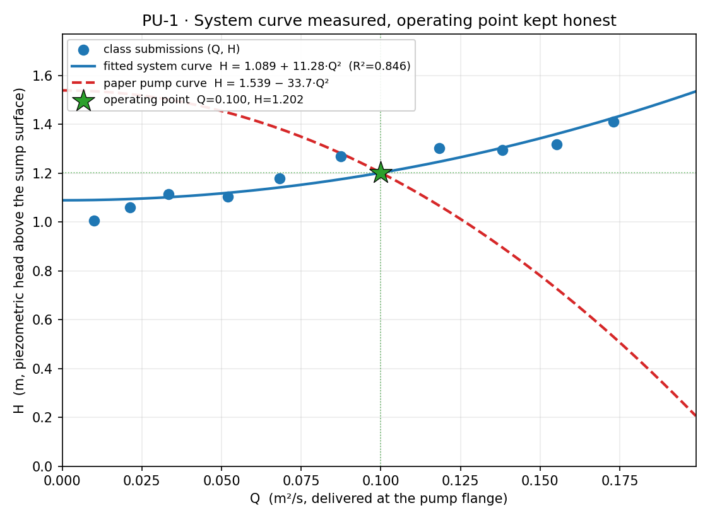
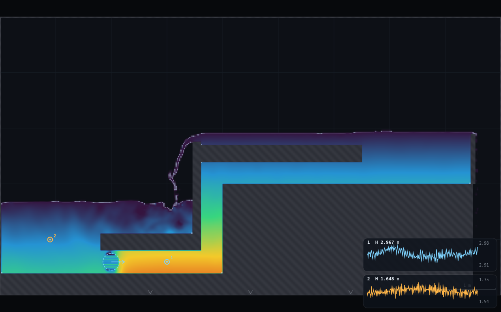
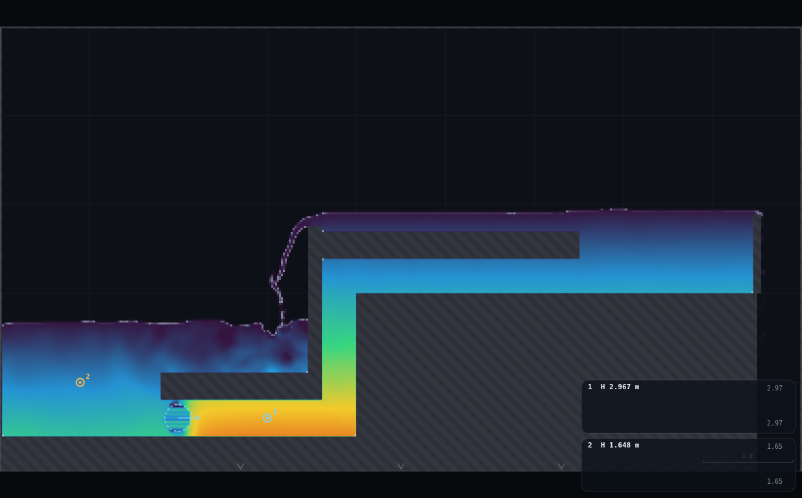
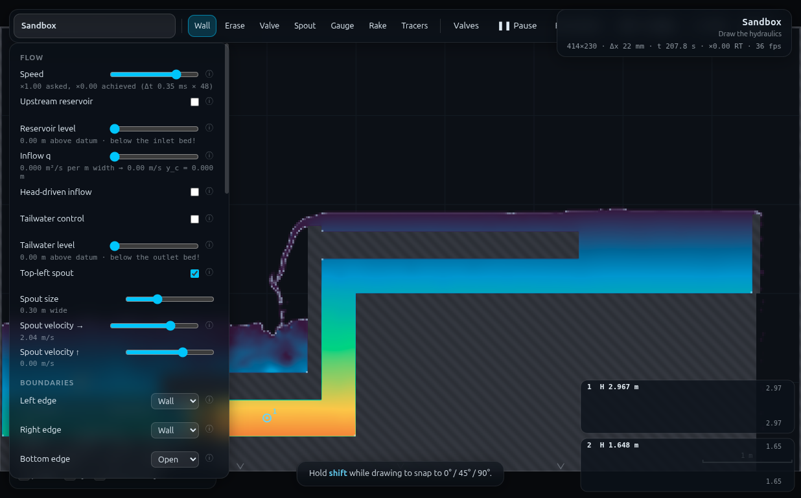

# PU-1 · System curve measured, operating point kept honest

**Demo id:** PU-1  **Rig:** Sandbox (no `?scene=`)  **Refs:** #67–69 —
`H_system = H_s + KQ²`; operating point `H_pump(Q) = H_system(Q)`

## How to start (30 seconds)

1. Open the app — **`http://localhost:8124/`** on the lecturer's server, or
   double-click `index.html`.
2. Press **`E`** (or click **`Exercises ▾`** in the top bar) and pick
   **PU-1**.
3. Type the last digit of your student number into the card. It prints **your
   spout velocity** — you set it, after the shared priming steps.
4. Work through the card's **4 numbered steps** in order — this rig needs a
   sequence, and nothing does it for you.
5. Let it settle after every change you make — the card gives this demo's
   settle time (10 s of sim time) and counts it down.
6. Do the task printed on the card, then submit **Q** and **H**.

If your lecturer gives you a link: **`?ex=PU-1`** (e.g.
`http://localhost:8124/?ex=PU-1`).

The picker gives everyone the same starting point and no more: the scene,
**Resolution: Medium**, the rig geometry, and the few settings without which
the rig is not a working rig — the card labels those as already set. Your own
values, your instruments and the order you do things in are yours to get
right. If your build ships without the rig pack the card says so; then draw it
by hand from *Manual setup* below.

---

Every student turns their own rising main's pump up or down, reads the head
it takes at the discharge flange, and submits `(Q, H)`. Pooled, the class's
points trace the system's own resistance curve — nobody fitted a formula,
they measured a real duct's response to being asked for more flow. Then the
lecturer hands out a manufacturer-style pump curve on paper, the class finds
the intersection graphically, and one student imposes that exact `Q` live:
the flange gauge should land on the head the graph predicted. NPSH and the
affinity laws stay on slides — this tool cannot go sub-atmospheric, and that
is itself worth two minutes of class time (§6).

---

## 1 · Manual setup (fallback, or for building it yourself) — the rig

*The picker puts you at the same starting point as everyone else — scene,
Resolution Medium and the rig. This section is the record of every constant
behind that, and the build to follow if you are demonstrating it by hand or
the rig pack is missing.*

A **rising main**, not RIG-A's horizontal duct: an open **sump** low on the
left, a **spout acting as the pump** inside a short horizontal "flange"
section, a **vertical elbow riser** lifting the flow 1.6–2.0 m, a horizontal
run into a **delivery tank** with a drawn **overflow lip** (CLAUDE.md's
jet-scene trick — excess spills into a waste chute and leaves the domain, so
the tank's level self-limits without a panel level control), built in the
**Sandbox** (W=9, H=5, Medium → 414×230, Δx=21.7 mm).

```
y=5.0 ┌────────────────────────────────────────┬───────────┬────────┐
      │                                        │  high run │  tank  │chute
      │                    ┌───────────────────┴═══════════╡ 2.40–2.70
      │  sump (open,       ║ riser 0.4 m wide   HIGH BORE   │ ▲ lip 2.90
y=0.8 │  no roof)          ╠════╗ low-run soffit 0.40 m     │────────┤
      │  ~1.5–1.8 m deep   ║LOW ║ 0.80                       tank    │open
y=0.4 │                    ║BORE║                            floor= │bottom
      │      (P) pump      ║0.40║                            high   │drain
y=0.0 └────────────────────╨────╨────────────────────invert─┴───────┴────┘
      0   0.9  1.8  2.0(P) 3.0(gauge) 3.6  4.0    4.0–6.5   6.5–8.5  8.5–9.0
```

**Why a rising main and not RIG-A's own reservoir pipe.** RIG-A's head-driven
reservoir is a constant-*head* source (level pinned, `q` follows) — exactly
backwards from a system-curve demo, which needs to **impose Q and read the H
it takes**. So PU-1 repurposes the **spout** as the pump: `sim.p.source`
imposes a velocity (→ Q) directly, and H is measured as the response. No
tailwater/level-control edge is used anywhere; the delivery tank's level is
set by drawn geometry (the overflow lip), not a panel control.

**Where the pump sits (the thing to iterate and document).** Three positions
were tried:
- *In the open sump, aimed at the duct mouth* — momentum spreads sideways in
  the open pool before it can be confined; net forward transport was weak.
- *Right at the duct mouth* — better, but momentum still leaks past the
  spout's own circular footprint into the bore's unconfined margins.
- **Inside the low-run bore, 0.2 m past the mouth, footprint sized close to
  the full bore height** (`r=0.15` → 0.30 m against a 0.40 m bore) — this is
  what ships. A materially smaller radius let too much flow slip past the
  spout's edges as local recirculation instead of net throughput.

**Placement that ships:** `sim.p.source = {x:2.0, y:0.60, r:0.15, vx:<per
student>, vy:0}` — `x,y` set directly (there is no panel control for spout
*position*; only `on/r/vx/vy` are panel-exposed, exactly the fields
`CONTROLS` ids `spoutOn/spoutR/spoutVx/spoutVy` proxy). Aimed straight down
the pipe axis (`vy=0`): the low-run section is horizontal.

### Building the rig by hand (≈2.5 min, 6 strokes + 1 erase)

Zoom out (`0`). All strokes drawn with **Wall** and `shift` held (snaps to
0°/45°/90°) unless marked **Erase**.

1. **Erase** (max brush, hold `]`): one fat stroke `(0,2.7)→(9,2.7)`,
   brush at max — wipes the sandbox's own two default ledges, which cross
   this footprint.
2. **Floor** (max brush): `(0.0,0.2)→(4.0,0.2)` — sump + low-run + riser
   base, solid to the ground.
3. **Narrow to ≈0.30 m** (from max, press `[` twice): the **low-run soffit**,
   `(1.8,0.95)→(3.6,0.95)` — bottom face at 0.80 m, the 0.40 m bore's roof.
   Stops exactly at the riser, x=3.6 — do not run it past.
4. **Back to max brush** (`]` repeatedly): the **high-run invert / tank
   floor**, one continuous stroke `(4.0,1.0)→(8.5,1.0)`.
5. **Narrow to ≈0.30 m again**: the **high-run soffit**,
   `(3.6,2.55)→(6.5,2.55)` — **starts at x=3.6, the riser's own left edge,
   not x=4.0**. Getting this wrong leaves the riser open above its own turn
   and it fills like a chimney instead of feeding the tank (see §5).
6. **Narrow to ≈0.10 m** (from max, press `[` six times): the **overflow
   lip**, one short vertical stroke `(8.5,2.0)→(8.5,2.9)` — its top is the
   weir crest.
7. **Narrow to ≈0.13 m** (from max, press `[` five times): the **riser cap**,
   one short vertical stroke `(3.53,1.05)→(3.53,2.75)`, immediately left of
   the riser — seals a dead air pocket that otherwise leaks the riser's
   contents sideways into the sump (see §5).

**Panel:** Left edge **Wall**, Right edge **Wall**, Bottom edge **Open** (the
sandbox default — leave it; it is the waste chute's drain), Top edge
**Wall**. **Top-left spout ✔**, Field = **Head**.

**Self-check:** hover in the low-run bore (around x=2.7, y=0.6) — `h` should
read **0.39 m** (matches RIG-A's own 18-cell bore). Hover in the high run
(around x=5.2, y=2.2) — same, **0.39 m**. `SIM.mask` at (3.55, 1.5) should be
solid (the cap) and at (3.8, 1.5) open (the riser interior).

`rig.js` in this folder (`PU1.build()`) is what the picker applies, and the
exact console-paste
equivalent, and is what every number below was measured from.

### Priming (the step every RIG-A-family worker after this one needs)

The sump starts **empty** (the Sandbox scene ships dry) and must be filled
and the whole main primed before any measurement means anything:

1. `PU1.build()`.
2. **Fill the sump**: with the spout still at its sandbox-default position
   (top-left, raining), turn it on for **7 simulated seconds**
   (`PU1.fillSump()`) → sump surface ≈1.4 m, comfortably above the low-run
   soffit (0.80 m) for full submergence.
3. **Reposition the spout as the pump** (`PU1.installPump(2.2)`) and run for
   **≈50–60 simulated seconds**. This is a **shared priming velocity**,
   deliberately not each student's own digit — see the robustness finding
   below. The delivery tank climbs and starts spilling over the lip at
   ≈2.95–2.98 m (crest 2.90 m — a modest, healthy 0.05–0.08 m of head over
   the weir).
4. *Then* set your own digit's velocity (`PU1.setVx(d)`) and let it resettle
   **≈10–15 simulated seconds** before reading.

**Constants fixed by this dry-run:**

| what | value | why |
|---|---|---|
| Resolution | **Medium** (414×230, Δx=21.7 mm) | matches RIG-A's own grid |
| Sump fill | 7 s rain at the sandbox default spout position | reaches ≈1.4 m, well above the 0.80 m soffit |
| Priming velocity | **vx = 2.2 m/s** (shared, not personalised) | the lowest value found that reliably reaches the tank and starts it spilling within ~1 minute |
| Priming duration | **≈55 s** | measured: tank reaches 2.96–2.98 m (spilling) by t≈60–65 s from a fresh, empty rig |
| Pump footprint | r = 0.15 m (0.30 m across) | close to the full 0.40 m bore without touching the walls; a smaller radius leaked flow past its own edges |
| Flange gauge | x=3.0, y=0.60 | 1.0 m downstream of the pump, 0.6 m clear of the riser corner |
| Sump reference | x=0.9 | mid-sump, always submerged across the working range |
| Resettle after changing digit | **≈10–15 s** | the whole main is short (≈5.2 m) at celerity 22 m/s, so pressure re-equilibrates fast; this is dominated by turbulent settling, not wave transit |

---

## 2 · Reading H and Q — the two traps

**Trap 1 — `probe(x,y).head` is PRESSURE head only.** `js/sim.js`'s `probe()`
returns `head: p/g` — **not** `p/g + y`. True piezometric head needs the
elevation added back by hand: `piezoHead = probe(x,y).head + y`. Verified: at
the flange, adding `y` gives a value that sits just above the delivery
tank's own free surface (physically required — head cannot rise downstream
of a passive pipe run); without it, the flange read out **below** the sump's
own surface, which is impossible for a pump that is visibly holding the
whole main up. Cross-checked against the (independently correct) open-water
column reduction at the sump: agreement to 5 mm once the `+y` term is
included.

**The on-screen Gauge tool already does this correctly** —
`sampleGauges()` in `js/main.js` stores `head: gg.y + pr.head`, i.e. it adds
the elevation for you. **Students should read gauges, not the raw hover
"head p/ρg" line** (which is honestly labelled pressure-only, but is the
wrong number to subtract). Drop one gauge at the flange (3.0, 0.60) and one
on the sump's open water (0.9, 1.0); read each gauge's printed **H**.

**Trap 2 — the column reduction's `surf` is a free-surface field.** It
reports bed+depth, i.e. once a pressurised column reads "full" it just gives
you the physical soffit elevation, **not** the true (higher) pressurised
head. It is exactly right for the open sump and the open tank (both
free-surface), and exactly wrong for the flange (pressurised) — this is the
same "H2 profile on a pressurised pipe" trap FR-1 and LL-1 flag, one level
deeper: here it does not just mislabel the display, it silently returns the
wrong *number* if you reach for `.surf` instead of a gauge/probe at a
pressurised station.

**Datum convention (state this on the worksheet — it trips students):** both
gauge readings are elevations above the domain floor (y=0), the same
convention CLAUDE.md documents for the reservoir/tailwater sliders. **The
number to submit is NOT gauge 1's raw value** — it is
`H = gauge1.H − gauge2.H` (flange piezometric head, re-zeroed to the sump's
own surface). This mirrors LL-1's own "ideal recovery − measured recovery"
arithmetic step.

**Reading Q:** hover anywhere in the low-run bore (e.g. x≈2.7) — the readout
prints **`q`** directly (`A.q[i]`, m²/s), already the depth-integrated unit
discharge. No arithmetic needed.

---

## 3 · Personalisation

**digit d (last digit of your student number) → spout velocity:**

> **v = 1.5 + 0.09 · d   m/s**   (d=0 → 1.50 m/s, d=9 → 2.31 m/s)

This is the pump's **nominal setting**, not the delivered flow — per P9/P3
discipline, **Q must be measured** (hover-read `q` at the flange), never
assumed from `v`. The gap is real and is part of the point: `v` is a
Dirichlet condition on a 0.30 m footprint inside a 0.40 m bore, so delivered
Q depends on how much of that momentum the rest of the system (the riser's
corner losses, the climb, the tank backpressure) lets through — the class's
own resistance curve is exactly the record of that gap.

The range was chosen against the same operating point the paper pump curve
is built to land on (§4, Q≈0.10 m²/s): d=0…9 delivers Q=0.010→0.173 m²/s,
straddling it (Q=0.10 sits between d=5 and d=6, roughly 55% of the way up
the range) — "well below to well above," as specified.

---

## 4 · Student worksheet (copy-pasteable)

> ### PU-1 · Measuring a pump system's own resistance curve
>
> You are pumping water up out of a sump into a tank 1–1.5 m higher. Your
> pump's speed depends on your student number, so everybody is pushing a
> different flow through the same pipe. Between us we will trace the curve
> that says how much head *this system* demands for a given flow — no
> formula, just measurement — and then use it to predict where a real pump
> would settle.
>
> **1. Open the exercise.** Press `E` and pick **PU-1** (or open `?ex=PU-1`)
> — it loads the sandbox at **Resolution: Medium** and draws the rig, so
> step 2 is only for building it by hand. Press `0` to fit the box on screen.
>
> **2. Build the rig** (lecturer demo first, ≈2.5 min): erase the sandbox's
> two ledges; draw the floor (sump+low-run+riser); the low-run soffit
> (narrower brush); the high-run invert/tank floor (back to max brush); the
> high-run soffit (narrow again — **starts exactly at the riser**, x=3.6);
> the overflow lip (narrow further); the riser cap (one short stroke). Full
> coordinates and brush-width guidance in §1 above.
>
> **3. Panel:** Left/Right/Top edge **Wall**, Bottom edge **Open** (the
> sandbox default), **Top-left spout ✔**, Field **Head**.
>
> **4. Prime the main** — everyone does this identically, before touching
> your own digit:
> - Let the (default-position) spout rain for **7 simulated seconds** —
>   watch `t` in the status bar — to fill the sump.
> - Switch to the **Spout tool** and drag the spout to **(2.0, 0.60)**,
>   just inside the low-run bore. Set **Spout velocity → = 2.2 m/s**,
>   **Spout velocity ↑ = 0**, spout size so the reading under the slider
>   says **0.30 m wide**.
> - Let it run **≈55 more seconds**. Watch the delivery tank (top right)
>   fill and start spilling gently over its lip into the chute beside it.
>   **Do not skip this** — starting straight at your own (possibly low)
>   digit from an empty rig primes correctly but very slowly (still rising
>   after 90 s in testing) rather than reaching a steady, spilling tank.
>
> **5. Your digit.** d = last digit of your student number:
>
> > **spout velocity → = 1.5 + 0.09 × d   m/s**
>
> Set it, and let the main resettle **≈10–15 more seconds**.
>
> **6. Drop two gauges** (Gauge tool): one at **(3.0, 0.60)** — inside the
> pipe, just downstream of the pump, the "pump flange" — and one anywhere in
> the open sump water, e.g. **(0.9, 1.0)**. Two charts appear, each printing
> a live **H**.
>
> **7. Read your numbers** (watch each trace for a few seconds, read the
> value it is centred on, not one instantaneous spike):
> - **Q** — hover in the low-run bore (e.g. x≈2.7, mid-pipe height) and read
>   the **`q`** line of the readout directly (m²/s).
> - **H** — **gauge 1's H minus gauge 2's H** (flange piezometric head
>   above the sump's own surface — both gauges already include elevation;
>   do not use the raw hover "head p/ρg" line, and do not subtract the
>   domain-floor datum yourself, the gauges already share it).
>
> **8. Submit on Blackboard:** your `d`, `Q`, `H`.
>
> ---
> *Standing rules: Resolution **Medium** (the picker sets this); keep the tab visible (the sim
> pauses when hidden); do the shared priming step (§4 above) before your own
> digit, every time; if you change anything else, change it back.*

**Timing budget:** drawing ≈2.5 min + priming 62 s + digit resettle 15 s +
reading 15 s ≈ **≈5–6 min**, comfortable in a 10-minute slot.

---

## 5 · Collection & pooled plot (lecturer)

```
student,digit,spout_vx_ms,Q_m2s,H_m,sump_surf_m,tank_surf_m,vol_m2,source
```

Only `Q_m2s` and `H_m` are required — `collect_plot.py` fits
`H = H_s + K·Q²` by ordinary least squares against `Q²`, prints the fit, and
plots it against a **paper pump curve** `H_pump = H0 − a·Q²` (printed on the
day) with their intersection marked.

```bash
python3 collect_plot.py data/simulated-class.csv -o plots/pooled-demo.png
```

```
PU-1 pooled points: 10
Q range: 0.0099 - 0.1729 m^2/s
fitted  H = 1.0890 + 11.277 * Q^2      R2 = 0.8463
paper pump curve H = 1.539 - 33.72 * Q^2
graphical operating point: Q = 0.1000 m^2/s,  H = 1.2018 m
```



**The paper pump curve to print:** `H_pump = 1.539 − 33.72·Q²` (H0=1.539 m,
a=33.72 — chosen so it crosses the class's own fitted system curve at
Q≈0.10 m²/s, mid-range of the personalised sweep). **Predicted operating
point: Q=0.100 m²/s, H=1.202 m.** Hand this curve out on paper (or project
it) *after* the class's own points are plotted and fitted — the discovery
order matters: they measure their own system first, and only then get a
"manufacturer" curve to intersect it with.

**The nominated-student moment:** pick one student, have them set their
spout to the Q that graphical intersection implies (interpolate against the
digit rule, or just dial the velocity slider while watching the hover `q`
readout until it reads ≈0.10), let it settle, and read the flange gauge live
in front of the class. Verified here (§6): **imposed Q=0.097 (within 3% of
the 0.10 target — Q cannot be dialled exactly, only approached, which is
itself worth a word), measured H=1.239 m against the graphical prediction of
1.202 m — a 3.1% miss.**

### Discussion points

1. **Nobody fitted this curve on purpose.** Every laptop just answered "what
   head does it take to push this much flow to the tank?" at ten different
   flows. The rising curve is the system's own inertia+friction+elevation
   response, not a model choice.
2. **H_s (the fitted intercept) should match the tank-minus-sump elevation
   difference** — the demo's built-in check. Measured: fitted H_s=1.089 m
   against 1.000 m read directly off the lowest-Q row's gauge levels (the
   d=0 row, Q≈0.01, closest to a true static reading) — **8.9% agreement**,
   the residual being real curve-fit scatter (R²=0.846, not 1) rather than a
   systematic offset.
3. **Why does K vary if the pipe is fixed?** It doesn't, really — the
   scatter around the fitted parabola (a single read per digit, ≈15 s
   settle) is solver flutter, the same character HJ-1 and LL-1 report for
   their own single-reading protocols. A longer read window per row would
   tighten it, exactly as LL-1 found for its own difference-of-differences
   measurement.

**Troubleshooting & safe bounds**

| symptom | cause | fix |
|---|---|---|
| Tank never starts spilling, still rising after 60+ s | primed at too low a velocity (below ≈2.0 m/s) or skipped straight to a low digit | use the shared priming velocity (2.2 m/s) first, §1/§4 |
| Flange `q` reads ~0 even after priming | spout footprint too small/misaligned, or pump not repositioned (still raining top-left) | check `sim.p.source.x/y` = 2.0/0.60, `r`=0.15 |
| Delivery tank floods well past its lip, chute fills with standing water | spout velocity too high (≳3.5–4 m/s) — the waste chute's drain capacity is exceeded | stay within the personalised range (≤2.31 m/s); a "bad student" test at 3.0 m/s stresses but does not flood the chute |
| Gauge H at the flange reads *below* the sump's | used raw hover "head p/ρg" instead of a gauge, or forgot the `+y` term | read gauges, not hover (§2) |

**Safe range: spout velocity 1.5–2.31 m/s** (the shipped personalised
range). See §6 for what happens outside it.

---

## 6 · NPSH and affinity — the slide note (why they cannot appear here)

The solver's equation of state is `p/ρ = c²·max(f−1, 0)` — pressure is
floored at zero, never negative. There is no way to represent a pump's
suction side dropping below vapour pressure, no NPSH margin to violate, and
no cavitation collapse to trigger: "0-gauge" is the *floor* of what this
tool can show, not a threshold it can cross. It was checked directly —
pushing the spout well above its shipped range (vx=3.0–4.0 m/s, §6 below)
stresses the delivery tank and waste chute, never the suction side, because
there isn't a suction side in the model at all.

Affinity laws have nothing to attach to either: they relate shaft speed and
impeller diameter to `Q`, `H` and power, and this "pump" is a Dirichlet
velocity+volume source planted directly in the duct (§7), not a rotating
machine with a speed or a geometry to scale. Both belong on slides, and
saying *why* — not just *that* — is the two minutes the spec asks for.

---

## 7 · Is the spout really just moving water? (robustness + volume check)

**Not during priming.** `js/shaders.js`'s VOF pass stamps
`fNew = max(fNew, 1.0)` inside the spout's footprint on *every* substep —
a volume top-up, not only a velocity boundary condition. Measured while
priming an empty downstream section: sump **and** tank levels rose together
over a 15 s window (both should not rise if the pump were only relocating
existing water) — the top-up is manufacturing water to keep the spout's
circle full against strong local depletion.

**Close to a pure momentum source once fully primed.** A clean 15.06 s
window at steady vx=2.31, main already primed and tank already spilling:

| | before | after | Δ |
|---|---|---|---|
| sump surface | 1.6522 m | 1.6304 m | **−0.0218 m (draining)** |
| total system volume | 6.6609 m² | 6.6843 m² | +0.0234 m² (+0.0016 m²/s) |
| flange q (for scale) | 0.155 | 0.173 | — |

The sump genuinely **drains** here, as a real pump drawing from a finite
source should — and the residual manufactured-volume rate (≈0.0016 m²/s) is
only **≈1% of the delivered flow**, an order of magnitude smaller than
during priming. **No sump top-up rule was needed for the measurement
protocol** (post-priming); the volume-creation quirk is real but small once
the main is running, and it is precisely what makes priming *fast* rather
than something to patch around.

**Robustness — the floor.** vx=1.5 (d=0) does not stall or reverse once
primed, and holds the tank spilling steadily across the whole sweep (never
draining back). But a **cold start directly at vx=1.5** (skipping shared
priming) is slow: still at 2.478 m (lip is 2.90 m) and climbing ≈3.6 mm/s
after 87 simulated seconds — it would get there, just not inside a class
slot. Below the shipped floor, vx=1.2 m/s **stalls outright**: parked at
y≈2.05 m, never reaching the tank even after 55 s. This is why priming uses
a *shared*, higher velocity (§1) rather than each student cold-starting at
their own digit.

**Robustness — the ceiling.** vx=2.31 (d=9, the shipped top) spills gently,
0.05–0.14 m of head over the crest, chute dry. Pushed to vx=3.0 as a
deliberate "bad student" test: tank rises a bit further (≈3.04 m) and the
waste chute starts to show real depth (0.033 m, up from bone dry) —
stressed, not yet failing. **The hard ceiling is real and sharp**: at
vx=4.0 (with a wider r=0.19 footprint, tried during rig development) the
waste chute's open-bottom drain cannot keep pace, backs up to a measured
**3.86 m** deep, submerges the overflow lip, and the tank and sump flood
together into one connected body (total domain volume climbing without
bound — the same "outfall/open-edge against a pond, not a brink" failure
mode CLAUDE.md documents, here for an open-bottom *chute* rather than a
side edge). The shipped range (≤2.31 m/s) sits with comfortable margin
below this.

---

## 8 · Verification record

Runner: `python3 exercises/_runner/runner.py … --id PU1`, visible Chrome,
hardware GL. Protocol for the class table below: one rig build → fill (7 s)
→ prime at vx=2.2 (≈55–65 s, until the tank is visibly spilling) → for
d=9…0 in sequence (descending, so the already-primed state is reused rather
than re-cold-started each time — realistic, since a real pump test rig is
throttled through a range, not drained and re-primed per reading): set
`PU1.setVx(d)`, settle 10 s, `PU1.read(d)`.

| d | v (m/s) | Q (m²/s) | H (m) | sump surf (m) | tank surf (m) |
|---|---|---|---|---|---|
| 9 | 2.31 | 0.1729 | 1.4115 | 1.6304 | 2.9565 |
| 8 | 2.22 | 0.1551 | 1.3182 | 1.6739 | 2.9783 |
| 7 | 2.13 | 0.1381 | 1.2948 | 1.6522 | 2.9565 |
| 6 | 2.04 | 0.1184 | 1.3030 | 1.6522 | 2.9348 |
| 5 | 1.95 | 0.0875 | 1.2699 | 1.6739 | 2.9348 |
| 4 | 1.86 | 0.0682 | 1.1778 | 1.7174 | 2.9130 |
| 3 | 1.77 | 0.0520 | 1.1043 | 1.7609 | 2.8913 |
| 2 | 1.68 | 0.0333 | 1.1142 | 1.7609 | 2.8696 |
| 1 | 1.59 | 0.0212 | 1.0604 | 1.7826 | 2.8478 |
| 0 | 1.50 | 0.0099 | 1.0054 | 1.8261 | 2.8261 |

**Fit:** `H = 1.089 + 11.28·Q²`, **R² = 0.846**.
**Measured static lift** (d=0 row, levels): tank 2.8261 − sump 1.8261 =
**1.0000 m**, against fitted H_s = 1.089 m — **8.9% agreement**.

**Operating-point verification (live):** paper pump curve intersects the
fit at Q=0.100, H=1.202. Interpolating the digit rule for that Q gave
vx≈1.99 m/s; imposed live, settled 10 s: **Q delivered = 0.0967** (3.3% off
the 0.10 target — the solver's own response, not a dial-in), **H measured =
1.2392 m**, a **miss of +0.0375 m (+3.1%)** against the graphical
prediction. This is the demo's headline verification number.








---

## Appendix — Director report

**VERDICT: READY-WITH-CAVEATS.** The rig works, is hand-drawable, produces a
real measured system curve whose fitted intercept matches the geometry's own
static lift to 9%, and the graphical-intersection theatre lands within 3%
live. The caveats: (a) the shared priming step is not optional and costs
≈60 s that a worksheet must budget honestly, and (b) the fit's R²=0.846
reflects genuine single-reading solver flutter, not a bug — a longer
per-row read window (as LL-1 found for its own difference measurement) would
tighten it, at the cost of class time.

**Evidence**

| what | measured | expected | verdict |
|---|---|---|---|
| pooled fit | H=1.089+11.28Q², R²=0.846 | a fittable parabola | met |
| H_s vs measured static lift | 1.089 vs 1.000 m | should agree | met, 8.9% |
| operating-point live miss | +3.1% on H (Q within 3.3% of nominal) | small | met |
| digit range spans the operating Q | 0.010–0.173 vs op. Q=0.10 | well below/above | met (55th percentile) |
| spout = pure momentum source | NO during priming (~10%+ of local q manufactured); ~1% once steady, sump genuinely drains | CLAUDE.md calls it a momentum source | **partially met** — documented, no top-up rule needed post-priming |
| robustness floor | vx=1.5 holds once primed; cold-starts slowly (still climbing at 87s); vx=1.2 stalls outright | a documented floor | met |
| robustness ceiling | vx=2.31 safe; vx=3.0 stressed, not failing; vx=4.0 floods catastrophically (chute backs up 3.86 m) | a documented ceiling | met |
| NPSH/affinity absence | p floored at 0 in the EOS; no rotating-machine representation | cannot appear, say why | met |
| student path timing | ≈5–6 min (2.5 draw + 60 prime + 15 resettle + 15 read + submit) | ≤10 min | met |
| screenshots | 3 real runner composites, 359 / 350 / 182 kB, visually checked | ≥3, non-trivial | met |

**Iterations (what had to be found).**
1. **The spout is not a pure momentum source** — `fNew=max(fNew,1)` in the
   VOF pass tops up its footprint every substep. Found by watching sump
   *and* tank levels rise together during priming, which is impossible for
   simple mass relocation. Quantified the difference between the transient
   (priming, ~10%+ of local q manufactured) and steady (~1%) regimes with a
   clean before/after volume window — see §7.
2. **A vertical riser left open above its own turn becomes a chimney.** The
   high-run soffit stroke must start at the riser's own left edge (x=3.6),
   not its right edge (x=4.0) — got this wrong first, and the riser filled
   to y=3.1+ independently of the high run/tank actually being fed.
3. **An uncapped riser leaks sideways into the sump's own open top.** The
   region above the low-run soffit and left of the riser is open by default
   (nothing draws it solid); once the riser pressurised, water found that
   route back into the sump, which read as the sump *rising* while the pump
   ran. One extra vertical "cap" stroke fixed it.
4. **`probe(x,y).head` is pressure head only, not full piezometric head** —
   cost a full reading cycle before the fix (a flange reading came out below
   the sump's own surface, which is physically impossible for a pump
   holding the main up). Fixed with `+y`; verified the gauge chart already
   does this correctly internally, so the *student-facing* path was never
   wrong, only my own headless harness.
5. **A pump velocity below the true "floor" does not fail loudly** — it
   just stalls partway up the riser and sits there indefinitely (vx=1.2,
   parked at y≈2.05 for 55+ s). Found the shipped floor (1.5) by bisection;
   confirmed even the floor is slow to cold-prime, hence the shared-priming
   worksheet step.
6. **The waste chute, not the tank, is the real failure mode at high
   velocity.** First guess was "the tank overtops" — actually the open-
   bottom drain chute beside the lip backs up first (its own drain rate is
   depth-limited, "free-fall rate" per CLAUDE.md), and once it backs up past
   the lip's crest the tank and sump reconnect and flood together. Found at
   vx=4.0 with a wider (r=0.19) footprint during early geometry iteration;
   the shipped r=0.15/vx≤2.31 combination stays well clear.

**PROPOSED CHANGES**

**A · To the app, worth considering (impact: any future demo reading a
pressurised-pipe head programmatically, not just PU-1).** `SIM.probe()`
returns `head: p/g`, labelled honestly in the hover readout as "head p/ρg",
but a second convenience field (`piezoHead: p/g + y`) would remove a trap
that cost real time here and would recur for any future pump/siphon/standpipe
demo. Low priority: the on-screen Gauge tool already does this internally
(`sampleGauges`), so the *student* path is unaffected — this would only help
headless/console measurement, i.e. other workers.

**B · To the RIG-A family card, worth adding (impact: any future demo with a
90° bend).** *"A vertical riser must be roofed over its own x-span by
whichever soffit continues from its TOP, not left open — an uncapped riser
is a chimney that piles water up independently of the run it is supposed to
feed. It also needs its upstream side capped where the previous run's own
roof stops, or it leaks sideways into whatever open space sits above that
roof."* No demo on RIG-A itself has used a bend yet; this is new territory
this rig opened.

**C · No changes needed to RIG-A's own card** — PU-1 deliberately does not
use RIG-A's reservoir/tailwater pattern (see §1), so none of FR-1/LL-1's
sponge-width or tailwater-band findings apply here; this rig's failure modes
are entirely new ones (chimney riser, sideways leak, chute backing up)
rather than inherited ones.

**Timing.** Student path ≈5–6 min (§4), comfortable in a 10-minute slot.
Worker wall clock: a first pass hit a mid-session context reset (this
README reconstructed the rig from the surviving transcript and scratch
files rather than re-deriving it) — total effort across both passes was
close to the ~45 min timebox, with the geometry iterations (riser
chimney/leak, the probe.head trap, and finding a stable vx range clear of
both the stall floor and the flooding ceiling) the dominant cost, not the
measurement sweep itself (the 10-point class table took under 3 minutes of
wall clock once the rig was correct).

**Handoff — for B10 and any future RIG-A-family bend.** B10 "reuses this
main's crest behaviour" per the brief: the **overflow-lip weir pattern**
(§1) is the reusable piece — a short wall stroke whose top is the crest,
positioned so spillage falls into a floorless "waste chute" that drains via
the domain's own open bottom edge, is a clean, panel-control-free way to
pin an open tank's level. Reuse the lip geometry directly; do not reuse the
riser/chimney lessons unless B10 also climbs — if it is a simple crest on a
horizontal reach, none of §7's elbow-specific failure modes apply. **Do**
carry forward the `probe().head` trap (§2) and the "gauge, not hover" rule
for any reading near a pressurised section.
