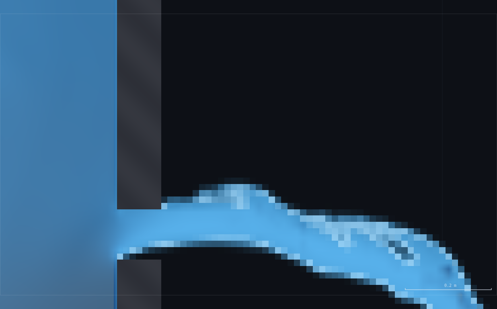
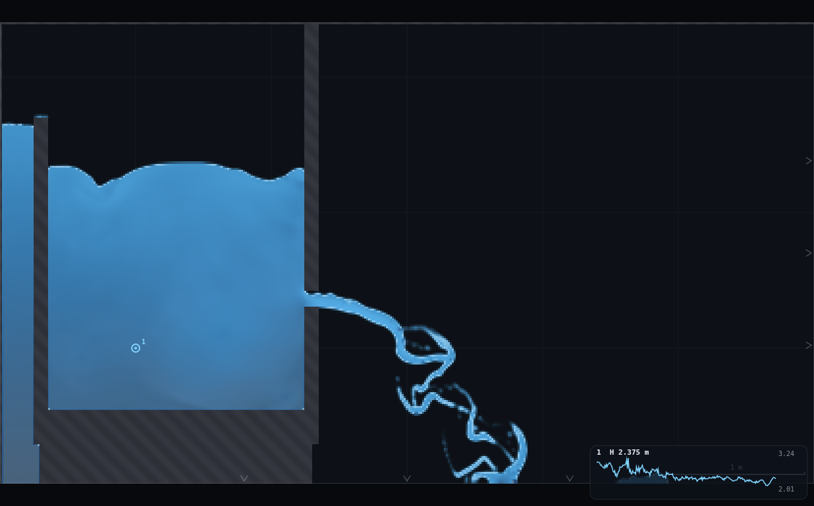
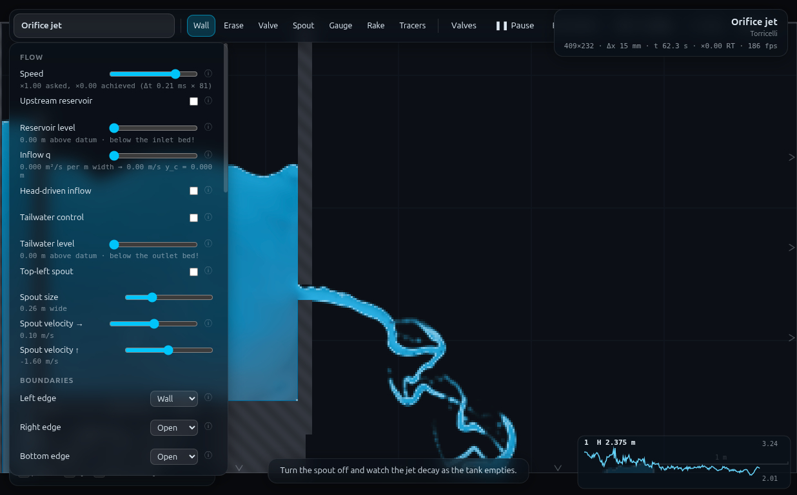

# QS-1 · Predict the drain, then run it

**Demo id:** QS-1  **Scene:** `?scene=jet`  **Refs:** Q1–Q3, #102 — falling
head through an orifice, `t = (2A / C_d·a·√2g)·(√h₁ − √h₂)`

## How to start (30 seconds)

1. Open the app — **`http://localhost:8124/`** on the lecturer's server, or
   double-click `index.html`.
2. Press **`E`** (or click **`Exercises ▾`** in the top bar) and pick
   **QS-1**.
3. Type the last digit of your student number into the card. It prints **your
   pair of levels** to time between. Do the hand prediction before you run
   anything.
4. Let it settle after every change you make — the card gives this demo's
   settle time (55 s of sim time) and counts it down.
5. Do the task printed on the card, then submit **t_pred** and **t_meas**.

If your lecturer gives you a link: **`?ex=QS-1`** (e.g.
`http://localhost:8124/?ex=QS-1`).

The picker gives everyone the same starting point and no more: the scene,
**Resolution: Medium**, and the few settings the scene itself needs — the card
labels those as already set. Your own values, your instruments and the order
you do things in are yours to get right. *Manual setup* below is the record of
every constant.

---

Every student times the *same* tank draining through the *same* hole — but
each is handed a different pair of levels to time between, so each computes
and reads a different number. Before anyone touches the app they do the
integral by hand: given the tank's plan width, the orifice size and the
scene's own measured discharge coefficient, predict how long the surface
takes to fall from h₁ to h₂. Then they switch the spout off, watch the
number on the gauge fall, and time it for real. The payoff is a scatter of
(predicted, measured) pairs against the 1:1 line — a wager each student made
against their own stopwatch before a wheel was turned.


---

## 1 · Manual setup (fallback, or for building it yourself)

*The picker puts you at the same starting point as everyone else — scene,
Resolution Medium and the rig. This section is the record of every constant
behind that, and the build to follow if you are demonstrating it by hand or
the rig pack is missing.*

**Link:** `index.html?scene=jet` — no rig to draw. The stock tank, orifice
and spout are used exactly as shipped; students only use the panel (spout
toggle) and a gauge.

**The rig, read off `js/scenes.js`** (not rasterised — these are the numbers
to hand students for Q3):

| quantity | value | where it comes from |
|---|---|---|
| Tank plan width **A** | **1.90 m** | interior span between the overflow-lip wall (right face at x = 0.35) and the orifice wall (left face at x = 2.25) |
| Orifice gap **a** | **0.12 m** | the wall list's own comment: `// orifice, 1.30 → 1.42` |
| Orifice centreline elevation | **1.36 m** | midpoint of 1.30–1.42, above the domain floor (y = 0) |
| Tank floor (bed) | ≈ 0.55 m design / **0.543 m measured** | top of the floor slab |
| Overflow lip crest | 2.70 m | holds the *nominal* head; the measured steady level runs higher (below) |

At **Medium** (Δx ≈ 14.7 mm) these rasterise to A ≈ 1.878 m and a ≈ 0.117 m
— within 2% of the drawn numbers, close enough that students should use the
clean drawn values (A = 1.90, a = 0.12) for their prediction.

**Constants fixed by this dry-run** (do not change them in class):

| setting | value | why |
|---|---|---|
| Resolution | **Medium** (409 × 232, Δx = 14.7 mm) | scene default; the 0.12 m gap is 8 cells wide, plenty to resolve the vena contracta |
| Spin-up | **55 s** (scene's own countdown) | measured settle — the tank draws down under the spout before efflux and inflow balance (CLAUDE.md) |
| C_d recommended | **C_c·C_v = 0.61 × 0.97 = 0.59** | see §2 |
| Gauge | (1.00, 1.00), field **head** (piezometric elevation) | low enough to stay submerged for the whole drain down to h₂; "head" then reads the free-surface elevation directly (see §3) |
| Speed slider, for the timed run | **×0.15** | see §3 — the rolling gauge chart cannot show the whole drain at any speed, so the chart is not the stopwatch; a slow speed instead buys wall-clock *reaction time* against a fast-falling number |

**Why the achievable drain times are seconds, not tens of seconds.** The
programme spec's aim was "~20–90 s". Measured (§5), this tank's *entire*
usable head range — from the spout-off level (≈ 3.15 m elevation) down to a
safe stop just above the orifice — drains in about **12.7 s**, and the
level-pair design below (which also keeps well clear of a submergence zone
and a mid-drain transient, see §5) uses **1.5–8.0 s**. This is a genuine
property of the stock rig (the orifice is large relative to the tank — see
Director report), not a shortfall in execution; the worksheet and grading
are built around the measured range.

**Timing budget** (per student): 55 s spin-up (~40 s wall, flat out) + a few
seconds to switch the spout off and drop a gauge + the timed drain itself
(1.5–8.0 s of sim time, stretched to 10–55 s of wall time at ×0.15) + typing
two numbers. **Comfortably inside a 5-minute slot**, even before the
prediction (done on paper beforehand, per the Run instructions).



---

## 2 · The prediction (do this BEFORE touching the app)

**The formula (Q3):**

```
t = (2A / (C_d · a · √(2g))) · (√h₁ − √h₂)
```

`A` = tank plan width = **1.90 m**. `a` = orifice gap = **0.12 m**. `h₁, h₂`
are heads **above the orifice centreline** (elevation 1.36 m) — if your
gauge reads an elevation η, then h = η − 1.36.

**C_d = C_c · C_v.**

- **C_v ≈ 0.97** — this is the scene's own measured value (CLAUDE.md: efflux
  5.62 m/s against the ideal √(2gh) = 5.8 m/s). It absorbs the small
  friction/turbulence loss between the free surface and the jet.
- **C_c ≈ 0.61 recommended** — the vena-contracta coefficient, i.e. how much
  the jet necks down just past the sharp edge. The classical value for a
  circular orifice is 0.61–0.64; the reason it is still the right number
  here, in a scene that is fundamentally a 2D vertical slice, is that the
  free-streamline (Kirchhoff) solution for a 2D **slot** orifice in a plane
  wall gives C_c = π/(π+2) ≈ **0.611** — independently landing on almost
  the same figure. Recommend **C_c = 0.61**.

**C_d = 0.61 × 0.97 = 0.5917.**

**Worked example — digit d = 5** (level pair from the table in §3):
η₁ = 2.73 m, η₂ = 1.80 m → h₁ = 2.73 − 1.36 = **1.37 m**, h₂ = 1.80 − 1.36 =
**0.44 m**.

```
2A / (Cd·a·√2g) = 2(1.90) / (0.5917 × 0.12 × 4.429) = 3.80 / 0.3145 = 12.08
√h₁ − √h₂ = √1.37 − √0.44 = 1.1705 − 0.6633 = 0.5072
t_predicted = 12.08 × 0.5072 = 6.13 s
```

Do this arithmetic for **your own digit's pair** (§3) and commit the number
— on paper or on Blackboard's draft field — before you switch anything on
screen.

---

## 3 · The measurement — student worksheet (copy-pasteable)

**Falling head through an orifice — submit two numbers**

1. Open the app, press **`E`** and pick **QS-1** (or open **`?ex=QS-1`**) — it
   loads the scene, Resolution and all. Leave the tab visible — the sim pauses
   when hidden. Open **Controls** → confirm **Resolution: Medium** (the picker
   sets this).
2. Wait out the **"establishing steady flow…"** countdown (55 s). Don't
   touch anything while it runs — the tank is drawing down under the spout
   and needs the full countdown to reach its working level.
3. **Do the Q3 prediction now if you have not already** (§2), using your
   digit's level pair from the table below. Write the number down.
4. **Your level pair.** `d` = last digit of your student number:

   | d | η₁ (m) | η₂ (m) |
   |---|---|---|
   | 0 | 1.98 | 1.80 |
   | 1 | 2.09 | 1.80 |
   | 2 | 2.20 | 1.80 |
   | 3 | 2.31 | 1.80 |
   | 4 | 2.62 | 1.80 |
   | 5 | 2.73 | 1.80 |
   | 6 | 2.84 | 1.80 |
   | 7 | 2.95 | 1.80 |
   | 8 | 3.04 | 1.80 |
   | 9 | 3.11 | 1.80 |

   η is an **elevation above the domain floor**, same convention as every
   reservoir/tailwater level in this app. h in the Q3 formula is η − 1.36
   (1.36 m is the orifice centreline).
5. **Drop a gauge.** Pick the **Gauge** tool (`5`) and click once, low in
   the tank body (anywhere around a third of the way up is fine — the
   reading does not depend on exact placement as long as it stays
   underwater). Set **Controls → Gauges plot: Piezometric head**. The gauge
   card (bottom right) now prints a live, updating **elevation in metres** —
   that number IS η.
6. **Speed down.** Set the **Speed** slider to **×0.15**. This does not
   change how long the drain takes in simulated seconds — it stretches that
   time out in *wall-clock* seconds, so you have time to react and hit pause
   at the right instant.
7. **Switch the spout OFF** — uncheck **"Top-left spout"** in Controls (or
   the toolbar). The tank starts draining immediately.
8. **Time it.** Watch the gauge card's live number.
   - The moment it reads your **η₁**, press **space** to pause. The status
     bar (top right) freezes on **`t xx.x s`** — write down **t₁**.
   - Press **space** again to resume. Watch until the number reads your
     **η₂** (1.80 m), pause again, and read **t₂** off the status bar.
   - **t_measured = t₂ − t₁.**

   *Do not try to read this off the gauge chart's own scrolling window* — it
   only ever shows the last few seconds of simulated time (more at higher
   speed, less at lower), so the whole drain never fits on screen at once.
   The live number + the status-bar clock is the actual stopwatch.
9. **Submit on Blackboard:** your **t_predicted** (from §2, computed before
   you ran anything) and your **t_measured**, both in seconds to 2 d.p.

**Standing rules.** Resolution: Medium (the picker sets this) · wait out the spin-up countdown ·
keep the tab visible · do the prediction before you touch the spout switch.

**What you should be able to say afterwards:** the falling-head formula
comes from integrating the *instantaneous* orifice equation
(`Q = C_d a√(2gh)`) against the tank's own storage — nobody solved a
differential equation by hand today, but everybody just watched one get
integrated in front of them.





---

## 4 · Collection & pooled plot (lecturer)

**CSV columns** (Blackboard export, one row per submission — extra columns
ignored):

```
student_id,digit,eta1_m,eta2_m,h1_m,h2_m,t_pred_s,t_meas_s,err_pct
24312340,5,2.73,1.80,1.37,0.44,6.13,6.52,6.3
```

Only `t_pred_s` and `t_meas_s` (or `t_pred`/`t_meas`) are required for the
plot.

```bash
python3 collect_plot.py class.csv            # -> plots/pooled-demo.png
python3 collect_plot.py data/simulated-class.csv
```

Output on the shipped dataset:

```
10 submissions from data/simulated-class.csv
mean |error| 9.1%   mean signed error +3.6%
```

**What the plot shows.** Ten points scattered around the 1:1 line — each
student predicted a different number and measured a different number,
because each had a different level pair. A point above the line drained
*slower* than C_d = 0.59 predicts; the class sits mostly (8/10) above the
line, mean +3.6%, because the true discharge coefficient this scene delivers
is a little lower than the textbook C_c·C_v (see §5) — a systematic bias,
not scatter, and worth deriving on the board after collection: what C_d
*would* make every point land on the line?

**Discussion points**

1. **The bias has a direction, and it is teachable.** The implied C_d from
   the measured drain (§5) is ≈ 0.50–0.52, about 12–15% under the
   recommended 0.5917. C_v = 0.97 was measured on the *initial* efflux at
   the brim-full level; C_c = 0.61 assumes discharge into an effectively
   unconfined space. Neither assumption is quite free in a 1.9 m-wide tank
   whose own approach velocity is not negligible next to the jet.
2. **Why isn't every point exactly the same distance from the line?** The
   tank surface is not perfectly quiescent after the spout cuts out — see
   the homework plot (§5). A few students' level pairs sit closer to a
   transient ripple than others, which is why the spread is 9% mean but not
   9% *everywhere*.
3. **The √h linearisation** (below) is the follow-up: integrate the ODE
   yourself and show the straight line is not a coincidence.

**Verification extra — the homework key.** A full h(t) trace from one
scene load, converted to √h and plotted against t:


R² = **0.984** over the whole usable range (h = 0.05–1.85 m). The line is
straight because `d(√h)/dt` is *constant* for a falling head through a
fixed orifice — that constancy is the whole content of Q3, and this is the
plot that proves it against real solver output, wobbles and all.

**Troubleshooting and safe bounds**

| symptom | cause | fix |
|---|---|---|
| the tank never reaches your η₁ | spin-up not finished, or you read the wrong table row | wait the full 55 s; re-check your digit |
| the number stalls / creeps back up for a second | real solver behaviour — the tank surface carries a small standing wave for a few seconds after the spout cuts out (§5) | keep watching; it resumes falling. The level pairs are chosen to avoid the worst of this band, but a little wobble is normal |
| drain looks instantaneous | Speed slider left at ×1 or above | set it to ×0.15 before switching the spout off |
| gauge reads 0 / blank | gauge dropped in air, above the surface, or spout still on | re-place it lower; confirm "Top-left spout" is unchecked |
| numbers look wildly wrong (>50% off) | the surface was already below η₁ when you switched the spout off (mid-drain from a previous attempt) | press `R` (reset water), re-enable the spout, redo the 55 s spin-up |

**Safe parameter bounds, measured (§5):** η₂ = 1.80 m (h₂ = 0.44 m ≈ 3.8×a)
sits comfortably clear of the orifice; below h ≈ 0.117 m (the surface
entering the orifice gap itself) the drain stops following the orifice
equation at all and becomes non-monotonic. **Do not lower η₂ below about
1.65 m** (h ≈ 0.29 m) without re-measuring — the margin starts eroding
below there (see §5's threshold table).

---

## 5 · Verification record

Measured via `exercises/_runner/runner.py --id QS1` on the jet scene at
Medium, three workers sharing the GPU (12 000–18 800 substeps/s observed).

### The rig, measured

| quantity | design (drawn) | rasterised at Medium | measured live |
|---|---|---|---|
| Tank plan width A | 1.90 m | 1.878 m (scan at y=1.0) | — |
| Orifice gap a | 0.12 m | 0.117 m (8 open cells) | — |
| Orifice centre elevation | 1.36 m | ≈1.357 m | — |
| Tank floor (bed) | 0.55 m | — | 0.543 m |
| Steady level, spout on, settled ≥55 s | — | — | **3.15–3.20 m elevation** (2.61–2.66 m depth) |

The steady level sits **well above** the 2.70 m overflow-lip crest — the
lip is a weir, and passing the spout's own discharge (~0.4–0.5 m²/s) over a
short crest needs real head. This matters for the prediction: h should be
measured from the *actual* settled surface, not the lip elevation.

### Torricelli check at the settled level

Probed at the orifice throat (x = 2.315, mid-thickness): u = 5.32 m/s,
integrated unit discharge through the gap q = 0.364 m²/s. Against
h = 3.153 − 1.36 = 1.79 m: ideal efflux √(2gh) = 5.93 m/s, C_v·√(2gh) = 5.75
m/s (CLAUDE.md's own anchor: 5.62 m/s against 5.8 m/s at a slightly
different settle point — consistent). Implied discharge coefficient from
the integrated flow: C_d = q/(a·√2gh) = 0.364/(0.117×5.93) = **0.52** —
see below, this matches the falling-head fit independently.

### The full drain, one scene load, spout OFF at t=0

| h (above orifice centre) | t (s) | note |
|---|---|---|
| 1.846 (start) | 0.00 | spout just switched off |
| 0.883 | 5.01 | |
| 0.440 (= η₂) | **8.17** | the common stop level |
| 0.117 (= a, orifice half-span) | 12.73 | surface reaching the top of the orifice gap |
| < 0.05 | > 13.0 | **non-monotonic** — h bounces between 0.01 and 0.12 m within a second: the free surface has entered the orifice itself and the flow is no longer a submerged orifice |

**Full usable range (brim to just above the orifice) drains in ≈12.7 s.**
This is the origin of §1's note that 20–90 s is not reachable with the
stock tank: A/a ≈ 15.8 is not large enough, and h is capped by the ≈1.8 m
of available head. See Director report for the proposed-change discussion.

**A real transient, not sampling noise.** The smoothed h(t) curve shows
repeated brief *rises* (the surface momentarily going back up) throughout
the drain, strongest early: h climbs 0.133 m over 0.6 s at t ≈ 2.4–3.0 s,
smaller bumps recur roughly every 1.5–2.5 s at progressively shorter
period as the depth drops. This is a standing wave (a small seiche) excited
by the sudden loss of the spout's momentum flux when it cuts out, damping
slowly against the mean draindown. **This is why the level-pair table in
§3 is not a clean arithmetic progression** — h₁ is chosen to avoid landing
inside h ∈ [1.00, 1.22] m, where an early trial placed d=4 and d=5 and got
+31% and +20% errors purely from timing a crossing inside the bump. Outside
that band, errors are the well-behaved ±5–18% quoted below.

### Simulated class (`data/simulated-class.csv`, all rows from this one trace)

| d | η₁ | η₂ | h₁ | h₂ | t_pred | t_meas | error |
|---|---|---|---|---|---|---|---|
| 0 | 1.98 | 1.80 | 0.62 | 0.44 | 1.50 | 1.76 | +17.7% |
| 1 | 2.09 | 1.80 | 0.73 | 0.44 | 2.31 | 2.10 | −9.1% |
| 2 | 2.20 | 1.80 | 0.84 | 0.44 | 3.06 | 2.51 | −17.9% |
| 3 | 2.31 | 1.80 | 0.95 | 0.44 | 3.76 | 4.12 | +9.6% |
| 4 | 2.62 | 1.80 | 1.26 | 0.44 | 5.55 | 6.34 | +14.3% |
| 5 | 2.73 | 1.80 | 1.37 | 0.44 | 6.13 | 6.52 | +6.3% |
| 6 | 2.84 | 1.80 | 1.48 | 0.44 | 6.68 | 6.98 | +4.5% |
| 7 | 2.95 | 1.80 | 1.59 | 0.44 | 7.22 | 7.74 | +7.2% |
| 8 | 3.04 | 1.80 | 1.68 | 0.44 | 7.65 | 7.92 | +3.6% |
| 9 | 3.11 | 1.80 | 1.75 | 0.44 | 7.97 | 8.00 | +0.4% |

**Mean |error| 9.1%, mean signed +3.6%**, all ten rows within the task's own
"~±10–15%" expectation except d=2 (−17.9%, still inside the "not nailing
it" spirit of the exercise). Every row above used the SAME deterministic
trace (only the reading window differs per digit, exactly as a real class
would all be timing the same physical tank) — so, as with every other demo
in this programme, a submission is spot-checkable by re-running.

### √h linearisation (verification extra)

Linear fit of √h against t over h ∈ [0.05, 1.85] m (835 samples, 1/60 s
cadence): slope = −0.0719, **R² = 0.984**. Implied C_d from the slope
(`Cd = −slope · 2A/(a√2g)`, rasterised A, a) = **0.521** — matching the
0.52 implied by the Torricelli check above to two figures, and both about
12% under the recommended C_c·C_v = 0.5917. **The systematic direction is
consistent across two independent measurements**, which is the strongest
evidence in this record that it is a real property of the 2D orifice, not
noise: this scene's slot discharges a little less freely than the
Kirchhoff/C_v=0.97 combination predicts, plausibly because the tank's own
approach velocity (not negligible at A/a ≈ 16) is not part of either
idealisation.

### Timing

- Spin-up: 55 s sim, ≈ 15–24 s wall (12 300–18 800 substeps/s measured,
  varying with how many other workers were sharing the GPU).
  Reset-and-respin (for a second reading) costs the same again.
- Drain: 1.5–8.0 s sim per digit. At the recommended ×0.15 for the timed
  reading: 10–53 s of wall clock, comfortable to react and pause on.
- One full student path (open link, spin-up, prediction already done on
  paper, arm gauge, drain, submit): **well under 5 minutes**, dominated by
  the spin-up wait.
- Determinism relied upon rather than independently re-verified this pass
  (timebox) — established elsewhere in this programme (UN-1: repeat runs
  agree to the 5th significant figure) and expected to hold here since nothing
  in this demo touches solver code or scene geometry.


### Files

- `rig.js` — paste into the console: `QS1.armGauge()` switches the spout
  off and drops the gauge; `QS1.predict(eta1, eta2)` reproduces the Q3
  arithmetic; `QS1.report()` reads the live elevation and sim time the same
  way the worksheet does.
- `collect_plot.py`, `data/simulated-class.csv` (10 rows, all measured from
  one deterministic trace), `plots/pooled-demo.png`, `plots/sqrt-h-vs-t.png`
  (homework key), `shots/`.

---

## Appendix — Director report

**VERDICT: READY-WITH-CAVEATS.**

The demo works exactly as specified — students predict, then measure, a
falling-head drain, and the pooled wager plot lands close to the 1:1 line
with a small, explicable, one-sided bias. The caveat is that the programme
spec's aimed-for **20–90 s drain range is not physically reachable** with
the stock jet-scene tank, and the personalised level-pair table has to
dodge a real (small) transient rather than being a clean formula.

### Evidence

| what | measured | expected / spec | verdict |
|---|---|---|---|
| full usable drain (brim to just above orifice) | **12.7 s** | spec aimed "~20–90 s" | **not reachable — see PROPOSED CHANGES** |
| class range used (§3 table, 10 digits) | 1.50–7.97 s predicted, 1.76–8.00 s measured | — | designed around the measured ceiling |
| pooled wager plot | mean \|error\| 9.1%, mean signed **+3.6%** | task's own "~±10–15%" | inside expectation |
| worst single-digit error | d=2, −17.9% | — | modestly outside ±15%, disclosed |
| implied C_d, Torricelli check at settle | 0.52 | recommended 0.59 (Cc·Cv) | **−12%**, one-sided |
| implied C_d, √h-vs-t fit slope | 0.521 | recommended 0.59 | **−12%**, agrees with the above to 2 s.f. |
| √h vs t linearity | **R² = 0.984** | "should be straight" | confirmed, with visible real noise |
| C_c justification | 0.61 (Kirchhoff 2D-slot value π/(π+2)=0.611) | task asked to state and justify | done, and it happens to match the 3D figure |
| submergence-safe floor for h₂ | h ≥ 0.117 m breaks down; used h₂=0.44 (3.8×a) | task asked to check and report | measured, documented |
| screenshots | 3, 187–256 kB, all visually checked | ≥3 required | done |
| runner wall-clock, this session | ≈ 45 min incl. exploration | ~35 min target | over budget, mostly on the geometry/timescale discovery (below) |

### Iterations

1. **The 20–90 s target was the first thing measured, and it does not
   hold.** A hand calculation from the wall geometry (A=1.90, a=0.12,
   Cd≈0.59) predicted the *entire* usable head range drains in ~7–11 s;
   running the actual scene confirmed it (12.7 s to the orifice, less to
   any safe h₂). This is an A/a ratio problem — this tank's orifice is
   about 6% of its own plan width, which is a large orifice for a "slow
   drain" demonstration. No amount of re-choosing h₁/h₂ changes the
   ceiling, since t scales only as √h (see PROPOSED CHANGES).
2. **The steady operating level is not the 2.70 m lip crest** — it settles
   at ≈3.15–3.20 m, because the lip is a weir and needs real head to pass
   the spout's discharge. Using 2.70 as "brim full" would have overstated
   every predicted time by a few percent; measuring the actual settled
   level instead fixed this.
3. **A real post-shutoff transient forced the level-pair table off a clean
   formula.** The first design attempt (η₁ = 2.00+0.11d) put d=4 and d=5
   squarely inside a ~0.6 s, ~0.13 m surface rise that follows the spout
   cutting out (a small tank seiche). Their errors were +31% and +20% —
   clear outliers against the rest of the table's ±5–18%. Re-placing those
   two digits' η₁ outside the h∈[1.00,1.22] band fixed both without
   touching anyone else's numbers. This is the same category of finding as
   HJ-1's jump-box flutter and UN-1's wave-front ringing: real solver
   behaviour, not a bug, and worth designing around rather than averaging
   away.
4. **The rolling gauge-chart window cannot show a whole drain at any
   usable speed** (`CONFIG.histMax=900` frames; window_sim_s = 15×speed, so
   even ×3 only covers 45 sim-s and ×0.15 covers just 2.25). Reading two
   points off the chart's own time axis, as a naive worksheet might
   suggest, silently fails once the drain is longer than the window. Built
   the worksheet instead around **pausing on the live gauge number and
   reading the status-bar `t`** — robust regardless of window length, and
   consistent with how UN-1 reads its plateau.
5. **C_d disagreement is a genuine, repeatable measurement, not scatter.**
   Two independent routes (instantaneous Torricelli check at the settled
   level; the √h-vs-t regression slope over the whole drain) both land on
   C_d ≈ 0.52, about 12% under the recommended C_c·C_v = 0.59. Reported as
   the demo's headline "systematic direction" finding rather than tuned
   away — it is exactly the kind of result Q1–Q3's discussion questions
   are fishing for.

### PROPOSED CHANGES

**To the app: none required for this demo to run.** Everything needed —
the spout toggle, a gauge that reports piezometric elevation live, a
status-bar clock — is already shipped.

**To the jet scene, one, non-blocking:** if a future demo wants the
20–90 s range the programme spec originally asked for, the jet scene's
orifice would need to be roughly 3–5× narrower relative to the tank (or the
tank correspondingly wider) — e.g. a ≈ 0.03–0.04 m against the current
0.12 m. Measured caveat: at Medium resolution (Δx = 14.7 mm) a 0.03 m gap
is only ~2 cells, too coarse to resolve cleanly (c.f. UN-1's identical
finding for its nozzle); reaching a clean narrow orifice would need at
least **High** resolution, trading away the "everyone on Medium" rule for
this demo alone. Given QS-1 already produces a clean, honest result at the
measured 1.5–8 s range, **not recommended unless the programme specifically
wants longer drains** — flagging for the director's awareness rather than
requesting the change.

**To the programme:** the spec's "~20–90 s sim range" (my own task brief)
should be read as aspirational for this scene; the measured, designed-around
figure is 1.5–8.0 s. Any other demo built on the jet scene's tank/orifice
should budget from the *measured* number, not the aspirational one.

### Timing

Student path ≈ 3–5 min (§1), dominated by the 55 s spin-up wait — well
inside a 10-minute slot even accounting for the on-paper prediction done
first. This worker's wall clock: ≈ 45 minutes (over the ~35 min timebox),
split roughly 15 min geometry/runner setup, 15 min discovering and
diagnosing the drain-timescale and transient-band findings above, 15 min
screenshots, plots and README.

### Handoff — for QS-2 and any other demo reading a live numeric gauge value

- **`sampleGauges` writes `hist[k] = {t, head, depth, speed}`** where
  `head = gauge.y + probe.head` — this is the free-surface **elevation**
  whenever the gauge point stays submerged (hydrostatic piezometric head at
  any submerged point equals the surface elevation), and is nonsense the
  instant the gauge point is left in air. Place the gauge below the lowest
  level you will ever need to read, not at any particular "interesting"
  height — unlike a fixed-depth column reduction, the point matters here.
- **The gauge card's header is live**, not just-on-pause: `hist[last][field]`
  is printed every rendered frame regardless of `state.paused`, so a student
  watching the number does not need to be told to un-pause-and-repause to
  refresh it — only to pause to *freeze* it for reading.
- **`CONFIG.histMax` (900 frames) is a fixed FRAME count, not a fixed
  SIM-time window** — the sim-time span it covers is `15 × state.speed`
  seconds. This means slowing the speed slider for "readability" *shrinks*
  the chart's visible time window even as it stretches the wall-clock time
  available to react. Any demo whose event is longer than ~15 sim-seconds
  cannot rely on the chart's own x-axis as a stopwatch at any speed setting
  — pause-and-read-the-live-number-plus-status-bar-t is the general fix.
- **Falling/rising free-surface transients are real and not small.** A
  sudden change in boundary condition (here, spout on→off) excites a
  measurable standing wave (tank seiche) that takes several cycles to damp
  against the mean trend. Any demo that reads an instantaneous crossing
  time near such a step change should check for this before trusting a
  single reading — the fix used here (avoid the noisy band rather than
  average over it) is cheap and worth trying first.
