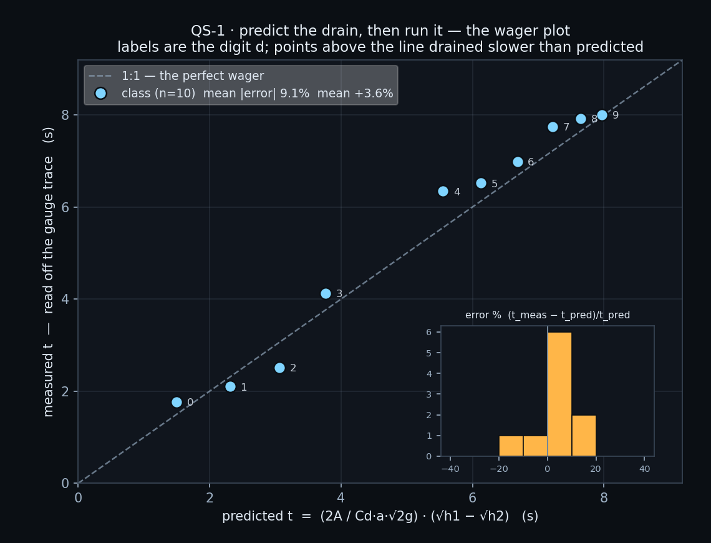
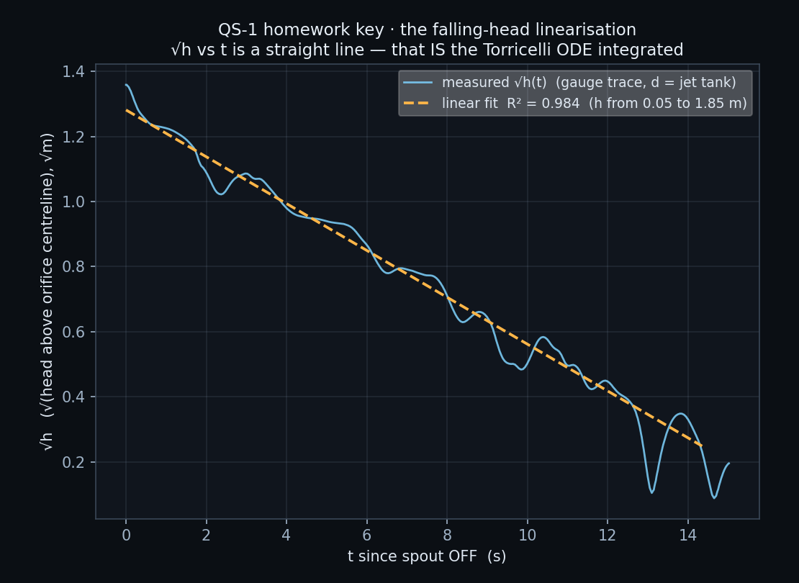

# QS-1 · Predict the drain, then run it

Every student times the *same* tank draining through the *same* hole — but
each is handed a different level to start from, so each computes and reads a
different number. Before anyone touches the app they do the integral by hand:
given the tank's plan width, the orifice size and the scene's own measured
discharge coefficient, predict how long the surface takes to fall from h₁ to
h₂. Then they switch the spout off, watch the number on the gauge fall, and
time it for real. The result is a scatter of (predicted, measured) pairs
against the 1:1 line.

**Open it:** press **E** in the [app](https://barneydobson.github.io/hydraulician/)
and pick **QS-1**, or use the direct link
[`?ex=QS-1`](https://barneydobson.github.io/hydraulician/?ex=QS-1).
How to run any exercise: see the [teaching pack index](../INDEX.md#running-an-exercise).

## Theory

Integrate the instantaneous orifice equation Q = C_d·a·√(2gh) against the
tank's own storage and the drain time falls out:

    t = (2A / (C_d·a·√2g)) · (√h₁ − √h₂)

For this tank, measured off the scene: plan width **A = 1.90 m**, orifice gap
**a = 0.12 m**, orifice centreline at elevation **1.36 m**. Heads are measured
above that centreline, so a gauge elevation η gives **h = η − 1.36**.

**C_d = C_c·C_v = 0.61 × 0.97 = 0.59.** C_v = 0.97 is this scene's own
measured efflux coefficient; C_c = 0.61 is the free-streamline value for a 2D
slot in a plane wall, π/(π+2) = 0.611, which happens to land on the classical
figure too.

Worked example for d = 5 (η₁ = 2.73 m → h₁ = 1.37 m, h₂ = 0.44 m):

    2A / (C_d·a·√2g) = 3.80 / (0.5917 × 0.12 × 4.429) = 12.08
    √h₁ − √h₂        = 1.1705 − 0.6633                = 0.5072
    t                = 12.08 × 0.5072                 = 6.13 s

## Your start level

**d** is the **last digit of your student number** — your lecturer will
explain the assignment in class. Everyone stops at the same **η₂ = 1.80 m**.

| d | 0 | 1 | 2 | 3 | 4 | 5 | 6 | 7 | 8 | 9 |
|---|---|---|---|---|---|---|---|---|---|---|
| **η₁ (m)** | 1.98 | 2.09 | 2.20 | 2.31 | 2.62 | 2.73 | 2.84 | 2.95 | 3.04 | 3.11 |

η is an **elevation above the domain floor**, the same convention as every
reservoir and tailwater level in this app; h in the formula is η − 1.36.

## What to do

1. Do the prediction on paper first, for your own η₁ and the common
   η₂ = 1.80 m. Commit the number before anything moves on screen.
2. Let the tank reach its steady level — about **55 s**; the card counts it
   down.
3. Drop a Gauge (`5`) low in the tank, around x = 1.0 m, y = 1.0 m. The
   Gauges plot arrives on **Piezometric head**, so the card's live **H** is
   the surface elevation — that number is η. The **Speed** slider arrives at
   **×0.15**, which stretches the drain in wall-clock time without changing
   it; leave it there.
4. Uncheck **Top-left spout**. Press **space** to pause the moment H reads
   your **η₁**, read `t` off the status bar, resume, and pause again at
   **1.80 m** for the second reading. Submit **t_pred** and
   **t_meas = t₂ − t₁**. (The gauge chart's own scrolling window is far too
   short to be the stopwatch; the live number plus the status-bar clock is.)

## For the instructor — pooling the class

Collect one row per student
(`student_id,digit,eta1_m,eta2_m,h1_m,h2_m,t_pred_s,t_meas_s,err_pct`),
export the CSV and run:

```bash
python3 collect_plot.py class.csv                # -> plots/pooled-demo.png
python3 collect_plot.py data/simulated-class.csv # the shipped dry-run class
```

Only `t_pred_s` and `t_meas_s` are needed: the script plots every student's
pair against the 1:1 line, labels each point with its digit, and insets a
histogram of the signed error (t_meas − t_pred)/t_pred.



### Discussion points

- **What C_d would put every point on the line?** Switch **Field → Speed**
  and hover the orifice throat at the settled level: the efflux reads
  5.3 m/s where √(2gh) says 5.9. The drain implies C_d ≈ 0.52, about 12%
  under the recommended 0.59 — and the same figure comes back from a second,
  independent route, so it is a property of this 2D slot rather than scatter.
- **The straight line hiding underneath.** √h against t is straight across
  the whole usable range, because d(√h)/dt is constant for a fixed orifice.
  That constancy *is* the formula, and this is the homework key:



The full verification record — the measured settled level, the two
independent C_d routes, the post-shutoff transient the level table is
designed around, safe bounds for η₂ and troubleshooting — is kept locally, out of version control, at `exercises/QS-1-drain-predict/_archive/README-full.md`.
