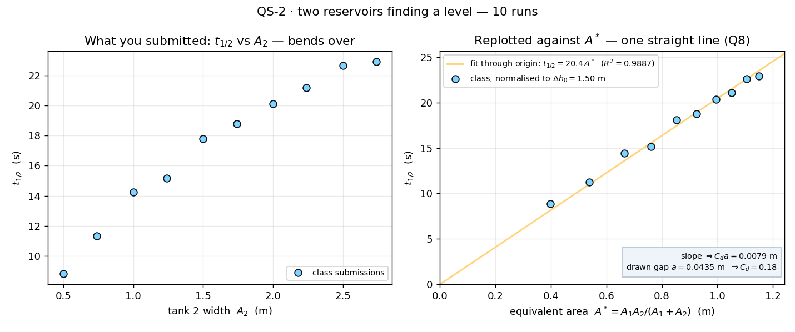

# QS-2 · Two reservoirs finding a level

Two open tanks stand side by side on a solid floor, joined by a pipe at the
base with a valve in it. One tank starts 1.5 m higher than the other. Release
the valve and the levels chase each other to a common level — the tall one
falling, the short one rising, at rates in the inverse ratio of their widths.
Each student runs the rig with **their own** tank-2 width, times how long the
level *difference* takes to halve, and submits
(A₂, t_½). Pooled, t_½ against A₂ is a curve that bends over; against the
equivalent area A* = A₁A₂/(A₁+A₂) it is one straight line through the origin.
The class derives that grouping from its own data before anyone writes the ODE
down.

**Open it:** press **E** in the [app](https://barneydobson.github.io/hydraulician/)
and pick **QS-2**, or use the direct link
[`?ex=QS-2`](https://barneydobson.github.io/hydraulician/?ex=QS-2).
How to run any exercise: see the [teaching pack index](../INDEX.md#running-an-exercise).

## Theory

One tank empties into the other through a single resistance:

    A₁·dh₁/dt = −Q,   A₂·dh₂/dt = +Q,   Q = C_d·a·√(2g·Δh)
    ⇒  d(Δh)/dt = −(C_d·a·√2g / A*)·√Δh,     A* = A₁A₂/(A₁+A₂)
    ⇒  t_½ = [2(1 − 1/√2)·√Δh₀ / (C_d·a·√2g)] · A*

Only the combination **A₁A₂/(A₁+A₂)** ever appears — the two tanks behave as
one tank of that area, and t_½ is proportional to it whatever the resistance
law. As built: tank 1 delivers **A₁ = 1.978 m**, the pipe is 2 cells tall
(**a = 0.0435 m**) and 1.60 m long, and everyone releases from
**Δh₀ = 1.50 m** (2.00 m against 0.50 m).

## Your tank-2 width

**d** is the **last digit of your student number** — your lecturer will
explain the assignment in class. Your width is **A₂ = 0.50 + 0.25·d metres**,
so tank 2's far wall goes at **x = 3.60 + A₂**. Your target level — what tank
1 reads once the difference has halved — is

    h* = (3.96 + 1.25·A₂) / (1.978 + A₂)   metres

| d | 0 | 1 | 2 | 3 | 4 | 5 | 6 | 7 | 8 | 9 |
|---|---|---|---|---|---|---|---|---|---|---|
| **A₂ (m)** | 0.50 | 0.75 | 1.00 | 1.25 | 1.50 | 1.75 | 2.00 | 2.25 | 2.50 | 2.75 |
| **h\* (m)** | 1.849 | 1.794 | 1.748 | 1.710 | 1.677 | 1.648 | 1.623 | 1.601 | 1.581 | 1.564 |

## What to do

The rig arrives drawn with tank 2 at A₂ = 2.00 m, the valve shut and the
upstream reservoir standing by at 2.00 m. This one needs its steps in order.

1. Erase (`2`) tank 2's far wall and redraw it with Wall (`1`) at
   **x = 3.60 + your A₂**, floor to about y = 3.2 — the Ruler (`M`) and
   Measure (`8`) put it on station.
2. Place a Gauge (`5`) low in each tank, around (0.9, 0.30) and (4.6, 0.30):
   card 1 is tank 1, card 2 is tank 2.
3. With the valve **open** (`V` toggles it; the band through the divider is
   green when open), let the **Upstream reservoir** fill tank 1 — and press
   `V` to shut the valve the moment card 2 reads **0.50 m**. Wait for card 1
   to settle at **2.00 m**.
4. Untick **Upstream reservoir** *and* set **Left edge → Wall**, or it leaks
   through the run. Let it stand about **5 s** until both cards are still,
   then read them: that is your Δh₀, and it should be about 1.50 m.
5. Note `t` on the status bar, press `V`, and note `t` again as card 1 falls
   to your **h\***. Submit **A₂** — the width you can measure against the
   metre grid, not the one you aimed for — and **t_½**, the difference between
   the two clock readings.

## For the instructor — pooling the class

Collect one row per student (`student,digit,A2_m,dh0_m,thalf_s`; `dh0_m` is
optional and defaults to 1.50 m), export the CSV and run:

```bash
python3 collect_plot.py class.csv                # -> plots/pooled-demo.png
python3 collect_plot.py data/simulated-class.csv # the shipped dry-run class
```

The script computes A* for every submission, normalises t_½ to a common
Δh₀ = 1.50 m, fits t_½ = slope·A* through the origin and turns the slope back
into the pipe's own C_d·a; the left panel is what the class submitted, the
right panel the same points against A*.



### Discussion points

- **The slope is the pipe, and it is not an orifice.** C_d·a = 0.0079 m
  against a drawn 43 mm gap gives C_d = 0.18 — the lumped resistance of a
  1.6 m duct plus its entry and exit, not a contraction coefficient. Drop
  **Eddy viscosity C_s** back to 0.16 in the panel and run it again: the same
  measurement returns 0.71, which *is* an orifice number.
- **The same rig is a dry dock.** Take the widest tank (d = 9) and read tank 2
  as the sea, tank 1 as the dock. The dry-dock flooding formula contains only
  the dock's own area because A₂ → ∞ sends A* → A₁, and the left-hand panel is
  already flattening towards that asymptote at d = 8–9. Reverse the two levels
  and the identical measurement is the dock emptying on the ebb.

The full verification record — the simulated class, the pipe geometry that
made the timescale both slow enough to read and robust to a hand-drawn stroke,
repeatability, safe bounds and troubleshooting — is kept locally, out of version control, at `exercises/QS-2-twin-tanks/_archive/README-full.md`.
