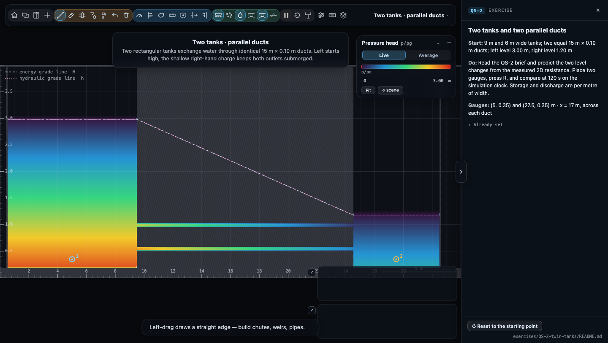

# QS-2 · Two tanks and two parallel ducts

An enlarged, two-dimensional version of the circular-tank question. The
rig spans 30 m between its outer water faces, with straight, equal ducts
and rectangular tanks. All storage and discharge are **per metre out of
the screen**.

Open [QS-2 in the app](../../index.html?ex=QS-2), or press **E** and choose
QS-2. This scene requires a build containing the replacement exercise. The accompanying
[rig JSON](hydraulician-rig-QS-2.json) also loads into that build through
Controls → Rig → Open file. **R** restores the initial water every time.
The exercise and saved rig open with **Pressure head** colouring and
**Grade lines (EGL / HGL)** enabled.

## Revised question

Two rectangular tanks are 9 m and 6 m wide in the vertical section and
have a common floor at z = 0.20 m. Two identical horizontal ducts connect
them in parallel. Each duct is **15 m long and 0.10 m clear height**.
Initially the left water level is **3.00 m** and the right is **1.20 m**.
Both ducts are full. There is no external inflow or outflow.

At the prescribed **Medium resolution**, the effective discharge law of
the pair, calibrated from the early drawdown, is approximately

    q = C√Δη,   C = 0.036 m^(3/2)/s,   Δη = η₁ − η₂

Here q is the **total** discharge per metre width (m²/s). Find the fall in
the left tank and the rise in the right tank after **120 s**. Predict first,
then measure. Treat the flow as quasi-steady and water as incompressible.

Only the left tank starts at the high level. The shallow right-hand charge
covers the outlets; a completely empty right tank would add a free-jet and
filling stage and would need a different question. Initial depth is 2.80 m
on the left and 1.00 m on the right.

## Worked solution

For a one-metre slice the storage areas are A₁ = 9 m² and A₂ = 6 m².
Equivalently use widths B₁ = 9 m and B₂ = 6 m with unit discharge q:

    dη₁/dt = −q/B₁,   dη₂/dt = q/B₂
    −dΔη/dt = C(1/B₁ + 1/B₂)√Δη
    √Δη(t) = √1.8 − [C(1/9 + 1/6)/2] t
            = √1.8 − 0.005t

At 120 s:

    Δη = (√1.8 − 0.600)² = 0.550031 m
    left fall = 6/(9 + 6) × (1.8 − Δη) = 0.499988 m
    right rise = 9/(9 + 6) × (1.8 − Δη) = 0.749981 m
    final levels: η₁ = 2.500012 m, η₂ = 1.949981 m

Each duct sees the full Δη, and q = 2bu for nominal gap b = 0.10 m.
The equivalent combined entrance, exit and duct resistance is
`Δη = K_eff u²/(2g)` with `K_eff ≈ 606`. This is an **effective calibrated
coefficient**, including the numerical representation at Medium, not a
circular-pipe friction factor or an independently specified material property.
The original 0.007 must not be entered as the solver's wall roughness.

## Run and compare

1. Pause while placing Head gauges (`5`) at (5, 0.35) and (27.5, 0.35) m.
2. Keep **Medium**, wall roughness **0.250**, eddy viscosity **0.40**, and
   celerity **35 m/s**. These are the scene defaults. Leave boundary sources off.
3. Press **R**, resume, and use the **simulation clock**, not a stopwatch.
4. Pause at 120 s. Compare the two gauge levels with 2.50 m and 1.95 m.
   A **0.05 m tolerance per level** is appropriate for this coarse teaching rig.
5. Optional: put one Section across each bore at x = 17 m. Their flows should
   be nearly equal and add, whereas their head losses are equal. Use tank
   drawdown for calibration; thin-bore section quadrature is coarse at Medium.

The nominal faces are exact: left tank x = 0.5–9.5 m, ducts x = 9.5–24.5 m,
right tank x = 24.5–30.5 m. Lower bore z = 0.50–0.60 m; upper bore
z = 0.94–1.04 m. The walls are clean rectangular blocks with no common
manifold, bends or unequal branch lengths. The view fits the larger domain.

## Verification and limits

Run `node exercises/QS-2-twin-tanks/verify.mjs` with Node 22+ and a GPU-backed
Chrome. It boots through `file://`, drives the solver, writes
[verification.json](verification.json), and checks the held-out prediction,
branch balance and conservation. No server, dependencies or build step.

The calibration uses only the **10–40 s** gauge observations, fitting the
slope of √Δη, then rounds C to 0.036. The **120 s** point is held out:
the measured levels were **2.524 m and 1.973 m**, against predictions of
2.500 m and 1.950 m. The measured head difference was **0.552 m** against
0.550 m. Branch section flows agreed within 1%; cached column volume varied
by less than 0.2% over 180 s. The solver's compressibility, grid geometry and
free-surface fluctuations explain why this is an approximate comparison.

Medium has Δx ≈ 0.0367 m and represents both nominal 0.10 m bores with the
same two open rows. This is a calibrated classroom experiment, **not a
grid-converged prediction of a physical duct**. Changing resolution, duct
geometry or drag requires recalibrating C. In particular, do not interpret
the agreement as independent validation of a pipe-friction law.

For an extension, derive C from your own 10–40 s observations, predict a
later time, and explain why the larger tank falls more slowly. Keep the
calibration interval separate from the prediction interval.

The original circular-tank calculation and its corrected answer are retained
in [the comparison note](../../docs/qs2-two-tank.md).
