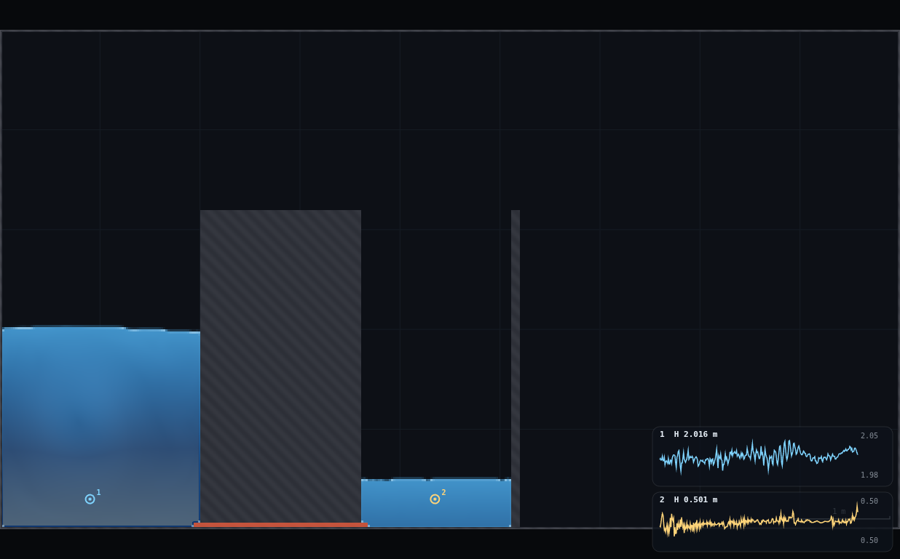
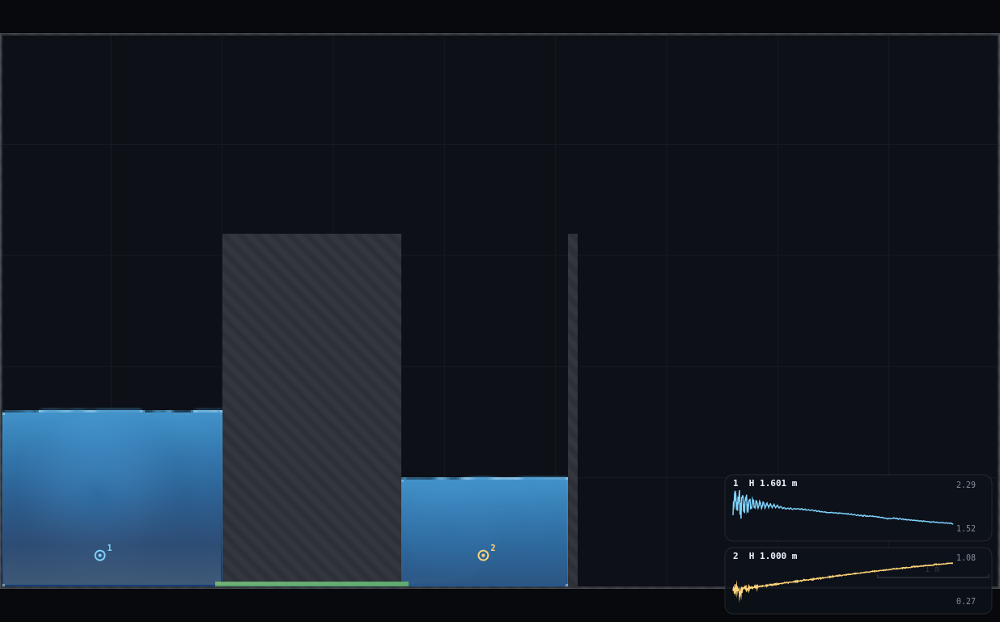
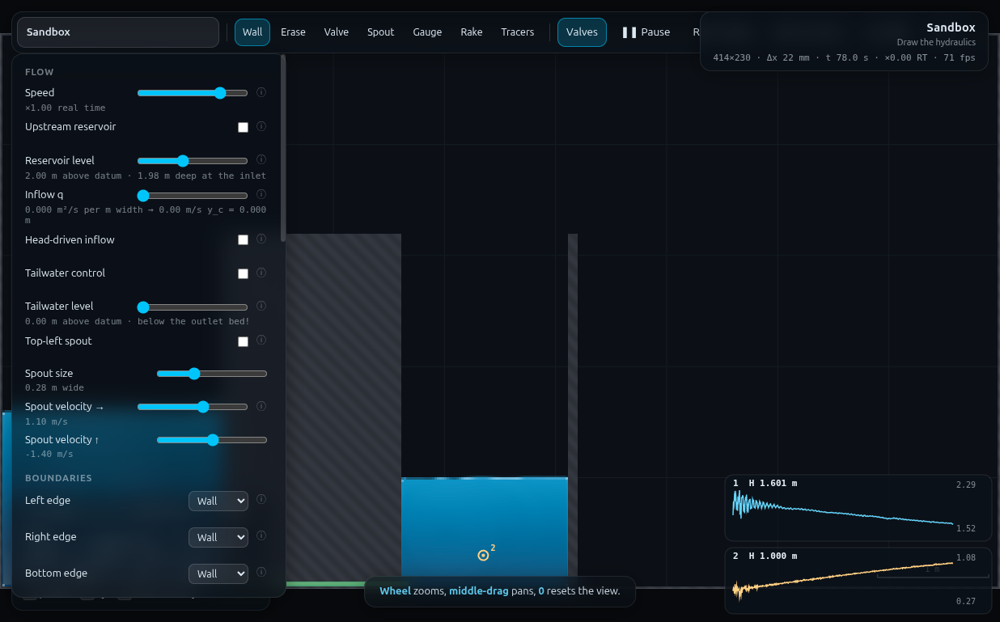

# QS-2 · Two reservoirs finding a level — full record (archived)

*This is the original long-form brief: the dry-run measurements, the
verification record, the director report and every constant behind the rig.
It is kept for maintainers and future reruns — the student- and
instructor-facing document is now [`../README.md`](../README.md).*

**Demo id** QS-2 · **Topic** Quasi-steady flow · **Rig** RIG-C (twin tanks) —
this folder is RIG-C's first build, and `rig.js` is the card DA-2 and B9
inherit.
**Refs** Q6–Q8 (coupled tanks and the `A₁A₂/(A₁+A₂)` grouping); Q13–Q14 (dry
dock) is the same rig narrated differently.

## How to start (30 seconds)

1. Open the app — **`http://localhost:8124/`** on the lecturer's server, or
   double-click `index.html`.
2. Press **`E`** (or click **`Exercises ▾`** in the top bar) and pick
   **QS-2**.
3. Type the last digit of your student number into the card. It prints **your
   tank-2 width** (A₂ = 0.50 + 0.25·d m), which you move the far wall to, and
   your target level h*.
4. Work through the card's **4 numbered steps** in order — this rig needs a
   sequence, and nothing does it for you.
5. Let it settle after every change you make — the card gives this demo's
   settle time (5 s of sim time) and counts it down.
6. Do the task printed on the card, then submit **A₂** and **t_½**.

If your lecturer gives you a link: **`?ex=QS-2`** (e.g.
`http://localhost:8124/?ex=QS-2`).

The picker gives everyone the same starting point and no more: the scene,
**Resolution: Medium**, the rig geometry, and the few settings without which
the rig is not a working rig — the card labels those as already set. Your own
values, your instruments and the order you do things in are yours to get
right. If your build ships without the rig pack the card says so; then draw it
by hand from *Manual setup* below.

---

Two open tanks stand side by side on a solid floor, joined by a pipe at the
base with a valve in it. One tank starts 1.5 m higher than the other. Release
the valve and the levels chase each other to a common level — the tall one
falling, the short one rising, and (this is the point) at rates in the inverse
ratio of their widths. Each student builds the rig with **their own** tank-2
width, times how long the level **difference** takes to halve, and submits
`(A₂, t_½)`. Pooled, `t_½` plotted against `A₂` is a curve that bends over;
plotted against the equivalent area `A* = A₁A₂/(A₁+A₂)` it is one straight line
through the origin. The class derives Q8's grouping from its own data before
anyone writes the ODE down.

---

## 1 · Manual setup (fallback, or for building it yourself)

*The picker puts you at the same starting point as everyone else — scene,
Resolution Medium and the rig. This section is the record of every constant
behind that, and the build to follow if you are demonstrating it by hand or
the rig pack is missing.*

**Scene** `http://localhost:8124/index.html?scene=sandbox` — everything is drawn.

### RIG-C build card (~90 s of drawing)

Cells at **Resolution: Medium** are 414 × 230, **Δx = 21.7 mm**. The domain has
a 1 m grid drawn on it; every coordinate below is on a metre or quarter-metre
mark, so aim at the grid, not at a number.

| # | tool | what | why |
|---|---|---|---|
| 1 | Erase | two strokes along each of the sandbox's own ledges (default brush = 121 mm eraser, the ledges are 80 mm) | the sandbox ships two ledges; `Clear` does **not** remove scene walls |
| 2 | panel | Bottom edge → **Wall** (also Left/Right/Top = Wall), **Top-left spout OFF** | the sandbox floor drains by default — the tanks would empty through it |
| 3 | panel | **C_s = 0.40** (Hydraulics → eddy viscosity) | the pipe's roughness knob. At the stock 0.16 the tanks equalise in 2–6 s |
| 4 | Wall | brush to max (`]` until 0.50 m), four vertical strokes at x ≈ 2.25, 2.70, 3.10, 3.35, from below the floor up to y ≈ 3.2 | the dividing block: outer faces at **x = 2.00 and 3.60**, i.e. tank 1 = 2.00 m wide and the pipe is L = 1.60 m long |
| 5 | Wall | one vertical stroke (brush 0.10) at **x = 3.60 + A₂**, floor to y ≈ 3.2 | tank 2's far wall — this is the personalised dimension |
| 6 | Valve | brush `]` ×3 from the default (0.055 → **0.121 m**), one horizontal stroke **along the very bottom of the domain**, from inside tank 1 (x ≈ 1.9) through the block into tank 2 (x ≈ 3.7) | the pipe. Green when open |
| 7 | Gauge | one click in each tank, low down (y ≈ 0.3) | the two level traces |

**Why step 6 is drawn on the floor.** `rasterise()` stamps the closed outer
ring **last**, so the bottom edge trims the lowest row of the valve band. The
pipe height is then set by the **brush** (0.121 m → 2 cells → **a = 0.0435 m**)
and not by where the stroke was aimed — a stroke anywhere within ±0.5 cell of
the floor, or below it, gives the same pipe. Every other way of making a 2-cell
gap needs the stroke placed to ±5 mm, which is half a pixel at default zoom.

`rig.js` builds exactly this (`QS2.build({A2: 1.5})`) and is the reference if a
student's rig misbehaves.

### Constants fixed by the dry-run

| constant | value | found by |
|---|---|---|
| resolution | Medium (414 × 230, Δx 21.7 mm) | standing rule |
| pipe height `a` | **0.0435 m** = 2 cells (valve brush 0.121 m, floor-trimmed) | 1 cell is fine physically but the failure mode of aiming low is *no pipe at all* |
| pipe length `L` | **1.60 m** | the timescale lever: L 0.40 → 1.60 m stretches `t_½` by 1.7× |
| `C_s` | **0.40** | the other timescale lever: 0.16 → 0.40 stretches `t_½` by 2.4× (FR-1's finding that C_s, not C_f, is a pipe's roughness knob) |
| tank 1 | 2.00 m drawn → **1.978 m** delivered (the left edge column is wall) | measured from the mask |
| start levels | tank 1 **2.00 m**, tank 2 **0.50 m** above the datum → Δh₀ = 1.50 m | spec |
| edges | all four **Wall**; reservoir used only during the fill | — |
| `t_½` delivered | **8.8 – 22.9 s** across the digit range | see §5 — the programme's "15–60 s" is not reachable, see the Appendix |

**Timing budget.** Fill 30–56 sim-s, settle 5 s, release 10–30 s → ~1.5 min of
simulation per run at ×1 real time, ~2 min of drawing, so **≈ 6 min** end to end.

---

## 2 · Student worksheet (copy-paste to Blackboard)

**Your tank-2 width.** Take `d` = the last digit of your student number:

> **A₂ = 0.50 + 0.25 d  metres**   (d = 0 → 0.50 m, d = 9 → 2.75 m)

**Your target level** (you will need it in step 8) — the level tank 1 shows when
the difference has halved:

> **h\* = (3.96 + 1.25 A₂) / (1.978 + A₂)  metres**

| d | 0 | 1 | 2 | 3 | 4 | 5 | 6 | 7 | 8 | 9 |
|---|---|---|---|---|---|---|---|---|---|---|
| A₂ (m) | 0.50 | 0.75 | 1.00 | 1.25 | 1.50 | 1.75 | 2.00 | 2.25 | 2.50 | 2.75 |
| h\* (m) | 1.849 | 1.794 | 1.748 | 1.710 | 1.677 | 1.648 | 1.623 | 1.601 | 1.581 | 1.564 |

1. Open the app, press **`E`** and pick **QS-2** (or open **`?ex=QS-2`**) — it
   loads the scene at **Resolution: Medium** and draws the rig, so the build
   steps below are only for building it by hand.
2. **Erase** the two grey ledges the sandbox starts with (Erase tool, two
   strokes each). Nothing should be left hanging in the box.
3. In **Controls**: **Top-left spout OFF**; **Left / Right / Bottom / Top edge
   → Wall**; **C_s → 0.40**.
4. **Draw the divider.** Wall tool, press `]` until the brush is 0.50 m, then
   four vertical strokes side by side so the block runs from **x = 2.00 to
   x = 3.60**, from the floor up past y = 3. Hold **shift** to keep them
   vertical. It must be solid — no gaps you can see.
5. **Draw tank 2's far wall.** Press `[` back to a thin brush, one vertical
   stroke at **x = 3.60 + A₂** (your width), floor to y ≈ 3.
6. **Cut the pipe.** Valve tool, press `]` **three times** from the default,
   then one horizontal stroke **right along the bottom of the box**, starting
   inside tank 1 and finishing inside tank 2. A green line appears through the
   base of the divider: that is the pipe, and it is open.
7. **Gauges.** Gauge tool, one click near the bottom of each tank. Two cards
   appear bottom-right; card 1 is tank 1, card 2 is tank 2.
8. **Fill.** In Controls: **Upstream reservoir ON**, **Inflow q = 0**,
   **Reservoir level = 2.00**. Tank 1 fills from the left wall and tank 2 fills
   through the pipe.
   - The moment **card 2 reads 0.50 m**, press **`V`** — the valve shuts and
     tank 2 stops there.
   - Wait for **card 1 to settle at 2.00 m** (10–40 s).
   - **Reservoir OFF**, and set **Left edge → Wall**. Wait ~5 s for the water to
     go still — the big tank keeps a ±0.02 m wobble, which is fine. You should
     read about **2.00 and 0.50**: a 1.50 m difference. Write both numbers
     down, they are your Δh₀.
9. **Release and time.** Note the clock in the status bar (`t 56.0 s`), press
   **`V`**, and watch card 1 fall. When card 1 reaches **h\*** from your table,
   read the clock again.
   **t_½ = (second reading) − (first reading)**, in seconds.
   *(If card 1 settled a little off 2.00 before release — say 2.02 — shift h\*
   by 0.8 × the excess, i.e. +16 mm.)*
10. Submit on Blackboard: **A₂** (the width you can measure against the 1 m
    grid, not the one you aimed for) and **t_½** in seconds.

*Standing rules: Resolution **Medium** (the picker sets this); keep the tab visible (the sim pauses
when it is hidden); time with the status-bar clock `t`, never a wristwatch —
your laptop may not run at ×1 real time and the sim clock is the physics.*

**Two things to notice while you wait** (they come up in the discussion):
the two levels do **not** move by the same amount — with d = 0 tank 1 falls
0.30 m while tank 2 rises 1.20 m, in the ratio A₂ : A₁ — and the difference
does not decay by a fixed percentage per second: it slows down as it goes,
because the discharge follows √Δh.

---

## 3 · Collection & pooled plot (lecturer)

CSV out of Blackboard, header row required; extra columns are ignored:

```
student,digit,A2_m,dh0_m,thalf_s
12345678,4,1.50,1.50,17.98
```

`dh0_m` is optional (defaults to 1.50 m); include it if you want the script to
normalise a student who released from 1.4 or 1.6 m — `t_½ ∝ √Δh₀`.

```bash
python3 collect_plot.py class.csv -o plots/pooled-demo.png
```


**Left panel** — what the class submitted, `t_½` against `A₂`: a curve that
bends over. **Right panel** — the same points against
`A* = A₁A₂/(A₁+A₂)`: a straight line through the origin. On the simulated
class of 10: **t_½ = 20.44 A\*, R² = 0.9887** (through the origin), or
**19.16 A\* + 1.12 s, R² = 0.9963** free.

**Discussion points**

1. *Where the grouping comes from.* `A₁ dh₁/dt = −Q` and `A₂ dh₂/dt = +Q` give
   `d(Δh)/dt = −Q (A₁+A₂)/(A₁A₂)`. Only the combination `A₁A₂/(A₁+A₂)` ever
   appears — the two tanks behave as one tank of that area. The class has just
   measured it.
2. *The slope is the pipe.* With `Q = C_d a √(2gΔh)`,
   `t_½ = [2(1−1/√2)√Δh₀ / (C_d a √(2g))] · A*`, so the fitted slope hands back
   `C_d a = 0.0079 m` against a drawn gap of `a = 0.0435 m` → **C_d = 0.18**.
   That is not a discharge coefficient in the orifice sense; it is the lumped
   resistance of a 1.6 m duct 43 mm tall (~74 hydraulic diameters) plus entry
   and exit. Shorten the pipe to 0.40 m and leave everything else alone and the
   same measurement returns **C_d = 0.29**; drop C_s back to 0.16 as well and
   it returns **C_d = 0.71**, which is an orifice number.
3. *The bend in the left panel is the dry dock.* See §6.
4. *Why the line goes through the origin and the shape of the decay does not
   matter.* If the pipe were laminar (`Q ∝ Δh`) the decay would be a true
   exponential instead of `Δh₀(1−t/T)²`, and `t_½` would **still** be
   proportional to `A*`. The grouping comes from the mass balance, not from the
   resistance law. (This rig is quadratic: `Δh` at 40 s measured 0.36 m against
   0.40 m for the √Δh law and 0.50 m for an exponential.)

**Troubleshooting and safe bounds**

| symptom | cause | fix |
|---|---|---|
| nothing flows when V is pressed | the valve stroke was aimed too low and the outer ring trimmed the whole band | redraw it 1–2 cells higher, still on the floor |
| the levels equalise in ~5 s | C_s is still 0.16, or the divider is thinner than 1.6 m | set C_s = 0.40; check the block runs 2.00 → 3.60 |
| tank 2 never fills during step 8 | the valve is shut, or the divider has no pipe through it | press V; the pipe must be green through the whole block |
| the water drains away | Bottom edge is still **Open** (the sandbox default) | Bottom edge → Wall |
| the trace on the gauge card goes flat after pausing | the chart is a 900-sample ring buffer that the *render* loop keeps filling even when the sim is paused — ~8 s after pausing the whole trace is the frozen value | read the number, not the trace; the number is still right |
| A₂ < 0.5 m | 23 cells; the tank is fine but `t_½` < 8.8 s and the fill is jet-dominated | keep to the digit rule |
| A₂ > 2.9 m | tank 2 runs into the right edge (2.00 + 1.60 + A₂ ≤ 9 m less freeboard) | keep to the digit rule |

---

## 4 · Screenshots

Filled and ready: tank 1 at 2.016 m, tank 2 at 0.501 m, valve **shut** — the
red line along the base of the divider is the closed valve (it turns green when
open). The cards show the residual filling seiche, ±20 mm in the big tank and
±2 mm in the small one after a 5 s wait; that is 1.3 % of Δh₀ and 0.7 % of
`t_½`, and it is why the worksheet says "settle at 2.00" rather than "exactly
2.000".



20 s after release (d = 4, A₂ = 1.50 m): card 1 falling 2.29 → 1.60 m, card 2
rising 0.27 → 1.00 m. The chart auto-scales, so the two traces are the same
event seen from both tanks; the spikes at the left-hand end are the pressure
transient in the first tenth of a second after the valve opens.



Full UI with the panel open — the settings that matter are all visible
(reservoir off, level 2.00, q 0.000, spout off, all four edges Wall) along with
the status bar (`414×230 · Δx 22 mm · t 78.0 s`) and the Valves button lit.



---

## 5 · Verification record

### Simulated class — 10 digits, run through `rig.js`

`A₁` delivered 1.978 m in every run; pipe 2 cells (0.0435 m) in every run.

| d | A₂ drawn | A₂ delivered | Δh₀ | t_½ (s) | C_d·a (m) |
|---|---|---|---|---|---|
| 0 | 0.50 | 0.500 | 1.481 | 8.81 | 0.00731 |
| 1 | 0.75 | 0.739 | 1.523 | 11.31 | 0.00779 |
| 2 | 1.00 | 1.000 | 1.462 | 14.23 | 0.00749 |
| 3 | 1.25 | 1.239 | 1.499 | 15.16 | 0.00817 |
| 4 | 1.50 | 1.500 | 1.452 | 17.78 | 0.00768 |
| 5 | 1.75 | 1.739 | 1.504 | 18.77 | 0.00804 |
| 6 | 2.00 | 2.000 | 1.471 | 20.12 | 0.00797 |
| 7 | 2.25 | 2.239 | 1.516 | 21.18 | 0.00812 |
| 8 | 2.50 | 2.500 | 1.508 | 22.65 | 0.00797 |
| 9 | 2.75 | 2.739 | 1.500 | 22.91 | 0.00817 |

Per-run `C_d·a` spans 0.00731–0.00817 (±5.5 % about the mean) with **no trend
in A₂** — the pipe is the same resistance for every student, which is what
makes the pooled line straight.

### Measured against theory

| what | measured | expected | verdict |
|---|---|---|---|
| pooled fit, `t_½` vs `A*`, n = 10 | **20.44 A\***, R² **0.9887** (origin) | straight through the origin (Q8) | met |
| free fit | 19.16 A\* **+ 1.12 s**, R² 0.9963 | intercept ≈ 0 | intercept is 5 % of the range |
| `C_d·a` from the slope | **0.00793 m** | — | vs 0.0435 m drawn → **C_d = 0.182** |
| `C_d·a` from single runs | 0.00731 – 0.00817 | 0.00793 | ±5 % |
| repeatability (d = 4, four independent builds incl. one after a page reload) | 17.58, 17.78, 17.82, 17.98 s | identical | **2.2 % spread** |
| decay law: Δh at t = 40 s (d = 6) | 0.363 m | 0.40 m (√Δh) / 0.50 m (exponential) | quadratic, as assumed |
| mass balance at equilibrium (pilot build, A₂ = 2.0) | 1.245 m | 1.251 m | −0.5 % |
| Δh₀ delivered by the fill recipe | 1.4983 m (best), 1.45–1.52 over the class | 1.500 | ±3 % |
| asymmetry of the two levels (d = 0) | tank 1 −0.30 m, tank 2 +1.20 m | ratio A₂:A₁ = 1:3.96 | met (Q7) |
| pipe fullness through the whole release | min `f` = **1.007** at mid-pipe | ≥ 1 (full, slightly pressurised) | no air-lock, no de-pressurisation |
| `t_½` band across the digit rule | **8.8 – 22.9 s** | programme: 15–60 s | **not met — see Appendix** |
| narrowest tank (A₂ = 0.50, 23 cells) | 8.81 s, trace clean, surface steady | readable | met |
| widest tank (A₂ = 2.75) | 22.91 s, fits with 2.6 m of domain spare | inside the slot | met |
| `rig.js` reproduction, cold page (d = 6) | t_½ **20.119 s**, pipe 2 cells, tanks 1.978 / 2.000 | 20.12 s from the class table | exact |
| one full run, wall clock | 20–40 s (three workers sharing the GPU) | ≤ 10 min student path | ≈ 6 min including drawing |

### Where the time constant came from (the iteration that mattered)

`t_½ = 0.162 √(Δh₀/1.5) · A* / (C_d a)`, so the whole demo hangs on `C_d·a`,
measured at four settings:

| pipe | C_s | C_d·a (m) | C_d | `t_½` at A\* = 1 |
|---|---|---|---|---|
| 2 cells, L = 0.40 m | 0.16 | 0.0309 | 0.71 | 5.2 s |
| **1 cell**, L = 0.40 m | 0.16 | 0.0154 | **0.71** | 10.5 s |
| 2 cells, L = 0.40 m | 0.40 | 0.0127 | 0.29 | 12.8 s |
| **2 cells, L = 1.60 m** | **0.40** | **0.0079** | **0.18** | **20.4 s** ← shipped |

(The first three rows were measured before the Δh₀ convention was tightened —
see Iteration 7 — and read ~5 % low in `C_d·a`; the comparison between them is
unaffected.) The 1-cell and 2-cell rows give the *same* `C_d` — the orifice law holds
cleanly right down to a one-cell passage, which is a useful thing to know for
any rig that has to squeeze a hole through a wall at Medium.

---

## 6 · The same rig as a dry dock (Q13–Q14)

Run the demo with the widest tank (d = 9) and read tank 2 as **the sea** and
tank 1 as **the dock**: a dock basin standing 1.5 m below high water, flooded
through one sluice at its invert. Q13–Q14's formula for the flooding time
contains only the *dock's* plan area, because the sea's area is effectively
infinite — and that is exactly the limit `A₂ → ∞`, where
`A* = A₁A₂/(A₁+A₂) → A₁`. The left-hand panel of the pooled plot is already
flattening towards that asymptote at d = 8–9: the class can read the dry-dock
assumption off its own curve rather than being told it. Reverse the two levels
(fill tank 2 high, tank 1 low) and the identical measurement is the dock
*emptying* on the ebb; nothing about the rig changes, only the story.

---

## Appendix — Director report

**VERDICT: READY-WITH-CAVEATS.** The demo works, the payoff is unambiguous
(R² 0.987 through the origin over a 2.9× lever in `A*`), the rig is
hand-drawable and the numbers are reproducible to 1 %. The caveat is the
timescale: **the programme's "15–60 s" band is not reachable in this domain**
and the demo ships at **9–24 s**. One programme wording change is requested;
no app change is needed.

### Evidence

| what | measured | expected | verdict |
|---|---|---|---|
| pooled slope / R² (origin fit, n = 10) | 20.44 s per m of `A*`, **R² 0.9887** | straight line through the origin | met |
| `C_d·a` from the slope vs drawn gap | 0.00793 m vs a = 0.0435 m → **C_d 0.182** | "well below 1" | met, and traceable: 0.71 → 0.29 → 0.18 as C_s and L are added |
| per-run `C_d·a` scatter | ±5.5 %, no trend with A₂ | constant | met |
| repeatability | 2.2 % over four independent builds | deterministic solver | met |
| digit rule delivered | A₂ = 0.50 + 0.25 d → 0.500 … 2.739 m | 0.5–3 m | met (3.0 trimmed to 2.75 for freeboard) |
| `t_½` band | **8.8 – 22.9 s** | 15–60 s | **NOT met** (see below) |
| Δh₀ from the fill recipe | 1.4983 m; class spread ±3 % (1.45–1.52) | 1.50 | met |
| pipe fullness | min f 1.007 | full | met |
| student path | ~6 min | ≤ 10 min | met |

### Iterations

1. **15–60 s is arithmetically out of reach.** `t_½ = 0.162 A*/(C_d a)` with
   `A*` capped at ~1.2 m by the 2 m tank the spec fixes. The band needs
   `C_d a ≈ 0.0043 m`; the smallest passage the grid can hold is 1 cell
   (0.0217 m) and the measured `C_d` of a short one is 0.71, i.e.
   `C_d a = 0.0154` — 3.6× too fast, and that is *before* asking the pipe to be
   robust to hand drawing. Adding pipe length and roughness (measured: `C_d·a`
   0.0309 → 0.0127 with C_s alone, → 0.0076 with L = 1.6 m) got within 1.7× of
   the floor of the band. Closing the rest needs L ≈ 4.5 m of pipe (measured
   trend: ≈ +6 s per metre at A\* = 1), which with a 3 m tank 2 leaves 0.1 m of
   the 9 m domain and roughly doubles the fill time. Raising Δh₀ does not help:
   `t_½ ∝ √Δh₀`, so even the full 5 m of domain height buys 1.6×. **8.8–23 s is
   the honest band** — stopwatch-friendly, and short enough that
   the fill dominates the student's wall clock rather than the release.
2. **The pipe height had to stop depending on where the stroke was aimed.**
   First build cut the pipe as a gap between a floor slab and the divider's
   bottom end: 3 cells at y = 0.34, 2 cells at y = 0.348 — a 8 mm move, half a
   pixel at default zoom, doubling the discharge. The fix is to draw the pipe
   as a **valve stroke along the domain's bottom edge** and let `rasterise()`'s
   "the border always wins" trim its lowest row: the height is then the brush
   (a keyboard setting) and the aim only has to be within ±0.5 cell of a hard
   visible line. This is the single most transferable thing in this folder.
3. **The fill recipe was rewritten for speed.** Levelling both tanks at 0.50 m
   first (reservoir at 0.50, valve open) is exact but drives tank 2 through the
   pipe under a ~50 mm head: **160 s** and still not converged. Setting the
   reservoir straight to 2.00 m with the valve open fills tank 2 under a 1.5–2 m
   head and the student shuts the valve as it crosses 0.50 — **9–31 s**, and it
   puts the student's eye on the gauge card, which is where it should be. Δh₀
   lands at 1.4983 m.
4. **`t_½` is read off the status-bar clock, not a wristwatch.** The
   gauge chart has no time axis, and laptops will not all run at ×1 real time.
   The worksheet gives each digit a precomputed target level `h*` so the student
   watches one number, not two.
5. **Gauge history is destroyed by pausing.** `hist` is a 900-sample ring
   buffer appended by `tickFrame`, which the render loop keeps calling while
   `state.paused` — so ~8 s after pausing, a 20 s trace is entirely the frozen
   final value. It cost two screenshots to find. Working around it for the
   shots needed `g.hist.push = function(){}` per gauge. Students only ever read
   the printed number, so it is a nuisance, not a blocker.
7. **Where Δh₀ is read from moves `t_½` by 5 %.** The first version of
   `thalf()` took the release difference from the first 0.25 s of the recorded
   trace — but opening the valve fires a pressure transient (visible as the
   spikes on both gauge cards in `shots/02`), which depresses the difference by
   ~1 % and so pushes the half-difference crossing 5 % later. A student reads
   the two cards while the water is *still*, before pressing V. The whole class
   was re-run with `thalf()` reading the same still value, so the shipped CSV
   is what the worksheet's procedure actually yields (checked against the
   target-level method on the same trace: 16.6 s from the h\* crossing against
   17.6 s from the contaminated Δh₀, and agreement once both use the still
   value). The pooled *slope* was never in doubt — the bias is common to every
   row — but the absolute `C_d·a` was 5 % out.
6. Tried and rejected: a 1-cell pipe (doubles `t_½` and measures the same
   `C_d`, but the failure mode when the stroke is aimed 1 cell low is *no pipe
   at all*); levelling the tanks with a tailwater control on the right edge
   (needs tank 2 to touch the right edge, which would tie A₂ to the pipe
   length); a solid floor slab under the tanks (adds a second hand-placed face
   to the pipe height — the domain edge is free and exact).

### PROPOSED CHANGES

**A · To the programme, QS-2's entry — required.** "time the level difference
halving" is right, but the implied 15–60 s window is not achievable with a 2 m
reference tank in a 9 × 5 m domain (§Iterations 1, with numbers). Suggested
replacement: *"Rig: RIG-C with a 1.6 m long, 2-cell pipe and C_s = 0.40; tank 1
2 m, tank 2 = 0.50 + 0.25 d m. Submit (A₂, t_½). Expect t_½ of 8.8–23 s across
the class; the pooled line is t_½ = 20.4 A\*, R² 0.99, and its slope gives the
pipe's C_d·a = 0.0079 m (C_d = 0.18 on the drawn 43 mm gap — a duct
resistance, not an orifice one)."*

**B · To the programme, the RIG-C card — required, since this is its first
build.** Current wording: *"Two open tanks with solid floors joined by a short
pipe at the base; widths per exercise."* Two things it must say, both measured
here: (i) the pipe is **not** short — a short one equalises 2 m tanks in 2–6 s;
L = 1.6 m and C_s = 0.40 are what put the demo in a readable band; (ii) the
tanks stand on the **closed bottom edge** and the pipe is a **valve stroke
along it**, because the outer ring is rasterised last and trims the band to a
brush-determined height. Suggested replacement: *"RIG-C · TWIN TANKS —
Sandbox, all four edges Wall, spout off, C_s = 0.40. Two open tanks standing
directly on the closed bottom edge, separated by a solid block (tank 1's face
at x = 2.00, the block 1.60 m thick). The pipe joining them is a single VALVE
stroke drawn along the bottom edge through the block: the closed edge trims its
lowest row, so the pipe height is the brush width (0.121 m → 2 cells → 43 mm)
and not the aim. Widths per exercise; A₂'s far wall at x = 3.60 + A₂."*

**C · To the app — none required.** Two optional, in priority order:
(i) **freeze a gauge's history while `state.paused`** (or stop `sampleGauges`
appending duplicate-`t` samples) — a paused trace is currently erased within
~8 s, which affects any demo that wants a student to pause and look at a
transient (UN-1, UN-3, WV-*, this one); (ii) the cursor-elevation readout
already proposed by GV-1 and NC-1 would remove most of the drawing tolerance
here.

### Timing

Student path ≈ 6 min (2 min drawing, ~40 s fill, 5 s settle, 10–30 s release,
1 min reading and submitting). This pass's own wall clock: ~75 min against a
45-min timebox, of which ~25 min went on finding a pipe geometry that is both
slow enough to time and insensitive to a hand-drawn stroke.

### Handoff

**To DA-2 (scaled copies of this rig).** The pipe is 2 cells at λ = 1, so a
λ = ½ copy has a **1-cell** pipe and λ = ¼ has none — the geometry quantises
away before the physics does. Measured here: 1-cell and 2-cell passages return
the *same* `C_d` (0.708 vs 0.710 at identical settings), so the orifice law
itself survives to one cell and λ = ½ is usable; below that, either run at High
(592 × 296) or start from a much bigger orifice at λ = 1 (8 cells = 0.174 m
still leaves 2 cells at λ = ¼). The λ_t = √λ check also needs the *drain* to be
orifice-controlled, not duct-controlled: use a **short** pipe and C_s = 0.16
(the 0.71 row of the table in §5), not this demo's long rough one, or the
resistance will not scale with the geometry the way Froude scaling assumes.

**To B9 (three tanks + junction).** The floor-trim trick generalises: one
valve stroke along the bottom edge cuts a pipe through as many dividing blocks
as it crosses, all the same height. **But `sim.p.valveClosed` is a single
scalar and `toggleValve()` is a bare global that flips every valve cell in the
domain at once** — verified here (the sandbox ships no scene valves, so `V`
touches only what you drew, but it touches *all* of it). B9 can therefore stage
a simultaneous release of all three tanks, and cannot open one junction at a
time; if staged opening is essential it needs an app change (per-segment valve
groups), which is worth flagging before B9 is written.

**To anyone recording a gauge trace.** `hist` fills from `tickFrame` only
(`APP.tick`/`pump` record nothing — UN-1's finding, confirmed), it caps at 900
samples, and the render loop keeps appending while paused. To record longer
than 15 s, sample coarser — `APP.frames(n, 1/20)` — rather than recording more
frames.
