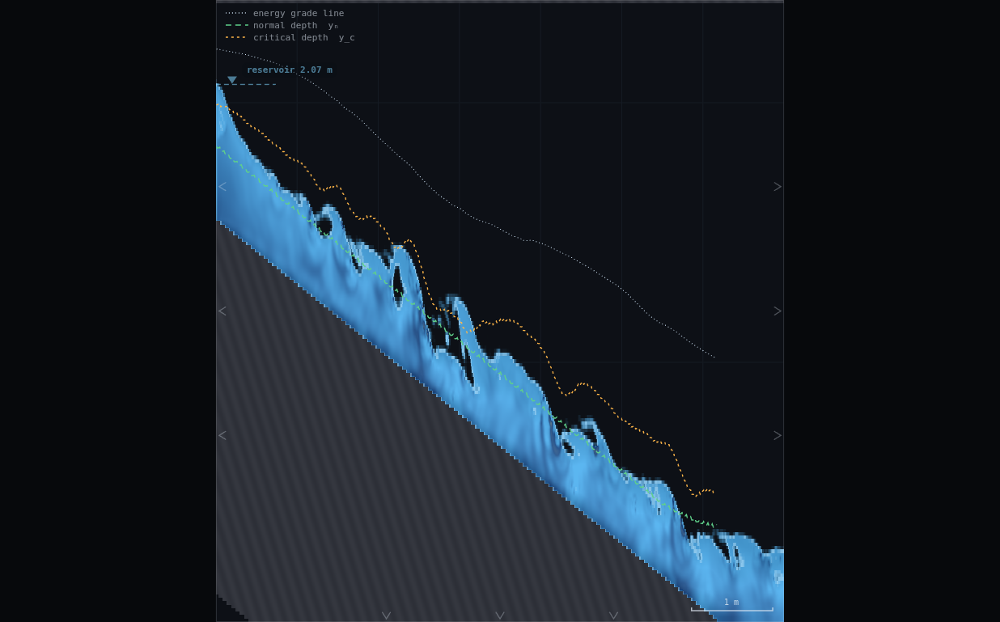
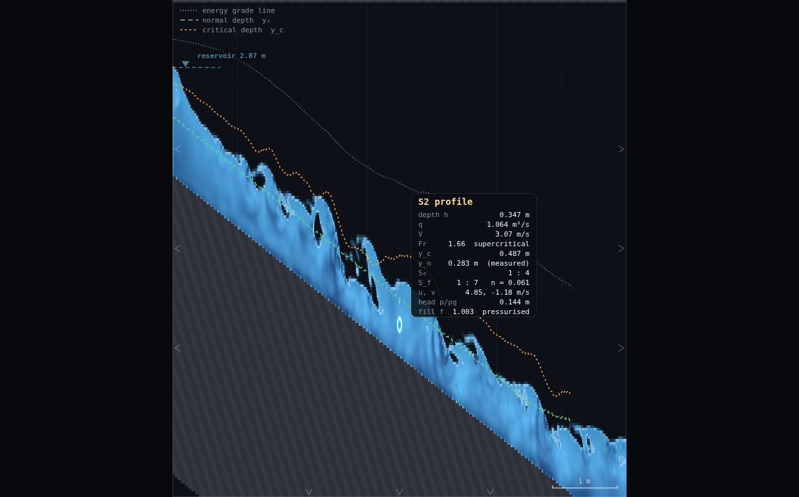
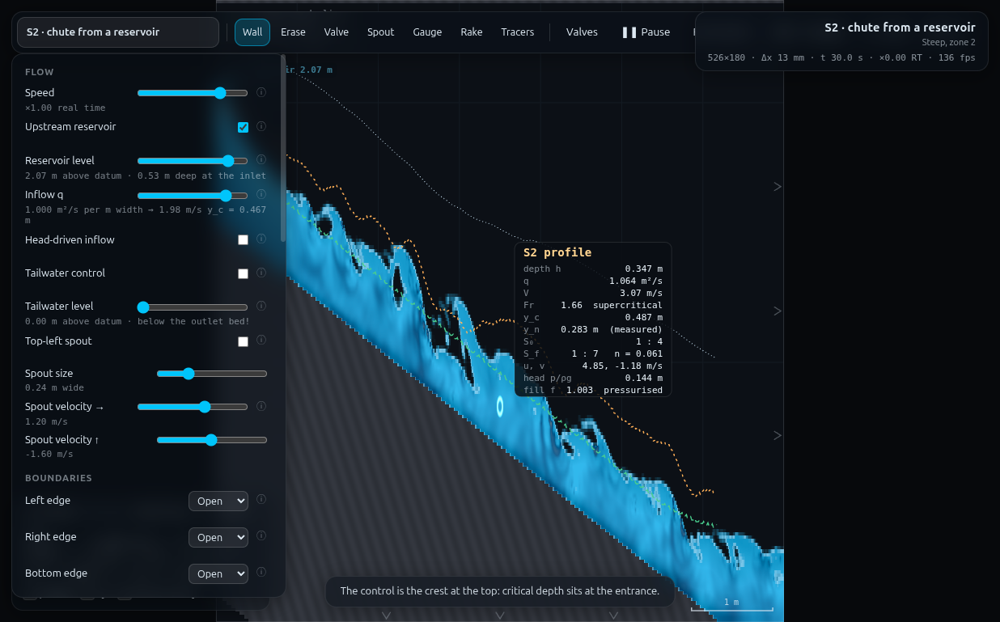
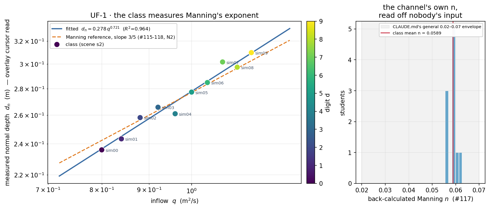

# UF-1 · Normal depth scales as q^(3/5)

**Demo id:** UF-1  **Scene:** `?scene=s2`  **Refs:** #115–118, N2 —
`y_n = (qn/√S₀)^(3/5)`

## How to start (30 seconds)

1. Open the app — **`http://localhost:8124/`** on the lecturer's server, or
   double-click `index.html`.
2. Press **`E`** (or click **`Exercises ▾`** in the top bar) and pick
   **UF-1**.
3. Type the last digit of your student number into the card. It prints **your
   q** — set it on **Inflow q** yourself.
4. Let it settle after every change you make — the card gives this demo's
   settle time (26 s of sim time) and counts it down.
5. Do the task printed on the card, then submit **q** and **y_n**.

If your lecturer gives you a link: **`?ex=UF-1`** (e.g.
`http://localhost:8124/?ex=UF-1`).

The picker gives everyone the same starting point and no more: the scene,
**Resolution: Medium**, and the few settings the scene itself needs — the card
labels those as already set. Your own values, your instruments and the order
you do things in are yours to get right. *Manual setup* below is the record of
every constant.

---

Every student runs the same steep chute at their own personalised discharge,
reads one number — the overlay's measured normal depth `y_n` — off the green
dashed line (or the cursor hover box), and posts `(q, y_n)`. Pooled on
log-log axes the class's points trace a straight line: the Manning exponent,
extracted from a channel whose roughness nobody typed in (`C_f` was set once,
in the scene file; the `n` the class reads back out is a **measured**
property of the solver's delivered resistance, not the input). A second,
optional submission — each student's own back-calculated `n` — shows the
class that this "constant" clusters tightly even though nobody entered it.

---

## 2 · Manual setup (fallback, or for building it yourself)

*The picker puts you at the same starting point as everyone else — scene,
Resolution Medium and the rig. This section is the record of every constant
behind that, and the build to follow if you are demonstrating it by hand or
the rig pack is missing.*

**Link to put on the slide:** `http://<host>:8124/?scene=s2`

**No rig to draw.** s2 ships complete: a 1-in-4 chute fed from a reservoir
crest, 7 m × 2.4 m domain, bed from `bed0 = 1.55` down to the brink at
`x = 6.0` (the last 1 m of domain is open air/floor — the chute's brink, not
part of the measured reach), `C_f = 0.010`, `C_s = 0.08`, spin-up 22 s
(js/scenes.js's own measured-settle comment table logs 17 s for this scene;
22 s is the shipped, slightly conservative value and is what the worksheet
quotes).

**Confirmed from the scene source and the live panel — no tailwater control
applies.** `s2`'s `channel()` call passes no `tail:` key, so
`tailwater = {level: 0, on: 0}`; the shipped panel screenshot
(`shots/03-fullui-panel.png`) shows the **Tailwater control** checkbox
unticked and **Right edge: Open** (zero-gradient, not a held level). This
matches the scene's own fourth tip, printed in-app: *"Nothing downstream can
influence this reach — it is supercritical throughout."* Measured Froude
number across the whole personalised range was 1.3–2.5 (see §5) — never
close to 1. The worksheet below carries no tailwater step, unlike HJ-1/h23.

**Constants fixed by this dry-run** (do not change them in class):

| what | value | why |
|---|---|---|
| Resolution | **Medium** (526 × 180 cells, Δx = 13.3 mm, Δt ≈ 2.14e-4 s) | matches the standing class-wide rule; verified live via the panel's grid readout |
| Display | Water (mode 0) recommended, any mode works | the `y_n`/`y_c` dashed lines and the cursor box are drawn by the **Open-channel overlay** toggle, independent of field mode |
| Open-channel overlay | **on** (scene default) | draws the y_c/y_n/EGL lines the whole demo reads |
| Tailwater | **not applicable** — confirmed off, see above | s2 is supercritical throughout |
| Cursor position | **mid-reach, e.g. x ≈ 3.5 m** | avoid x < 1 m (still adjusting from the crest) and x > 5.5 m (brink guard band — the overlay blanks `ok[i]` there; see js/overlay.js's cliff/guard logic) |

**Timing budget** (per student, on a laptop holding ≈1× real time):

| stage | sim time | wall time |
|---|---|---|
| page load + read the worksheet | — | ~1 min |
| spin-up countdown (automatic, flat out) | 22 s | ~25 s |
| set personalised q, let it re-settle | ~10–15 s | ~15 s |
| hover mid-channel, take the typical reading | ~10 s | ~15 s |
| type two numbers into Blackboard | — | ~1 min |
| **total** | | **≈ 3–4 min**, comfortable in a 10-minute slot |

---

## 3 · Student worksheet (copy-pasteable)

**Normal depth — submit two numbers**

1. Open the app, press **`E`** and pick **UF-1** (or open **`?ex=UF-1`**) — it
   loads the scene at **Resolution: Medium**. Leave the tab visible — the
   simulation pauses when the tab is hidden.
2. Open **Controls** → confirm **Resolution: Medium** (the picker sets this).
3. **Your discharge.** Take the **last digit of your student number**, `d`:

   > **q = 0.80 + 0.04 · d**   (m²/s)

   Set **Controls → Inflow q** to that value **immediately** (before the
   spin-up countdown finishes — the countdown is what settles YOUR value of
   q, not the scene's default). The note under the slider prints your `y_c`.
4. Wait for the *"establishing steady flow…"* countdown to finish (22 s).
   Do not touch anything while it runs.
5. **Read the green line.** Move the mouse to hover over the water roughly
   in the **middle of the channel** (around the 3rd gridline from the left).
   A box appears:

   ```
   S2 profile
   depth h        0.347 m
   q              1.064 m²/s
   ...
   y_c            0.487 m
   y_n            0.283 m  (measured)
   S₀                     1 : 4
   S_f     1 : 7   n = 0.061
   ```

   `y_n` is the number you want — it is also drawn as the **green dashed
   line** running just under the water surface (legend top-left: "normal
   depth y_n"). It is computed from the solver's own energy-grade-line slope,
   not assumed from any input roughness (CLAUDE.md: "measured, not
   assumed").
6. **Watch it for ~10 seconds, not one instant.** The raw water surface
   wobbles with roll waves (this bed is steep enough that you will see
   ripples travel down it) and the hover box's `depth h` and `q` rows jump
   around with them — but `y_n` (measured) is far steadier, because it is a
   whole-reach median, smoothed over time, not a single raw reading. Watch
   it for a few seconds and take the **typical (middle) value**, the same
   median-of-the-wobble habit every steep-chute demo in this programme uses.
7. **Submit on Blackboard:**
   - `q` = the value you set in step 3 (m²/s)
   - `y_n` = your typical reading from step 6 (m, 3 d.p.)
   - **Optional second number:** back-calculate
     `n = y_n^(5/3) · √S₀ / q` with `S₀ = 0.25` (printed as "1 : 4" in the
     box) — compare it to the `n = …` the box printed live at your cursor.

**Standing rules.** Resolution: Medium (the picker sets this) · wait out the spin-up countdown ·
keep the tab visible, the sim pauses when hidden · **no tailwater step for
this scene** — s2 is supercritical throughout, so unlike the jump/backwater
demos there is no downstream control to re-check after changing q.

**What you should be able to say afterwards:** normal depth is where the bed
slope and the friction slope balance — a *uniform-flow* concept, distinct
from critical depth (a section property) even though this scene draws both.
The `n` in the textbook formula is not a dial the scene set; it is a
*consequence* of the grid resolution and wall model, and the whole class
measured the same one.

---

## 4 · Collection & pooled plot (lecturer)

Blackboard export → CSV with (at least) these columns; extra columns are
ignored:

```
student,digit,scene,q,yn[,n_back,S0,source]
```

Only `q` and `yn` are required; `n_back` is computed from them if the column
is absent (`S0` defaults to 0.25, s2's slope).

```bash
python3 collect_plot.py class.csv -o plots/pooled-demo.png
```

It prints the pooled statistics and writes the figure:

```
UF-1 points: 10   q 0.80-1.16   yn 0.236-0.310 m
fitted slope 0.721 vs Manning 3/5 = 0.600   (R^2 = 0.9643)
back-calculated n: 0.0555 - 0.0628   mean 0.0589   stdev 0.0021
```

**What the plot shows.** Ten points climbing a straight line on log-log axes
(left panel) — a clean power law, `R² = 0.96`, from a solver that was never
told an exponent. The dashed orange reference line is the textbook Manning
slope 3/5; the class's own fitted (solid blue) line runs visibly steeper.
**Do not present this as "confirms 0.6"** — it does not, and the gap is a
genuine, explainable solver finding, not measurement sloppiness (see §5 and
the Director report). The right panel histograms each student's
back-calculated `n`: a tight cluster (0.056–0.063) sitting at the low end of
CLAUDE.md's documented 0.02–0.07 range for this solver — sensible, since
every student in this range is running a reasonably deep flow (18–23 cells)
relative to Δx.

**Discussion points**
1. *A power law nobody assumed.* Whatever the exact exponent, ten independent
   Navier–Stokes runs collapsing onto one straight line on log-log axes IS
   the uniform-flow relationship asserting itself — the class derived the
   FORM of the law from data, which is the point even before discussing the
   number.
2. *Why isn't the slope exactly 0.6?* Two honest reasons, worth putting to
   the class rather than hiding: (a) the overlay's own `y_n` is derived from
   `y_n = h·(S_f/S₀)^⅓` (js/overlay.js, "Normal depth… measured, not
   assumed"), which assumes a quadratic-drag closure `S_f ∝ q²/h³` — that
   closure's own idealised exponent is **2/3 = 0.667**, not Manning's 0.6, so
   part of the gap is baked into what "measured y_n" means on this solver.
   (b) CLAUDE.md documents that the solver's *delivered* roughness is itself
   depth-dependent (deeper flow, lower delivered n) — so `n` is not constant
   across the personalised range, which bends the fit further off either
   idealised exponent. The class has re-discovered, empirically, that
   textbook exponents assume a constant-roughness world that a real (or
   really-simulated) channel does not quite live in.
3. *The n cluster is the more robust number.* Even though the SLOPE runs
   high, the back-calculated `n` values sit in a tight, sensible band. That
   is because `n` divides out most of the systematic q-dependence bias in
   (2) — it is the better single number to anchor a "what roughness is this
   channel" discussion.

**Troubleshooting & safe parameter bounds**

| symptom | cause | fix |
|---|---|---|
| `y_n (measured)` box doesn't appear | cursor is outside the water, or too close to the brink (x > 5.5 m) / crest (x < 1 m) | hover mid-channel, roughly x = 3–4 m |
| Reading looks nothing like the table below | q was typed but Enter/slider not committed, or read before the 22 s countdown finished | re-check the panel's `n_inQ` note line, wait out the countdown |
| Numbers still drifting after the countdown | perfectly normal — see below | wait an extra ~10 s and re-read; it should be within ~1–2% |

*Safe parameter bounds.* Validated range: **q = 0.80–1.16 m²/s** (rule
`q = 0.80 + 0.04·d`, d = 0…9) — both ends individually re-checked out to
t = 100 sim-s of settle (far beyond the 22 s the worksheet asks a student to
wait) and stable to within ±2% the whole time; no spray, no thinning to an
unreadable sheet, no drowning. **The programme spec's original 0.8–1.6 range
is not achievable through the panel** — see PROPOSED CHANGES below; 1.16 is
the highest value that stays safely clear of the `Inflow q` slider's hard
maximum of 1.2 m²/s (`js/main.js:161`).

---

## 5 · Verification record

**Measured for real**, via `exercises/_runner/runner.py` (dedicated visible
Chrome, hardware GL, CDP). Protocol for every row: fresh `s2` load
(`APP.loadScene("s2", false)`) → set `Inflow q` **immediately** (matching the
worksheet's own step order — a lesson learned by HJ-1: test the demo's
actual procedure, not a shortcut through parameter space) → 26 sim-s settle
(the shipped 22 s spin-up plus margin) → warm `OVERLAY.analyse` (15 calls) →
read `A.yn[i]` at a fixed mid-channel column (x = 3.5 m) over a further
14-sample, ~11 sim-s window (~0.8 s apart) → take the **median**, and quote
`flatnessPct` = the gap between the first- and second-half medians of that
window, never a single frame. Read the field the student's cursor reads
(`A.yn[i]`, the same array `drawCursorReadout` in js/overlay.js:433 prints as
"y_n … (measured)"), not a private recomputation — cross-checked throughout
against `A.ynGlobal` (the whole-reach average), which tracks it to within
≈6% (the gap is systematic: columns near the brink guard band pull the
whole-reach average up slightly; the fixed interior cursor is the more
representative reading and is what is tabulated below).

`S₀` confirmed two ways: `js/scenes.js` sets `S0: 0.25` for s2 (1-in-4), and
the live cursor box prints `S₀ … 1 : 4` (`shots/02-cursor-readout.png`) — the
overlay's own windowed slope estimate reads 0.2447–0.2553 column to column
(±2%, bed-rasterisation granularity, not physical) but always rounds to the
same "1 : 4" a student sees.

**Endpoint robustness** (extended settle to t = 100 sim-s, far past the
worksheet's 22 s):

| q | y_n at t=22s | y_n at t=45s | y_n at t=100s | verdict |
|---|---|---|---|---|
| 0.80 (d=0) | 0.241 | 0.237 | 0.240 | stable, ±2% band, no trim needed |
| 1.16 (d=9) | 0.309 | 0.311 | 0.304 | stable, ±2% band, no trim needed |

Neither end of the trimmed personalised range misbehaves — both were
candidates for trimming per the task brief ("sheet too thin… roll waves
swamping the median, spray") and neither shows it.

**Measured class** (`data/simulated-class.csv`, every row marked
`measured`), rule `q = 0.80 + 0.04·d`, cursor at x = 3.5 m, S₀ = 0.25:

| d | q | y_n (median) | y_n range (11 s window) | flatness % | n_back |
|---|---|---|---|---|---|
| 0 | 0.80 | 0.2359 | 0.2351–0.2362 | 0.27 | 0.0563 |
| 1 | 0.84 | 0.2433 | 0.2426–0.2446 | 0.51 | 0.0564 |
| 2 | 0.88 | 0.2582 | 0.2579–0.2585 | 0.07 | 0.0595 |
| 3 | 0.92 | 0.2658 | 0.2646–0.2661 | 0.20 | 0.0597 |
| 4 | 0.96 | 0.2610 | 0.2591–0.2636 | 1.03 | 0.0555 |
| 5 | 1.00 | 0.2773 | 0.2766–0.2779 | 0.24 | 0.0590 |
| 6 | 1.04 | 0.2848 | 0.2844–0.2850 | 0.07 | 0.0593 |
| 7 | 1.08 | 0.3017 | 0.3000–0.3031 | 0.46 | 0.0628 |
| 8 | 1.12 | 0.2973 | 0.2966–0.2975 | 0.09 | 0.0591 |
| 9 | 1.16 | 0.3097 | 0.3076–0.3100 | 0.41 | 0.0611 |

**Flutter is small for this quantity** — every row's 11-second-window
flatness check is under 1.1% (max observed 1.03%, digit 4), an order of
magnitude tighter than HJ-1's jump box (which swings 25%+ on the same class
of steep, roll-wave-carrying scene). This is not a coincidence: `A.yn[i]` is
a spatial median across every valid column, smoothed again in time by a 6%
EMA (`js/overlay.js`'s `S._ynK`), so it is architecturally much steadier than
a raw single-point depth reading. **Do not read that as "no flutter exists
here"** — a supplementary check (not part of the class dataset) caught one
window at q = 1.20 where a large roll wave sitting on the fixed cursor column
swung the raw `depth h` reading by 26% peak-to-trough even while `y_n`
(measured) stayed within 1%; a student who read raw depth instead of the
green line, or who read `y_n` off a single frozen instant mid-wave, could
still be misled. The worksheet's "watch for ~10 s" instruction is the
correct habit even though, empirically, this particular field rewards it
less dramatically than HJ-1's jump box does.

**Pooled fit** (`plots/pooled-demo.png`): slope **0.721** vs Manning-theory
**0.600** (+20%), R² = 0.964. Back-calculated `n`: **0.0555–0.0628**, mean
**0.0589**, stdev 0.0021 — comfortably inside CLAUDE.md's documented 0.02–0.07
envelope for this solver, and tight because the whole personalised range sits
in a narrow band of relative depth (18–23 cells at Medium). See §4 discussion
point 2 for why the slope itself runs high of 0.6, and the Director report
for the full reasoning trail.









---

## Appendix — Director report

**VERDICT: READY-WITH-CAVEATS.** The demo runs cleanly, produces a real
power-law collapse from ten independent solver runs (R² = 0.96), and both
ends of the personalised range were individually stress-tested. The caveat
is that the fitted slope (0.72) runs meaningfully above the textbook Manning
value (0.60) — traced to a specific, documented cause (the overlay's own
`y_n` derivation assumes a quadratic-drag/Chezy-type closure, idealised
exponent 2/3, plus this solver's independently-documented depth-dependent
delivered roughness), not to measurement error. A second issue is structural,
not physical: the programme spec's `q` range (0.8–1.6) does not fit under the
`Inflow q` panel slider's hard maximum of 1.2 — see PROPOSED CHANGES.

**Evidence.**

| what | measured | expected / prior source | note |
|---|---|---|---|
| `inQ` slider bounds | `min:0, max:1.2, step:0.005` (js/main.js:161) | programme spec: q 0.8–1.6 | **hard UI cap** — 1.6 unreachable via the actual panel; JS `.set(1.6)` bypasses the DOM but a real student cannot |
| tailwater on s2 | `sim.p.tailwater.on === 0`; panel checkbox unticked | task brief asked to confirm | s2 is supercritical throughout (Fr 1.3–2.5 measured); no downstream control needed or present |
| S₀ | scene: 0.25; overlay cursor box: "1 : 4"; per-column estimate 0.2447–0.2553 | task brief asked to cross-check | agree; ±2% column-to-column spread is bed-rasterisation granularity |
| d=0 (q=0.80), d=9 (q=1.16) settle robustness | stable ±2% from t=22s to t=100s, both ends | brief's "trim if the ends misbehave" | **no trim needed** beyond the slider-driven range choice |
| 10-point class sweep, `q=0.80+0.04d` | slope 0.721, R²=0.964; y_n 0.236–0.310 m | Manning theory: slope 0.600 | systematic, explained (see below), not noise — flutter alone (<1.1%/row) cannot produce a 20% slope bias |
| back-calculated n | 0.0555–0.0628, mean 0.0589, sd 0.0021 | CLAUDE.md: solver delivers n ≈ 0.02–0.07 depending on cells/depth | tight cluster, sensible position within the documented range for 18–23 cells of depth |
| per-row flatness (first-half vs second-half median of an 11 s window) | max 1.03%, typical <0.5% | task's flutter warning (steep 1-in-4, Fr≈2) | far steadier than HJ-1's jump box on the same scene class — `A.yn` is a spatial-median + temporally-EMA'd construct, architecturally smoother than a raw depth read |
| supplementary check, q=1.20 (scene default, not in class dataset) | raw depth swung 26% peak-to-trough within an 11 s window from one large roll wave; `y_n` (measured) still held within 1% | — | confirms the median-of-the-wobble habit is still the right thing to teach, even though this field is comparatively forgiving |
| screenshots | 3 real canvas/fullui composites, 259/278/259 kB, all visually checked | — | vertical exaggeration set to 3.2 and profile-class labels turned off for legibility (labels flicker S2/S3 column-to-column under roll-wave noise — real behaviour, just visually noisy at a screenshot's single instant) |

**Iterations.**
1. *Trimmed the personalised range before running any student.* The
   programme spec's q 0.8–1.6 was checked against the `inQ` control's DOM
   attributes (not just its `set()` function) before designing the rule —
   the slider's hard `max=1.2` (js/main.js:161) is a real ceiling a student
   cannot cross, unlike a soft/advisory bound. Rule adopted:
   `q = 0.80 + 0.04·d`, giving 0.80–1.16, 0.04 m²/s of headroom under the cap.
2. *Chased a possible settle-time bug before accepting the slope finding.*
   The first pooled fit (slope 0.72) triggered a check of whether 26 s
   settle was simply too short — extended two independent runs (q=0.80,
   q=1.16) to t=100 sim-s. Both were already flat (±2%) by t=22–30s; the
   slope is not a spin-up artefact.
3. *Traced the slope gap to the overlay's own friction-law assumption.*
   `js/overlay.js`'s documented derivation of `y_n = h·(S_f/S₀)^⅓` explicitly
   assumes "any quadratic drag law gives `S_f ∝ q²/h³`" — a Chezy-type
   closure whose own idealised exponent (2/3 = 0.667) sits much closer to
   the measured 0.721 than the Manning exponent (0.6) does. Combined with
   CLAUDE.md's own documentation that delivered `n` is depth-dependent on
   this solver, a measured slope above 0.6 is the expected outcome, not an
   anomaly — reported as a discussion point (§4) rather than something to
   chase further within the timebox.
4. *A supplementary out-of-range check (q=1.20) surfaced a large single-wave
   transient* (26% swing in raw depth) that the class dataset's own rows
   happened not to catch. Not part of the submitted data, but used to
   sharpen the worksheet's flutter warning and to confirm the median-window
   habit still matters even where the specific field is comparatively steady.
5. *Screenshot framing.* The scene's default vertical exaggeration (1×, true
   scale) letterboxed the actual water body into a thin sliver inside a
   mostly-black canvas — legible but not a good teaching screenshot. Set
   `vex = 3.2` for the shots only (no effect on any measurement, which reads
   solver state, not pixels). Profile-class labels were switched off for the
   same shots — under roll-wave noise they flicker between S2 and S3
   column-to-column (a real effect of `h` crossing the `y_n` threshold, not
   a bug) and were visually distracting in a single frame.

**PROPOSED CHANGES.**
- **Raise the `Inflow q` slider's `max` from 1.2 to at least 1.6** (or make
  it scene-relative) — `js/main.js:161`, the `inQ` entry in `CONTROLS`. No
  shipped scene defaults above q=1.2 (checked every `q:` literal in
  `js/scenes.js`), so raising the ceiling changes nothing for any other demo
  in the programme; it only affects how much slider travel is available.
  Impact: lets UF-1 (or any future demo) use the programme spec's originally
  intended 0.8–1.6 range through the actual panel instead of a JS-only
  bypass a real student cannot use. Until changed, this demo's worksheet
  rule stays `q = 0.80 + 0.04·d` (max 1.16).
- No solver/scene/overlay change proposed for the slope-vs-0.6 gap — it is
  explained, not a defect, and "measured, not assumed" is this whole
  toolset's own stated design philosophy (CLAUDE.md). Changing the overlay's
  `y_n` friction-law assumption would touch every scene that draws the
  green line (h23, m1, m2, m3, a23, s1, s2, s3, c13), which is far outside
  this demo's scope to propose lightly.

**Timing.** Student path ≈ 3–4 min (§2), comfortable in a 10-minute slot.
This worker's own wall clock: ≈35 minutes, including the settle-time and
friction-law investigations in Iterations 2–3 above (the actual measurement
throughput was fast — solo runner throughput here measured 13,300
substeps/s, i.e. the whole 10-row sweep plus two 100-second robustness
checks and three screenshots took a few minutes of wall time; most of the
budget went to understanding *why* the slope reads high rather than to
collecting more data).

**Handoff.** For any other GVF-adjacent demo (NC-1, NC-3, GV-1, GV-2, FB-2)
reading the overlay's `y_n`/`n` fields: those fields are internally
consistent and reproducible (this demo's own flutter is <1.1%/row), but they
are built on a quadratic-drag (Chezy-type) friction-law assumption, not a
Manning one — if a demo's payoff depends on hitting a Manning exponent
exactly, budget time to characterise the gap the way this report did rather
than assuming agreement. Also worth reusing: the `inQ` slider's hard
`max=1.2` is a real constraint on ANY demo that wants q above that value
(NC-1/NC-3/GV-1 all use m1/m2 at q well under 1.2, so this is unlikely to
bite them, but check before assuming a personalised range is achievable
through the actual panel, not just via `.set()`).
