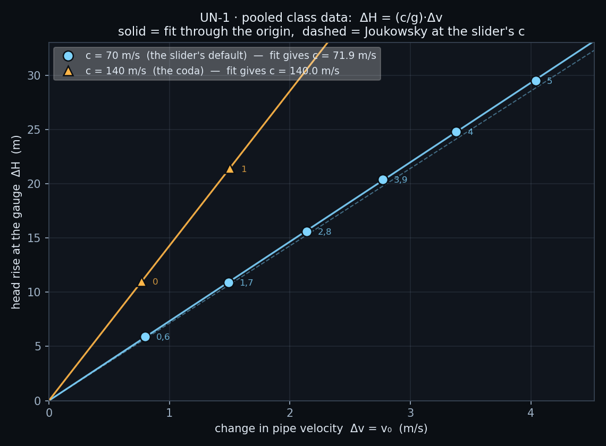

# UN-1 · The class discovers the celerity

A 49 m penstock runs from a reservoir 21 m above it to a valve at the far end.
Every student fits their own nozzle, and so gets their own steady pipe
velocity; they slam the valve, read the head rise off the square wave, and
submit the pair. Pooled, the points lie on a straight line **through the
origin** whose slope, multiplied by g, is the celerity of the pressure wave in
that pipe — a quantity nobody was told and nobody computed.

**Open it:** press **E** in the [app](https://barneydobson.github.io/hydraulician/)
and pick **UN-1**, or use the direct link
[`?ex=UN-1`](https://barneydobson.github.io/hydraulician/?ex=UN-1).
How to run any exercise: see the [teaching pack index](../INDEX.md#running-an-exercise).

## Theory

Shutting a valve on a moving column turns its momentum into pressure. The head
rise is Joukowsky's, and the wave then runs to the reservoir and back:

    ΔH = (c/g)·Δv          T = 4L/c

c is the celerity — the speed of sound in that pipe, set by the water's
compressibility and the pipe's elasticity, and it is what the class is about
to measure. Here the static head is **21.1 m** (measured: reservoir surface
above the pipe axis) and the penstock is **L = 49 m**. Δv is the whole steady
velocity v₀, because the valve shuts completely.

## Your nozzle gap

**d** is the **last digit of your student number** — your lecturer will
explain the assignment in class. Your gap is **0.14 × (1 + (d mod 6))**
metres:

| d | 0 | 1 | 2 | 3 | 4 | 5 | 6 | 7 | 8 | 9 |
|---|---|---|---|---|---|---|---|---|---|---|
| **gap (m)** | 0.14 | 0.28 | 0.42 | 0.56 | 0.70 | 0.84 | 0.14 | 0.28 | 0.42 | 0.56 |

## What to do

1. Erase the shipped nozzle plate at x = 56.5 m — Erase (`2`), but press `]`
   four times first, because the default brush is narrower than the plate.
   Stroke it away from y = 2.05 up to y = 4.95.
2. Draw your own gap in two pieces at the same station — Wall (`1`), Shift
   held to snap vertical: pipe floor (y = 2.0) up to y = 3.5 − gap/2, and
   y = 3.5 + gap/2 up to the pipe roof (y = 5.0). Measure (toolbar) checks it.
3. Press `R` and let it reach steady state — about **15 s**; the card counts
   it down. Hover mid-pipe for the bore-mean **V**, which is your **v₀**
   (ignore the readout's y_c and S₀ lines — those belong to open channels),
   and drop a Gauge (`5`) at x = 30 m on the pipe axis for its steady **H**.
   Call that **H₀**.
4. Press `V` to slam the valve, then **space** to pause on the first flat top
   for **H₁** — read the plateau, not the ringing spike on the wave front —
   and submit **gap, v₀, ΔH = H₁ − H₀**.

## For the instructor — pooling the class

Collect one row per student (`student_id,digit,gap_m,celerity,v0_ms,dH_m`),
export the CSV and run:

```bash
python3 collect_plot.py class.csv                # -> plots/pooled-demo.png
python3 collect_plot.py data/simulated-class.csv # the shipped dry-run class
```

`celerity` is 70 for the main run and 140 for the coda below. The script fits
ΔH = mΔv through the origin for each celerity series, reports m·g as the
celerity the class has just measured, and plots the points against Joukowsky
at the slider's own c.



### Discussion points

- **Keep the Controls panel shut until the fit is on the board.** The Slot
  celerity slider's own note line reads `70 m/s (Δh from Δv: 7.1 m per m/s)`
  — it prints the answer.
- **Then move it.** Set c = 140, re-run one nozzle, and every ΔH doubles while
  the period halves: the class's point jumps onto the second line. This is the
  experiment no physical rig can run — you cannot change a real pipe's
  elasticity between two readings. At that celerity anything above
  v₀ ≈ 1.5 m/s takes the downsurge to zero absolute pressure and the column
  separates, so only the two smallest nozzles give a clean coda; that is why
  surge protection exists, and where UN-3 starts.

The full verification record — the six-rung velocity ladder, the Joukowsky
check at both celerities, settle-time evidence, safe gap bounds and
troubleshooting — is kept locally, out of version control, at
`exercises/UN-1-celerity/_archive/README-full.md`.
