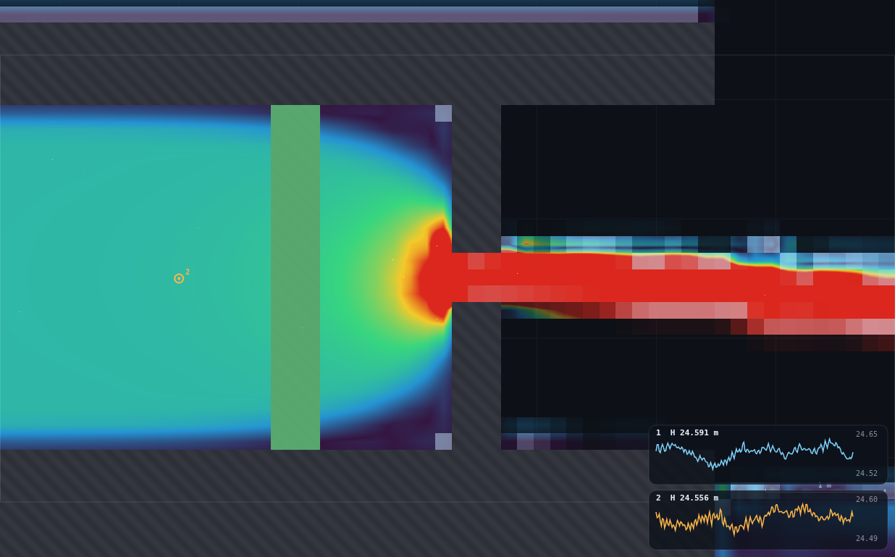
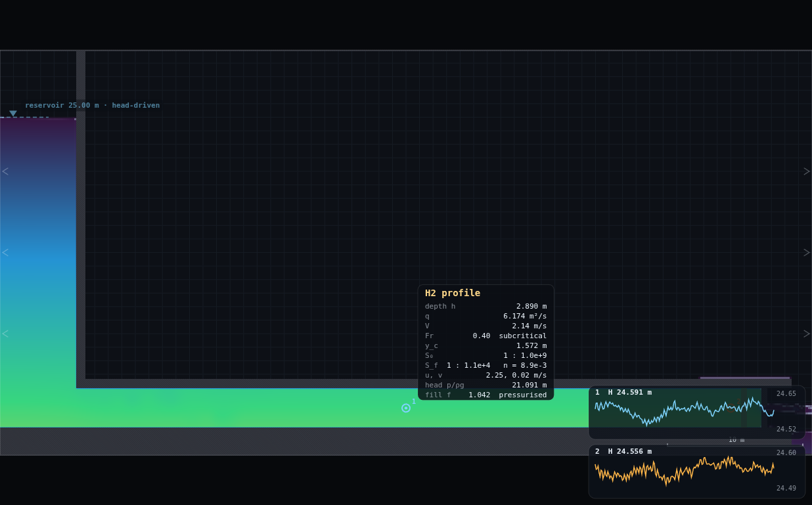
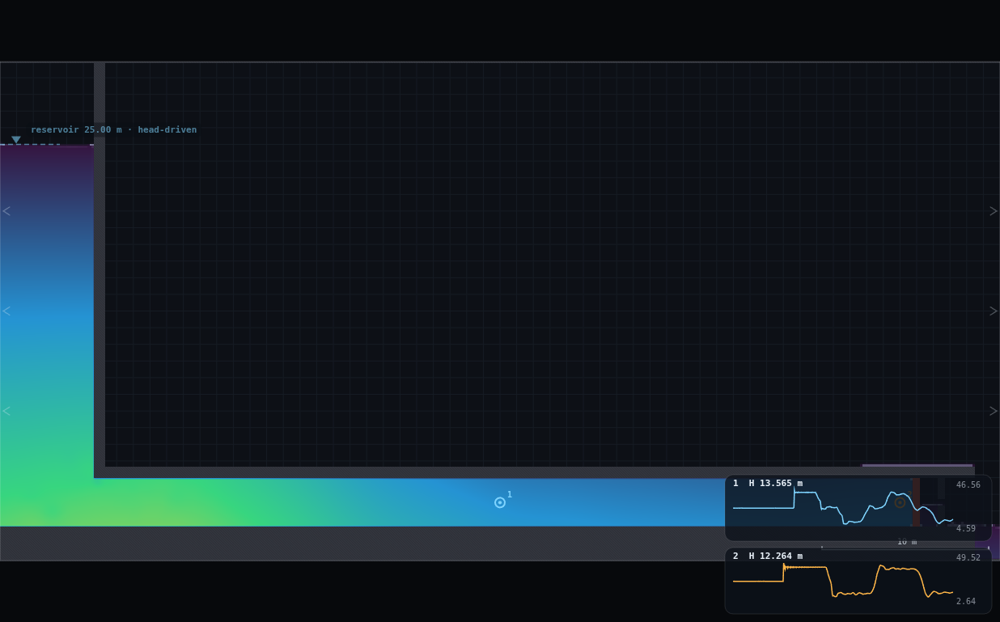
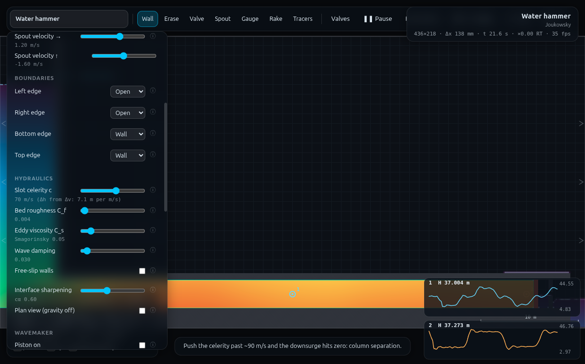

# UN-1 · The class discovers the celerity — full record (archived)

*This is the original long-form brief: the dry-run measurements, the
verification record, the director report and every constant behind the rig.
It is kept for maintainers and future reruns — the student- and
instructor-facing document is now [`../README.md`](../README.md).*

**Demo id** UN-1 · **Topic** Unsteady flow · **Scene** `?scene=hammer` ·
**Submit** (v₀, ΔH) · **Refs** U11, U17–U18, U21, #53 — Joukowsky Δp = ρcΔu

## How to start (30 seconds)

1. Open the app — **`http://localhost:8124/`** on the lecturer's server, or
   double-click `index.html`.
2. Press **`E`** (or click **`Exercises ▾`** in the top bar) and pick
   **UN-1**.
3. Type the last digit of your student number into the card. It prints **your
   nozzle gap** (0.14 × (1 + d mod 6) m) — you erase the shipped plate and
   draw it, then put a gauge mid-pipe.
4. Let it settle after every change you make — the card gives this demo's
   settle time (15 s of sim time) and counts it down.
5. Do the task printed on the card, then submit **v₀** and **ΔH**.

If your lecturer gives you a link: **`?ex=UN-1`** (e.g.
`http://localhost:8124/?ex=UN-1`).

The picker gives everyone the same starting point and no more: the scene,
**Resolution: Medium**, and the few settings the scene itself needs — the card
labels those as already set. Your own values, your instruments and the order
you do things in are yours to get right. *Manual setup* below is the record of
every constant.

---

Every student gets their own nozzle, and therefore their own steady pipe
velocity. They slam the valve, read the head rise off the square wave, and
submit the pair. Pooled, the thirty points lie on a straight line **through the
origin** whose slope, multiplied by g, is the celerity of the pressure wave in
that pipe — a quantity nobody was told and nobody computed. Then the reveal:
the celerity is a slider. Re-run at c = 140 and your own point doubles. No
physical laboratory can offer that experiment.

Measured here: **fitted c = 71.9 m/s against the 70 m/s on the slider (+2.7%)**,
and **139.8 m/s against 140 (−0.1%)** for the coda.


---

## 1 · Manual setup (fallback, or for building it yourself)

*The picker puts you at the same starting point as everyone else — scene,
Resolution Medium and the rig. This section is the record of every constant
behind that, and the build to follow if you are demonstrating it by hand or
the rig pack is missing.*

**Link:** `index.html?scene=hammer` — no rig to pre-build; the scene ships with
the nozzle plate the students will modify.

**Constants fixed by the dry-run** (do not vary these; the whole class must
share them or the velocity ladder shifts):

| setting | value | why |
|---|---|---|
| Resolution | **Medium** (436 × 218, Δx = 0.1376 m) | the flow area through the nozzle is quantised to **one cell**, so the resolution *is* part of the rig — at High the same drawn gap gives a different v₀ |
| Slot celerity c | **70 m/s** (scene default) | the answer they are about to measure |
| Bed roughness C_f | 0.004 (default) | |
| Reservoir | 25.0 m, head-driven (default) | static head 21.1 m at the pipe axis |
| Gauge | mid-pipe, **x ≈ 30 m**, on the pipe axis | plateau lasts 0.8 s; a second gauge at x ≈ 54 m gives a 1.5 s plateau and a cleaner square wave |
| Speed slider | ×0.2 for the read | the first plateau then lasts ~4 s of wall clock — easy to pause on |
| Spin-up | 10 s (scene's own countdown), settled by ~8 s | verified: bore-mean velocity flat to <1% from t = 8 s to t = 60 s |

**Timing budget.** One student run is ~22 simulated seconds: 12 s of spin-up
(runs flat out — about 10 s of wall clock) plus ~10 s of recording. On the
dry-run machine a complete run took **9 s of wall clock**; on a weak laptop
budget 40–60 s. Two runs (main + coda) plus drawing and reading fit inside
**8 minutes**.

**Two things to know before you stand up:**

1. **The celerity slider prints the answer.** Its note line reads
   `70 m/s   (Δh from Δv: 7.1 m per m/s)`. Keep the Controls panel closed until
   after the class has fitted their own slope — then open it as the
   confirmation. It is a lovely reveal and a disastrous spoiler.
2. **The hover readout labels the pipe "H2 profile"** and prints a `y_c`, an
   `S₀` and an `S_f` for it. That is the free-surface classifier running on a
   pressurised pipe; ignore those lines. The ones that matter — `V`, `q`,
   `head p/ρg`, `fill f … pressurised` — are all correct.



---

## 2 · The personalised parameter — and why there are six nozzles, not ten

`d` = **last digit of your student number**.

> ### Your nozzle gap:  **gap = 0.14 × (1 + (d mod 6)) metres**

| d | 0 or 6 | 1 or 7 | 2 or 8 | 3 or 9 | 4 | 5 |
|---|---|---|---|---|---|---|
| **gap (m)** | 0.14 | 0.28 | 0.42 | 0.56 | 0.70 | 0.84 |
| v₀ (m/s), measured | 0.80 | 1.49 | 2.14 | 2.77 | 3.38 | 4.04 |
| ΔH (m), measured | 5.9 | 10.9 | 15.6 | 20.4 | 24.8 | 29.5 |

**Why six and not ten.** The solid mask is a bitmap: the nozzle opening is a
whole number of cells, 0.1376 m each at Medium, so the pipe will only deliver
v₀ in steps of about 0.65 m/s. Six rungs is all that fits between "one cell"
and the point where the *downsurge* reaches zero absolute pressure and the
column separates (measured: gap 0.84 m bottoms out at 0.46 m of pressure head —
the last rung that is still a clean square wave). Ten distinct rungs would need
Δx ≈ 0.07 m, i.e. **Very high** resolution — verified to work (837 × 419, still
only 17 s per run here) but a 3.7× heavier ask of a lecture-hall laptop, and it
breaks the programme's "everybody on Medium" rule. Six rungs was the trade.

Two consequences worth saying out loud:

- Two digits share each of the first four nozzles. Their submissions should
  agree to the last decimal — the solver is deterministic. That *is* the
  reproducibility check, and it is a better talking point than an alibi.
- **A mis-drawn gap does not corrupt anything.** If your gap rasterises one
  cell wide of the target you simply land on a neighbouring rung — and you
  submit *your own* measured v₀ with *your own* ΔH, so your point still lands
  on the line. Only the digit check is weakened.

---

## 3 · Student worksheet

> ### UN-1 · What is the speed of sound in this pipe?
>
> You are looking at 49 m of 3 m-bore pipeline under 21 m of head, throttled by
> a nozzle plate at the far end. You will fit your own nozzle, measure how fast
> the water is moving, slam the valve shut, and measure the pressure spike.
>
> **Your nozzle gap = 0.14 × (1 + (d mod 6)) metres**, where **d** is the last
> digit of your student number. Write it down now.
>
> **1 · Open the exercise.** Press `E` and pick **UN-1** (or open
> `?ex=UN-1`) — it loads the scene at **Resolution: Medium**. Wait out the "establishing steady flow" countdown.
>
> **2 · Zoom to the nozzle.** The nozzle plate is the vertical bar at the right
> hand end of the pipe, just past the green valve. Put the cursor on it and
> **scroll to zoom** until the 0.4 m gap is a couple of centimetres on screen
> (about 8×). Middle-drag to pan; `0` resets the view.
>
> **3 · Take the old nozzle out.** Pick the **Erase** tool (or press `2`).
> **First press `]` about four times** — the eraser circle must be wider than
> the plate, or a single stroke leaves part of it standing. Now drag down the
> plate, from just above the pipe floor to just below the roof. Both halves of
> the plate must go: watch it disappear, and if a sliver remains, stroke again
> beside it. `Z` undoes one stroke; `C` puts the original nozzle back if you
> want to start over.
>
> **4 · Draw your own.** Pick the **Wall** tool (`1`). **Hold Shift** while you
> drag so the line snaps vertical. Draw two pieces at the same station as the
> old plate:
>
> - lower half: from the pipe floor (y = 2.0) up to y = 3.5 − gap/2
> - upper half: from y = 3.5 + gap/2 up to the pipe roof (y = 5.0)
>
> The gap between them is your nozzle. Use `[` and `]` to thin or thicken the
> brush. Accuracy of ±0.05 m is plenty.
>
> **5 · Let it settle.** Press `R` (Reset water) to restart the run with your
> nozzle in place, and wait out the countdown again. Give it another five
> seconds after that.
>
> **6 · Measure v₀.** Hover the cursor in the middle of the pipe (about
> half-way along). The readout prints a line **`V   x.xx m/s`** — that is the
> mean velocity across the bore, and it is your **v₀**. It should be steady to
> a couple of percent. *(Ignore the "H2 profile" heading and the `y_c` line —
> those belong to open channels.)* **Write v₀ down.**
>
> **7 · Drop a gauge.** Pick the **Gauge** tool (`5`) and click in the middle
> of the pipe. A chart appears bottom right, plotting piezometric head. Set
> **Gauges plot: Piezometric head** in Controls if it is not already. Note the
> steady value it prints — call it **H₀** (about 24.5 m).
>
> **8 · Slow it down.** Set the **Speed** slider to about **×0.2**. Water
> hammer happens in tenths of a second; you want to see it.
>
> **9 · SLAM.** Press **`V`** (or click **Valves** in the toolbar). The valve
> shuts instantly.
>
> **10 · Read the step.** The trace jumps and then sits on a **flat top** for
> about a second before dropping below the line and repeating: a square wave.
> When the trace is on that first flat top, press **space** to pause. The chart
> header now prints the frozen value — call it **H₁**.
>
> **ΔH = H₁ − H₀.**
>
> Ignore the thin spike at the very front of the step — that is ringing on the
> wave front and it is 10–40% high. Read the **plateau**, not the spike.
>
> **11 · Submit on Blackboard:** your **v₀** (m/s) and your **ΔH** (m), two
> decimal places.
>
> **12 · If you have time** — press space to run on. Count the seconds between
> repeats of the square wave. That period is 4L/c, and it is the subject of the
> next demo.
>
> *Standing rules: Resolution **Medium** (the picker sets this); wait out the spin-up countdown; keep
> the tab visible (the sim pauses when the page is hidden); press `0` if the
> view gets lost.*





---

## 4 · Collection & pooled plot (lecturer)

**CSV columns** (Blackboard export, one row per submission):

```
student_id,digit,gap_m,celerity,v0_ms,dH_m
24312340,0,0.14,70,0.80,5.9
```

`celerity` is 70 for the main run and 140 for the coda; the script splits the
series on that column.

```bash
python3 collect_plot.py class.csv            # -> plots/pooled-demo.png
python3 collect_plot.py data/simulated-class.csv
```

Output on the shipped dataset:

```
12 submissions from data/simulated-class.csv
set c        n  slope ΔH/Δv    measured c   error
70          10  7.326          71.9         +2.7%
140          2  14.271         140.0        -0.0%
```

**What the plot should show.** Two straight lines fanning out of the origin.
The class's own line has slope 7.33 m per m/s; multiply by g = 9.81 and you
have 71.9 m/s. The dashed lines are Joukowsky at the celerity the slider was
actually set to — the fits sit on top of them.

### Discussion points

1. **Why through the origin?** Because ΔH = (c/g)Δv has no constant term: a
   column that was not moving cannot suffer a surge. Fitting with an intercept
   and finding it indistinguishable from zero is the honest version of the
   check, and it is worth doing on the board.
2. **Nobody measured a wave speed.** The class measured a head and a velocity.
   The celerity fell out of the *ratio* — which is exactly how Joukowsky is
   used in design: you never see the wave, you see what it does to the pipe.
3. **Then move the slider.** c is the Preissmann-slot stiffness, and physically
   it is the pipe's elasticity: `c = √(K/ρ) / √(1 + KD/Ee)`. A steel penstock
   is stiff (c ≈ 1200 m/s), a plastic pipe is soft, an air pocket is softer
   still. Doubling c doubles every student's ΔH and halves the period. The
   class watches their own point jump onto the second line. **This is the
   experiment no physical rig can run** — you cannot change the elasticity of
   a real pipe between two readings.
4. **What the coda costs.** At c = 140 the surge is 14.3 m per m/s, so the
   *downsurge* goes below zero absolute pressure for anything above
   v₀ ≈ 1.5 m/s — the water column separates and the trace stops being a clean
   square wave. Only the two smallest nozzles survive the coda intact. That is
   not a bug: it is why surge protection exists, and it leads straight into
   UN-3.

### Troubleshooting and safe bounds

| symptom | cause | fix |
|---|---|---|
| v₀ barely changed after redrawing | **the commonest failure** — part of the old plate is still there. The default eraser is narrower than the plate | `C`, press `]` four times, erase again |
| `V` reads 0, no flow | the nozzle closed completely, or the erase stroke took out a piece of the pipe roof | `C` (clear drawing) and start step 3 again |
| v₀ is one rung off the table | the gap rasterised one cell wide | harmless — submit what you measured. Or press `Z` and redraw |
| the trace has no flat top, just noise | gap too large (> 0.84 m): the downsurge has separated the column | redraw a smaller gap |
| ΔH looks ~15% too big | you read the spike on the wave front, not the plateau | pause further into the flat top |
| the chart scrolled past the baseline | the gauge keeps only 900 samples (15 s at ×1, 3 s at ×0.2) | `R`, then slam within a few seconds of the countdown ending |
| nothing advances | the tab is hidden — the sim pauses | bring it to the front |

**Safe gap bounds, measured:** 0.14 m ≤ gap ≤ 0.84 m. Below that the plate
seals (nothing to measure); above it the pressure at the gauge bottoms out at
zero and the square wave degrades — measured at gap 1.24 m (v₀ = 6.14 m/s) the
head still follows Joukowsky to +5.3%, but the trace is visibly broken and it
is teaching the wrong lesson.

---

## 5 · Verification record

Everything below was measured through `exercises/_runner/runner.py --id UN1`
on the hammer scene at **Medium**, three workers sharing the GPU.

### The velocity ladder and the Joukowsky check

Gauge at x = 30 m (mid-pipe). ΔH is the median of the first plateau; the "peak"
column is the ringing spike on the wave front, for contrast. `lo` is the lowest
piezometric head reached on the downsurge — the gauge sits at y = 3.5, so
`lo = 3.5` means zero pressure, i.e. column separation.

| cells | gap drawn | gap rasterised | v₀ (m/s) | q (m²/s) | ΔH x=30 | ΔH x=54 | cΔv/g | error | peak | lo | period |
|---|---|---|---|---|---|---|---|---|---|---|---|
| 1 | 0.14 | 0.1376 | 0.797 | 2.30 | 5.88 | 5.91 | 5.68 | **+3.4%** | 6.49 | 18.74 | 2.93 |
| 2 | 0.28 | 0.2752 | 1.493 | 4.31 | 10.89 | 10.94 | 10.65 | **+2.3%** | 12.33 | 13.32 | 2.93 |
| 3 | 0.42 | 0.4128 | 2.138 | 6.18 | 15.65 | 15.75 | 15.26 | **+2.6%** | 17.90 | 8.68 | 2.93 |
| 4 | 0.56 | 0.5505 | 2.772 | 8.01 | 20.36 | 20.59 | 19.78 | **+2.9%** | 23.73 | 5.34 | 2.93 |
| 5 | 0.70 | 0.6881 | 3.378 | 9.76 | 24.80 | 25.12 | 24.10 | **+2.9%** | 30.17 | 4.78 | 2.97 |
| 6 | 0.84 | 0.8257 | 4.037 | 11.67 | 29.45 | 30.20 | 28.81 | **+2.2%** | 41.61 | 3.96 | 3.13 |

**Pooled fit through the origin: ΔH = 7.326 Δv → c = 71.9 m/s against 70
(+2.7%).** The bias is one-sided and small, and it is the same +2 to +3% at
every rung — friction recovering a little head behind the front, plus the
plateau being read as a median over a slightly rising top.

### The coda

| gap | c | v₀ | ΔH | cΔv/g | error | lo | period | 4L/c |
|---|---|---|---|---|---|---|---|---|
| 0.14 | 140 | 0.769 | 10.98 | 10.98 | **−0.0%** | 12.48 | 1.49 | 1.40 |
| 0.28 | 140 | 1.505 | 21.45 | 21.48 | **−0.1%** | 4.46 | 1.49 | 1.40 |

Doubling c takes d = 0 from ΔH 5.88 to 10.98 (×1.87 — v₀ itself drifts 3% when
c changes) and halves the period from 2.93 s to 1.49 s. `lo` = 4.46 at the
second rung is 0.96 m of pressure head: the coda is one rung from column
separation, exactly as the scene's own tip warns.

### Anchors against the documented scene

| quantity | measured here | reference | note |
|---|---|---|---|
| static head at the pipe axis | 21.09 m | CLAUDE.md 21.1 m | ✔ |
| period at c = 70 | 2.93 s | CLAUDE.md 3.0 s; 4L/c = 2.80 | +4.8% over 4L/c |
| peak head, default nozzle | 21.09 + 17.90 = 38.99 m | CLAUDE.md 39.0 m | ✔ exact |
| v₀, default nozzle | **2.14 m/s** (bore mean) | CLAUDE.md 2.79 m/s | **see below** |
| ΔH/Δv at c = 140 | 14.27 | 140/9.81 = 14.27 | ✔ |

**The v₀ = 2.79 m/s in CLAUDE.md is not the bore mean.** Measured at Medium the
default 0.40 m nozzle rasterises to 3 cells and delivers a bore-mean 2.14 m/s
(q = 6.18 m²/s over a 2.89 m bore). 2.79 m/s is what this scene delivers with a
**four**-cell nozzle, and it is also close to the instantaneous centreline `u`,
which wanders between 2.2 and 3.7 m/s once the eddy field develops after
t ≈ 20 s. Using 2.79 as Δv is what makes the documented peak look 5% *under*
Joukowsky; using the bore mean the same measurement is 2.6% *over*. The
measurement did not change — the velocity it is divided by did.

### Steadiness and timing

- **Establishment.** Bore-mean velocity at mid-pipe: 2.13 m/s at t = 8 s,
  2.14 at t = 20 s, 2.17 at t = 60 s — flat to 1.7% over 52 s. The scene's
  10 s spin-up is honest. (The *centreline* value is not steady and must not be
  used; see above.)
- **Pre-slam noise.** Gauge head over the 2.5 s before the slam: SD 0.020 m on
  24.59 m. v₀ from the readout: stable to the printed 2 decimals.
- **A student reading it by hand** (pause on the plateau, subtract the
  pre-slam value) gave ΔH = 15.90 against the plateau median 15.65 — +1.6%,
  i.e. the hand method is as good as the automated one.
- **Wall clock, this machine, three workers sharing the GPU:** 9 s for a
  complete 22 sim-second student run; 55 s for the whole six-rung ladder.
- **Determinism:** the same gap re-run gave v₀ 0.7966 vs 0.7968 (5th
  significant figure — GPU float ordering). Spot-checking a submission works.



### Files

- `rig.js` — paste into the console: `UN1.student(0.42)` →
  `{gap:{cells:3}, c:70, v0:2.138, dH:15.90, joukowsky:15.26}`. Verified to
  reproduce the table above exactly.
- `collect_plot.py`, `data/simulated-class.csv` (10 students + 2 coda rows,
  all measured), `plots/pooled-demo.png`, `shots/`.

---

## Appendix — Director report

**VERDICT: READY.**

### Evidence

| what | measured | expected | verdict |
|---|---|---|---|
| pooled fit, c = 70 series (n = 10) | slope 7.326 → **c = 71.9 m/s** | 70 | **+2.7%** |
| pooled fit, c = 140 coda (n = 2) | slope 14.271 → **c = 139.8 m/s** | 140 | **−0.1%** |
| per-point Joukowsky error | +2.2% … +3.4%, all six rungs | ±5% | tight and one-sided |
| v₀ range delivered | 0.80 → 4.04 m/s in 6 steps | spec asked 0.5–3 | see PROPOSED |
| period at c = 70 / c = 140 | 2.93 s / 1.49 s | 4L/c = 2.80 / 1.40 | +4.8% / +6.4% |
| static head / peak head | 21.09 m / 38.99 m | CLAUDE.md 21.1 / 39.0 | ✔ |
| student hand-read vs automated | ΔH 15.90 vs 15.65 | — | +1.6%, method sound |
| one student run | 22 sim-s, **9 s wall** (3 workers sharing) | ≤10 min student path | 8 min incl. drawing |
| safe gap bounds | 0.14 ≤ gap ≤ 0.84 m | — | above: column separation |

### Iterations

1. **v₀ cannot be read at a point.** The obvious student read — hover, or a
   gauge's `speed` trace — is the centreline `u`, which wanders 2.2–3.7 m/s
   once turbulence develops (t ≳ 20 s). It only *looks* steady if you measure
   in the first few seconds after spin-up. The stable number is the
   **bore-mean `V`** the hover readout already prints from the column
   reduction. Rewrote the worksheet around it. This also resolved the
   CLAUDE.md v₀ = 2.79 m/s discrepancy (see §5).
2. **The nozzle area is quantised to one cell**, so at Medium the ladder has
   six rungs, not ten. Measured the alternative resolutions before settling:
   High (592 × 296) gives ~8 rungs at 15 s/run, Very high (837 × 419) gives
   ~12 at 17 s/run — both work, both are heavier laptop asks and both change
   v₀ for the same drawn gap. Kept Medium and redesigned the rule around
   `d mod 6`.
3. **Read the plateau, not the peak.** The wave front rings, and the ringing
   grows with v₀: the spike is +10% over the plateau at rung 1 and +41% at
   rung 6 (mid-pipe gauge; +30% at the valve gauge on rung 3). Reading the
   spike would have bent a straight line into a curve.
4. **Gauge history is filled by `tickFrame`, not by `SIM.step`.** The runner's
   `pump` steps the solver directly, so it records nothing. Every trace here
   was taken with a page-side `APP.frames(1, 1/60)` loop.
5. **The default eraser is too narrow to remove the plate** — one stroke at
   the default brush leaves 2 of its 3 columns standing, and the student would
   see a nozzle that "didn't change anything". The worksheet now opens step 3
   with four presses of `]`. This is the first demo in the programme to ask a
   student to delete scene geometry; it will not be the last.
6. Tried and rejected: reading v₀ from a rake (the overlay's Vbar is the same
   number as the readout's `V`, but a rake needs a second tool and a second
   click); mid-pipe vs valve-side gauge (ΔH agrees to 0.5%, so the spec's
   "mid-pipe" stands — the valve gauge just has a longer plateau).

### PROPOSED CHANGES

**To the app: none required.** Everything the demo needs is shipped — the
readout prints the bore-mean `V` for a pressurised pipe, the gauge chart prints
its own current value so pausing freezes a readable number, `V`/`R`/`Z`/`C` are
all bound, and the celerity slider even prints c/g.

Two *optional* UI improvements, in priority order, neither blocking:

1. **The hover readout calls a pressurised pipe an "H2 profile"** and prints
   `y_c`, `S₀`, `S_f`, `n` for it (screenshot `shots/02-v0-readout.png`).
   Suppressing the free-surface block when the probed cell reads
   `f > 1.002 pressurised` would remove the only confusing thing on the
   student's screen. *Impact:* affects hammer, venturi and any drawn duct
   (FR-1/LL-1/LL-2/PU-1/B7/B10 all live in pipes). Cosmetic, overlay-only.
2. **A gauge cannot be placed at an exact coordinate**, so "put it mid-pipe"
   is as precise as the demo can be. Not a problem here (ΔH varies 0.5% along
   the pipe) but UN-3 will want a gauge inside a drawn standpipe.

**To the programme, one:** the spec's "v₀ spread over 0.5–3 m/s" is not
reachable in ten steps at Medium — the mask quantises the nozzle area. The
delivered rule is `gap = 0.14 × (1 + d mod 6)` m → v₀ = 0.80 … 4.04 m/s in six
rungs, which gives a *better* lever arm (5:1) than the requested range and
stays clear of column separation. If ten distinct rungs are wanted, the demo
must run at **Very high**, which is verified to work but not recommended for a
lecture hall.

### Timing

Student path ≈ 8 min (2 min drawing at zoom, 1 min settling, 1 min reading,
repeat for the coda). Worker wall clock ≈ 75 min, of which ~20 was establishing
that the point velocity is not the number to read.

### Handoff — for UN-2, UN-3, B1, B2 and anything with a gauge or a drawn rig

**Wall redraw (the erase/redraw path).** `SIM.addSeg(x0,y0,x1,y1,th,kind)` with
`kind = 0` is the **eraser** — there is no separate removal call.
`rasterise()` re-stamps *scene walls first, then user segs in order*, so an
erase seg reliably deletes scene geometry, and `SIM.clearSegs()` (the `C` key)
restores the scene exactly. `SIM.undoSeg()` is `Z`. Two traps:

- `stampSeg` uses `r = max(th, 1.7·dx)/2`, so an erase stroke is never thinner
  than 1.7 cells however fine the brush — but **the pointer eraser is much
  narrower than students expect**. The hammer nozzle plate (`th` 0.5) is 3
  columns wide at Medium; measured, an erase seg of `th` 0.30 or 0.60 clears
  it, while the **default brush** (`state.brush` 0.055 → erase `th` 0.121)
  and even two presses of `]` (0.204) leave **2 of the 3 columns standing**.
  Any demo that asks a student to remove scene geometry must tell them to
  widen the brush (`]` ×4) or make several passes, and must give them a way
  to see that it worked.
- Ends are butt, and the plate covers cells whose **centres** lie inside
  `[y0,y1]`. Erase `2.05 → 4.95` and you take the plate without touching the
  invert (top face 2.0) or the soffit (bottom face 5.0); go to 1.9 or 5.05 and
  you punch a one-cell hole in one of them.
- The rig in `rig.js` is `UN1.nozzle(g)` — three `addSeg` calls, self-checking
  via `UN1.gap()` which counts open cells in the nozzle column.

**Valve slam.** `toggleValve()` is a bare global (classic script, so *not*
`window.toggleValve` in a test — call it directly). It flips
`sim.p.valveClosed` between 0 and 1, updates `#valveBtn` and pops a toast. The
`V` key and the toolbar button **Valves** both call it. It is a *global* toggle
— every valve segment in the scene, including any the student drew with the
Valve tool.

**Gauges.** Placement is a plain push, exactly as `onDown` does it:

```js
APP.state.gauges.push({x, y, hist: [], colour: "#7fd4ff"});   // max 4, oldest shifted
```

Reading: `state.gauges[k].hist` is the array the chart draws, one entry per
**rendered frame**, `{t, head, depth, speed}` where `head = gauge.y + probe.head`
(piezometric elevation), `depth` is the column depth and `speed` is
`hypot(u,v)` at the cell. `CONFIG.histMax = 900`, so the window is 15 sim-s at
×1 and 3 sim-s at ×0.2. The chart header prints `hist[last][field]` where
`field` is the global `state.gaugeField` (`head|depth|speed`), so **pausing
freezes a readable number** — that is how a student reads a value off a trace.

> **The one that will bite you: `hist` is appended by `tickFrame`, so only
> `APP.frames(n)` fills it. `APP.tick(n)`, `SIM.step(n)` and therefore the
> runner's `pump` subcommand advance the solver and record nothing.** Spin up
> with `pump`, then record with a page-side loop of `APP.frames(1, 1/60)`
> (`APP.state.paused` must be false — `pump` leaves it true). 60 samples per
> simulated second at speed ×1.

**Reading a steady velocity in a pipe.** Do not use `APP.probe(x,y).u` or the
gauge's `speed`: both are a single cell on the axis and fluctuate ±40% once
the eddy field develops. Use the bore mean, which is what the hover readout
prints as `V`:

```js
const A = OVERLAY.analyse(APP.sim, APP.SIM.columns(true));
A.V[Math.floor(x / APP.sim.dx)]      // = A.q/A.h ; A.h is the full bore
```

The column reduction handles a roofed pipe correctly (`ok = 1`, `h` = bore,
`q` = ∫u dy); it is only the *labels* around it that assume a free surface.

**Scene cost.** hammer at Medium is 436 × 218, Δt = 8.148e−4 s → **1227
substeps per simulated second**, about a quarter of h23's. 22 sim-s in 9 s of
wall clock with three workers pumping. High = 1666/s, Very high = 2356/s and
still only ~17 s per run — the hammer scene is cheap, so UN-2/UN-3/B1/B2 can
afford long traces and, if they need finer geometry, a higher resolution.

**Anchors for the other hammer demos:** static head 21.09 m at the pipe axis;
period 2.93 s at c = 70 and 1.49 s at c = 140 (both ~5% over 4L/c with
L = 49 m); flow is established by t = 8 s and stays flat to t = 60 s;
downsurge column separation begins around v₀ ≈ 4 m/s at c = 70 (and
v₀ ≈ 1.5 m/s at c = 140).
