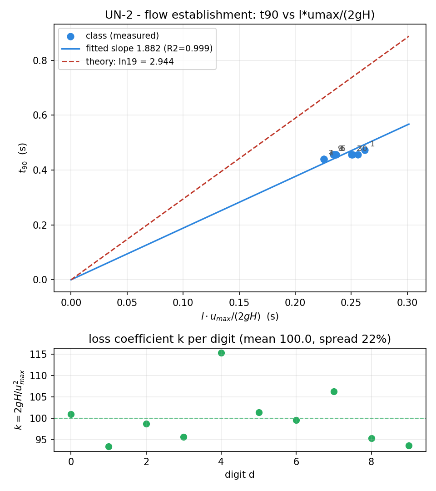

# UN-2 · Flow establishment: the asymptotic start

A student starts from nothing: valve shut, pipe full, water dead still. They
open the valve and the speed trace rises to a plateau — not instantly, because
49 m of water has inertia. Read where it settles (u_max)
and how long it took to get within 10% of there (t_90), and the inertia-head
derivation predicts the ratio between them before anyone has measured
anything. Personalised by reservoir level, the class's pooled t_90 against
l·u_max/2gH should be a straight line through the origin.

**Open it:** press **E** in the [app](https://barneydobson.github.io/hydraulician/)
and pick **UN-2**, or use the direct link
[`?ex=UN-2`](https://barneydobson.github.io/hydraulician/?ex=UN-2).
How to run any exercise: see the [teaching pack index](../INDEX.md#running-an-exercise).

## Theory

The driving head accelerates the column against a loss that grows with the
square of the speed, so the flow approaches its plateau rather than arriving
at it:

    u_max = √(2gH/k)
    t     = (l·u_max / 2gH)·ln[(u_max + u)/(u_max − u)]

Put u = 0.9·u_max in the second and the logarithm becomes ln 19, so

    t_90 = ln 19 · l·u_max/(2gH)          ln 19 = 2.944

— a straight line through the origin, whatever each student's k turns out to
be. Here the penstock is **l = 49.0 m** (reservoir face to valve) and
**H = your reservoir level − 3.5 m**, the pipe axis. The picker also sets Wave
damping to 0.30, which kills the ringing that a level change on a shut pipe
otherwise excites, and Speed to ×0.2, because the gauge chart remembers 15
real seconds and this event needs 3 simulated ones. Leave both where they are.

## Your reservoir level

**d** is the **last digit of your student number** — your lecturer will
explain the assignment in class. Your level is **22.0 + 0.6·d** metres, an
elevation above the domain floor, which is what the Reservoir level slider
sets:

| d | 0 | 1 | 2 | 3 | 4 | 5 | 6 | 7 | 8 | 9 |
|---|---|---|---|---|---|---|---|---|---|---|
| **level (m)** | 22.0 | 22.6 | 23.2 | 23.8 | 24.4 | 25.0 | 25.6 | 26.2 | 26.8 | 27.4 |

## What to do

1. Press `V` to shut the valve — the scene boots open and flowing — then set
   **Controls → Reservoir level** to your own value.
2. Press `R` and let it reach steady state — about **10 s**; the card counts
   it down. Hover the pipe: the readout's **V** should be back to about
   0.00 m/s.
3. Place a Gauge (`5`) mid-pipe, at x = 30 m on the axis. Its card plots
   **|u|**, the speed at that point.
4. Press `V` again to open the valve — that is your t = 0 — and watch for
   about fifteen real seconds. Pause (**space**) and read: the band the trace
   settles into is **u_max** (not the first spike, which overshoots it), and
   the first crossing of 0.9·u_max is **t_90**. Submit **level, u_max,
   t_90**.

## For the instructor — pooling the class

Collect one row per student
(`student_id,digit,level_m,H_m,l_m,umax_ms,t90_s`), export the CSV and run:

```bash
python3 collect_plot.py class.csv                # -> plots/pooled-demo.png
python3 collect_plot.py data/simulated-class.csv # the shipped dry-run class
```

`H_m` is the head above the pipe axis (level − 3.5 m) and `l_m` is 49.0 for
every row on this scene. The script fits t_90 against l·u_max/(2gH) forced
through the origin, prints and plots that slope against ln 19, and puts each
digit's loss coefficient k = 2gH/u_max² in the panel underneath.



### Discussion points

- **Why the whole class comes in early.** The fitted slope is 64% of ln 19 —
  consistently, not scattered. The rigid-column derivation assumes pressure
  communicates along the pipe effectively instantly, but here the time
  constant l·u_max/2gH ≈ 0.25 s is *shorter* than the pipe's one-way wave
  transit l/c = 49/70 ≈ 0.7 s, so the trace rings and crosses 90% on its
  first overshoot. Teach it as the validity limit of the derivation.
- **Do not improvise "raise c and watch it match".** It measurably does not:
  at c = 400 the fit is just as straight and lands at 139% of ln 19 instead,
  and the trace stays ringy at every celerity tried.

The full verification record — the closed-pipe ringing investigation behind
the wave-damping setting, the point gauge's bias during the rise, the
ten-digit sweep, safe level bounds and troubleshooting — is kept locally, out of version control, at `exercises/UN-2-establishment/_archive/README-full.md`.
