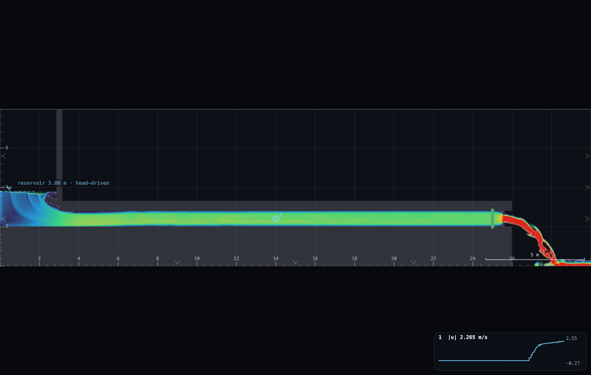
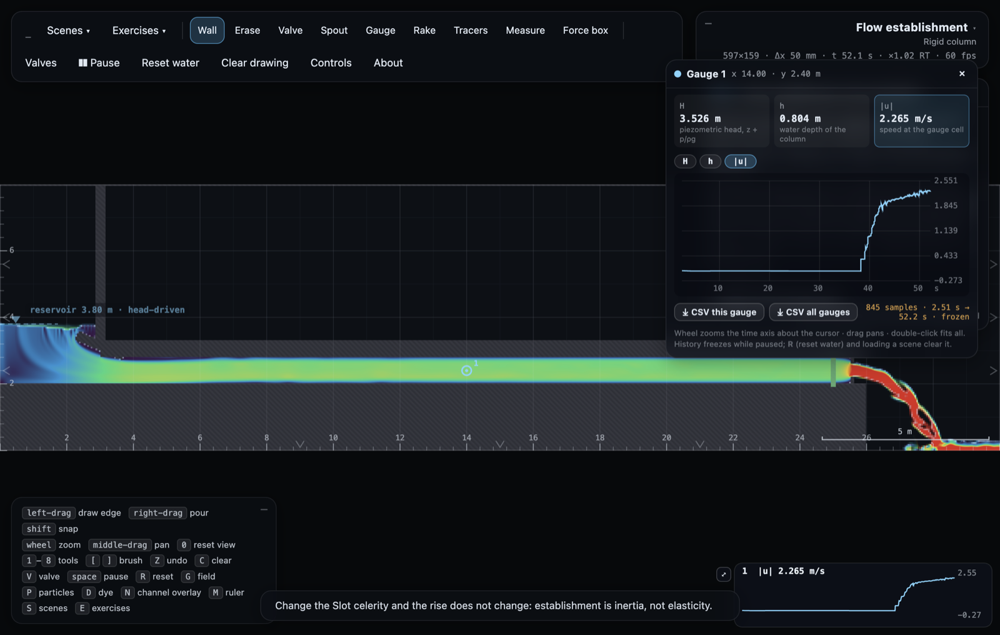

# UN-2 · Flow establishment: the asymptotic start

A reservoir feeds a 23 m pipe with a shut valve at the far end. Open the
valve and the column takes seconds to come up to speed — 23 m of water has
inertia — approaching its final velocity instead of arriving at it. Each
student runs their own reservoir level, reads the plateau speed and the time
to reach 75% of it, and the pooled class points trace a straight line through
the origin whose slope is ln 7, a number nobody typed in anywhere.

**Open it:** press **E** in the [app](https://barneydobson.github.io/hydraulician/)
and pick **UN-2**, or use the direct link
[`?ex=UN-2`](https://barneydobson.github.io/hydraulician/?ex=UN-2).
How to run any exercise: see the [teaching pack index](../INDEX.md#running-an-exercise).

## Theory

The driving head accelerates the column against a loss that grows with the
square of the speed, so the flow approaches its plateau rather than arriving:

    u_max = √(2gH/k)
    t     = (l·u_max / 2gH)·ln[(u_max + u)/(u_max − u)]

Put u = 0.75·u_max in the second and the logarithm becomes **ln 7 = 1.946**:

    t_75 = ln 7 · l·u_max/(2gH)

— a straight line through the origin, whatever each student's k turns out to
be. Here the pipe is **l = 23 m** (mouth to the exit orifice) and
**H = reservoir level − 2.4 m**, the pipe axis. Read the level off the ∇
marker **while the pipe flows** — the reservoir concedes a few centimetres
under draw, and the flowing level is the head the column actually sees.

## Your reservoir level

**d** is the **last digit of your student number** — your lecturer will
explain the assignment in class. Your level is **3.4 + 0.1·d** metres, an
elevation above the domain floor, which is what the Reservoir level slider
sets:

| d | 0 | 1 | 2 | 3 | 4 | 5 | 6 | 7 | 8 | 9 |
|---|---|---|---|---|---|---|---|---|---|---|
| **level (m)** | 3.4 | 3.5 | 3.6 | 3.7 | 3.8 | 3.9 | 4.0 | 4.1 | 4.2 | 4.3 |

## What to do

1. Set **Controls → Reservoir level** to your value. Press `R` and let it
   settle — about **30 s**; the card counts it down. The pipe should be full
   and still.
2. Place a Gauge (`5`) mid-pipe at x = 14 m on the axis (y ≈ 2.4) and expand
   its card — the **⤢** button opens the inspector, a full-width trace.
3. Press `V` to open the valve — that is your t = 0 — and watch about
   fifteen seconds. Pause (**space**).
4. Read off the inspector trace: the settled band is **u_max** (about
   2–3 m/s depending on your level), and **t_75** is the first crossing of
   0.75·u_max, timed from where the trace leaves zero. The crossing sits on
   the steep flank, so it is sharp. Read the flowing reservoir level off its
   marker before you pause, and submit **level, u_max, t_75**.





## For the instructor — pooling the class

Collect one row per student
(`student_id,digit,level_m,H_m,l_m,umax_ms,t75_s`), export the CSV and run:

```bash
python3 collect_plot.py class.csv                # -> plots/pooled-demo.png
python3 collect_plot.py data/simulated-class.csv # the shipped dry-run class
```

`H_m` is the flowing level − 2.4 and `l_m` is 23.0 for every row. The script
fits t_75 against l·u_max/(2gH) forced through the origin, prints and plots
that slope against ln 7, and puts each digit's loss coefficient k = 2gH/u_max²
in the panel underneath. The shipped dry-run class — ten headless runs, one
per digit — fits at 101% of ln 7 with k steady near 4.3.


### Discussion points

- **Why this rig and not the water-hammer pipe.** The derivation assumes
  pressure communicates along the pipe much faster than the flow changes.
  Here the rise spans about five wave round-trips, so it holds; on the
  49 m hammer pipe the rise is over inside one transit and the trace is a
  staircase of wave passes, not an asymptotic curve.
- **The negative control.** Set the Slot celerity slider to 60 and re-run:
  t_75 does not change (measured: about 2% apart). Establishment is inertia
  against resistance — the pipe's elasticity is not in the equation, and the
  rig can prove it.

The full verification record — the design trail (two-reservoir and apron
variants and why they failed, the bellmouth measurement), the ten-digit
sweep, settle evidence and safe bounds — is kept locally, out of version
control, at `exercises/UN-2-establishment/_archive/README-full.md`.
