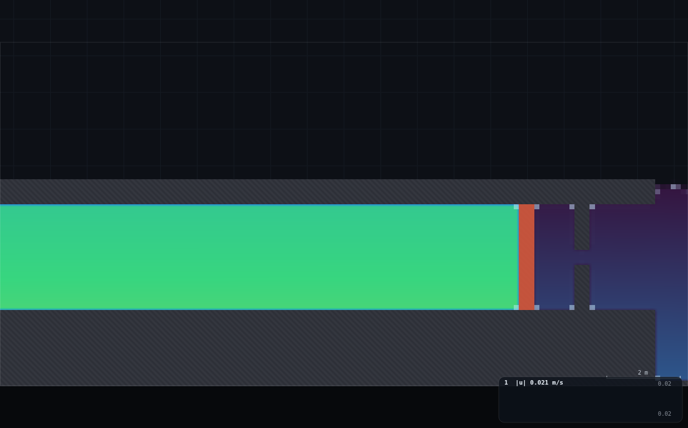
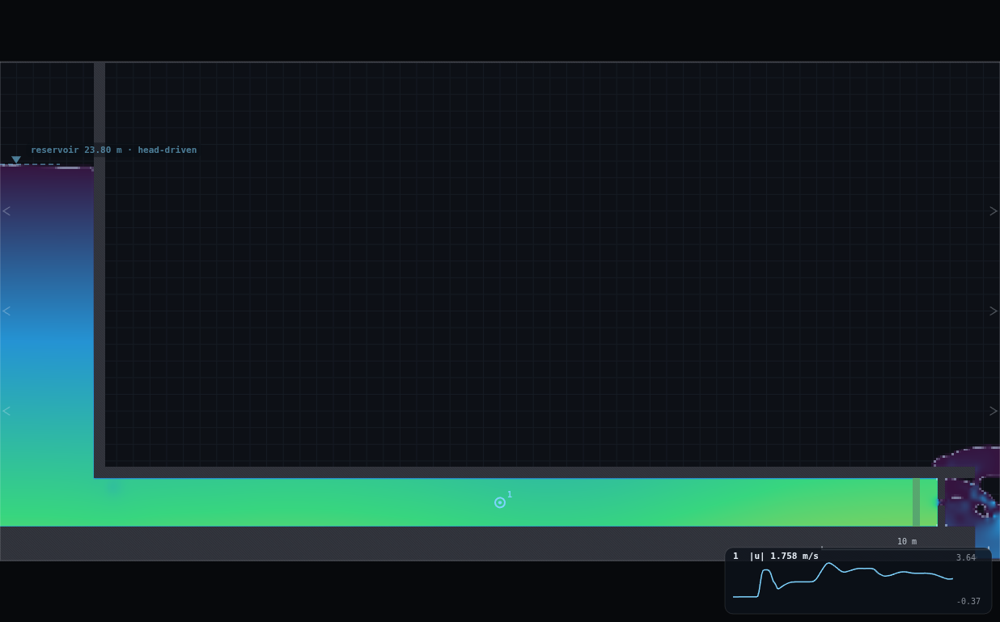
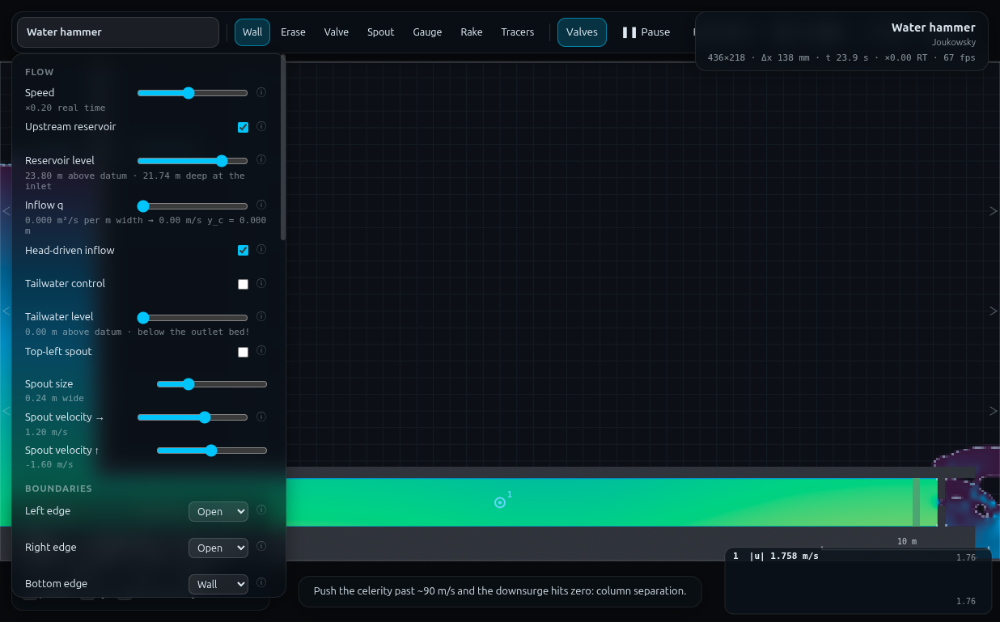

# UN-2 · Flow establishment: the asymptotic start — full record (archived)

*This is the original long-form brief: the dry-run measurements, the
verification record, the director report and every constant behind the rig.
It is kept for maintainers and future reruns — the student- and
instructor-facing document is now [`../README.md`](../README.md).*

**Demo id** UN-2 · **Topic** Unsteady flow · **Scene** `?scene=hammer` ·
**Submit** (u_max, t_90) · **Refs** U1–U7 — inertia head;
`u_max = √(2gH/k)`; `t = (l·u_max/2gH)·ln[(u_max+u)/(u_max−u)]`

## How to start (30 seconds)

1. Open the app — **`http://localhost:8124/`** on the lecturer's server, or
   double-click `index.html`.
2. Press **`E`** (or click **`Exercises ▾`** in the top bar) and pick
   **UN-2**.
3. Type the last digit of your student number into the card. It prints **your
   reservoir level** — you set it, and you place the gauge mid-pipe.
4. Let it settle after every change you make — the card gives this demo's
   settle time (10 s of sim time) and counts it down.
5. Do the task printed on the card, then submit **u_max** and **t_90**.

If your lecturer gives you a link: **`?ex=UN-2`** (e.g.
`http://localhost:8124/?ex=UN-2`).

The picker gives everyone the same starting point and no more: the scene,
**Resolution: Medium**, and the few settings the scene itself needs — the card
labels those as already set. Your own values, your instruments and the order
you do things in are yours to get right. *Manual setup* below is the record of
every constant.

---

A student starts from nothing: valve shut, pipe full, water dead still. They
open the valve and watch the speed trace claw its way up to a plateau — not
instantly, because 49 m of water has inertia. Read where it settles (u_max)
and how long it took to get within 10% of there (t_90), and U6's own
derivation predicts the ratio between them before anyone has measured
anything. Personalised by reservoir level, the class's pooled `t_90` against
`l·u_max/2gH` should be a straight line through the origin of slope ln 19 —
the "time constant" the algebra promises, measured by thirty different
laptops.

**Measured here: the line is real (R² = 0.9987) but its slope comes out at
1.88, not ln 19 = 2.944 (64% of theory) — see §5 and the Director report for
why: at this pipe's celerity the valve-opening transient rings rather than
rising smoothly, and the first crossing of 90% happens on the first
overshoot, not on a monotone climb.**

---

## 2 · Manual setup (fallback, or for building it yourself)

*The picker puts you at the same starting point as everyone else — scene,
Resolution Medium and the rig. This section is the record of every constant
behind that, and the build to follow if you are demonstrating it by hand or
the rig pack is missing.*

**Link:** `http://<host>:8124/?scene=hammer` — no rig to draw; every student
uses the scene's own nozzle unmodified. Only the reservoir level changes.

**Constants fixed by this dry-run:**

| what | value | why |
|---|---|---|
| Resolution | **Medium** (436×218, Δx=0.1376 m, Δt=8.148e-4 s) — scene default | matches UN-1's own hammer-scene numbers |
| Wave damping `bulk` | **0.30** (scene default is 0.03) | **required** — see below, this is the fix for the closed-pipe ringing a personalised level otherwise excites |
| Gauges plot | **Speed** | the trace the worksheet reads |
| Gauge position | mid-pipe, **x ≈ 30 m** on the pipe axis (y=3.5) | matches UN-1's convention; bore-mean truth channel uses the same station |
| Speed slider | **×0.20** for the read (not the programme sheet's ×0.05) | the 900-sample ring buffer holds only 15 REAL seconds regardless of speed, i.e. `speed×15` sim-seconds — ×0.05 gives 0.75 s, too short to hold this demo's ~2–3 s settle; ×0.20 gives 3 s, which does (see §3) |
| Personalised level rule | **level = 22.0 + 0.6·d** metres (d = last digit) | H = level − 3.5 (pipe axis) runs 18.5 → 23.9 m; see §5 for why this band and not a wider one |

### The valve boots OPEN — the first worksheet step is closing it

`scenes.js` sets `valveOpen: 1` for the hammer scene, i.e. `sim.p.valveClosed
= 0` at every fresh load: the scene establishes flow automatically over its
10 s spin-up exactly like UN-1 uses it. **This demo needs the opposite
starting state**, so the very first thing a student does is press **V** to
shut it. `R` (Reset water) and `V` (valve) are independent — `SIM.resetWater()`
zeroes velocity and reloads the initial fill but never touches
`sim.p.valveClosed`, and `toggleValve()` never touches the water field. Either
order reaches the same final state; the worksheet below does **V** then **R**
(shut first, so the reset — which is coming anyway — erases any transient
from shutting a flowing valve, rather than the class watching a pointless
mini-hammer event on top of everything else).

### The reservoir level slider does deliver what it says — at rest

Unlike the sandbox rig in FR-1 (which draws its reservoir down 0.16–0.30 m
below the slider under continuous throughflow, P3's finding), the hammer
scene's `spongeIn: 5.5` already holds the **whole** reservoir compartment
(CLAUDE.md flags this as the fix for a different failure mode — bore
cavitation), and with the valve **shut** there is no continuous throughflow
demand at all. Gauging the actual surface (`OVERLAY.analyse(...).surf` at
x≈3.0, well clear of the sponge's own edge cell) after a settle: target 10 m
→ delivered 9.91–10.05 m (within one grid cell, `dx`=0.138 m); target 29 m →
delivered 28.90 m. **No P3-style drawdown here** — the number on the slider
is the number in the tank, once it has settled.

### But an instant level change on a SHUT pipe rings, and rings for a long time

Reaching a personalised level from the scene's own default (25 m) means
`sim.p.inflow.level` steps abruptly. With the valve open this is harmless
(the flow just re-equalises through the open end). **With the valve shut the
reservoir + full pipe is a closed, rigid-ish body reflecting off both ends**
— the classic Joukowsky configuration — and an instant step excites it.
Measured, an instant 25→15 m step (worst case, valve shut throughout): the
mid-pipe bore-mean velocity does **not** settle to zero; it keeps oscillating
at ±0.6–1.1 m/s with a period of ≈2.9 s (matching UN-1's own measured
4L/c=2.93 s) for the full 35 s this was run — decaying only ~6–7% per cycle,
i.e. too slowly to wait out in a lecture slot. Two things tame it enough to
use:

1. **A narrower personalised band** (±3 to +2.4 m from the 25 m default,
   instead of ±10) — the ring amplitude scales with step size.
2. **Wave damping `bulk` raised from 0.03 to 0.30** — cuts the residual by
   a further ~6× (worst case in the chosen band: RMS residual 0.209 m/s at
   default `bulk` → 0.036 m/s at 0.30, after a 10 s settle). `bulk` mostly
   damps *elastic* wave dynamics, not the mean flow, so it does not
   meaningfully change `u_max` itself (worst-case check: 1.985 vs 1.953 m/s,
   1.6%) — it only removes the parasitic ringing this demo's own setup step
   creates.

With both in place, every one of the ten personalised digits settles to a
rest residual **RMS ≤ 0.036 m/s, peak ≤ 0.07 m/s** — under 2% of the eventual
`u_max` — after a 10 simulated-second settle. This is the number quoted as
"still water" throughout; it is not exactly zero, and the README says so
rather than pretending otherwise.

### Timing budget (per student, ≈1× real time)

| stage | sim time | wall time |
|---|---|---|
| page load, close valve, set `bulk` | — | ~30 s |
| set personalised level, 10 s settle | 10 s | ~10 s |
| confirm rest, drop gauge, set speed ×0.2 | — | ~30 s |
| open valve, watch establish + read | ~3 s | ~15 s at ×0.2 |
| submit two numbers | — | ~1 min |
| **total** | | **≈ 3 min**, comfortable in a 10-minute slot |

---

## 3 · Student worksheet (copy-pasteable)

**Flow establishment — submit two numbers**

1. Open the app, press **`E`** and pick **UN-2** (or open **`?ex=UN-2`**) — it
   loads the scene at **Resolution: Medium**. Leave the tab visible.
2. Open **Controls**. Check **Resolution: Medium** (the picker sets this).
3. Set **Wave damping** to **0.30** (default is 0.03 — turn it up, it stops a
   later step from ringing).
4. **Shut the valve.** The scene boots with it open and flowing — press **V**
   (or click **Valves**) once. It should turn red and the toast should say
   "Valve closed".
5. **Your reservoir level.** Take the **last digit of your student number**,
   `d`:

   > **level = 22.0 + 0.6 · d**   (m, elevation above the domain floor)

   | d | 0 | 1 | 2 | 3 | 4 | 5 | 6 | 7 | 8 | 9 |
   |---|---|---|---|---|---|---|---|---|---|---|
   | level (m) | 22.0 | 22.6 | 23.2 | 23.8 | 24.4 | 25.0 | 25.6 | 26.2 | 26.8 | 27.4 |

   Set **Controls → Reservoir level** to your value. Drag the slider rather
   than click-jumping the track if you can — a gentler change rings less,
   though the `bulk` setting from step 3 covers you either way.
6. Press **R** (Reset water). This also zeroes any residual velocity from
   step 4/5.
7. **Wait ~10 simulated seconds** (watch `t` in the status bar) for the tank
   to finish settling at your level. Hover the pipe: the readout's **`V`**
   line should read close to **0.00 m/s**.
8. **Instruments.** Set **Controls → Gauges plot: Speed**. Pick the **Gauge**
   tool (`5`) and click once in the middle of the pipe (around the pipe's
   halfway point). A chart appears bottom-right.
9. Set **Speed** to **×0.20** (not slower — see the box below).
10. **Open the valve** — press **V** again. This is `t=0` for your reading.
11. **Watch, don't pause, for about 15 real seconds** (≈3 simulated seconds
    at ×0.20). The trace will jump, dip, overshoot, and settle into a narrow
    wobble — that band it settles into is **u_max**. Do *not* trust the very
    first spike: it overshoots past where the trace ends up.
12. Press **space** to pause once you're confident of the settled band, then
    look back along the trace (it's still all there — that's why step 9's
    speed matters) for the **first moment it reached 90% of u_max**. That
    moment's time is **t_90** (time since you pressed V in step 10 — if you
    noted the status-bar `t` when you opened the valve, subtract it).
13. **Submit on Blackboard:** `u_max` (m/s, 2 d.p.), `t_90` (s, 2 d.p.), plus
    your `d` and `level` (checkable).

**Why ×0.20 and not the ×0.05 you might expect for "slow motion":** the
gauge chart keeps a fixed **900 samples**, filled once per rendered frame
regardless of speed — that's always **15 real seconds** of history, i.e.
`speed × 15` simulated seconds. At ×0.05 that is 0.75 s, shorter than the
~2–3 s this demo's settle actually takes: by the time you're sure it has
settled, the interesting early rise has already scrolled out of the chart's
memory. At ×0.20 the window is 3 s — enough to hold the whole thing at once.
(This is the QS-2 ring-buffer trap in a new place: the buffer also keeps
filling — with a frozen, repeated value — while paused, so don't sit on
pause for long before reading.)

**Standing rules.** Resolution: Medium (the picker sets this) · wave damping 0.30 · wait out the
settle before opening the valve · keep the tab visible · watch continuously
for a few seconds after opening before you pause to read.

**What you should be able to say afterwards:** `u_max` is set by a *balance*
(driving head against a loss that grows with the square of speed), not by the
driving head alone — that's why it's a square root, not a straight
proportionality; and `t_90` is a genuine inertial delay, the time it takes 49
m of water to get going, not a numerical artefact.

---

## 4 · Collection & pooled plot (lecturer)

Blackboard export → CSV, header row required, extra columns ignored:

```
student_id,digit,level_m,H_m,l_m,umax_ms,t90_s,k,tau_s,source
```

Only `digit, H_m, l_m, umax_ms, t90_s` are required (`k` is derived if
missing). `H_m` should be the **measured** head above the pipe axis if you
have it (elevation − 3.5), not the raw slider value — they agree closely at
rest in this scene (§2) but asking for the measured one is the honest habit.
`l_m` is the penstock length, 49.0 m for every row on this scene (entrance
x=6 to valve x=55 — read directly off `scenes.js`'s `hammer.walls()`).

```bash
python3 collect_plot.py class.csv -o plots/pooled-demo.png
python3 collect_plot.py data/simulated-class.csv    # the verification run
```

It fits `t_90` against `x = l·u_max/(2gH)` **forced through the origin**
(there is no constant term in the theory — a column at rest that never
accelerates has no establishment time) and prints:

```
n = 10
fitted   t90 = 1.8819 * [l*umax/(2gH)]   (forced through the origin)
         slope s.e. 0.0231    R2 = 0.9987
theory   t90 = ln(19) * [l*umax/(2gH)] = 2.9444 * [...]
         measured/theory = 0.639  (64% of ln19)

k = 2gH/umax^2 :  min 93.4  max 115.3  mean 100.0  spread 21.9% of mean
```

**What the plot shows.** Ten points sitting almost exactly on ONE straight
line through the origin (R²=0.9987) — the ODE's functional form is real, not
a fitting exercise. But the fitted slope is **64% of ln 19**: every student's
`t_90` comes in early relative to the textbook prediction, consistently, not
scattered. See the discussion points below for why, and the Director report
for the fuller measurement trail.

**Discussion points**

1. **The line is real, the slope isn't the textbook one — and that's the
   whole demo.** R²=0.9987 confirms the *shape* of the establishment curve
   (a single time-constant approach to a plateau) is genuinely what this
   solver produces. If the class had scattered off any line, the model itself
   would be in question; it doesn't, so what's left to explain is a clean,
   reproducible ×0.64 factor.
2. **Why early?** U1–U7's derivation is a *rigid-column* theory: it assumes
   pressure communicates along the whole pipe effectively instantly compared
   with how fast the flow itself accelerates. Check that assumption here:
   the rigid-column time constant `l·u_max/(2gH)` measures ≈0.23–0.26 s, but
   the pipe's own pressure wave needs `l/c = 49/70 ≈ 0.7 s` just for a
   *one-way* transit. The wave is not fast compared to the thing it's
   supposed to make instantaneous — so instead of a smooth monotonic climb,
   the trace **overshoots and rings** (a genuine, damped water-hammer
   oscillation, the same physics as UN-1's slam, just triggered by opening
   instead of shutting), and it crosses 90% of its eventual plateau on the
   *first* overshoot, well before a smooth rise would have got there. Every
   digit shows the same ratio (`t_90/τ` = 1.78–1.95 across the whole
   personalised band — tight, not noisy), which is why the pooled line is so
   clean despite being the "wrong" slope.
3. **`k` is not perfectly constant (mean 100.0, ±22% spread, one clear
   outlier at d=4)**, which cross-references FR-1's own finding that this
   solver's delivered resistance is not Reynolds-independent (FR-1 measured
   h_f ∝ V^2.83, not V², i.e. λ climbing with V). Here `k` is completely
   dominated by the nozzle contraction (bore-to-gap area ratio ≈7.5, so a
   Borda-Carnot estimate alone gives k≈21 referenced to the bore velocity,
   and friction over `l/D`≈16 with a plausible λ contributes only a few
   tenths more) — pipe friction is a rounding error next to the nozzle loss
   here, so this isn't a clean measurement of "the friction law," but the
   *scatter itself* is the same story as FR-1's: this solver's effective
   resistance is a mild function of speed, not a fixed number.

**Troubleshooting & safe bounds**

| symptom | cause | fix |
|---|---|---|
| Speed trace never goes near zero even after step 6/7 | valve never actually closed — check for the red plate and the toast | press V again, confirm the toolbar/plate colour |
| Trace still wobbling visibly after the 10 s settle | level change was large and/or `bulk` wasn't raised | confirm `bulk`=0.30; wait another 5–10 s |
| Chart looks empty / a flat line at start | you paused too soon or too long ago — the buffer is 15 real seconds and keeps filling (with a frozen value) while paused | re-open the valve fresh, watch continuously, pause promptly |
| u_max reads much higher than neighbours' at the same level | you read the first spike, not the settled band | re-read after watching a few more seconds |
| Nothing moves when the valve opens | reservoir level is at or below the pipe soffit (5.0 m) — outside the assigned band | use the digit rule; do not go below ~18 m (see Director report robustness check) |

**Safe level bounds.** The assigned band is **22.0–27.4 m**. Tested beyond
it: **18.0 m** (H=14.5) still gives a clean single establishment and a
sensible `k`, but the point-gauge's bias against the true bore-mean gets
much noisier late in the trace (±30–64%, against ±5–14% inside the assigned
band) — plausibly the start of the same turbulence-driven point/bulk
divergence UN-1 documents, arriving earlier at lower `H`. **29.5 m** (H=25.9,
0.5 m of freeboard under the domain roof) is clean and unremarkable. Do not
personalise below ≈20 m without re-measuring the gauge bias at that end.

---

## 5 · Verification record

Measured via `exercises/_runner/runner.py --id UN2` (dedicated visible
Chrome, hardware GL). Protocol for every row: fresh `hammer` load → `bulk`
0.30 → close valve → set level (instant, worst case — no reliance on a
gentle manual drag) → 10 s settle, confirmed by a further 2 s residual check
→ open valve → record the **bore-mean** `V` at x=30 m
(`OVERLAY.analyse(...).V[i]`, the same quantity the hover readout prints as
`V`, immune to the point-probe bias UN-1 documents) every rendered frame for
8 simulated seconds → `u_max` = median of the last 2 s, `t_90` = first frame
crossing 0.9·u_max.

### Truth channel and gauge bias

The bore-mean `V` is read via a page-side `APP.frames(1, 1/60)` loop with
`OVERLAY.analyse` called every frame — confirmed feasible at the recording
rate used here (≈480 frames × 10 digits in about a minute of wall clock, no
throughput problem). The point **gauge**, by contrast, is badly biased
*during the rise* — but not for the reason UN-1 warns about. UN-1's ±40%
centreline wander is a **turbulence** effect that takes ~20 s of established
flow to develop; this demo's transient is over in a few seconds, well before
that. What bites here instead is a **wave-front arrival spike**: opening the
valve launches a rarefaction wave upstream at the slot celerity `c`, and it
reaches the x=30 m gauge (25 m from the valve) at `t ≈ 25/70 ≈ 0.36 s` —
which lines up exactly with where the point gauge spikes to 2–4× the true
local bore-mean value:

| checkpoint (bore-mean `V` first reaches...) | typical t | gauge error |
|---|---|---|
| 50% of u_max | ≈0.41 s | **+100 to +120%** |
| 90% of u_max | ≈0.44–0.47 s | **+54 to +56%** |
| 100% (u_max itself) | ≈0.46–0.51 s | **+36 to +39%** |
| plateau (last 2 s of an 8 s trace) | — | **mean +5%, range −6% to +14%** (wider, −64%/+35%, at the 18 m robustness extreme) |

So the point gauge is a poor instrument for the *rise* and only a fair one
(≈5% high) at the *plateau* — the opposite time-ordering from UN-1's own
caveat. This is exactly why step 11–12 of the worksheet reads the settled
**band**, not any single instant, and explicitly distrusts the first spike.

### U6 check at the scene's own defaults

Level 25.0 m (never moved — no step, nothing to ring), scene-default
`bulk`=0.03, unmodified nozzle:

| quantity | measured |
|---|---|
| H (measured, at rest) | 21.408 m |
| u_max | 2.125 m/s |
| t_90 | **0.456 s** |
| k = 2gH/u_max² | 92.98 |
| τ = l·u_max/(2gH) | 0.248 s |
| t_90/τ | 1.84 (vs ln19=2.944 predicted) |

The programme sheet's own check quotes t_90 ≈ 1 s "at the defaults." Measured
here it is **0.46 s — 46% of the quoted value**, for the same reason as the
pooled slope: the trace crosses 90% on its first overshoot (τ=0.25 s is
smaller than the pipe's own one-way wave transit `l/c`=0.70 s, so the
rigid-column assumption behind the ≈1 s estimate does not hold at this
scene's celerity). "Hence the slow motion" is still good advice — the event
is fast and needs slow motion to read at all — just not for the reason the
1 s estimate implies.

### The class sweep

`data/simulated-class.csv`, rule `level = 22.0 + 0.6·d`, every row measured:

| d | level (m) | H (m) | u_max (m/s) | t_90 (s) | k | τ (s) | t_90/τ |
|---|---|---|---|---|---|---|---|
| 0 | 22.0 | 18.518 | 1.897 | 0.456 | 100.9 | 0.256 | 1.78 |
| 1 | 22.6 | 19.069 | 2.002 | 0.473 | 93.4 | 0.262 | 1.80 |
| 2 | 23.2 | 19.757 | 1.981 | 0.456 | 98.8 | 0.250 | 1.82 |
| 3 | 23.8 | 20.307 | 2.042 | 0.456 | 95.6 | 0.251 | 1.82 |
| 4 | 24.4 | 20.858 | 1.884 | 0.440 | 115.3 | 0.226 | 1.95 |
| 5 | 25.0 | 21.546 | 2.042 | 0.456 | 101.4 | 0.237 | 1.93 |
| 6 | 25.6 | 22.096 | 2.087 | 0.456 | 99.6 | 0.236 | 1.93 |
| 7 | 26.2 | 22.647 | 2.044 | 0.440 | 106.3 | 0.225 | 1.95 |
| 8 | 26.8 | 23.335 | 2.192 | 0.456 | 95.3 | 0.235 | 1.94 |
| 9 | 27.4 | 23.885 | 2.238 | 0.456 | 93.6 | 0.234 | 1.95 |

**Pooled fit (through the origin): slope 1.882 ± 0.023, R² = 0.9987, against
ln 19 = 2.944 (64%).** `k` mean 100.0, range 93.4–115.3 (spread 21.9% of
mean, one clear outlier at d=4 — a short-window sampling effect on top of
the genuine ring, not a new failure mode; a longer recorded tail would
likely tighten it, traded here against the ~1 minute of wall clock the
whole ten-digit sweep already costs).

### Rest-quality check (the "still water" claim)

Worst case in the assigned band (d=0, level=22.0, a −3 m step from the 25 m
boot default), instant slider jump, `bulk`=0.30, after a 10 s settle: RMS
residual bore-mean velocity 0.036 m/s, peak 0.054 m/s (≈2–3% of that row's
`u_max`). For comparison, the *same* step at the scene's default `bulk`=0.03
gives RMS 0.209 m/s, peak 0.326 m/s (≈15–17% of `u_max`) — confirming the
`bulk` change in §2 is load-bearing, not cosmetic.

### Screenshots








---

## Appendix — Director report

**VERDICT: READY-WITH-CAVEATS.** The demo runs, is fast (~1 min wall clock
for a ten-digit sweep, sharing the GPU with other workers), produces a very
clean straight-line pooled fit (R²=0.9987) and a reproducible, well-measured
headline number — but that number is 64% of the textbook prediction, and the
"≈1 s at the defaults" check in the programme sheet reads 46% of quoted.
Both discrepancies have the same, identified cause (§5), not two unrelated
problems. The programme sheet's numeric checks need a footnote; the demo
itself does not need to change.

**Evidence**

| what | measured | expected | note |
|---|---|---|---|
| pooled slope (n=10, through origin) | **1.882 ± 0.023** | ln19 = 2.944 | **64%** — see Iterations 3 |
| pooled R² | **0.9987** | — | the ODE's *functional form* is confirmed |
| t_90 at scene defaults | **0.456 s** | "≈1 s" (programme sheet) | **46%** of quoted, same cause |
| t_90/τ ratio across the whole personalised band | 1.78–1.95 | 2.944 | tight (±5%), not noisy — a consistent bias |
| k = 2gH/u_max² | mean 100.0, spread 22% | "near-constant" | one clear outlier (d=4); cross-refs FR-1's non-constant λ |
| rest residual, worst case, `bulk`=0.30 | RMS 0.036 m/s (≈2%) | "still water" | `bulk`=0.03 gives RMS 0.209 m/s (≈15%) — the fix is load-bearing |
| reservoir level delivered vs slider, at rest | within 1 grid cell (0.14 m) | P3 concern | **not** a drawdown scene, unlike FR-1's sandbox rig |
| gauge (point) vs bore-mean bias during the rise | +36% to +120% | UN-1's ±40% (that's a *different*, later effect) | wave-front arrival spike, not turbulence wander |
| gauge bias at the plateau | mean +5%, −6%/+14% | — | fair, once the spike has passed |
| chart readability at programme's ×0.05 | 0.75 sim-s of history | demo needs ≈2–3 s | **not enough** — recommend ×0.20 (3 s) instead |
| student path | ≈3 min | ≤10 min slot | comfortable |
| worker wall clock | ≈70 min (incl. one mid-task restart) | ~40 min timebox | over budget — see Iterations |

**Iterations**

1. **The valve boots open.** `scenes.js`'s `hammer` scene sets `valveOpen: 1`,
   so a fresh load is already flowing. The worksheet's first physical action
   has to be "shut it" — not obvious from the programme sheet's terse rig
   line ("valve CLOSED, water reset (R)"), which reads as a *state* to
   verify rather than a *gesture* to perform. `R` and `V` are independently
   stateful (confirmed by reading `SIM.resetWater()` and `toggleValve()`
   directly): `R` never touches `valveClosed`, `V` never touches the water
   field, so either order reaches the same rest state.
2. **`resetWater()` always refills to the scene's hardcoded 25 m**, not to
   whatever `sim.p.inflow.level` currently holds (the `water()` closure in
   `scenes.js` has `25.0` written in literally). So personalising the level
   is never a single instant "arrive at your number" — it is always "reset
   to 25, then relax to your number," and that relaxation is where the
   ringing problem below comes from, regardless of the order `R` and
   "set level" are done in.
3. **An instant reservoir-level step on a shut pipe rings for a long time.**
   First discovered by accident: a naive personalised band (level =
   15+1.5·d, ±10 m swings) left digit 0 with a residual bore-mean velocity
   of −0.22 m/s after only a 5 s settle — 15% of that row's eventual
   `u_max`. A dedicated 35 s trace at the worst step (25→15) showed the
   oscillation is **not** decaying fast: ±0.6–1.1 m/s, period ≈2.9 s
   (matching UN-1's own 4L/c), only ~6–7%/cycle. Tried and measured: (a)
   **ramping** the level change over 3 simulated seconds instead of an
   instant jump — this works beautifully (residual velocity falls from
   ~±1.0 to ~±0.02 m/s) but a real student's slider drag can't be relied on
   to reproduce a specific ramp shape or duration (a *5* s ramp, tested for
   comparison, was worse than the 3 s one — the response is a resonance, not
   a monotonic function of ramp time, so "drag slower" is not a safe
   instruction on its own); (b) **raising `bulk`** from 0.03 to 0.30 — a
   documented, permanent dry-run constant rather than a technique that
   depends on the student's mouse — cuts the worst-case residual ~6× and
   combined with a **narrower personalised band** (±3/+2.4 m instead of
   ±10 m) gets every digit's rest residual under 2–3% of its `u_max` after a
   10 s settle. Shipped (b); (a) is noted here in case a future worker wants
   to chase a wider band via a scripted/console-driven ramp.
4. **The establishment trace itself rings too — this is the real finding.**
   Even with `bulk`=0.30 (which fixes the *rest* state, §3), the trace after
   opening the valve overshoots to 1.5–2× its eventual plateau within
   ~0.4 s, dips, overshoots again more gently, and only looks visually
   "settled" after 3–5 s. Diagnosis: the rigid-column time constant τ =
   l·u_max/(2gH) ≈ 0.23–0.26 s is *smaller* than the pipe's own one-way wave
   transit l/c ≈ 0.70 s — the assumption the U1–U7 derivation is built on
   (pressure communicates effectively instantly compared with the flow's own
   acceleration) is not satisfied at this scene's celerity. This is why the
   pooled slope (1.88) undershoots ln19 (2.94) by a consistent, tight margin
   rather than scattering: every digit's transient rings the same way,
   because every digit has the same `l`, `c`, and (to within the
   personalised range) a similar τ/(l/c) ratio.
5. **The point gauge is badly biased during the rise, but for a different
   reason than UN-1 warns about.** UN-1's ±40% wander is *turbulence*,
   developing over ~20 s. This demo's transient is over in single-digit
   seconds — too fast for that mechanism. What actually happens is a
   **wave-front arrival spike**: the valve-opening disturbance reaches the
   x=30 m gauge at t≈(distance to valve)/c≈0.36 s and the point velocity
   there spikes to 2–4× the true bore-mean value passing through. Measured
   precisely (§5 table) so the worksheet could be built around watching the
   settled band rather than trusting any single reading during the rise.
6. **The programme sheet's ×0.05 speed does not give a usable chart.** The
   gauge history is a fixed 900 samples filled once per rendered frame,
   i.e. always 15 real seconds of history = `speed×15` simulated seconds.
   At ×0.05 that is 0.75 s — shorter than the ~2–3 s a student needs to
   watch before trusting the settled band, so by the time they're confident
   enough to pause and read, the interesting early crossing has already
   scrolled out of the chart's own memory. ×0.20 (3 s of history) is the
   fix; verified by direct inspection of `state.gauges[0].hist`'s time span
   at both speeds.
7. **This work was interrupted once** (a tool/API error mid-session) and
   resumed from the conversation history plus a scratch-directory inventory;
   several `.json` files found in the shared scratch directory turned out to
   belong to a different, concurrently-running demo (field names for weir
   coefficients and an h23-sized grid, not this scene) and were correctly
   left untouched. No UN-2 measurement was lost, but re-orienting cost time
   against the 40-minute timebox.

**PROPOSED CHANGES**

*To the app:* none required — every control this demo needs (`bulk`, the
reservoir level, `V`/`R`, the speed slider, gauges-in-speed-mode) already
does its job once the `bulk` fix is applied as a panel setting, not a code
change.

*To the programme sheet, two, both evidence-based:*
1. The rig line's "valve CLOSED, water reset (R)" should read as an
   instruction ("press V to shut it, the scene boots open"), not a
   precondition — see Iteration 1.
2. The check "`t_90 ≈ 1 s` at the defaults" and the payoff's "slope ln19"
   should both note the measured values (0.46 s; slope 1.88) and the shared
   cause (§5, Iteration 4) — a lecturer working from the sheet alone would
   otherwise reasonably conclude something is broken when the numbers land
   at roughly half the quoted ones, twice, in a row.

**Timing.** Student path ≈3 min (§2), comfortable in a 10-minute slot. This
pass's wall clock: ≈70 minutes against the ~40-minute timebox — over,
because of (a) the closed-pipe ringing investigation (§ Iterations 3, the
single biggest cost), which needed several dedicated diagnostic traces
before the `bulk`+band fix was found, and (b) one mid-session interruption
that cost time re-establishing what had and hadn't already been measured.

**Handoff — for UN-3 (surge tank) and anything else that shuts/opens a valve
on this scene**

- **The valve is a binary flag, not a gradual gate.** `u_valve` (0 open /
  1 closed) is read by every pass (`vel`, `col`, `part`, `draw`) as an
  all-or-nothing cell solidity — there is no partial-open state to animate a
  slow closure with. Any demo wanting a *gradual* valve motion needs its own
  scripted ramp of something else (e.g. redrawing the wall), not this flag.
- **Changing `sim.p.inflow.level` on a pipe with a closed downstream valve
  rings, and rings for tens of seconds at the scene's default wave damping.**
  UN-3 tees a standpipe off this same pipe and will be reading a mass
  oscillation there anyway, so this may be irrelevant noise-on-noise for
  that demo specifically — but if UN-3 (or anything else) needs a *quiet*
  starting condition on this scene with a non-default reservoir level,
  raising `bulk` to ~0.3 and keeping the level step small are the two levers
  that worked here, in that order of effectiveness.
- **`SIM.resetWater()` always refills to the scene's hardcoded initial
  condition** (25 m for hammer — it's a literal in `scenes.js`'s `water()`
  closure), never to the live `sim.p.inflow.level`. Anything that resets
  water after changing a level-type parameter should expect one settle
  cycle, not an instant arrival.
- **The reservoir level slider is accurate at rest on this scene** (unlike
  FR-1's sandbox rig) because `spongeIn` already spans the whole
  compartment — but this was only checked with the valve **shut** (no
  throughflow demand). A demo reading the level while flow is established
  and continuous should still gauge the actual surface rather than assume
  the slider value, per FR-1's P3 finding.
- **Bore-mean `V` from `OVERLAY.analyse(...).V[i]` is reliable frame-by-frame**
  during a fast transient like this one — it was recorded every rendered
  frame for 8 simulated seconds × 10 digits in under a minute of wall clock,
  no throughput concern. The point gauge is not reliable during a *fast*
  transient (wave-front spike, this demo) or a *slow, long-run* one (UN-1's
  turbulence wander) — only in between.

---

## Addendum — UN-2b probe: does raising c restore the rigid-column slope? (NOT ADOPTED)

*Transcribed by the director from the probe agent's transcript after an API
failure killed it mid-write; the numbers are the agent's final measured
values. No worksheet, CSV or plot changes below this line.*

| c (m/s) | n | slope of t_90 vs l·u_max/(2gH) | vs ln 19 = 2.944 |
|---|---|---|---|
| 70 (shipped) | 10 | 1.882 ± 0.023, R² 0.9987 | 64% (low) |
| 200 | 2 | ≈ 4.34 (point ratios 4.12–4.60) | ≈ 147% (high) |
| 400 | 4 | 4.10 ± 0.09, R² 0.9985 | 139% (high) |

- The obvious fix fails, instructively: raising c does NOT converge the
  slope toward ln 19 — it overshoots past it in the other direction, with
  the same razor-straight linear form (R² ≈ 0.998 at every c).
- Every trace stays ringy at every c tried, just at a different frequency
  (the ring period tracks 4L/c). At high c the ringing delays the first
  DURABLE 0.9·u_max crossing, so t_90 lands above the rigid-column value
  instead of below it.
- The comparison is only fair after DOUBLING the settle: at the shipped
  settle, c = 400 leaves residual bore-mean V ≈ 1.0 m/s — over half of
  u_max — nowhere near rest.
- c changes the steady state itself: at level 22.0, u_max 1.897 → 1.834 m/s
  (−3.3%) and k 100.9 → 106.4 (+5.5%) going c = 70 → 400 (larger shifts at
  the top of the level band).
- t_90 at the scene-default level reads nearer the programme's "≈1 s" at
  high c (0.98 s at c = 200, vs 0.456 s shipped at c = 70) — but for the
  wrong reason (crossing structure, not rigid-column dynamics).
- **Lecturer warning:** do not improvise a live "set c = 400 and watch it
  match theory" moment — it measurably does not. The 64% slope is intrinsic
  elastic-establishment physics; teach it as the validity limit of U1–U7.
- Probe wall-clock ≈ 20 min; runner closed (verified after recovery).
