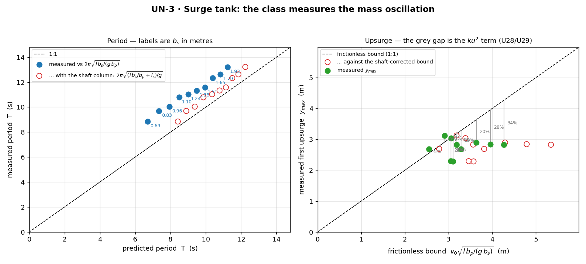

# UN-3 · Surge tank: measure y_max against the ODE

A standpipe is teed into the penstock just upstream of the valve. Establish
the flow and slam the valve, and the pipe's momentum has nowhere to go but up
the shaft: what follows is a **mass oscillation** — upsurge, downsurge and a
friction decay — with a period of about ten seconds and an amplitude of about
three metres. Two numbers come off one gauge trace. Pooled, the class's
periods trace the ODE's √b_s law, and every measured y_max sits **below** the
frictionless bound: the shortfall is the ku² term.

**Open it:** press **E** in the [app](https://barneydobson.github.io/hydraulician/)
and pick **UN-3**, or use the direct link
[`?ex=UN-3`](https://barneydobson.github.io/hydraulician/?ex=UN-3).
How to run any exercise: see the [teaching pack index](../INDEX.md#running-an-exercise).

## Theory

Take the penstock water as a rigid column and the shaft as a frictionless
U-tube, and the surge-tank ODE gives a period and an upsurge:

    T     = 2π·√(l·b_s / (g·b_p))
    y_max = v₀·√(l·b_p / (g·b_s))

l is the penstock length, b_p the bore and b_s the shaft width. That version
puts all the inertia in the penstock and none in the shaft; adding the shaft's
own water column l_s to the oscillating mass gives

    T = 2π·√((l·b_s/b_p + l_s) / g)

Measured off this rig: **l = 47.0 m** (reservoir face at x = 6.0 to the tee at
x = 53.0), bore **b_p = 2.890 m**, and the shaft stands on the pipe soffit at
**y_s = 5.57 m**, so l_s = rest level − 5.57, about 6.2 m. With the reservoir
at 12.0 m the shaft rests near 11.8 m and v₀ ≈ 1 m/s.

## Your standpipe width

**d** is the **last digit of your student number** — your lecturer will
explain the assignment in class. Your shaft is **b_s = 0.70 + 0.14·d** metres
wide. The mask quantises it to whole cells, so **submit the delivered width**,
not the target; the wall centrelines are x = 53.0 ∓ (b_s/2 + 0.15):

| d | 0 | 1 | 2 | 3 | 4 | 5 | 6 | 7 | 8 | 9 |
|---|---|---|---|---|---|---|---|---|---|---|
| **b_s target (m)** | 0.70 | 0.84 | 0.98 | 1.12 | 1.26 | 1.40 | 1.54 | 1.68 | 1.82 | 1.96 |
| **b_s delivered (m)** | 0.688 | 0.826 | 0.963 | 1.101 | 1.238 | 1.376 | 1.514 | 1.651 | 1.789 | 1.927 |
| **x_left (m)** | 52.50 | 52.43 | 52.36 | 52.29 | 52.22 | 52.15 | 52.08 | 52.01 | 51.94 | 51.87 |
| **x_right (m)** | 53.50 | 53.57 | 53.64 | 53.71 | 53.78 | 53.85 | 53.92 | 53.99 | 54.06 | 54.13 |

## What to do

1. The rig arrives built — nozzle fitted, tee punched through the pipe soffit
   at x = 53.0, shaft standing at **b_s = 0.98 m**, which is d = 2. If that is
   your digit, go to step 3.
2. Otherwise resize it. `Z` twice lifts the two shipped shaft walls; Erase
   (`2`) the tee again at x = 53.0, from z = 4.9 to z = 6.6, with the brush
   widened to your own b_s; then Wall (`1`), Shift held, draw both walls from
   z = 4.9 up to z = 29.6 at your **x_left** and **x_right**. Erase first and
   wall second — the later stroke wins, and that is what seals the shaft
   against its own hole.
3. Press `R` and let it reach steady state — about **60 s**; the card counts
   it down. The tank has to drain from its 25 m fill to 12.0 m and the shaft
   has to fill.
4. Hover mid-pipe for the bore-mean **V**, which is your **v₀**, then place a
   Gauge (`5`) inside the shaft, a metre or so above the pipe. Its **d** trace
   is the water standing in your shaft; note the steady value as **h₀**.
5. Press `V` to slam the valve and let it swing at least twice — a decaying
   wave, not a square wave. Pause (**space**) promptly and read **y_max** =
   first crest − h₀ (the first crest is the biggest) and **T** = crest to
   crest. Submit **b_s (delivered), v₀, y_max, T**.

## For the instructor — pooling the class

Collect one row per student
(`student_id,digit,bs_m,v0_ms,ymax_m,T_s,rest_level_m`), export the CSV and
run:

```bash
python3 collect_plot.py class.csv                # -> plots/pooled-demo.png
python3 collect_plot.py data/simulated-class.csv # the shipped dry-run class
```

`rest_level_m` — the student's own h₀ + 2.06 m — is optional, and worth
asking for because it enables the shaft-inertia correction. The script plots
measured period against 2π√(l·b_s/(g·b_p)) on the left, with the
shaft-corrected prediction as open markers, and measured y_max against the
frictionless bound on the right, each point's shortfall drawn as a stem: that
gap is the ku² term the U28/U29 follow-up asks students to integrate.



### Discussion points

- **The offset is the tank's own weight of water.** The blue points sit above
  1:1 until the shaft column l_s joins the oscillating mass, and then they
  collapse onto it. That is precisely why real surge tanks are built short and
  fat: a tall narrow shaft is mostly its own inertia. Ask what the correction
  would be for a tank ten times the pipe's area.
- **The tank did not abolish the water hammer.** Switch Gauges plot to Head
  and slam again: the roughly 3 s Joukowsky wave is still there, swinging
  about 6 m each way, because this tank's area is only 0.33 of the pipe's,
  far too small to reflect the pressure wave (a real one runs 10–50). What
  the tank has done is stop the pipe having to absorb the flow's momentum,
  which is the other half of its job — and it is why this demo reads the
  Depth channel, where the free
  surface filters that wave out.

The full verification record — the ten-width ladder, the containment
arithmetic behind the 12.0 m reservoir, the wave-damping decision, the seal
audit, safe bounds and troubleshooting — is kept locally, out of version control, at
`exercises/UN-3-surge-tank/_archive/README-full.md`.
