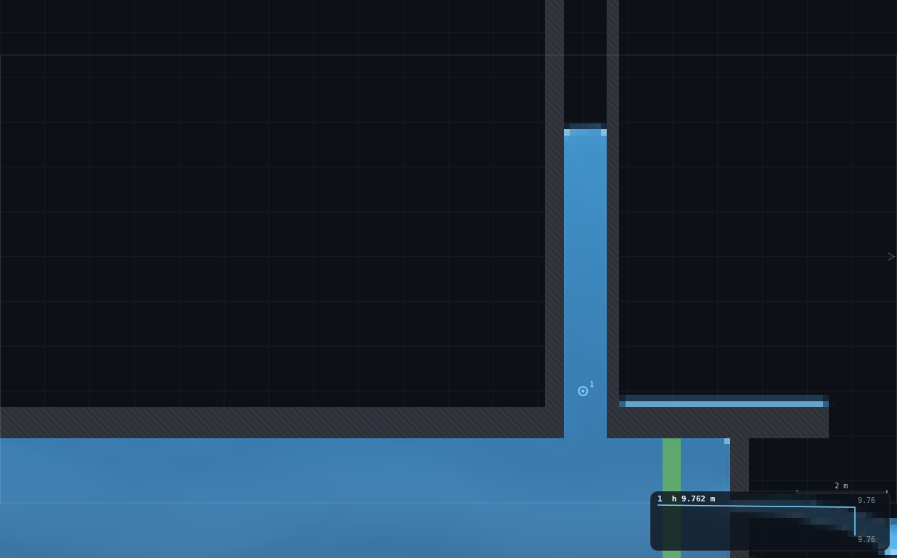
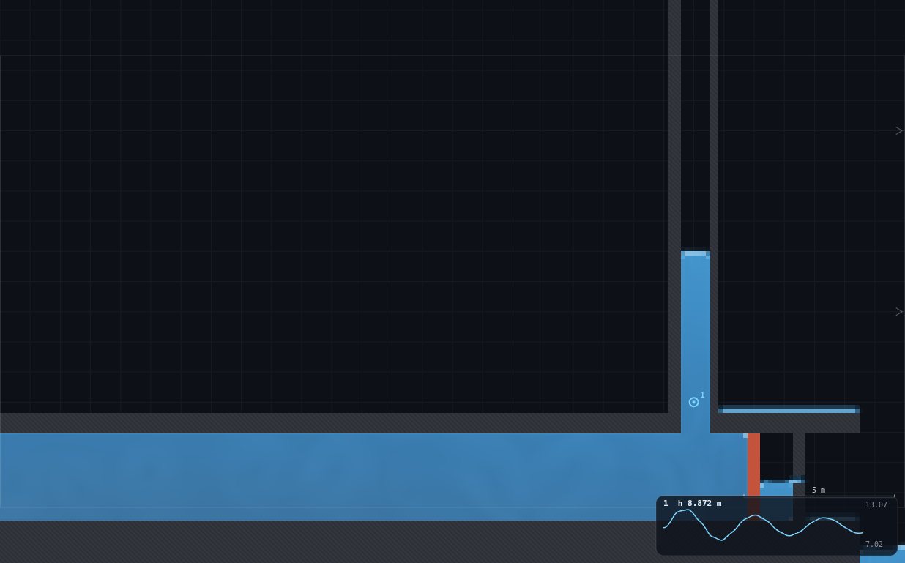
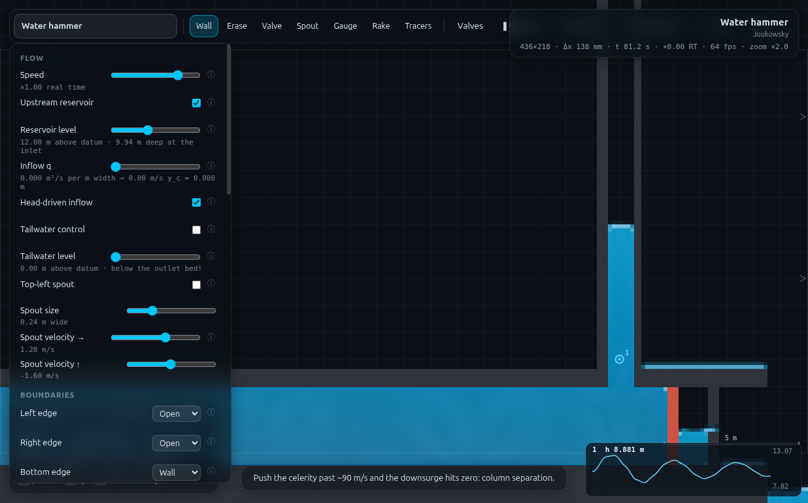

# UN-3 · Surge tank: measure y_max against the ODE

**Demo id** UN-3 · **Topic** Unsteady flow · **Scene** `?scene=hammer` + a drawn
standpipe · **Submit** (b_s, y_max, T) · **Refs** U23–U29 — the surge-tank ODE
and its trial-solved upsurge

## How to start (30 seconds)

1. Open the app — **`http://localhost:8124/`** on the lecturer's server, or
   double-click `index.html`.
2. Press **`E`** (or click **`Exercises ▾`** in the top bar) and pick
   **UN-3**.
3. Type the last digit of your student number into the card. It prints **your
   standpipe width** (b_s = 0.70 + 0.14·d m) — you draw it, and you submit the
   width the grid actually delivered.
4. Let it settle after every change you make — the card gives this demo's
   settle time (60 s of sim time) and counts it down.
5. Do the task printed on the card, then submit **b_s**, **y_max** and **T**.

If your lecturer gives you a link: **`?ex=UN-3`** (e.g.
`http://localhost:8124/?ex=UN-3`).

The picker gives everyone the same starting point and no more: the scene,
**Resolution: Medium**, the rig geometry, and the few settings without which
the rig is not a working rig — the card labels those as already set. Your own
values, your instruments and the order you do things in are yours to get
right. If your build ships without the rig pack the card says so; then draw it
by hand from *Manual setup* below.

---

Every student tees their own standpipe into the penstock just upstream of the
valve, establishes the flow, and slams the valve. The pipe's momentum has
nowhere to go but up the shaft, and what follows is a **mass oscillation** —
upsurge, downsurge, and a friction decay — with a period of about ten seconds
and an amplitude of about three metres. Two numbers come off one gauge trace.
Pooled, the class's periods trace the ODE's √b_s law, and every measured y_max
sits **below** the frictionless bound: the shortfall is the `ku²` term, and
integrating U28/U29 to account for it quantitatively is the follow-up sheet.

Measured here: **ten widths, T = 8.85 → 13.22 s, matching
2π√((l·b_s/b_p + l_s)/g) to +6.8% mean**, and **y_max 2 – 47% below the
frictionless bound**, with the gap closing as the shaft widens.


---

## 1 · Manual setup (fallback, or for building it yourself)

*The picker puts you at the same starting point as everyone else — scene,
Resolution Medium and the rig. This section is the record of every constant
behind that, and the build to follow if you are demonstrating it by hand or
the rig pack is missing.*

**Link:** `index.html?scene=hammer`. There is a rig to build — three strokes —
and **two panel settings that must be changed from the scene defaults**.

### Constants fixed by the dry-run

| setting | value | why |
|---|---|---|
| Resolution | **Medium** (436 × 218, Δx = 0.1376 m) | the shaft width and the nozzle are both quantised to whole cells, so resolution *is* part of the rig |
| **Reservoir level** | **12.0 m** (scene default is 25.0) | **load-bearing** — see the containment arithmetic below |
| **Gauges plot** | **Depth** (default is Head) | **load-bearing** — the head channel carries the Joukowsky ringing; the depth channel is the free surface |
| Nozzle gap | **0.28 m** (UN-1's rung 2, two cells) | fixes v₀ ≈ 0.95–1.05 m/s for the whole class |
| Slot celerity c | 70 m/s (scene default) | untouched |
| Wave damping `bulk` | **0.03 (scene default — do NOT raise it)** | see §4; UN-2 raises this to 0.30, and here that would be wrong |
| Speed slider | **×2** for the read (not slow motion) | the 900-sample ring buffer holds 15 **real** seconds = `speed × 15` sim-seconds; two cycles of a 13 s period need 26 s |
| Settle | 10 s scene spin-up **+ 50 s** | the reservoir has to drain from its hard-coded 25 m fill down to 12 m |

### Geometry datums (measured off the mask, not off `scenes.js`)

| quantity | value |
|---|---|
| bore `b_p` | **2.890 m** (21 cells; the drawn 3.0 m rasterises down) |
| penstock length `l` | **47.0 m** — reservoir wall face **x = 6.0** to the standpipe centreline **x = 53.0** |
| valve upstream face | x = 54.70 (the tee is 1.75 m **upstream** of it, as it must be) |
| shaft base `y_s` | **5.57 m** — the top face of the pipe soffit |
| shaft water column `l_s` | ≈ **6.2 m** at rest (rest level 11.8 m − 5.57 m) |

**The `l` convention.** `l` is the *penstock* length: from the reservoir face to
the tee, the column of water that actually decelerates when the valve shuts.
The 1.75 m of dead pipe between the tee and the valve takes no part in the
oscillation, and the reservoir compartment upstream of x = 6.0 is wide enough
that its own inertia is negligible. Checked against the absolute period: with
`l` = 47.0 m the ten measured periods come out **+23% high** against the
textbook formula and **+6.8%** against the same formula with the shaft's own
water column added (§5). Using `l` = 49 m (UN-2's entrance-to-valve convention)
would move that only to +20%/+5% — the residual is the shaft, not the datum.

### The standpipe build card

Three strokes, in this order. Order matters: `rasterise()` re-stamps scene walls
first and then user segments **in order**, so a wall drawn after an erase always
wins — which is exactly what seals the shaft against its own hole.

1. **Erase a hole in the pipe soffit.** Erase tool, a short vertical stroke at
   **x = 53.0** from **y = 4.9 to y = 6.6**, brush widened to your `b_s`.
2. **Left shaft wall.** Wall tool, Shift-drag vertical at **x_left**, from
   **y = 4.9** up to **y = 29.6**.
3. **Right shaft wall.** Same at **x_right**.

Wall centrelines: `x = 53.0 ∓ (b_s/2 + 0.15)` at a 0.30 m brush. Starting the
walls at y = 4.9 — *inside* the old soffit, but above the top row of the bore —
is what makes the join solid: butt ends abut rather than interlock, so the wall
must overlap the soffit it is sealing against (MO-2's apex trap, same family).

`rig.js` builds all of it: `UN3.setup(0.98)` returns the seal audit, and
`UN3.check()` re-runs it. **A correct rig reports `ok: true`, exactly one hole
in the soffit, `cells` equal to the shaft width, and `leakyWallRows: 0`.**
Verified on the shipped rig: 7 cells at x 52.57–53.39, zero leaky rows over the
full 24 m of shaft.



### Containment arithmetic — why the reservoir is dropped to 12 m

The frictionless bound `y_max = v₀√(l·b_p/(g·b_s))` is large, and the domain
roof is a **wall** (`open: [1,1,0,0]`), so an overtopping shaft pressurises
against it. Rest level + bound must stay under ~29.5 m.

| reservoir | v₀ (2-cell nozzle) | rest level | headroom | bound at b_s = 0.69 | verdict |
|---|---|---|---|---|---|
| 25.0 (scene default) | 1.49 | ≈ 23.5 | 6.0 m | 6.7 m | **overtops** |
| 25.0, 1-cell nozzle | 0.87 | 23.5 | 6.0 m | 3.9 m | measured peak 28.6 m — 0.9 m of freeboard, and the piezometric head hit **31.7 m**. Rejected. |
| **12.0** | **≈ 1.0** | **11.8** | **17.7 m** | **4.3 m** | **shipped** — measured peaks 14.3–15.3 m |

Dropping the reservoir buys containment twice over: it lowers v₀ (so the surge
is smaller) *and* it lowers the rest level (so there is more room above it). It
also **shortens the shaft water column** from ≈18 m to ≈6.2 m, which is what
brings the measured period back near the textbook formula — see §5.

The other end matters too: the downsurge must not drain the shaft, or air enters
the penstock. At the narrowest rung the trough left **4.2 m of water still
standing in the shaft**. Reservoir levels below ≈10 m are not safe.

### Timing budget (per student)

| stage | sim time | wall time (laptop) |
|---|---|---|
| load, set Resolution / level / gauge field | — | ~45 s |
| draw the three strokes at zoom | — | ~2 min |
| spin-up + settle at the new level | 60 s | ~60–90 s |
| drop the gauge, set Speed ×2 | — | ~20 s |
| slam, watch three cycles | ~35 s | ~18 s at ×2 |
| read two numbers and submit | — | ~1 min |
| **total** | ~95 s | **≈ 6–7 min** |

Dry-run wall clock, three workers sharing the GPU: **~15 s per complete run**
(107 sim-s), 75 s for a five-rung ladder.

---

## 2 · The personalised parameter

`d` = **last digit of your student number**.

> ### Your standpipe width:  **b_s = 0.70 + 0.14 · d  metres**

| d | 0 | 1 | 2 | 3 | 4 | 5 | 6 | 7 | 8 | 9 |
|---|---|---|---|---|---|---|---|---|---|---|
| **b_s target (m)** | 0.70 | 0.84 | 0.98 | 1.12 | 1.26 | 1.40 | 1.54 | 1.68 | 1.82 | 1.96 |
| **b_s delivered (m)** | 0.688 | 0.826 | 0.963 | 1.101 | 1.238 | 1.376 | 1.514 | 1.651 | 1.789 | 1.927 |
| cells | 5 | 6 | 7 | 8 | 9 | 10 | 11 | 12 | 13 | 14 |
| **x_left** | 52.50 | 52.43 | 52.36 | 52.29 | 52.22 | 52.15 | 52.08 | 52.01 | 51.94 | 51.87 |
| **x_right** | 53.50 | 53.57 | 53.64 | 53.71 | 53.78 | 53.85 | 53.92 | 53.99 | 54.06 | 54.13 |
| T measured (s) | 8.85 | 9.69 | 10.04 | 10.79 | 11.03 | 11.33 | 11.58 | 12.33 | 12.62 | 13.22 |
| y_max measured (m) | 2.83 | 2.84 | 2.90 | 2.69 | 2.29 | 2.29 | 2.83 | 3.04 | 3.13 | 2.69 |

**Submit the delivered width**, not the target — the mask quantises the shaft to
whole cells, so the drawn 0.70 m is really 0.688 m. Ten distinct rungs fit
inside the programme's 0.5–2 m band at Medium, one per digit, with no sharing.

The bottom of the range was trimmed from 0.5 m to 0.688 m: below five cells the
shaft is only three or four cells clear, the surge velocity in it exceeds
5 m/s, and the free surface stops being flat enough to read off a one-column
reduction.

---

## 3 · Student worksheet

> ### UN-3 · How long does a surge tank take to swing?
>
> A surge tank is a shaft open to the air, teed into a penstock next to the
> turbine. When the turbine trips, the water in the pipe has to go somewhere;
> it goes up the shaft, overshoots, comes back, and rocks for a couple of
> minutes. You are going to build one and time it.
>
> **Your standpipe width b_s = 0.70 + 0.14 · d metres**, where **d** is the last
> digit of your student number. Read your row off the table in §2 — you need
> **x_left** and **x_right** as well.
>
> **1 · Open the exercise.** Press `E` and pick **UN-3** (or open
> `?ex=UN-3`) — it loads the scene at **Resolution: Medium**, with the
> standpipe still yours to draw.
>
> **2 · Two panel settings.** Set **Reservoir level** to **12.0 m** and
> **Gauges plot** to **Depth**. Leave everything else — in particular leave
> **Wave damping at 0.03**; do not turn it up.
>
> **3 · Fit the smaller nozzle.** The nozzle plate is the vertical bar at the
> far right of the pipe, past the green valve. Zoom in on it (scroll wheel),
> pick **Erase** (`2`), **press `]` four times to widen the brush**, and drag
> the whole plate away from y = 2.05 up to y = 4.95. Then pick **Wall** (`1`),
> **hold Shift**, and draw two pieces back at the same station (x = 56.5):
> from y = 2.00 up to **y = 3.36**, and from **y = 3.64** up to y = 5.00.
> That leaves a 0.28 m gap. (`C` puts the original plate back if you need to
> start over.)
>
> **4 · Build your standpipe.** Pan left to about x = 53, where the pipe roof
> runs flat. Three strokes:
>
> - **Erase** a vertical stroke at **x = 53.0**, from **y = 4.9 to y = 6.6**.
>   Widen the brush with `]` until the erased hole is about as wide as your
>   b_s. This punches the tee through the pipe roof.
> - **Wall**, Shift-held, vertical at **x_left**, from **y = 4.9** up to the
>   top of the domain (**y = 29.6**).
> - **Wall**, Shift-held, vertical at **x_right**, same height.
>
> You should now see a chimney standing on the pipe. Check it: the roof must be
> open **only** between your two walls, and both walls must run unbroken from
> the pipe to the top.
>
> **5 · Let it fill and settle.** Press **R** (Reset water) and wait. The tank
> has to drain from 25 m down to your 12 m and the shaft has to fill — watch
> the status-bar `t` and give it **60 seconds**. The water in the shaft should
> come to rest at about **11.8 m**.
>
> **6 · Measure v₀.** Hover the cursor in the middle of the pipe. The readout
> prints **`V   x.xx m/s`** — the mean velocity across the bore. It should be
> close to 1.0 m/s. *(Ignore the "H2 profile" heading — that belongs to open
> channels.)* **Write v₀ down.**
>
> **7 · Drop a gauge in the shaft.** Pick **Gauge** (`5`) and click **inside
> the standpipe, low down** — a metre or so above where it meets the pipe. A
> chart appears bottom right. Because you set **Gauges plot: Depth** in step 2,
> it is plotting the height of water standing in your shaft. Note the steady
> value — call it **h₀**.
>
> **8 · Speed up.** Set the **Speed** slider to **×2**. This surge is *slow* —
> ten seconds a swing — and the chart only remembers 15 seconds of real time.
> At ×2 that window holds three whole cycles.
>
> **9 · SLAM.** Press **`V`** (or click **Valves**). The valve turns red.
>
> **10 · Watch three swings.** The trace climbs, rounds over a crest, falls
> past where it started, and comes back — a decaying wave, not a square wave.
> Let it run for at least two full crests.
>
> **11 · Read your two numbers**, then press **space** and read them *promptly*
> (the chart keeps scrolling even while paused):
>
> - **y_max** = (the **first** crest) − h₀. The first crest is the biggest;
>   later ones are smaller and are not what you want.
> - **T** = the time from the first crest to the second. If you can see a third
>   crest, use the average of the two gaps. The chart's time axis spans 15 real
>   seconds = **30 simulated seconds** at ×2.
>
> **12 · Submit on Blackboard:** your **b_s** (the *delivered* value from the
> §2 table), your **y_max** (m, 2 d.p.) and your **T** (s, 2 d.p.).
>
> **13 · If you have time** — switch **Gauges plot** back to **Head** and slam
> again. The same event, read as a pressure instead of a level, is a mess of
> 3-second spikes ±6 m tall. That is the water hammer from UN-1, still there,
> riding on top. Why does the *level* not show it?
>
> *Standing rules: Resolution **Medium** (the picker sets this); reservoir 12.0 m; wave damping 0.03;
> wait the full 60 s settle; keep the tab visible (the sim pauses when hidden);
> press `0` if the view gets lost.*



---

## 4 · Collection & pooled plot (lecturer)

**CSV columns** (Blackboard export; extra columns ignored):

```
student_id,digit,bs_m,v0_ms,ymax_m,T_s[,rest_level_m,l_m,bp_m]
24300000,0,0.6881,0.9508,2.825,8.847,11.966,47.0,2.8899
```

`rest_level_m` is optional but worth asking for (it is the h₀ + 2.06 m the
student already read): it lets the script add the **shaft-inertia correction**,
which is the whole second half of the discussion.

```bash
python3 collect_plot.py class.csv -o plots/pooled-demo.png
python3 collect_plot.py data/simulated-class.csv
```

Output on the shipped dataset:

```
  period vs 2*pi*sqrt(l*b_s/(g*b_p)) : +22.8% mean  (+16.3% .. +31.9%)
  period vs shaft-corrected theory   :  +6.8% mean  ( +4.0% ..  +9.3%)
  y_max shortfall below the simple bound       : 15% mean  (-8% .. 34%)
  y_max shortfall below the corrected bound    : 26% mean  ( 2% .. 47%)
```

**What the plot shows.** *Left panel* — measured period against
`2π√(l·b_s/(g·b_p))`. The ten points make a clean straight line, but it sits
**above** 1:1 by a margin that shrinks from +32% at the narrowest shaft to
+17% at the widest. The open red markers are the same measurements against
`2π√((l·b_s/b_p + l_s)/g)`, which adds the standpipe's own water column to the
oscillating mass — those collapse onto 1:1 within +4 to +9%. *Right panel* —
measured y_max against the frictionless bound, with the shortfall drawn as a
grey stem. Every point is below the corrected bound by 2–47%.

### Discussion points

1. **The period is pure inertia — it does not care about the flow or the
   damping.** Measured directly: at b_s = 0.963, raising the wave damping from
   0.03 to 0.30 cut v₀ by 33% and y_max by 36%, and left the period at
   **10.04 s, unchanged to three figures**. That is the signature of a
   gravity-inertia oscillator: amplitude scales with how hard you hit it,
   period does not.
2. **The +23% offset is the tank's own weight of water, and it is a design
   lesson.** U23–U29 derive the ODE with all the inertia in the penstock and
   none in the shaft. Here the shaft holds 6.2 m of water in a ~1 m slot, and
   its acceleration costs real pressure. Adding it as an effective length
   `l·b_s/b_p + l_s` takes the ten points from +23% to +7%. This is precisely
   why real surge tanks are built **short and fat**: a tall narrow shaft is
   mostly its own inertia. Ask what the correction would be for a tank ten
   times the pipe's area.
3. **The gap under the bound is `ku²`, and it closes as the shaft widens.**
   34% at b_s = 0.69, 3% at b_s = 1.93. A narrow shaft means a fast shaft
   velocity (`v₀·b_p/b_s` ≈ 4 m/s at the narrow end against 1.4 m/s at the
   wide end) and therefore far more head lost to the `ku²` term on the way up.
   The follow-up sheet is U28/U29: integrate the damped ODE with the measured
   `k` and reproduce each student's own y_max.
4. **The surge tank did not abolish the water hammer.** Switch the gauge to
   Head and the 2.8 s Joukowsky wave is still there at ±6 m — because this
   tank's area is only **0.33 of the pipe's**, far too small to reflect the
   pressure wave. A real tank runs `A_s/A_p` of 10–50. What the tank *has*
   done is stop the pipe having to absorb the flow's momentum, which is the
   other half of its job.

### Troubleshooting and safe bounds

| symptom | cause | fix |
|---|---|---|
| shaft never fills; the roof is still solid | the erase stroke was too narrow or too short | widen with `]` and re-erase from y = 4.9 to 6.6; check the roof is open only between your walls |
| water pours out sideways along the pipe roof | the erase stroke was wider than the gap between your walls | `Z` to undo, or `C` and start over; erase **before** drawing the walls |
| the shaft level rises and never comes back | one wall has a gap and the shaft is draining into the domain | look along both walls at zoom; redraw the offending one full height |
| the trace is a mess of tall thin spikes | **Gauges plot is on Head** — that is the pressure channel, carrying the hammer | switch to **Depth** |
| only one crest fits on the chart | Speed is at ×1 or slower; the buffer holds `speed × 15` sim-seconds | set Speed ×2 (or ×3) |
| the trace is flat after the slam | the valve was already shut, or `V` was pressed twice | check for the red plate |
| y_max is much smaller than neighbours' | you read the second crest, or you raised the wave damping | read the **first** crest; put `bulk` back to 0.03 |
| the shaft empties completely and the pipe goes noisy | reservoir set below ~10 m | put it back to 12.0 and re-settle |

**Safe bounds, measured:** `b_s` 0.69 – 1.93 m (five to fourteen cells);
reservoir level 10 – 14 m. At the scene-default 25 m the shaft **overtops the
domain roof** at any width below ~1.5 m — the demo does not work there, and
that is not a solver failure but a real containment limit (§1).

---

## 5 · Verification record

Everything below was measured through `exercises/_runner/runner.py --id UN3`
on the hammer scene at **Medium**, three workers sharing the GPU. Protocol per
row: fresh `hammer` load → nozzle (2 cells) → standpipe → seal audit → level
12.0 → 50 s settle → 3 s baseline (median of the gauge's `depth` channel) →
`toggleValve()` → 44 s recorded at 20 samples/simulated-second with a page-side
`APP.frames(1, 1/20)` loop. `y_max` = first crest above the pre-slam median;
`T` = median of all crest-to-crest and trough-to-trough intervals.

### The width ladder

`l` = 47.0 m, `b_p` = 2.890 m, `y_s` = 5.57 m, `l_s` = rest level − 5.57.

| d | b_s | v₀ | T meas | 2π√(l·b_s/g·b_p) | err | +shaft `l_s` | err | y_max | simple bound | gap | corrected bound | gap |
|---|---|---|---|---|---|---|---|---|---|---|---|---|
| 0 | 0.688 | 0.951 | 8.85 | 6.71 | +31.8% | 8.41 | +5.2% | 2.825 | 4.265 | 34% | 5.347 | 47% |
| 1 | 0.826 | 0.967 | 9.69 | 7.35 | +31.9% | 8.89 | +9.0% | 2.844 | 3.960 | 28% | 4.791 | 41% |
| 2 | 0.963 | 0.960 | 10.04 | 7.94 | +26.4% | 9.37 | +7.1% | 2.896 | 3.638 | 20% | 4.296 | 33% |
| 3 | 1.101 | 0.926 | 10.79 | 8.49 | +27.1% | 9.87 | +9.3% | 2.690 | 3.284 | 18% | 3.817 | 30% |
| 4 | 1.238 | 0.929 | 11.03 | 9.00 | +22.6% | 10.36 | +6.5% | 2.285 | 3.105 | 26% | 3.573 | 36% |
| 5 | 1.376 | 0.961 | 11.33 | 9.49 | +19.4% | 10.78 | +5.1% | 2.293 | 3.048 | 25% | 3.463 | 34% |
| 6 | 1.514 | 1.054 | 11.58 | 9.95 | +16.3% | 11.14 | +4.0% | 2.831 | 3.186 | 11% | 3.566 | 21% |
| 7 | 1.651 | 1.058 | 12.33 | 10.40 | +18.6% | 11.50 | +7.2% | 3.039 | 3.062 | 1% | 3.387 | 10% |
| 8 | 1.789 | 1.045 | 12.62 | 10.82 | +16.7% | 11.85 | +6.5% | 3.125 | 2.907 | −8% | 3.183 | 2% |
| 9 | 1.927 | 0.953 | 13.22 | 11.23 | +17.7% | 12.24 | +8.0% | 2.691 | 2.555 | −5% | 2.785 | 3% |

The period is **monotonic in b_s over the whole ladder** and the pooled offset
against the textbook formula is one-sided and smooth. The two rows that read
*above* the simple y_max bound (d = 8, 9) are the same effect seen in the period
column: the simple bound omits the shaft's inertia, which raises the true bound;
against the corrected bound both sit 2–3% below, as they must.

**Sanity anchor.** The programme sheet's check is `b_s ≈ 1 m → T ≈ 8 s`.
Measured at b_s = 0.963: the textbook formula gives **7.94 s** — the sheet's
arithmetic is right — but the scene delivers **10.04 s**, because of the shaft
column. With the shaft term the prediction is 9.37 s (+7%).

### v₀ steadiness

Bore-mean `V` at x = 30 m (never the point probe — UN-1's rule) read
0.93–1.06 m/s across the ten rows, a 13% spread on runs that should be
identical. Two causes, both measured: the 50 s settle still leaves ~2.6% of
drift (v₀ 0.932 at t = 60 s against 0.957 three seconds later), and a wide
shaft takes longer to fill than a narrow one. Because **each row's bound uses
its own measured v₀**, the spread does not enter the pooled comparison — which
is exactly why the worksheet asks students to read and submit v₀ rather than
assume it.

### The bulk-damping decision — measured, at b_s = 0.963

| | `bulk` = 0.03 (shipped) | `bulk` = 0.30 (UN-2's setting) |
|---|---|---|
| v₀ | 0.960 m/s | **0.642 m/s (−33%)** |
| period T | **10.04 s** | **10.04 s (identical)** |
| y_max | 2.896 m | 1.868 m |
| y_max / v₀ | 3.017 | 2.910 (−3.5%) |
| crest sequence | 2.896, 1.948, 1.513, 1.254, 1.054 | 1.868, 1.298, 0.945, 0.695, 0.499 |
| decay per cycle | 0.777 | 0.719 |
| logarithmic decrement δ | **0.253** | **0.330 (+30%)** |

**Decision: the worksheet prescribes the scene default, `bulk` = 0.03.**
Three reasons, in order of weight:

1. **The decay is the physics.** The `ku²` term is what the follow-up sheet
   asks students to integrate. Raising `bulk` adds 30% to the logarithmic
   decrement from a numerical bulk viscosity that appears nowhere in U28/U29 —
   it would corrupt the one quantity the exercise is about.
2. **It costs a third of the signal for nothing.** `bulk` throttles the
   two-cell nozzle hard (v₀ −33%), shrinking y_max from 2.90 to 1.87 m, while
   leaving the period — the other submitted number — bit-identical.
3. **UN-2's reason does not apply here.** UN-2 raised `bulk` to suppress
   closed-pipe acoustic ringing excited by stepping the reservoir level with
   the valve **shut**. In this demo the valve is open throughout the settle, so
   that ringing is never excited; and the acoustic ringing that *does* exist
   after the slam lives on the **pressure** channel, which this demo does not
   read. Choosing the right channel solved the problem that `bulk` was being
   asked to solve.

### Why the Depth channel and not the gauge's head

At the scene default the gauge's **head** channel after the slam is dominated by
the Joukowsky wave, not by the surge tank: measured at b_s = 0.963 and the
scene's own 25 m reservoir, the head trace showed a first peak of **+6.13 m**
with a **2.09 s** period — that is `cΔv/g` = 70 × 0.866/9.81 = 6.2 m at
`4L/c` = 2.8 s — completely swamping a 3 m mass oscillation at 10 s. The tank
cannot reflect that wave because its area is a third of the pipe's. The free
**surface**, by contrast, is a low-pass filter: the same run read on the depth
channel gives clean crests at 12.1 s intervals. The column reduction's surface
is quantised to one cell (0.1376 m, 5% of y_max), and `OVERLAY.analyse`'s
10%-per-call EMA smooths it further — both help here and neither shifts the
period (raw column surface and gauge depth agreed to within one sample).

### Robustness — the two ends of the ladder

| | narrowest (b_s = 0.688, 5 cells) | widest (b_s = 1.927, 14 cells) |
|---|---|---|
| T | 8.85 s | 13.22 s |
| y_max | 2.825 m | 2.691 m |
| crests resolved in 44 s | 5 | 4 |
| peak shaft level | 15.28 m (roof 29.5 → **14.2 m freeboard**) | 14.31 m (**15.2 m freeboard**) |
| downsurge | left 4.2 m of water in the shaft | left 5.0 m |
| verdict | contained, fastest, tallest — readable | contained, slowest — **needs Speed ×2** or the second crest falls off the chart |

The widest rung is the binding case for the ring buffer, not for containment:
two crests span 26.4 s, and the 900-sample buffer holds `speed × 15`
sim-seconds. At ×1 a student would see one crest and could not measure a period
at all. At ×2 the window is 30 s and holds both, with margin.

### Seal audit (the rig's own acceptance test)

`UN3.check()` on the shipped rig at b_s = 0.98:

```
ok: true, bs_delivered: 0.9633, cells: 7, gapCells: 2, leakyWallRows: 0
soffit rows y = 4.954 … 5.505, each with exactly 7 open cells at x 52.57–53.39
```

Five soffit rows, one hole, same width in every row, and zero breaks in either
shaft wall over the 24 m from the tee to the domain roof.



### Files

- `rig.js` — `UN3.setup(b_s)` builds nozzle + standpipe + gauge and returns the
  seal audit; `UN3.student(b_s)` runs a whole measurement and returns
  `{v0, rest_level, ymax, T, peaks, T_theory, ymax_bound}`.
- `collect_plot.py`, `data/simulated-class.csv` (10 measured rows),
  `plots/pooled-demo.png`, `shots/`.

---

## Appendix — Director report

**VERDICT: READY-WITH-CAVEATS.** The demo works, produces two clean submitted
numbers, and the pooled period plot is a straight monotonic line over a 1.5×
range of T. But **it needs two panel settings the programme sheet does not
mention** (reservoir 12.0 m, Gauges plot: Depth), and **the sheet's expected
period is systematically low by ~23%** for a reason that is physics, not
numerics. Both are documented above with the measurements behind them.

### Evidence

| what | measured | expected | verdict |
|---|---|---|---|
| T across ten widths | 8.85 → 13.22 s, monotonic | — | clean ladder, 1.49× lever arm |
| T vs `2π√(l·b_s/(g·b_p))`, l = 47 m | **+22.8% mean (+16.3…+31.9%)** | 1:1 | systematic, width-dependent |
| T vs the same + shaft column `l_s` | **+6.8% mean (+4.0…+9.3%)** | 1:1 | collapses; the offset is identified |
| spec anchor b_s ≈ 1 m → T ≈ 8 s | formula 7.94 s ✔, **scene 10.04 s** | 8 s | sheet's arithmetic right, scene 26% over |
| y_max below the frictionless bound | 15% mean (−8%…34%) simple; **26% mean (2%…47%) corrected** | below | corrected bound bounds every row |
| gap vs shaft width | 34% at 0.69 m → 3% at 1.93 m | shrinking | the `ku²` story, cleanly ordered |
| `bulk` 0.03 → 0.30 | T 10.04 → 10.04 s; v₀ −33%; δ +30% | — | ship 0.03 (§5) |
| containment, shipped setup | peaks 14.3–15.3 m, ≥14 m freeboard | < 29.5 m | comfortable |
| containment, scene-default reservoir | 28.6 m surface / **31.7 m head** at b_s = 0.96 | < 29.5 m | **fails — hence level 12.0** |
| seal audit, all widths | one hole, 0 leaky wall rows | sealed | ✔ |
| one student run | 107 sim-s, **~15 s wall** (3 workers) | ≤10 min student path | ≈6–7 min incl. drawing |

### Iterations

1. **The first rig read the wrong channel.** A gauge in the shaft on the
   default **Head** field gives a 2.1 s, ±6 m trace — the Joukowsky wave, which
   this tank is far too small (`A_s/A_p` = 0.33) to reflect. The mass
   oscillation is a 3 m signal underneath a 6 m one. Switching to the gauge's
   **Depth** field (the free surface, via the column reduction) removes it
   entirely, because a free surface is a low-pass filter. This is the single
   most important finding for anyone else instrumenting a shaft.
2. **The standpipe's own water column is not negligible, and at the scene
   default it dominates.** At the 25 m reservoir the shaft stands 18 m deep, so
   `l_s` ≈ 18 m against `l·b_s/b_p` ≈ 16 m — the measured period came out
   **+45%** over the textbook formula and, worse, varied with b_s in a way that
   destroyed the pooled 1:1. Dropping the reservoir to 12.0 m shortens the
   column to 6.2 m and brings the offset to a smooth +17…+32%, which the
   corrected formula then explains to +7%.
3. **`bulk` = 0.30 was tested and rejected**, against UN-2's precedent — see
   §5. The measurement that settled it: the period is *identical* at both
   settings, so the damping buys nothing on one submitted number and costs 33%
   of v₀ on the other, while adding 30% to the decay that the follow-up sheet
   asks students to explain.
4. **The 900-sample ring buffer bites the opposite way from UN-1/UN-2.** Those
   demos slow the sim down to see a fast event; this one must **speed it up**
   (×2), because the buffer holds a fixed 15 real seconds and the event lasts
   40 simulated ones. It also silently ate the pre-slam baseline in the first
   harness (60 baseline + 920 recorded samples > 900), which is why `rig.js`
   snapshots the rest level before the slam and clears the buffer at t = 0.
5. **The spec's 0.5 m rung was trimmed to 0.688 m** (five cells). Below that the
   shaft is three clear cells, the surge velocity in it exceeds 5 m/s, and the
   one-column surface reduction stops being a reliable level.

### PROPOSED CHANGES

**To the app: none required.** The rig is three ordinary strokes, the gauge's
depth channel already reports exactly the right quantity, and every constant is
a live panel control.

Two *optional* items, neither blocking, both echoing UN-1's list:

1. **A gauge cannot be placed at an exact coordinate** (UN-1 raised this and
   predicted UN-3 would want it — confirmed). "Click inside the shaft, low
   down" is as precise as the worksheet can be. It is tolerable here because
   any submerged point in the shaft reads the same depth, but a shift-click
   coordinate entry would make spot-checking a submission exact rather than
   approximate.
2. **The gauge chart's y-axis label does not say which field it is plotting** —
   it prints `1  h 8.872 m` whether that is head, depth or speed. This demo
   hinges on the student being on **Depth**, and the commonest failure mode
   (a spiky trace) is exactly "you are on Head". Printing the field name in the
   chart header would make the troubleshooting row self-diagnosing.
   *Impact:* overlay-only, affects every gauge demo, no physics.

**To the programme sheet, two:**

1. **The rig line needs the two extra settings.** "Hammer scene + one drawn
   open standpipe" is not sufficient: at the scene's own reservoir level the
   shaft **overtops the closed domain roof** for any width under ~1.5 m, and on
   the gauge's default field the mass oscillation is invisible under the
   Joukowsky wave. Reservoir 12.0 m and Gauges plot: Depth are both required.
2. **The expected-period check should carry the shaft-inertia footnote.** The
   sheet's "b_s = 1 m on the 3 m bore gives ≈ 8 s" is arithmetically correct
   (7.94 s) but the scene delivers 10.04 s. A lecturer working from the sheet
   alone would reasonably conclude the rig was wrong. The honest version is
   "≈ 8 s from the massless-tank formula; expect ~10 s, and the difference is
   the shaft's own water column — which is the best discussion point in the
   demo."

### Timing

Student path ≈ 6–7 min (§1), comfortable in a 10-minute slot; the drawing is the
expensive part, not the simulation. Worker wall clock ≈ 95 minutes against the
~45-minute timebox — over, and almost all of it spent on the two findings in
Iterations 1 and 2, each of which needed several dedicated traces before the
cause was clear.

### Handoff — for anything that draws a shaft, a tank or a branch on a pipe

- **Erase first, then wall.** `rasterise()` re-stamps scene walls and then user
  segments in order, so a wall segment drawn after an erase always wins. That
  is what lets a shaft be sealed against the very hole it stands on.
- **Overlap the join; never abut it.** The shaft walls start at y = 4.90, which
  is *inside* the soffit slab (rows 4.954–5.505) but above the top row of the
  bore (4.817). Starting them at the soffit's own bottom face would have left
  the butt ends meeting the slab edge-to-edge — MO-2's apex trap.
- **Audit the seal, do not assume it.** `UN3.check()` in `rig.js` counts open
  cells per soffit row and walks both wall columns; it is nine lines and it
  caught two bad geometries during this dry-run.
- **Instrument a free surface with the gauge's `depth` field, a pressure with
  `head`.** In a pressurised system they are wildly different signals: `head`
  carries the acoustic wave at `4L/c`, `depth` carries only the slow mass
  motion. Neither is wrong; picking the wrong one makes a demo unreadable.
- **The ring buffer is `speed × 15` sim-seconds and it is a two-sided
  constraint.** Fast events need ×0.2 (UN-1, UN-2); slow ones need ×2 (this
  demo). Work out the event duration first, then choose the speed.
- **The scene's hard-coded 25 m initial fill means any lower reservoir level
  costs a real settle** — 50 s here, on top of the 10 s spin-up, and v₀ was
  still drifting 2.6% at the end of it. Budget it, and read v₀ rather than
  assuming it.
- **Anchors for this rig:** bore 2.890 m (21 cells at Medium); valve upstream
  face x = 54.70; soffit top face y = 5.57; penstock 47.0 m to a tee at
  x = 53.0; at reservoir 12.0 m with a two-cell nozzle, v₀ ≈ 1.0 m/s and the
  shaft rests at 11.8 m.
