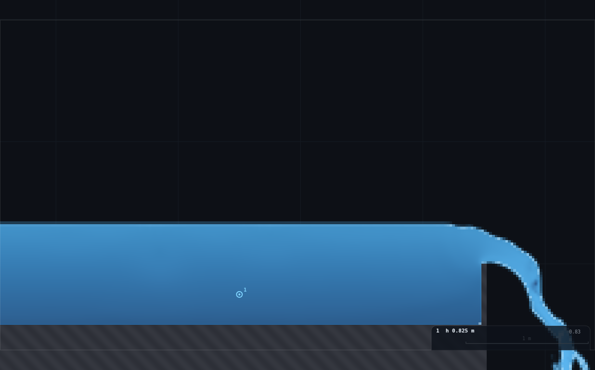
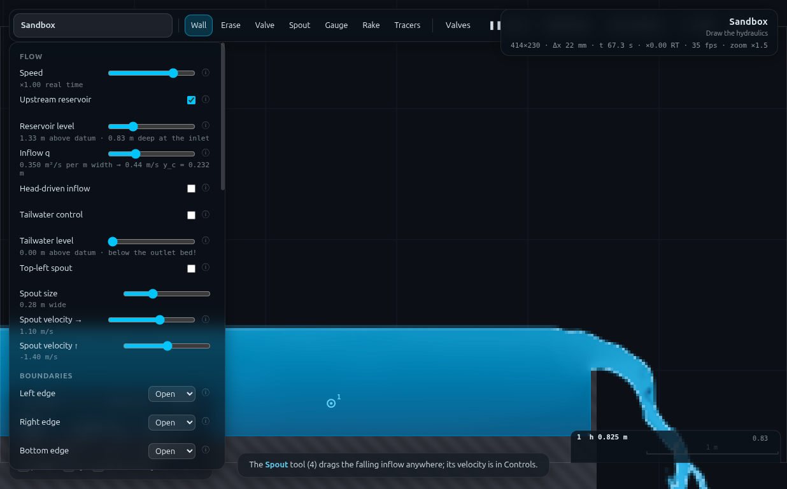

# WE-1 · Rating a sharp-crested weir, one point each

**Demo id:** WE-1  **Scene:** `?scene=sandbox` + **RIG-B**  **Refs:** #103–108 —
`Q = C_d · ⅔ · √(2g) · b · H^(3/2)`, Rehbock `C_d = 0.602 + 0.083 H/P` (#108)

## How to start (30 seconds)

1. Open the app — **`http://localhost:8124/`** on the lecturer's server, or
   double-click `index.html`.
2. Press **`E`** (or click **`Exercises ▾`** in the top bar) and pick
   **WE-1**.
3. Type the last digit of your student number into the card. It prints **your
   q** and the **reservoir level** paired with it — you set both, and the
   pairing is load-bearing.
4. Let it settle after every change you make — the card gives this demo's
   settle time (60 s of sim time) and counts it down.
5. Do the task printed on the card, then submit **q** and **H**.

If your lecturer gives you a link: **`?ex=WE-1`** (e.g.
`http://localhost:8124/?ex=WE-1`).

The picker gives everyone the same starting point and no more: the scene,
**Resolution: Medium**, the rig geometry, and the few settings without which
the rig is not a working rig — the card labels those as already set. Your own
values, your instruments and the order you do things in are yours to get
right. If your build ships without the rig pack the card says so; then draw it
by hand from *Manual setup* below.

---

Everyone builds the same weir — a flat bed with a thin plate standing 0.50 m
proud of it — runs it at their own discharge, and reads **one** number: the
depth of the approach pool. Subtract the crest height and you have `H`. Ten
students, ten points; pooled on log–log axes they lie on a straight line whose
slope the class measures (**1.599 ± 0.020** here, R² 0.9987) and whose intercept
is a discharge coefficient (**C_d = 0.623**). Nobody calibrated a weir; twenty
laptops did it between them, and the answer lands 4.5% under Rehbock.

The interesting argument is *why the slope is not exactly 1.5*: it is 1.5 only
if `C_d` is a constant, and neither the solver nor Rehbock says it is. Regress
Rehbock itself over this range of heads and it predicts **1.569**.

---

## 2 · Manual setup (fallback, or for building it yourself)

*The picker puts you at the same starting point as everyone else — scene,
Resolution Medium and the rig. This section is the record of every constant
behind that, and the build to follow if you are demonstrating it by hand or
the rig pack is missing.*

**Link for the slide:** `http://<host>:8124/?scene=sandbox`

**RIG-B must be drawn.** This folder's `rig.js` is the reusable RIG-B card —
paste it into the dev console and call
`RIGB.build({plate:{x:6.5,P:0.50}, bedX1:6.525, q:0.35, level:1.326, gauge:4.5})`
to reproduce the verification runs exactly. Students draw it by hand in about
90 seconds; the steps are in §3 and they are deliberately forgiving (§3 has a
one-slider self-check for the only dimension that has to be right).

**Constants fixed by this dry-run** (do not change them in class):

| what | value | why |
|---|---|---|
| Resolution | **Medium** → 414 × 230, Δx = **21.7 mm**, Δt = 3.494e−4 s | Δx divides 0.50 m exactly (23 cells), so the drawn bed and crest rasterise with no error at all |
| Bed top face | **y = 0.50 m** | RIG-B's standard datum; also exactly 23 cells |
| Crest height above the bed | **P = 0.50 m** (crest at y = 1.00 m) | gives `H/P` = 0.30 → 0.87 across the class, which is inside Rehbock's band and wide enough that the `H/P` trend is *visible* rather than a rounding error |
| Plate | x = **6.50 m**, 0.05 m thick (**2 cells**, verified watertight) | far enough downstream for a settled approach, far enough from the right edge for the nappe to land inside the domain |
| Bed ends at | **x = 6.52 m** (i.e. at the plate) | so the nappe falls 1.0 m to the draining floor. **Not optional — see the trap below** |
| Bottom edge | **Open** (drains) | the plunge pool has to leave |
| Right edge | **Open** (zero-gradient) | the sheet leaving the plunge zone is supercritical |
| Tailwater | **OFF** | there is no downstream control and there must not be one |
| Gauge | x = **4.50 m**, "Gauges plot: **Depth**" | 2.0 m upstream of the plate = 4.6 H at the largest H, 13 H at the smallest — clear of the drawdown, which only starts within ~0.15 m of the plate |
| Reservoir | **ON**, head-driven **OFF**, level **per the q→level table** | the one thing that has to be set with the discharge |

**THE TRAP, in one line.** Build canonical RIG-B — bed slab all the way across
the domain, right edge Open, no tailwater — and the whole domain **ponds to
1.46 m deep**, drowning the weir completely (measured). A zero-gradient outflow
is right for supercritical flow and simply ponds a subcritical one (CLAUDE.md);
the bed must therefore *end at the plate* so the water has somewhere to fall.
A tailwater is not a substitute here: held clear of critical (1.3 y_c) at the
top of the range it sits at 0.91 m against a crest at 1.00 m, i.e. it drowns
the nappe by construction.

**Timing budget** (per student, laptop holding ≈ 1× real time):

| stage | sim time | wall time |
|---|---|---|
| open the link, read the sheet | — | ~1 min |
| draw the rig (5 strokes) | — | ~90 s |
| set q + reservoir level | — | ~15 s |
| fill and settle (watch `t` in the status bar) | 60 s | ~60 s |
| read the gauge card | ~10 s | ~15 s |
| type two numbers into Blackboard | — | ~1 min |
| **total** | | **≈ 5 min** — comfortable in a 10-minute slot |

---

## 3 · Student worksheet (copy-pasteable)

**Rating a sharp-crested weir — submit two numbers**

1. Open the app, press **`E`** and pick **WE-1** (or open **`?ex=WE-1`**) — it
   loads the scene at **Resolution: Medium** and draws the rig, so the build
   steps below are only for building it by hand. Keep the tab visible — the
   simulation pauses when it is hidden.
2. **Controls → Resolution: Medium** (the picker sets this — check it anyway). The status bar
   should read `414×230 · Δx 22 mm`.

### Build the rig (five strokes, ~90 s)

The background grid is **1 m** squares and the scale bar is bottom right. Hold
**shift** while dragging to snap a stroke horizontal or vertical.

3. **Clear the sandbox's two grey ledges.** Press **`2`** (Erase) and **`]`**
   nine times (brush to maximum). Sweep once left-to-right across the upper
   ledge and once across the lower one until both are gone.
4. **Draw the bed.** Press **`1`** (Wall); the brush is still at maximum, which
   is a **0.5 m** thick stroke. Drag, with shift held, from **off the left edge
   of the domain** to **x = 6.5 m** (halfway through the 7th grid square),
   keeping the stroke centred **a quarter of the way up the first grid square**.
   You want a slab whose **top face sits at y = 0.50 m** — the half-grid line —
   and whose bottom reaches the domain floor. Start outside the domain: a
   stroke has *butt* ends, so a slab started at x = 0 leaves the first column
   open. **Do not extend it past x = 6.5** — the water has to fall off the end.
5. **Draw the plate.** Press **`[`** nine times (brush back to ~0.05 m = 2
   cells). Drag, with shift held, **straight up at x = 6.5 m**, from *inside*
   the bed slab (about y = 0.4) to the **first full grid line above the bed,
   y = 1.00 m**. That grid line is what makes the crest exact. The plate is
   now **P = 0.50 m** above the bed.
   *Got it wrong? Press `Z` to undo the last stroke and redo it.*
6. **Panel setup** (Controls):
   - **Upstream reservoir: ON**, **Head-driven inflow: OFF**
   - **Tailwater control: OFF**
   - **Top-left spout: OFF**
   - **Left edge: Open · Right edge: Open · Bottom edge: Open · Top edge: Wall**
   - **Gauges plot: Depth**
7. **Self-check the bed (10 s, do not skip).** Set **Reservoir level** to
   **1.00**. The note under the slider must read
   *"1.00 m above datum · **0.50 m** deep at the inlet"*. If it says 0.48 or
   0.52, your bed is a cell out: press `Z`, redraw stroke 4 slightly higher or
   lower, and check again.
8. **Place the gauge.** Press **`5`** (Gauge) and click once in the middle of
   the future pool at **x = 4.5 m**, about half a grid square above the bed.
   A small chart appears bottom right. Press **`1`** to go back to the Wall
   tool so you do not add gauges by accident.

### Your run

9. **Your discharge.** Take the **last digit of your student number**, `d`:

   > **q = 0.10 + 0.05 · d**   (m²/s per m width)

10. **Your reservoir level.** The reservoir *pins* the water surface at
    whatever level you give it, so it must be set to the level the weir's own
    pool wants. Set **both** sliders from your row:

    | d | q (m²/s) | **Reservoir level (m)** |
    |---|---|---|
    | 0 | 0.10 | **1.152** |
    | 1 | 0.15 | **1.195** |
    | 2 | 0.20 | **1.233** |
    | 3 | 0.25 | **1.261** |
    | 4 | 0.30 | **1.304** |
    | 5 | 0.35 | **1.326** |
    | 6 | 0.40 | **1.362** |
    | 7 | 0.45 | **1.389** |
    | 8 | 0.50 | **1.412** |
    | 9 | 0.55 | **1.434** |

    (Levels are **elevations above the domain floor**, not depths over the bed.
    They are just crest + the head the weir is about to produce; the pattern is
    `level = 1.00 + 0.64 q^0.625`.)

11. **Wait.** The pool has to fill. Watch **`t`** in the status bar and wait
    until **t = 60 s**. Then look at the picture: the pool should be **flat all
    the way back to the left edge**, with a clean nappe springing off the crest
    and an air pocket underneath it. If the surface near the inlet is rippled
    or visibly lower than the rest of the pool, your reservoir level is wrong —
    re-check step 10.
12. **Read the gauge.** The chart bottom right prints `1  h 0.xxx m` — the
    depth of the approach pool. It should be steady to the last digit. Take a
    typical value.
13. **Your head over the crest:**

    > **H = h − 0.50**   (the gauge depth minus the crest height P)

    Sanity check: `H` should be somewhere between **0.14 m and 0.45 m**
    depending on your digit. Outside that, your rig is a cell or two out —
    redo step 7.
14. **Submit on Blackboard:**
    - `q` = your discharge (2 d.p., from step 9)
    - `H` = head over the crest (3 d.p.)
    - (also record your `d` and the reservoir level you used)

**Standing rules.** Resolution: Medium (the picker sets this) · wait for the pool to fill (t = 60 s) ·
keep the tab visible, the sim pauses when hidden · set the reservoir level from
the table **every time you change q** — the two go together.

**What you should be able to say afterwards:** a weir is a *rating*, not a
measurement — you measure a level and infer a discharge, and the whole trick is
that `q` depends on `H^{3/2}`, so a weir is a far more sensitive flow meter at
low flows than at high ones.

---

## 4 · Collection & pooled plot (lecturer)

Blackboard export → CSV; extra columns are ignored:

```
student,digit,q,level,h_gauge,P,H,source
```

Only `q` and `H` are required (`h_gauge` and `P` are used to derive `H` if a
student submitted the raw gauge depth instead).

```bash
python3 collect_plot.py class.csv -o plots/pooled-demo.png
```

It prints the pooled statistics and writes the figure:

```
WE-1 pooled rating — 10 points, H 0.150-0.433 m, q 0.10-0.55 m2/s
  log-log slope      1.599 +/- 0.020   (ideal 3/2 = 1.500; Rehbock over this range = 1.569)
  R^2                0.99871
  C_d, slope free    0.7041
  C_d, slope = 3/2   0.6226   <- the number to quote
  C_d per point      0.582 - 0.653, mean 0.6231
  Rehbock mean       0.6527   -> class runs -4.5%
  C_d = 0.556 + 0.109 (H/P)   vs Rehbock 0.602 + 0.083 (H/P)
```

**What the plot shows.** Top panel: ten points on a log–log line, R² 0.9987,
slope 1.599. Bottom panel: each student's own `C_d` against their `H/P`, with
Rehbock drawn through it — the class sits a few percent below the Rehbock line
but **rises with `H/P` at a very similar rate** (0.109 measured against 0.083).

**Discussion points**
1. *Why isn't the slope 1.5?* Because `C_d` is not a constant. Rehbock says so
   too: regress `0.602 + 0.083 H/P` over the class's own heads and it gives
   **1.569**, not 1.500. The measured 1.599 is closer to Rehbock's effective
   slope than to the textbook one — the class has measured the *H/P* effect
   without being told to look for it.
2. *Why is `C_d` 4.5% low?* Two honest reasons, both worth naming: this is a
   **2D slice** — no side contractions, and Rehbock's constants come from
   finite-width laboratory weirs — and `H` is resolved in **7 to 20 cells**, so
   the thinnest nappe in the class is the least trustworthy point. Point at
   digit 0 (7 cells, `C_d` = 0.582, the furthest below Rehbock) and let them
   draw the conclusion.
3. *No clinging-nappe hysteresis.* The air under the nappe here is passive and
   the nappe is always ventilated, so the classic clinging/free jump in the
   rating does not appear. Real weir plates need a vent for exactly this
   reason — worth 60 seconds on the slide.
4. *The V-notch (#109, Q11) stays a paper exercise.* A notch is intrinsically
   3D; nothing in a vertical-plane solver can produce the `H^{5/2}` law, and
   saying so crisply is better than faking it.

**Troubleshooting & safe bounds**

| symptom | cause | fix |
|---|---|---|
| The whole domain fills up and the plate disappears | the bed was drawn **past** x = 6.5, so the nappe has nowhere to fall | `Z` to undo, redraw the bed ending at the plate; check Bottom edge = **Open** |
| The pool surface ripples near the inlet, or sags below the rest of the pool | reservoir level not set from the table | set it; the pool goes flat within ~20 s |
| The gauge reads a depth that keeps rising | still filling | wait until `t` = 60 s |
| Water leaks *through* the plate | the plate stroke does not reach down into the bed slab | `Z`, redraw from y ≈ 0.4 upward |
| `H` far outside 0.14–0.45 m | bed or crest a cell out | redo the step-7 self-check |

*Safe parameter bounds (measured).*

| q | verdict |
|---|---|
| **0.05** | **too low** — H = 0.107 m (4.9 cells), `C_d` = 0.484, and the boundary delivers 17% more water than the slider says. Quantisation-dominated; do not use |
| **0.10 – 0.55** | the personalised range. `H` = 7 → 20 cells, mass balance within 1.4%, surface dead flat, `C_d` 0.58 → 0.65 |
| **0.80** | still good (H = 0.558 m, 25.7 cells, `C_d` = 0.650), nappe free, plunge pool 0.22 m against a 1.00 m crest. The range *could* be widened to here |
| **1.20** (slider cap) | the plunge pool climbs to 0.85 m against the 1.00 m crest — the nappe is on the edge of drowning. Hard upper limit |

---

## 5 · Verification record

Measured through `exercises/_runner/runner.py` (dedicated visible Chrome,
hardware GL, CDP), sandbox at Medium, ~9 000–12 000 substeps/s. Protocol per
row, matching the worksheet's own order of operations: **fresh empty sandbox →
build RIG-B → set q and the seed level together → settle 45 s → set the level
to the measured pool surface (one fixed-point pass) → settle 20 s → read → 8 s
more → read again**. Every reading is the mean of the gauge's own `depth`
history over a 6 s window (360 samples), i.e. exactly the number the on-screen
card prints, time-averaged the way step 12 asks the student to.

Simulated class (`data/simulated-class.csv`), rule `q = 0.10 + 0.05·d`:

| d | q | level used | H (m) | H in cells | H/P | C_d | Rehbock | diff |
|---|---|---|---|---|---|---|---|---|
| 0 | 0.10 | 1.152 | 0.1501 | 6.9 | 0.300 | 0.582 | 0.627 | −7.1% |
| 1 | 0.15 | 1.195 | 0.1936 | 8.9 | 0.387 | 0.596 | 0.634 | −6.0% |
| 2 | 0.20 | 1.233 | 0.2355 | 10.8 | 0.471 | 0.593 | 0.641 | −7.6% |
| 3 | 0.25 | 1.261 | 0.2594 | 11.9 | 0.519 | 0.641 | 0.645 | −0.7% |
| 4 | 0.30 | 1.304 | 0.2977 | 13.7 | 0.595 | 0.625 | 0.651 | −4.0% |
| 5 | 0.35 | 1.326 | 0.3245 | 14.9 | 0.649 | 0.641 | 0.656 | −2.2% |
| 6 | 0.40 | 1.362 | 0.3617 | 16.6 | 0.723 | 0.623 | 0.662 | −5.9% |
| 7 | 0.45 | 1.389 | 0.3880 | 17.8 | 0.776 | 0.631 | 0.666 | −5.4% |
| 8 | 0.50 | 1.412 | 0.4099 | 18.9 | 0.820 | 0.645 | 0.670 | −3.7% |
| 9 | 0.55 | 1.434 | 0.4331 | 19.9 | 0.866 | 0.653 | 0.674 | −3.0% |

**Anchors.**

| quantity | measured | expected | note |
|---|---|---|---|
| pooled log-log slope | **1.599 ± 0.020**, R² 0.9987 | 1.500 (constant `C_d`) / 1.569 (Rehbock over this range) | +6.6% on the textbook exponent, +1.9% on Rehbock's own |
| `C_d`, slope forced to 3/2 | **0.6226** | 0.602–0.674 (Rehbock, this `H/P` range) | inside the band; −4.5% on Rehbock's mean |
| `C_d` trend with `H/P` | **0.556 + 0.109 (H/P)** | 0.602 + 0.083 (H/P) | the *trend* is reproduced; the offset is the calibration lesson |
| mass balance | column `q` in the pool 0.101 → 0.554 against 0.10 → 0.55 set | equal | within **1.4%** at every digit |
| steadiness | `H` changed by ≤ 1.5% (median 0.2%) between reads 8 s apart | <1%/s | settled |
| surface flatness | at q = 0.10 the pool surface is a single cell value (1.1522 m) at **every** station 1–6 m | flat | the level table works |
| crest / bed rasterisation | crest 1.0000 m, P 0.5000 m, plate 2 cells, **0 holes** | exact | 0.50 m = 23 cells exactly at Medium |
| nappe free? | plunge-pool surface 0.02 m (q = 0.10) → 0.22 m (q = 0.80) against a 1.00 m crest | free | never within 0.78 m of the crest inside the class range |
| spin-up | settled by **t ≈ 46 s** at q = 0.10 (the slowest — filling *is* the spin-up), t ≈ 50 s at q = 0.55 | — | the sheet says 60 s |
| `rig.js` reproduction | `WE1.student(5)` from a cold paste → H 0.3246, `C_d` 0.6409 | sweep row d = 5: H 0.3245, `C_d` 0.641 | **0.03%** — the card rebuilds the rig exactly |

**Reservoir-level sensitivity** (q = 0.35, the demo's own hard part):

| reservoir level | H | `C_d` | pool surface − level | gauge flutter (max−min over 6 s) |
|---|---|---|---|---|
| 1.25 (−0.08) | 0.3225 | 0.647 | **+76 mm** (sponge draining) | 7 mm |
| **1.326 (fixed point)** | **0.3245** | **0.641** | **0 mm** | **1 mm** |
| 1.45 (+0.12) | 0.3920 | 0.483 | −66 mm (sponge filling) | 95 mm |

That is the whole argument for the table: ±0.1 m of reservoir level moves the
answer by 25%, and the fixed point is also the quietest state by two orders of
magnitude. The seed formula `level = 1.00 + 0.64 q^0.625` landed within **8 mm**
of the fixed point at all ten digits, so the correction pass moved nothing and
students never have to iterate.







---

## Appendix — Director report

**VERDICT: READY.** The demo works as specified, first time, with no scene or
panel change needed. It produces the promised payoff (a log–log line with slope
≈ 3/2 and an intercept that is a real `C_d`), the personalised parameter spans
a useful range, every point settles, and the pooled result is tight enough
(R² 0.9987) that the *deviation* from 1.5 becomes the teaching point rather
than noise.

**Evidence.**

| what | measured | expected / prior source | note |
|---|---|---|---|
| pooled log-log slope, n = 10 | **1.599 ± 0.020**, R² 0.9987 | programme: "slope 1.5" | met in spirit; the residual +6.6% is Rehbock's own `C_d(H/P)` trend, which predicts 1.569 |
| `C_d` (slope forced to 3/2) | **0.6226** | ~0.6 | −4.5% on Rehbock's mean over the class's `H/P` |
| `C_d` vs `H/P` | 0.556 + **0.109** H/P | Rehbock 0.602 + **0.083** H/P | the trend is recovered, the intercept is 7.6% low |
| mass balance (pool column q vs slider q) | +1.0% to +1.4% | — | the level fixed point is what makes this true; off the fixed point it reaches +3.6% |
| canonical RIG-B (bed across the domain, right edge Open, no tailwater) | **domain ponds to 1.46 m deep**, weir fully drowned | CLAUDE.md: zero-gradient outflow "simply ponds a subcritical reach" | the single most important RIG-B fact — see PROPOSED CHANGES |
| bed truncated at the plate, floor draining | nappe free at every q from 0.10 to 0.80; plunge pool ≤ 0.22 m against a 1.00 m crest | required | the fix |
| plate at 0.05 m | **2 cells, 0 holes** at Medium | "thin as the rasteriser allows, sealed" | 0.03 m also sealed but is 1 cell in places; 0.05 is the honest hand-drawable minimum |
| level sensitivity at q = 0.35 | `C_d` 0.647 / 0.641 / 0.483 at level 1.25 / 1.326 / 1.45 | unknown before this run | the q→level table is load-bearing, not a convenience |
| seed formula vs fixed point | within **8 mm** at all 10 digits | — | students never iterate; one measured formula does it |
| q = 0.05 (below range) | H = 4.9 cells, `C_d` = 0.484, mass +17% | — | the floor. q = 0.10 (6.9 cells) is the lowest sound digit |
| q = 1.20 (slider cap) | plunge pool 0.85 m vs crest 1.00 m | UF-1 found the cap | hard upper bound: the nappe is about to drown |
| spin-up | 46 s at q = 0.10, 50 s at q = 0.55 | — | filling the pool *is* the spin-up; low q is the slow case, not the fast one |
| screenshots | 3 PNGs, 150–175 kB, all visually checked | — | settled pool, ventilated nappe with air pocket, gauge card legible, panel values match the d = 5 row |

**Iterations.**
1. *Canonical RIG-B ponds.* First build put the bed slab across the whole
   domain with an Open right edge — textbook RIG-B — and after 40 s the domain
   was 1.46 m deep everywhere with the 1.00 m crest under water. Truncating the
   bed at the plate so the nappe falls to the draining floor fixed it
   completely and is now baked into `rig.js` as `bedX1`.
2. *The reservoir level had to be found, not assumed.* Three levels at a fixed
   q (1.25 / 1.35 / 1.45) gave `C_d` 0.647 / 0.603 / 0.483. The self-consistent
   point — where the measured pool surface equals the slider — is also where
   the sponge stops adding or removing mass (pool `q` within 1% of the slider)
   *and* where the gauge stops fluttering (1 mm instead of 95 mm). Simple
   fixed-point iteration `level ← measured pool surface` converges in one pass,
   and the converged values fit `1.00 + 0.64 q^0.625` to 8 mm.
3. *`P` = 0.50 m was chosen for `H/P`, not for looks.* It puts `H/P` at
   0.30–0.87 across the class — inside Rehbock's usual band and wide enough
   that the `C_d(H/P)` trend is measurable (it is the bottom panel of the
   plot). A taller plate would have compressed it to nothing.
4. *A shell/JSON plumbing bug cost ~8 minutes* — embedding the runner's
   JSON-string output inside a Python triple-quoted literal ate the
   backslashes, an empty value reached `CONTROLS…set()`, and
   `sim.p.inflow.level` became `undefined`, after which both `syncPanel()` and
   `drawMarkers()` throw on every call. Worth knowing: **a bad `.set()` bricks
   the page until the level is set to a number again.** Drive the runner from
   Python with `subprocess`, not from bash string interpolation.

**PROPOSED CHANGES.**

**A · To the programme, the RIG-B card — required.** The current wording
("a flat bed slab (top face y = 0.5) across the domain, reservoir feeding q on
the left, tailwater or a drawn control on the right") builds a rig that ponds.
Suggested replacement: *"RIG-B · THE CHANNEL — Sandbox. A flat bed slab (top
face y = 0.5) fed by a reservoir on the left. The reach needs a real downstream
control: either a **tailwater** (bed carried to the right edge) or a **brink** —
carry the bed only as far as the structure and let the water fall to the
draining floor (Bottom edge = Open). With the bed carried to an Open right edge
and no tailwater the domain ponds — measured 1.46 m deep, drowning a 1.00 m
crest. Bottom edge Open only where something must fall; Wall otherwise. Top
edge Wall, spout OFF."* Impact: MO-1 (sluice gate) and FB-1 will hit exactly
this on their first build; DA-1 likewise.

**B · To the programme, WE-1's payoff line — suggested.** "Pooled log-log slope
1.5" oversells it. Measured is 1.599 ± 0.020, and *Rehbock over the same range
predicts 1.569* — so the honest line is stronger than the original: *"Pooled
log-log slope ≈ 1.6, not 1.5 — because `C_d` is not a constant, which is what
Rehbock's `0.083 H/P` term says. The class measures that term (0.109 against
0.083) without being told to look for it. Intercept with the slope forced to
3/2 → `C_d` = 0.62, about 4.5% under Rehbock."*

**C · To the app, optional.** Nothing here needs a change to run. The one thing
that would help every drawn-rig demo: **a numeric elevation readout for the
cursor** (already proposed by GV-1). WE-1 dodges it because the gauge card
prints *depth* and the crest is set by a visible grid line, but the step-7
self-check (set the level to 1.00 and read the note under the slider) is a
workaround for a missing readout, and every RIG-B demo will need one.

**Timing.** Student path ≈ 5 min (§2), of which 90 s is drawing and 60 s is
waiting for the pool to fill. Worker wall clock ≈ 60 min against a ~45 min
timebox: ~10 min on the ponding trap, ~10 min on the level fixed point, ~8 min
lost to the bash/JSON bug in iteration 4.

**Handoff — for MO-1, FB-1, DA-1 (everything on RIG-B).**

Start from `rig.js` (`RIGB.build({...})`). It is parameterised on bed
elevation, bed extent, plate position/height/thickness, q, level, tailwater,
`C_f`, `C_s` and gauge station, and it self-checks the rasterised crest and the
plate seal. The facts you would otherwise rediscover:

- **Grid.** Sandbox at Medium is **414 × 230, Δx = 21.7 mm, Δt = 3.494e−4 s** →
  2 862 substeps per simulated second (same as FR-1's RIG-A). 60 sim-seconds is
  ~20 s of wall clock solo. Keep every RIG-B elevation a multiple of Δx:
  **0.50 m = 23 cells exactly**, and both the bed and the crest then rasterise
  with zero error.
- **The sandbox's two ledges must be erased** (FR-1's finding, confirmed). They
  sit above the water in RIG-B but catch spray and ruin a screenshot.
- **Bare RIG-B ponds.** See PROPOSED CHANGES A. Decide your downstream control
  *before* you draw the bed: tailwater ⇒ bed to the right edge; brink ⇒ bed
  stops at the structure, Bottom edge Open.
- **A tailwater cannot be low.** Clear of critical at the top of a useful q
  range it sits ~0.9 m above the floor, which is near enough to a 1.0 m crest
  to submerge it. If your structure needs a *dry* downstream side, you need the
  brink, not a tailwater.
- **The reservoir level is a real parameter, not a formality.** It pins the
  surface, and being 0.1 m off changes a measured coefficient by 25% and makes
  the gauge flutter 100× more. Find the fixed point (`level ← measured pool
  surface`, converges in one pass) and *tabulate it against q* on the
  worksheet. Cheap test that you are at it: the pool's column `q` should equal
  the slider's `q` to ~1%, and the surface should be a single flat value from
  the inlet to the structure.
- **Read depth, not elevation.** The gauge card's `h` is `A.h[i]`, the
  EMA-smoothed *column depth*, so it is sub-cell and quiet; the raw surface
  elevation from `SIM.columns()` is quantised to a whole cell (21.7 mm) and a
  single frame can be a cell off. With a flat bed at a known elevation, depth
  is all you need and it is the better number.
- **Filling is the spin-up, so LOW discharge is the SLOW case** — the opposite
  of the intuition. 46 s at q = 0.10, 50 s at q = 0.55. Budget from the *pool
  volume ÷ q*, not from the flow speed.
- **Structures need ~7 cells of head to be worth measuring.** At 4.9 cells
  (q = 0.05 here) the coefficient was 17% out and the boundary mass error was
  17%. Size your personalised range so the smallest case still resolves the
  thing being measured in ≥ 7 cells.
