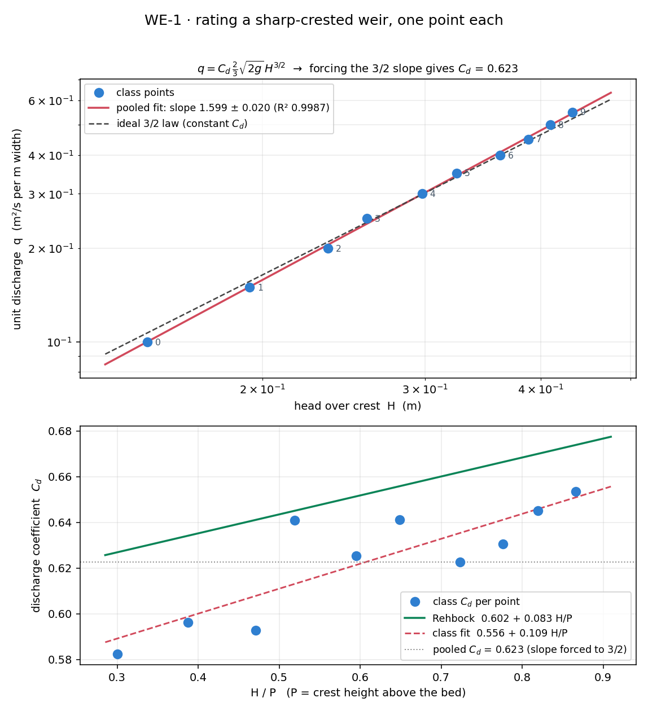

# WE-1 · Rating a sharp-crested weir, one point each

Everyone gets the same weir — a flat bed with a thin plate standing 0.50 m
proud of it, and nothing downstream but a free fall — runs it at their own
discharge, and reads **one** number: the depth of the approach pool. Subtract
the crest height and you have `H`. Ten students, ten points; pooled on log–log
axes they lie on a straight line whose slope the class measures and whose
intercept is a discharge coefficient. Nobody calibrated a weir; twenty laptops
did it between them.

**Open it:** press **E** in the [app](https://barneydobson.github.io/hydraulician/)
and pick **WE-1**, or use the direct link
[`?ex=WE-1`](https://barneydobson.github.io/hydraulician/?ex=WE-1).
How to run any exercise: see the [teaching pack index](../INDEX.md#running-an-exercise).

## Theory

A sharp-crested weir is a **rating**: you measure a level and infer a
discharge.

    Q = C_d · ⅔ · √(2g) · b · H^(3/2)        H = h − P

`h` is the approach-pool depth, `P` the crest height above the bed, so `H` is
the head over the crest. The exponent is 3/2 *only if* `C_d` is a constant, and
it is not — Rehbock's fit says so directly:

    C_d = 0.602 + 0.083 · H/P

Here the crest is **P = 0.50 m** above a bed whose top face sits at
**y = 0.50 m**, so the crest itself is at y = 1.00 m and

    H = h − 0.50

The gauge is already placed at **x = 4.5 m**, two metres upstream of the plate
and well clear of the drawdown. Expect `H` between about **0.14 m** and
**0.45 m** depending on your digit; well outside that, something is a cell out.

## Your discharge and reservoir level

**d** is the **last digit of your student number** — your lecturer will explain
the assignment in class. The reservoir *pins* the surface at whatever level you
give it, so the level paired with your `q` is load-bearing, not a convenience:
±0.1 m moves `C_d` by about 25%. Set both.

> **q = 0.10 + 0.05 · d**   (m²/s per m width)

| d | 0 | 1 | 2 | 3 | 4 | 5 | 6 | 7 | 8 | 9 |
|---|---|---|---|---|---|---|---|---|---|---|
| **q (m²/s)** | 0.10 | 0.15 | 0.20 | 0.25 | 0.30 | 0.35 | 0.40 | 0.45 | 0.50 | 0.55 |
| **level (m)** | 1.152 | 1.195 | 1.233 | 1.261 | 1.304 | 1.326 | 1.362 | 1.389 | 1.412 | 1.434 |

Levels are elevations above the domain floor, not depths over the bed — they
are just the crest plus the head the weir is about to produce.

## What to do

1. Set **Inflow q** and **Reservoir level** to your row, together.
2. Press `R` and let it reach steady state — about **60 s**; the card counts
   it down. The pool should then be flat all the way back to the left edge,
   with a clean nappe springing off the crest and an air pocket under it. If
   the surface near the inlet ripples or sags, your level is wrong.
3. Read the gauge card at x = 4.5 m — it prints `1  h 0.xxx m`, steady to the
   last digit — take **H = h − 0.50**, and submit **q, H**.

## For the instructor — pooling the class

Collect one row per student (`student,digit,q,level,h_gauge,P,H`), export the
CSV and run:

```bash
python3 collect_plot.py class.csv                # -> plots/pooled-demo.png
python3 collect_plot.py data/simulated-class.csv # the shipped dry-run class
```

The script derives `H` from `h_gauge − P` for anyone who submitted the raw
gauge depth, fits the pooled points on log–log axes and prints the slope, R²
and `C_d` (both slope-free and at the textbook 3/2), then plots that line above
each student's own `C_d` against their `H/P` with Rehbock drawn through it.



### Discussion points

- **Why isn't the slope 1.5?** Because `C_d` is not a constant, and Rehbock
  agrees: regress `0.602 + 0.083 H/P` over the class's own heads and it
  predicts **1.569**, not 1.500. The class measured the `H/P` effect without
  being told to look for it.
- **Look under the nappe.** Zoom in on the crest: the air pocket is passive
  and the sheet is always ventilated, so the clinging-nappe hysteresis a real
  plate shows never appears here — which is exactly why real weir plates are
  vented. The same idealisation (a 2D slice, no side contractions) is most of
  why the pooled `C_d` sits a few percent under Rehbock.

The full verification record — why the bed must end at the plate, the measured
per-digit table and Rehbock comparison, safe bounds and troubleshooting — is
archived in the repository at
`exercises/WE-1-sharp-weir/_archive/README-full.md`.
