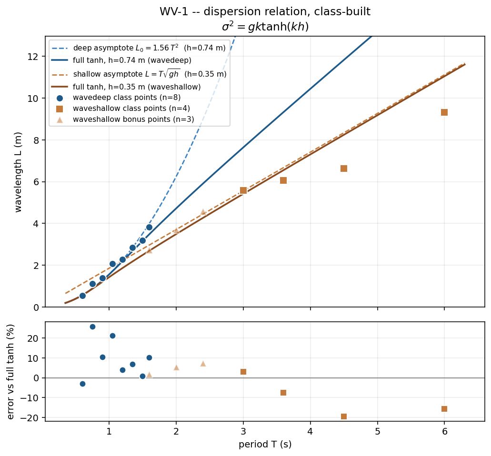

# WV-1 · Dispersion, one period each

Every student sets their own wave period on a wavemaker flume, lets the train
run out, and reads one wavelength off the scale bar. Pooled on one axis, the
short periods land on the deep-water line, the long periods land on the
shallow-water line, and the ones in between sag off both — the class has drawn
the full dispersion relation without anyone solving a transcendental equation
by hand.

**Open it:** press **E** in the [app](https://barneydobson.github.io/hydraulician/)
and pick **WV-1**, or use the direct link
[`?ex=WV-1`](https://barneydobson.github.io/hydraulician/?ex=WV-1).
How to run any exercise: see the [teaching pack index](../INDEX.md#running-an-exercise).

## Theory

One relation ties a wave's period to its length, and it is transcendental:

    σ² = g·k·tanh(k·h)        σ = 2π/T,   k = 2π/L

Its two limits are the formulas people actually quote. In deep water
`tanh kh → 1`, so `L₀ = 1.56·T²`; in shallow water `tanh kh → kh`, so
`L = T·√(gh)`. Neither is right in between, which is where a good part of the
class lands. Still-water depths here: **wavedeep h = 0.74 m**,
**waveshallow h = 0.35 m**.

## Your period and stroke

**d** is the **last digit of your student number** — your lecturer will
explain the assignment in class. Take your period from the table below (it
plateaus at 1.60 s from d = 7), and with it the paired stroke: a short wave
given a long stroke just breaks at the paddle.

| d | 0 | 1 | 2 | 3 | 4 | 5 | 6 | 7 | 8 | 9 |
|---|---|---|---|---|---|---|---|---|---|---|
| **T (s)** | 0.60 | 0.75 | 0.90 | 1.05 | 1.20 | 1.35 | 1.50 | 1.60 | 1.60 | 1.60 |
| **stroke (m)** | 0.05 | 0.08 | 0.11 | 0.15 | 0.19 | 0.23 | 0.28 | 0.30 | 0.30 | 0.30 |

The second half of the class works the long-period rows on `waveshallow`:

| d | 0 | 1 | 2 | 3 | 4 | 5 | 6 | 7 | 8 | 9 |
|---|---|---|---|---|---|---|---|---|---|---|
| **T (s)** | 3.0 | 3.3 | 3.6 | 3.9 | 4.2 | 4.5 | 4.8 | 5.1 | 5.5 | 6.0 |

Stroke there: 0.25 m at T = 3.0 s, 0.28 m at T = 3.6 s, 0.30 m (the slider
maximum) from T = 4.2 s up.

## What to do

1. Under **Controls → Wavemaker**, set **Period** and **Amplitude** to your
   row.
2. Press `R` and let it reach steady state — about **40 s**; the card counts
   it down.
3. Zoom onto the paddle (scroll-zoom on the orange piston marker), then press
   **space** to pause — the far half of the tank looks flat, and that is
   expected, not a fault.
4. Read one crest-to-crest span against the scale bar, or with **Measure**
   (`8`). If only one crest is visible, run on for exactly one period `T` and
   measure how far that same crest travelled. Submit **T, L, flume**.

**Also:** second half — switch to **waveshallow** (Scenes menu), repeat on the
shallow rows, submit with `flume = shallow`. Press `0` to zoom out first; the
second crest may sit out over the start of the beach, which is fine.

## For the instructor — pooling the class

Collect one row per student (`student,digit,flume,T_s,L_measured_m`), export
the CSV and run:

```bash
python3 collect_plot.py class.csv                # -> plots/pooled-demo.png
python3 collect_plot.py data/simulated-class.csv # the shipped dry-run class
```

The script solves `σ² = gk tanh kh` at each point's own depth and plots L
against T with both full-tanh curves and both simple asymptotes drawn through
the class points, over a residual panel of the error against the full
relation.



### Discussion points

- **Why the worksheet insists on measuring beside the paddle.** Press `0` to
  drop back to the scene's own mid-tank camera: dead-flat water. The coherent
  wave decays 30–50× within about 2.5–3 m of the paddle at every stroke
  tried, so the middle of the tank has nothing left to measure — which is
  also why real wave flumes are built long.
- **The longest waveshallow rows read low, and it is not a bad measurement.**
  By T = 4.5 s, L is 8–11 m against only 3.7 m of flat bed before the beach,
  so part of any crest-to-crest span sits over the shoal, where the depth —
  and with it the local wavelength — is already shrinking.

The full verification record — the stroke calibration and why the scene's own
defaults break at the paddle, the measured wavelength table for both flumes,
the crest-tracking and two-probe phase cross-checks, safe bounds and
troubleshooting — is kept locally, out of version control, at
`exercises/WV-1-dispersion/_archive/README-full.md`.
