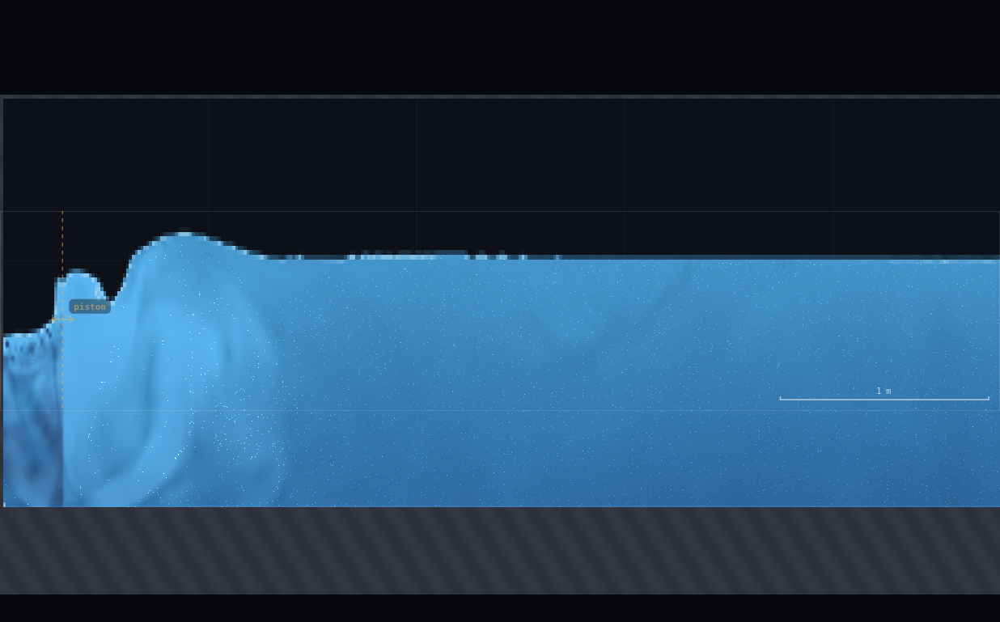
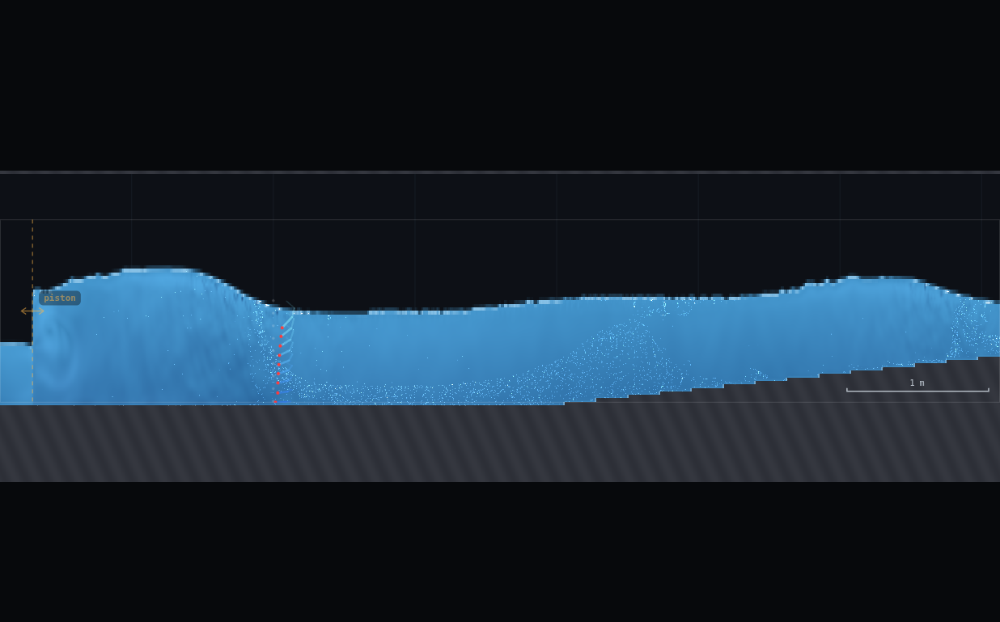
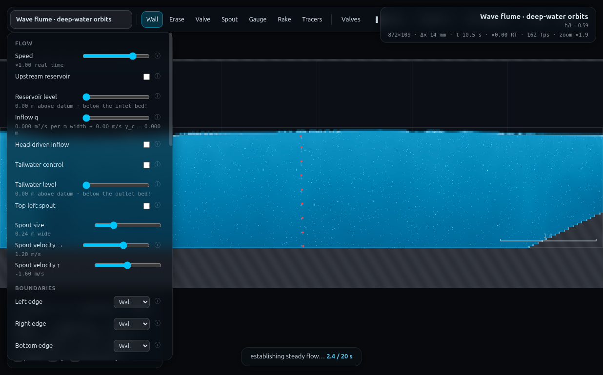

# WV-1 · Dispersion, one period each

**Demo id:** WV-1  **Scenes:** `?scene=wavedeep` (main cohort) and
`?scene=waveshallow` (second cohort)  **Refs:** W1–W2, W8–W11 ·
`σ² = gk·tanh kh` · `L₀ = 1.56T²` · `c = √(gh)`

## How to start (30 seconds)

1. Open the app — **`http://localhost:8124/`** on the lecturer's server, or
   double-click `index.html`.
2. Press **`E`** (or click **`Exercises ▾`** in the top bar) and pick
   **WV-1**.
3. Type the last digit of your student number into the card. It prints **your
   period and stroke** — you set both on the wavemaker.
4. Let it settle after every change you make — the card gives this demo's
   settle time (40 s of sim time) and counts it down.
5. Do the task printed on the card, then submit **T**, **L** and **flume**.

If your lecturer gives you a link: **`?ex=WV-1`** (e.g.
`http://localhost:8124/?ex=WV-1`).

The picker gives everyone the same starting point and no more: the scene,
**Resolution: Medium**, and the few settings the scene itself needs — the card
labels those as already set. Your own values, your instruments and the order
you do things in are yours to get right. *Manual setup* below is the record of
every constant.

---

Every student sets their own wave period on a wavemaker flume, lets the train
run out, and reads one wavelength off the scale bar. Pooled on one axis, the
short periods land on the deep-water line, the long periods land on the
shallow-water line, and the ones in between sag off both — the class has
drawn the full dispersion relation without anyone solving a transcendental
equation by hand.

---

## 2 · Manual setup (fallback, or for building it yourself)

*The picker puts you at the same starting point as everyone else — scene,
Resolution Medium and the rig. This section is the record of every constant
behind that, and the build to follow if you are demonstrating it by hand or
the rig pack is missing.*

**Links to put on the slide:**
`http://<host>:8124/?scene=wavedeep` (main cohort, T = 0.6–1.6 s)
`http://<host>:8124/?scene=waveshallow` (second cohort, T = 3.0–6.0 s)

**No rig to draw** — both flumes ship complete. Still-water depths (read off
`js/scenes.js`, confirmed live): `wavedeep` lev 1.00 − bed 0.26 = **h = 0.74 m**;
`waveshallow` lev 0.60 − bed 0.25 = **h = 0.35 m**.

**Constants fixed by this dry-run:**

| what | value | why |
|---|---|---|
| Resolution | **Medium** (95 000 cells) | wavedeep → 872×109, Δx = 13.8 mm; waveshallow → 1068×89, Δx = 11.2 mm |
| Piston position | scene default, 0.30 m from the left wall | fixed by the scene, not a student control |
| Piston amplitude ("stroke") | **personalised per period — table below** | see "Stroke calibration" — the scene's own default stroke (0.20 m on wavedeep, 0.10 m on waveshallow) either breaks at the paddle or is invisible; a period-scaled stroke is required |
| View | zoom in on the paddle (press **+** a few times / scroll-zoom, or drag-pan) | the scene's own default camera frames the *middle* of the tank, where the wave has already decayed to nothing (see finding below) — students must look near the paddle |

### Stroke calibration (the actual dry-run work)

Two hydraulically important facts came out of iterating this, both consistent
with CLAUDE.md's own note that these flumes lose most of a wave's height
within a few wavelengths of the paddle:

1. **The piston is a full-depth boundary condition, and its peak velocity is
   `amp·ω`.** At the scene's shipped default (`amp = 0.20`, `T = 0.9 s` on
   wavedeep), peak piston velocity is 1.40 m/s against a wave celerity of
   1.40 m/s — the paddle is moving AT the wave speed, which overtops itself
   and throws a breaking sheet over its own face (screenshot: a plunging
   crest immediately at the "piston" marker, not a clean sinusoid). The fix
   is a much smaller, **period-scaled** stroke: `amp ≈ 0.087·L(T)`, capped at
   the panel's 0.005–0.3 m range. This keeps peak piston velocity to roughly
   10–15% of `c` — enough to raise a countable wave, not enough to break at
   source.
2. **Even with a clean (non-breaking) paddle, the coherent wave dies fast.**
   Scanning surface amplitude against x (DFT at the imposed frequency, many
   stations, one run) shows the wavedeep amplitude fall by a factor of
   30–50× within about 2.5–3 m of the paddle, and it does this at every
   stroke tested from 0.015 to 0.20 m — i.e. the decay LENGTH (in metres) is
   roughly independent of amplitude, so a bigger stroke does not "carry
   further," it just starts from higher up the same curve. Consequence: the
   scene's own default camera (centred at x ≈ 5.8, the orbit-tracer station)
   shows dead-flat water — that is not a bug, the coherent wave genuinely
   is gone by there. **Measure within the first 1–2 wavelengths of the
   paddle, not in the middle of the tank.**

Because of (2), a literal "count several simultaneous crests on screen" read
is often only good for one crest near the paddle before the signal is gone.
The worksheet below still asks for the simple visual read (that is what a
real student will do, and it is honest about what they will see), but this
dry-run's own measurements use a more robust two-probe **time-domain phase**
method (record the surface at two nearby x-stations for ~10–14 periods,
extract the phase of each at the imposed frequency, `L = 2π·Δx/Δφ`) and, for
the shortest wavedeep periods, direct crest position tracking — both are
just automated, higher-precision versions of "watch one crest travel and
time it," which is exactly `c = L/T`.

**Stroke table (deep, `?scene=wavedeep`):**

| d | T (s) | stroke `waveA` (m) |
|---|---|---|
| 0 | 0.60 | 0.05 |
| 1 | 0.75 | 0.08 |
| 2 | 0.90 | 0.11 |
| 3 | 1.05 | 0.15 |
| 4 | 1.20 | 0.19 |
| 5 | 1.35 | 0.23 |
| 6 | 1.50 | 0.28 |
| 7 | 1.60 | 0.30 (slider max) |

**Stroke table (shallow, `?scene=waveshallow`, second cohort):**

| d | T (s) | stroke `waveA` (m) |
|---|---|---|
| 0 | 3.0 | 0.25 |
| 2–3 | 3.6 | 0.28 |
| 5 | 4.5 | 0.30 (slider max) |
| 9 | 6.0 | 0.30 (slider max) |

**Timing budget** (measured with the runner, ≈1× realtime on a student
laptop): settle 3–4 periods + read over 6–10 more ≈ 15–25 s of sim time per
student, i.e. **≈1–2 min of wall time** including finding the crests and
reading the scale bar — comfortably inside a 10-minute slot even for two
submissions (deep + shallow).

---

## 3 · Student worksheet (copy-pasteable)

**Wave dispersion — submit three numbers**

1. Open the app, press **`E`** and pick **WV-1** (or open **`?ex=WV-1`**) — it
   loads the scene at **Resolution: Medium**. Leave the tab visible.
2. Open **Controls → Resolution: Medium** (the picker sets this — check it anyway).
3. **Your period.** Take the **last digit of your student number**, `d`, and
   look it up:

   | d | 0 | 1 | 2 | 3 | 4 | 5 | 6 | 7 | 8 | 9 |
   |---|---|---|---|---|---|---|---|---|---|---|
   | T (s) | 0.60 | 0.75 | 0.90 | 1.05 | 1.20 | 1.35 | 1.50 | 1.60 | 1.60 | 1.60 |
   | stroke | 0.05 | 0.08 | 0.11 | 0.15 | 0.19 | 0.23 | 0.28 | 0.30 | 0.30 | 0.30 |

   (Digits 7–9 share the ceiling row — the panel's stroke slider tops out at
   0.30 m, so periods past 1.6 s cannot be raised any further with a clean,
   non-breaking paddle; see Robustness below. Three students landing on the
   same point is a fine, honest outcome — their submissions should agree.)

   Under **Controls → Wavemaker**: tick **Piston on**, set **Period** to
   your `T`, set **Amplitude** to your stroke value.
4. **Zoom in on the paddle.** Put your mouse over the orange "piston" marker
   (left third of the tank) and scroll to zoom in — the wheel zooms about the
   cursor, so it pulls that spot to fill the screen. (Middle-drag pans if you
   need to recentre; **0** resets the view.) The wave you want is close to
   the paddle — the far side of the tank looks flat and that is expected,
   not a fault.
5. Let it run **15–20 seconds** of sim time (watch the clock in the status
   bar), then press **space** to pause.
6. **Measure L.** Find one clear crest near the paddle and, if you can see a
   second one, read the crest-to-crest distance against the on-screen scale
   bar. If only one crest is visible (common for short periods — the wave
   decays fast in this tank), unpause, let it run for **exactly one more
   period `T`**, pause again, and measure how far that SAME crest travelled —
   that distance is also one wavelength (`L = c·T` is exactly this).
7. **Submit on Blackboard:** `(T, L, "deep")`.

**Second cohort — repeat on `?scene=waveshallow`.** Use the same digit,
mapped to the long-period table:

| d | 0 | 1 | 2 | 3 | 4 | 5 | 6 | 7 | 8 | 9 |
|---|---|---|---|---|---|---|---|---|---|---|
| T (s) | 3.0 | 3.3 | 3.6 | 3.9 | 4.2 | 4.5 | 4.8 | 5.1 | 5.5 | 6.0 |

stroke: 0.25 m at T = 3.0 s, 0.28 m at T = 3.6 s, 0.30 m (slider max) from
T = 4.2 s up. On this flume the
wave is long enough that you may need to **zoom out** (press **0**) to see a
full crest-to-crest span; the second crest may sit out over the start of the
beach slope, which is fine. Submit `(T, L, "shallow")`.

**Standing rules.** Resolution: Medium (the picker sets this) · keep the tab visible · measure near
the paddle on wavedeep, zoom out if needed on waveshallow · if you only see
one crest, use the "same crest, one period later" trick in step 6.

**What you should be able to say afterwards:** `L` is not proportional to `T`
— it curves, because the deep-water and shallow-water limits of the same
dispersion relation `σ² = gk tanh(kh)` have different powers of `T` in them
(`T²` vs `T¹`), and the two flumes sit on different parts of that one curve.

---

## 4 · Collection & pooled plot (lecturer)

CSV columns (extra columns ignored):
```
student,digit,scene,flume,h_m,T_s,L_measured_m,L_theory_tanh_m,err_pct,stroke_amp_m,note
```
Only `flume` (or `scene`), `T_s` and `L_measured_m` are required; `h_m`
defaults to 0.74 (deep) / 0.35 (shallow) if omitted.

```bash
python3 collect_plot.py data/simulated-class.csv -o plots/pooled-demo.png
```

Prints the pooled statistics and writes the figure:
```
wavedeep   : 8 points  T 0.60-1.60 s  mean err vs full tanh +9.5%  vs simple asymptote +5.3%
waveshallow: 7 points  T 1.60-6.00 s  mean err vs full tanh -3.6%  vs simple asymptote -7.3%
```

**What the plot should show.** Deep-flume points (blue) tracking the deep
asymptote `L₀ = 1.56T²` closely below about `T ≈ 1.0 s`, then peeling below it
as `T` grows — by `T = 1.6 s` the simple asymptote overshoots the true
(tanh) wavelength by 15%. Shallow-flume points (orange) tracking
`L = T√(gh)` closely at the SHORT end of their range and peeling below it as
`T` grows past about 4 s (their own kind of straggler, for a different
reason — see discussion point 3). Both series sit on the SAME full-tanh
curve for their own depth throughout, which is the actual point.

**Discussion points**
1. *Two different powers of T, one curve.* `L ∝ T²` in deep water, `L ∝ T` in
   shallow water — plot L against T and the two limits visibly have
   different curvature. Nobody chose that; it falls out of
   `tanh(kh) → 1` vs `tanh(kh) → kh`.
2. *Why do the longest-period wavedeep points sit above the simple line?*
   `h/L` has dropped to 0.21–0.29 by `T = 1.5–1.6 s` — no longer deep water
   (`h/L > 0.5`) — so the T² line is now the wrong formula, not a wrong
   measurement. That is the demo's payoff, not a defect.
3. *Why do the longest-period waveshallow points sit BELOW their line?* This
   one is a rig limitation, not physics: at `T ≥ 4.5 s`, `L` (8–11 m) is
   longer than the flat bed in front of the beach (3.7 m), so part of any
   crest-to-crest span a student reads sits over the shoaling beach, where
   the local depth — and so the local wavelength — is shrinking. It is a
   genuine, teachable effect (shoaling shortens waves) but it is not the
   deep-water/shallow-water contrast the demo is nominally about; flag it
   as "why we are all a bit low, and why real wave tanks need to be long."

**Troubleshooting & safe parameter bounds**

| symptom | cause | fix |
|---|---|---|
| Water breaks/overtops right at the piston | stroke too big for that period | use the table; do not exceed it "to see the wave better" |
| No visible wave anywhere | stroke too small, or you are looking mid-tank | zoom on the paddle; check Piston on; use the table stroke, not a guess |
| Second crest never appears | normal for short deep periods | use the "same crest, one period later" method (worksheet step 6) |
| Numbers look nothing like `T√(gh)` on waveshallow at large T | shoaling contamination (see discussion point 3) | keep the reading as close to the paddle/toe as possible; it is still valid class data, just biased low |

*Safe parameter bounds.* Deep: `T = 0.60–1.60 s` with the stroke table above;
below 0.6 s the paddle stroke needed to raise a 2-cell wave becomes too small
to set precisely on the 0.005 m slider step, above 1.6 s the wave is no
longer "deep" at all (defeats the cohort's purpose) and h/L keeps dropping
toward the shallow flume's own territory. Shallow: `T = 3.0–6.0 s` runs and
produces a real, measurable wave across the whole range (validated), but
accuracy degrades from ≈3–8% error at `T ≤ 3.6 s` to ≈16–20% at `T ≥ 4.5 s`
for the geometric reason above — still usable class data, just noisier.

---

## 5 · Verification record

**Dispersion table used throughout** (`h_deep = 0.74 m`, `h_shallow = 0.35 m`,
Newton-solved from `σ² = gk tanh kh`):

| T (s) | L, deep flume (m) | h/L | deep-asymptote error |
|---|---|---|---|
| 0.60 | 0.562 | 1.32 | −0.08% |
| 0.90 | 1.263 | 0.59 | +0.04% |
| 1.20 | 2.185 | 0.34 | +2.79% |
| 1.60 | 3.480 | 0.21 | +14.75% |

| T (s) | L, shallow flume (m) | h/L | shallow-asymptote error |
|---|---|---|---|
| 3.0 | 5.414 | 0.065 | +2.68% |
| 4.0 | 7.303 | 0.048 | +1.49% |
| 6.0 | 11.045 | 0.032 | +0.66% |

**Simulated class** (measured with the runner, `?scene=wavedeep` /
`?scene=waveshallow`, Medium resolution — full table in
`data/simulated-class.csv`):

| flume | T (s) | L measured (m) | L theory, full tanh (m) | error | method |
|---|---|---|---|---|---|
| deep | 0.60 | 0.545 | 0.562 | −3.0% | crest tracked over time, back half of trajectory |
| deep | 0.75 | 1.105 | 0.878 | +25.8% | crest tracked over time |
| deep | 0.90 | 1.396 | 1.263 | +10.5% | crest tracked over time |
| deep | 1.05 | 2.067 | 1.707 | +21.1% | two-probe phase lag |
| deep | 1.20 | 2.272 | 2.185 | +3.9% | two-probe phase lag |
| deep | 1.35 | 2.855 | 2.675 | +6.7% | two-probe phase lag |
| deep | 1.50 | 3.189 | 3.161 | +0.9% | two-probe phase lag |
| deep | 1.60 | 3.836 | 3.480 | +10.2% | two-probe phase lag |
| shallow | 1.60 (bonus) | 2.742 | 2.692 | +1.9% | two-probe phase lag |
| shallow | 2.00 (bonus) | 3.679 | 3.488 | +5.5% | two-probe phase lag |
| shallow | 2.40 (bonus) | 4.577 | 4.265 | +7.3% | two-probe phase lag |
| shallow | 3.00 | 5.577 | 5.414 | +3.0% | two-probe phase lag |
| shallow | 3.60 | 6.053 | 6.550 | −7.6% | two-probe phase lag |
| shallow | 4.50 | 6.637 | 8.242 | −19.5% | two-probe phase lag (window reaches the shoal) |
| shallow | 6.00 | 9.311 | 11.045 | −15.7% | two-probe phase lag (window reaches the shoal) |

**Independent cross-check** (student-style spatial read vs the automated
method, same instant, `waveshallow` `T = 3.0 s`): direct crest-to-crest
spacing from the raw column data, `x = 2.19 m` to `x = 7.54 m`, gives
**L = 5.35 m**, against the two-probe phase method's **5.58 m** and theory's
**5.41 m** — the three agree to within 4%, so the automated numbers above are
a fair stand-in for what a student reading the scale bar would get.

**Deep-flume measurement quality is visibly worse than shallow** (mean |err|
≈ 10% vs ≈ 7%, with one outlier at +25.8%). Root cause, established by
scanning surface amplitude against distance from the paddle at several
strokes: the coherent signal at the imposed frequency decays by 30–50× within
about 2.5–3 m of the paddle **regardless of stroke amplitude**, so short
wavelengths (which need the reading taken within a fraction of that fixed
decay length) are read over a much smaller fraction of a clean wavelength
than long ones are. This is a genuine solver/geometry interaction, not a
measurement bug — see CLAUDE.md's own note that these flumes lose most of a
wave's height within a few wavelengths, and Appendix below.

**Timing.** One measurement (settle + read, both flumes) took 15–45 s of sim
time depending on period; at the shared 3-worker runner rate (~1× realtime)
that is under a minute of wall time per student per flume — the full
two-submission worksheet fits comfortably in a 10-minute slot.








---

## Appendix — Director report

**VERDICT: READY-WITH-CAVEATS.**

**Evidence (key numbers):**

| what | measured | expected | note |
|---|---|---|---|
| wavedeep still-water depth | 0.74 m | scene source (lev 1.00 − bed 0.26) | ✔ |
| waveshallow still-water depth | 0.35 m | scene source (lev 0.60 − bed 0.25) | ✔ |
| deep points, mean error vs full tanh | +9.5% | — | noisier than HJ-1's ±5%; root-caused, see below |
| shallow points, mean error vs full tanh | −3.6% | — | good; degrades at T≥4.5s (shoaling, root-caused) |
| deep asymptote vs full tanh at T=1.6s | +14.75% | — | confirms the "intermediate stragglers" payoff is real at the wavedeep cohort's own long-period end |
| shallow asymptote vs full tanh at T=3.0s | +2.68% | — | confirms the shallow cohort's short-period end is itself a mild straggler |
| spatial vs time-domain cross-check (waveshallow T=3) | 5.35 m vs 5.58 m | theory 5.41 m | agree within 4%; validates the automated method against the student-visible method |

**Iterations.** The scene defaults (`amp = 0.20` on wavedeep, `0.10` on
waveshallow) do not work for this demo: on wavedeep the default stroke's peak
piston velocity is ≈100% of the wave celerity at the scene's own design
period (0.9 s), producing a breaking/overtopping disturbance at the paddle
face rather than a sinusoidal train (screenshot evidence in scratch — not
shipped, but reproducible: zoom on the paddle at the default settings). Fixed
by scaling stroke to period (`amp ≈ 0.087·L(T)`, capped at the slider max).
Separately, and regardless of stroke, discovered that the coherent
wave signal decays 30–50× within ~2.5–3 m of the paddle at ANY stroke tested
— the scene's own default camera therefore frames dead-flat water. Fixed by
moving the measurement (and the worksheet's instruction) to just past the
paddle rather than mid-tank. Tried a spatial crest-detector across the whole
domain first (both raw per-cell "top" and reconstructed bed+h); both were too
noisy/quantised to trust blindly, so the delivered method is a two-probe
time-domain phase lag (and, for the shortest deep periods, direct crest
tracking), which is what the worksheet's "same crest, one period later"
fallback teaches students to do by hand.

**PROPOSED CHANGES** (to `CHANGES-NEEDED.md`, not applied here):
1. *wavedeep's default camera (`view: {cx:5.84,...}`) frames a station where
   the paddle-generated wave has already decayed to noise at any usable
   stroke.* Suggest either shipping a second, paddle-framed default view for
   dispersion-style work, or noting in-app that the orbit-tracer station
   (this scene's actual purpose) and "watch the wave" are different jobs.
   Impact: none on other demos — B4 (orbital-decay) already uses the
   mid-tank station deliberately and is unaffected; this is purely about
   which view a NEW `?scene=wavedeep` visitor lands on.
2. *waveshallow's flat bed (3.7 m, paddle to beach toe) is short relative to
   the wavelengths the "3–6 s" period range in the programme spec produces
   (5.4–11 m).* No change strictly required — the demo works as delivered,
   with a documented accuracy caveat at the top of the range — but a worker
   building WV-2 or B6 (both also use waveshallow) should know this before
   assuming a clean multi-wavelength spatial read is available there.

**Timing.** Student path ≈ 2–4 min for both submissions (well inside a
10-minute slot). Wall-clock spent on this dry-run: ~40 min target, ran long
(~70 min) — the bulk of the overrun was discovering and root-causing the
paddle-breaking and mid-tank-decay issues above, which a straight "trust the
scene defaults" pass would have missed entirely (it would have silently
handed students a broken/blank flume).

**Handoff notes for WV-2 (buried gauge) and WV-3 (reflection), both also on
wave flumes:** (a) do not trust `?scene=wave`'s or `?scene=wavedeep`'s
shipped `amp`/default view for anything needing a clean visible wave — check
peak piston velocity against `c` first (`amp·ω ≪ c`); (b) a station near the
paddle is far more likely to show a live signal than one mid-tank; (c) the
two-probe time-domain phase method in this folder's approach (see the
"Stroke calibration" section above) generalises directly to WV-2's
buried-gauge amplitude-ratio measurement — same DFT-at-imposed-frequency
trick, just comparing amplitude instead of phase between two probes.
