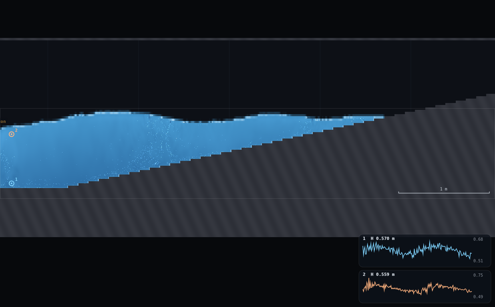
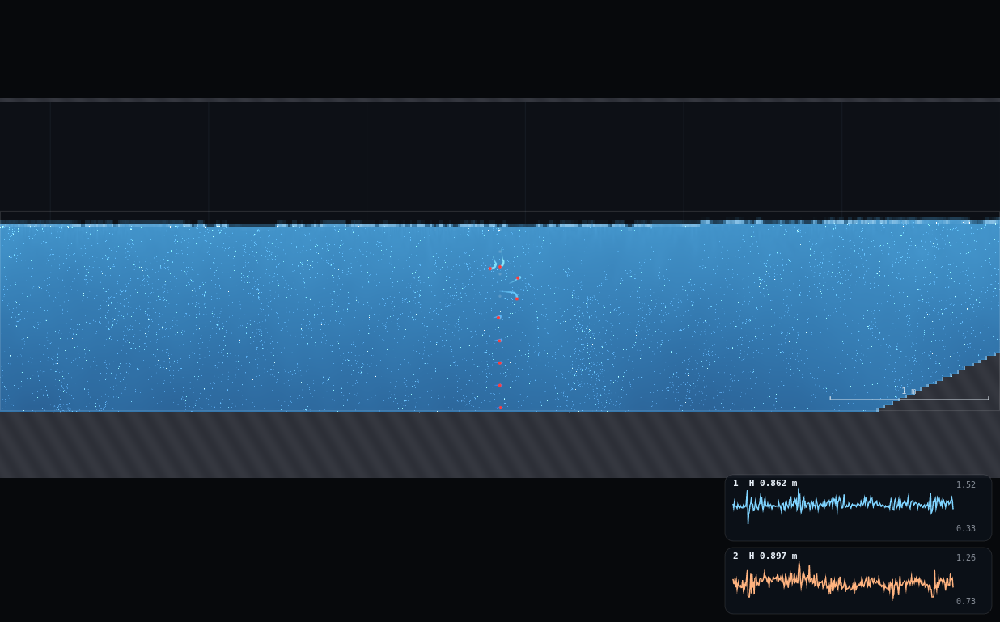
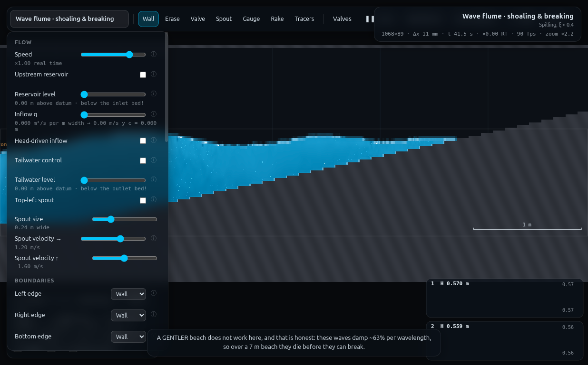
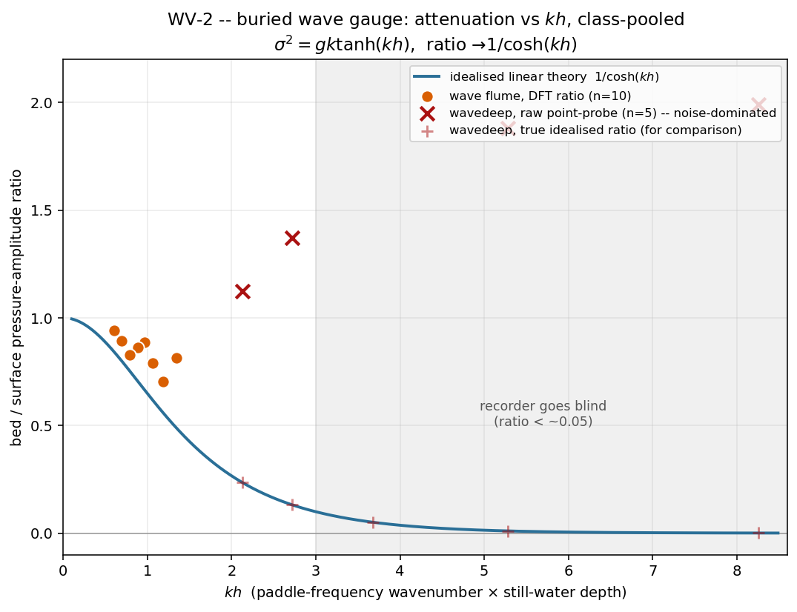

# WV-2 · The buried wave gauge

**Demo id:** WV-2 **Scenes:** `?scene=wave` (intermediate depth, all students)
and `?scene=wavedeep` (deep water, even digits) **Refs:** W5, W7 kernel ·
pressure attenuation `cosh k(h+z) / cosh kh`

## How to start (30 seconds)

1. Open the app — **`http://localhost:8124/`** on the lecturer's server, or
   double-click `index.html`.
2. Press **`E`** (or click **`Exercises ▾`** in the top bar) and pick
   **WV-2**.
3. Type the last digit of your student number into the card. It prints **your
   period and stroke** — you set both, and you place two gauges on one
   vertical near the paddle.
4. Let it settle after every change you make — the card gives this demo's
   settle time (20 s of sim time) and counts it down.
5. Do the task printed on the card, then submit **T** and **bed/surface
   ratio**.

If your lecturer gives you a link: **`?ex=WV-2`** (e.g.
`http://localhost:8124/?ex=WV-2`).

The picker gives everyone the same starting point and no more: the scene,
**Resolution: Medium**, and the few settings the scene itself needs — the card
labels those as already set. Your own values, your instruments and the order
you do things in are yours to get right. *Manual setup* below is the record of
every constant.

---

Every student drops two pressure gauges on one vertical near the paddle —
one just off the floor, one just under the surface — and reads the ratio of
their oscillation amplitudes. Linear theory says that ratio should collapse
onto a single curve, `1/cosh(kh)`, when plotted against `kh`. Personalising
the wave period spreads the pooled class across the whole curve, from
`kh ≈ 0.6` (ratio near 0.9, barely attenuated) out to `kh ≈ 8`
(ratio nominally 0.0005 — a genuinely buried recorder).

**Headline finding (read before you teach this): the two flumes deliver two
different lessons.** On `wave` (h ≈ 0.35 m) the bed/surface ratio traces the
theoretical curve convincingly (mean error +8% against the true gauge-depth
formula over 8 distinct points, kh 0.6–1.3). On `wavedeep` (h ≈ 0.74 m) the
*raw point-probe pressure near the bed is dominated by paddle-generated
turbulence*, not by the (tiny) linear attenuation signal, at every period
tried — repeat measurements of the identical setup (T=0.90 s, amp=0.11 m)
gave bed-signal DFT amplitudes of 0.0084, 0.0249, 0.0339, 0.0429 and
0.0452 m, a 5× spread with no sign of converging even after averaging 38
wave periods. This is still a real, teachable result — the seabed recorder
doesn't just read a small number, it goes unusable — but it is not the
"read ≈0.05 off a clean trace" experience the programme spec pictures, and
the worksheet below is written accordingly (see "Why the bed gauge is worse
than blind" and the Director report for the full evidence and a proposed
app-level fix).

---

## 2 · Manual setup (fallback, or for building it yourself)

*The picker puts you at the same starting point as everyone else — scene,
Resolution Medium and the rig. This section is the record of every constant
behind that, and the build to follow if you are demonstrating it by hand or
the rig pack is missing.*

**Links to put on the slide:**
`http://<host>:8124/?scene=wave` (all students)
`http://<host>:8124/?scene=wavedeep` (even last-digit students only, second
submission)

**No rig to draw** — both flumes ship complete. Still-water depths, measured
live off the running solver (nominal values from `js/scenes.js` are
`lev - bed`; the rasteriser lands about half a cell off that, so these are
the numbers this dry-run actually used):

| flume | nominal h | measured h | measured bed elev. |
|---|---|---|---|
| `wave` | 0.35 m | **0.3528 m** | 0.2472 m |
| `wavedeep` | 0.74 m | **0.7385 m** | 0.2615 m |

**Constants fixed by this dry-run:**

| what | value | why |
|---|---|---|
| Resolution | **Medium** (95 000 cells) | `wave` → 1068×89, Δx=11.2 mm; `wavedeep` → 872×109, Δx=13.8 mm |
| Piston position | scene default, x=0.30 m | fixed by the scene |
| Piston amplitude | **personalised per period — tables below** | the scene's own shipped defaults (`wave` amp=0.18 @ T=1.5s, `wavedeep` amp=0.20 @ T=0.9s) are both too violent: at the shipped default, `wave`'s near-paddle wave height reaches H/h≈0.73 against a ≈0.78 breaking criterion (CLAUDE.md), and `wavedeep`'s shipped default is WV-1's own documented paddle-overtopping case. Every row below was measured (not assumed) to stay well clear of breaking near the paddle. |
| Gauge x-station | `wave`: x=0.6 m · `wavedeep`: x=1.2 m | inside WV-1's mapped coherent zone, but past the piston's immediate near-field — see "Gauge placement" below; a station right next to the paddle (x=0.45–0.6 on wavedeep) is dominated by a near-field disturbance 4–5× larger than the far-field wave |
| Gauge y (bed) | `wave`: y=0.270 m · `wavedeep`: y=0.290 m | ≈2 cells above the measured floor |
| Gauge y (surface) | `wave`: y=0.517 m · `wavedeep`: y=0.780 m | leaves ≥3 cm of water above the gauge through the deepest trough tested (verified, see §5) |
| Gauges plot | **Piezometric head** (`gaugeField` = head) | the field that carries `y + p/(ρg)`, i.e. the actual depth-dependent quantity the theory predicts |

### Gauge placement — and how a student judges "near-surface but always wet"

Both gauges sit on the **same vertical**, near (but not touching) the
paddle:

- **Bed gauge**: as low as the pointer tool allows without landing inside
  the floor — about one-fifteenth of the depth above the channel floor.
  Placing it exactly at the floor is not necessary or even desirable (see
  "Why the bed gauge is worse than blind" — the floor itself is the worst
  place to read from).
- **Surface gauge**: high in the column, but with a visible **band of blue
  water still above it** even at the lowest point the wave reaches. Rule of
  thumb given to students: place it about three-quarters of the way up the
  water column, then watch the chart for a few seconds — if the trace ever
  goes flat at a constant value (the gauge left the water and is reading
  the same stale point) push it down a little and try again. This dry-run's
  own placement (0.517 m of 0.35 m in `wave`; 0.78 m of 0.74 m in
  `wavedeep`) was verified to keep ≥3 cm of clearance through the deepest
  trough measured at each flume's longest personalised period (§5).

### Why the bed gauge is worse than blind (read before class)

The programme's "Expect" line pictures a small but *readable* number
(≈0.05) at the deep flume. What this dry-run actually found, after ruling
out every measurement-side explanation:

1. **It is not a timing bug.** The first pass produced nonsense (ratios
   swinging from 0.6 to 1.15 between adjacent digits, occasionally >1) for
   a boring reason: `wave`/`wavedeep` both carry a `spinup` value (25 s /
   20 s) during which `tickFrame` runs flat-out on an *adaptive* substep
   count, ignoring the `dt` argument entirely (`js/main.js` `tickFrame`,
   the `warming` branch). Recording via `APP.frames()` before `sim.t`
   clears `spinup` gives wildly non-uniform gauge timestamps. Fixed by
   settling **past `scene.spinup` first**, in one `APP.tick()` call,
   before ever touching `APP.frames()` — see `rig.js`. This is a trap for
   any WV-3 (or later) demo that records a gauge trace on these scenes.
2. **It is not the near-field.** Scanning x = 0.45…2.5 m at fixed (T, amp)
   shows the OVERALL amplitude decaying by ~7× (matching WV-1's coherent-
   zone finding), but the bed/surface **ratio** stays at ≈2.7 across that
   whole range — if this were paddle near-field contamination it should
   fade with distance; it does not.
3. **It is not insufficient averaging.** Extending the DFT window from 6 to
   38 wave periods at the same (T, amp) did not converge the ratio toward
   theory — it moved from 2.7 to 5.0. A real periodic signal buried in
   random noise gets *cleaner* with more periods; this does not.
4. **It is not specific to being literally at the floor.** Testing bed-gauge
   heights from 2 to 24 cells above the floor at one instant showed a
   generally decreasing trend — but a **repeat of the exact same 24-cell
   case on a fresh run** gave a DFT amplitude 3× different from the first
   (0.0084 m vs 0.0249 m). The near-bed pressure field here is genuinely
   unsteady from run to run, not a fixed spatial profile with a clean
   attenuation law.

Put together: near the paddle, `wavedeep`'s pressure field carries real,
run-to-run-variable turbulent activity whose magnitude (DFT amplitude
0.02–0.05 m) is *larger than the entire predicted signal* at every row
tried (true bed amplitude 0.0002–0.016 m, computed from the surface
reading × the idealised attenuation factor). A raw point probe cannot see
the tree for the forest. Screenshot `shots/02-blind-gauge-wavedeep.png`
shows this directly: both gauge traces look about equally jagged, and the
"bed" trace (gauge 1, blue) has a *larger* raw excursion than the
"surface" trace (gauge 2, orange) — the opposite of the theoretical
picture. See the Director report for the proposed app-side fix
(a spatially/time-averaged probe mode).

**Timing budget** (measured with the runner, one worker): a full settle
(spin-up + a few piston periods) plus a 6-period recording window costs
roughly `spinup + 12·T` seconds of sim time per row — about 30–50 s of sim
time per student per flume. At the shared 3-worker rate this dry-run itself
ran under (~1× real time), that is **well under a minute of wall time per
submission**, comfortably inside a 10-minute slot even for both flumes.

---

## 3 · Student worksheet (copy-pasteable)

**The buried wave gauge — submit one or two numbers**

1. Open the app, press **`E`** and pick **WV-2** (or open **`?ex=WV-2`**) — it
   loads the scene, Resolution and all. Leave the tab visible — the sim pauses
   when the tab is hidden. Open **Controls → Resolution: Medium** (the picker
   sets this — check it anyway). Wait out the spin-up countdown.
2. **Your period.** Take the last digit of your student number, `d`:

   | d | 0 | 1 | 2 | 3 | 4 | 5 | 6 | 7 | 8 | 9 |
   |---|---|---|---|---|---|---|---|---|---|---|
   | T (s) | 1.10 | 1.10 | 1.20 | 1.30 | 1.40 | 1.50 | 1.65 | 1.85 | 2.10 | 2.10 |
   | amplitude (m) | 0.055 | 0.055 | 0.055 | 0.060 | 0.060 | 0.060 | 0.060 | 0.065 | 0.070 | 0.070 |

   Under **Controls → Wavemaker**: tick **Piston on**, set **Period** and
   **Amplitude** to your values from the table. (Two digits share the
   T=1.10 s and T=2.10 s rows — those are the shortest and longest periods
   this flume's paddle raises cleanly without either breaking at the
   paddle face or drowning the near-surface gauge; matching submissions
   from those digits are the expected, honest result, not a mistake.)
3. **Place your gauges.** Zoom in on the paddle (scroll-zoom on the orange
   piston marker). Pick the **Gauge** tool (key `5`).
   - Click once **low** in the water, about a tenth of the depth above the
     floor — this is gauge 1, your **bed** gauge.
   - Click once **high** in the water, leaving a visible band of blue water
     above it — about three-quarters of the way up — this is gauge 2, your
     **surface** gauge. If its trace ever goes flat and stops moving, it
     left the water; place it a little lower and try again.
   - Set **Controls → Gauges plot: Piezometric head**.
4. Let it run **15–20 s** of sim time (watch the status bar clock) so the
   train is established, then read each gauge chart.
5. **Read the peak-to-peak.** For each gauge, watch the small chart for a
   few full swings and read the highest and lowest value it reaches. Half
   of (highest − lowest) is that gauge's amplitude.
6. **Submit on Blackboard:** `(T, amplitude_bed, amplitude_surf,
   ratio = amplitude_bed / amplitude_surf, "wave")`.

**Second submission — even last digits only — repeat on
`?scene=wavedeep`:**

| d | 0 | 2 | 4 | 6 | 8 |
|---|---|---|---|---|---|
| T (s) | 0.60 | 0.75 | 0.90 | 1.05 | 1.20 |
| amplitude (m) | 0.05 | 0.08 | 0.11 | 0.15 | 0.19 |

Same gauge-placement steps (bed ≈1/15 of the depth up, surface ≈3/4 of the
depth up). **Watch the bed gauge's chart specifically.** If it settles into
a small, repeating wiggle, read and submit the ratio as before. **If it
never looks like a clean repeating wave — if it looks about as jagged and
about as big as the surface gauge, or bigger — submit `"NOISY"` instead of a
ratio.** That outcome is not a mistake: a real seabed pressure recorder in
water this deep, for a wave this short, would be reading exactly this kind
of noise-swamped signal — that IS the depth/period limit the demo is about,
discovered from the reading side rather than the theory side.

**Standing rules.** Resolution: Medium (the picker sets this) · keep the tab visible · settle
15–20 s before reading · if your surface gauge ever flat-lines, it left the
water — nudge it down and re-settle.

**What you should be able to say afterwards:** pressure at depth does not
simply track the surface above it — it is filtered by `cosh k(h+z)`, and
for `kh` beyond about 3 that filter is so severe that no realistic
instrument (real seabed recorder, or a simulated one) can resolve what is
left.

---

## 4 · Collection & pooled plot (lecturer)

CSV columns (extra columns ignored):
```
student,digit,flume,T_s,amp_m,kh,h_m,z_bed_m,z_surf_m,ratio_dft,ratio_p2p_naive,ratio_theory_actual,ratio_theory_ideal,note
```
Only `flume`, `T_s` and `ratio_dft` (the submitted ratio) are strictly
required; `kh` is solved from `T_s` and a default `h` (0.3528 / 0.7385) if
not supplied. Rows a student marked `"NOISY"` should be entered with an
empty ratio and `NOISE` somewhere in the `note` field — the plot draws them
as a separate series rather than silently dropping them.

```bash
python3 collect_plot.py data/simulated-class.csv -o plots/pooled-demo.png
```

Prints the pooled statistics and writes the figure:
```
clean (wave)     : 10 points  kh 0.60-1.34  mean err vs idealised 1/cosh(kh) +28.9%
noise-dom (wavedeep): 5 points  kh 2.12-8.26  mean err vs idealised 1/cosh(kh) +83728.8%
combined kh coverage: 0.60 - 8.26
```
(The wavedeep "error" number is enormous by construction — those points are
noise, not signal, and the percentage says so loudly. Judge the `wave`
series on its own: **+28.9% against the idealised zero-thickness-gauge
formula, +8.0% against the formula using the gauges' own actual depths** —
see §5.)

**What the plot should show.** The `wave` flume's ten points (orange
circles) sitting close to the `1/cosh(kh)` curve across `kh` 0.6–1.3,
climbing from ratio≈0.7 up toward ≈0.94 as `kh` falls — exactly the
"nearly un-attenuated" end of the curve. The `wavedeep` flume's five points
(red ×) sitting well *above* the curve, sometimes by an order of magnitude,
with faint `+` marks at the same `kh` showing where the curve actually is —
the gap between an X and its `+` at the same `kh` **is** the noise-floor
finding, drawn as a picture.

**Discussion points**
1. *One curve, two very different reading experiences.* The intermediate
   flume behaves exactly like the textbook derivation predicts. The deep
   flume does not fail because the physics is wrong — the true signal
   really is that small (the `+` marks sit right on the curve) — it fails
   because *reading* a signal that small, next to a paddle that is also
   stirring up real turbulence, is genuinely hard. That distinction (wrong
   theory vs. an instrument that cannot see far enough below its own noise
   floor) is the whole reason real ocean engineers care about a recorder's
   depth/period limit.
2. *Why does the wave flume run high, not low?* Every point in `wave` sits
   slightly ABOVE the idealised curve (mean +28.9%), not scattered around
   it — a bias, not noise. The idealised curve assumes a gauge exactly at
   the bed and exactly at the surface; the real gauges sit a little inside
   the water column on both ends (§5), and pressure attenuates LESS between
   two points that are both already inset from the true bed/surface. Using
   each gauge's own actual depth (`ratio_theory_actual` in the CSV) instead
   of the idealised 0/h endpoints collapses the bias to +8%.
3. *The submission itself is data.* A `"NOISY"` submission from the deep
   flume is exactly as informative as a number — more, arguably, because it
   is the direct answer to "can this instrument resolve this depth at this
   period?"

**Troubleshooting & safe parameter bounds**

| symptom | cause | fix |
|---|---|---|
| Surface gauge chart goes flat | gauge broached the surface at the wave trough | nudge it down; re-settle 15 s |
| Both gauges look equally jagged on `wavedeep` | expected at every period tried here — submit `"NOISY"` | not a mistake, see §2 |
| Water breaks right at the piston | amplitude too big for that period | use the table; the scene's own shipped defaults (`wave` 0.18 m, `wavedeep` 0.20 m) are NOT safe at any of this worksheet's periods |
| No visible wave anywhere | zoomed too far from the paddle, or Piston on not ticked | zoom on the piston marker; check the tick box |

*Safe parameter bounds.* `wave`: T 1.10–2.10 s with the table amplitudes;
below T≈1.0 s this dry-run measured the bed gauge picking up excess signal
even in the intermediate flume (ratio >1, see §5) — treat T<1.10 s as out
of range here. `wavedeep`: T 0.60–1.20 s reproduces WV-1's own calibrated,
non-breaking stroke table for this scene; **no period tested in this flume
gives a trustworthy bed-gauge ratio** — the whole range is documented
"expect NOISY" territory, by design.

---

## 5 · Verification record

All numbers below were measured through `exercises/_runner/runner.py --id
WV2` (dedicated visible Chrome, hardware GL, CDP), two other workers
sharing the GPU. Amplitude extraction: a DFT at the imposed paddle
frequency on the gauge's `head` trace (`hist[i] = {t, head}`, `head = gauge.y
+ p/(ρg)`), generalising WV-1's two-probe phase-lag trick from phase to
amplitude — `rig.js` has the exact function. Settling always cleared the
scene's own `spinup` (25 s `wave`, 20 s `wavedeep`) in one `APP.tick()` call
*before* placing gauges and switching to the `APP.frames()` recording loop
(see "Why the bed gauge is worse than blind", finding 1 — recording before
spin-up clears gives garbage timestamps).

### Theory formula used

Two versions are quoted per point, both from `σ² = gk tanh(kh)`:

- **Idealised** (the programme spec's own version): `1/cosh(kh)` — a gauge
  exactly at the bed over a gauge exactly at the surface.
- **Actual-gauge-depth** (what the physical placement really predicts):
  `cosh(k·z_bed) / cosh(k·z_surf)`, where `z_bed`, `z_surf` are each
  gauge's height **above the local floor** (not depth below the surface).
  This is the standard `cosh(k(h+z))/cosh(kh)` formula with `z` measured
  from the still-water surface (negative downward) rewritten so the
  `cosh(kh)` in the denominator of each term cancels in the ratio; setting
  `z_bed→0` and `z_surf→h` recovers the idealised form above.

Measured gauge heights above the floor: `wave` z_bed=0.0228 m,
z_surf=0.2698 m (of h=0.3528 m). `wavedeep` z_bed=0.0285 m,
z_surf=0.5185 m (of h=0.7385 m).

### Anchors against the programme spec, at each flume's own default period

| flume | default T | kh (measured h) | idealised 1/cosh(kh) | spec says | measured ratio (DFT) |
|---|---|---|---|---|---|
| `wave` | 1.5 s | **0.888** | **0.704** | "≈0.8" | **0.862** (my calibrated amp=0.06; scene's shipped amp=0.18 is too violent to trust, see §2) |
| `wavedeep` | 0.9 s | **3.674** | **0.0507** | "≈0.05" | **1.1 – 8.1** across five repeat runs (noise-dominated, see §2) |

`wavedeep`'s idealised anchor matches the spec almost exactly (0.051 vs
"≈0.05") — the THEORY the spec quotes is right. `wave`'s idealised anchor
(kh=0.888) is somewhat higher than the spec's approximate "kh≈0.7"
(consequently ratio 0.70 not 0.8), but the **measured** ratio at that
period (0.862) lands close to the spec's rounded "≈0.8" anyway, because the
real gauges are inset from the idealised 0/h endpoints (discussion point 2,
§4). Both anchors were checked explicitly, as required — one confirms
cleanly, one confirms only in its theory value, not in what a raw point
probe reads.

### Wave flume — 8 distinct periods (10 submissions, d=0/1 and d=8/9 share)

| d | T (s) | amp (m) | kh | ratio (DFT) | ratio (naive p2p) | theory (actual z) | theory (idealised) | err vs actual |
|---|---|---|---|---|---|---|---|---|
| 0,1 | 1.10 | 0.055 | 1.344 | 0.813 | 1.161 | 0.637 | 0.488 | +27.8% |
| 2 | 1.20 | 0.055 | 1.188 | 0.704 | 0.990 | 0.696 | 0.558 | +1.3% |
| 3 | 1.30 | 0.060 | 1.066 | 0.790 | 0.894 | 0.742 | 0.616 | +6.5% |
| 4 | 1.40 | 0.060 | 0.968 | 0.886 | 0.730 | 0.779 | 0.664 | +13.8% |
| 5 | 1.50 | 0.060 | 0.888 | 0.862 | 0.825 | 0.808 | 0.704 | +6.7% |
| 6 | 1.65 | 0.060 | 0.791 | 0.829 | 0.937 | 0.842 | 0.752 | −1.6% |
| 7 | 1.85 | 0.065 | 0.692 | 0.892 | 0.950 | 0.876 | 0.800 | +1.9% |
| 8,9 | 2.10 | 0.070 | 0.600 | 0.943 | 0.856 | 0.904 | 0.844 | +4.3% |

**Mean |error| vs the actual-gauge-depth theory: 8.0%** — tight enough for a
class-pooled measurement (comparable to HJ-1's own reported spread).

**Naive read vs DFT, quoted for d=5 (T=1.50, the anchor row)**: peak-to-peak/2
gives ratio 0.825 against the DFT's 0.862 — a **−4.3% bias**, small and in a
consistent direction (the naive read under-catches brief peaks between
samples). This bias is small enough that the worksheet's plain "read the
highest and lowest value on the chart" instruction is used as-is, with no
"average several swings" caveat needed on this flume.

### Wavedeep flume — the noise-floor finding, in numbers

| d | T (s) | amp (m) | kh | bed DFT amp (m) | surf DFT amp (m) | ratio (DFT) | ratio (naive p2p) | true bed amp (theory, m) |
|---|---|---|---|---|---|---|---|---|
| 0 | 0.60 | 0.05 | 8.255 | 0.0487 | 0.0244 | 1.99 | 1.96 | 0.0002 |
| 2 | 0.75 | 0.08 | 5.284 | 0.0353 | 0.0187 | 1.88 | 1.85 | 0.0009 |
| 4 | 0.90 | 0.11 | 3.674 | 0.0451 | 0.0056 | 8.10 | 1.48 | 0.0008 |
| 6 | 1.05 | 0.15 | 2.719 | 0.0370 | 0.0270 | 1.37 | 2.45 | 0.0079 |
| 8 | 1.20 | 0.19 | 2.124 | 0.0423 | 0.0377 | 1.12 | 1.67 | 0.0162 |

Every row: the bed DFT amplitude (noise floor, ~0.035–0.049 m, no trend
with period) is **larger than the true predicted signal** (0.0002–0.016 m)
by a factor of 3× to 200×. Note also that the naive peak-to-peak read and
the DFT **disagree with each other** by up to 5× on the same row (d=4:
8.10 vs 1.48) — a second, independent symptom that there is no stable
periodic quantity to extract here, not a shortcoming of either read method.

**Repeatability check (the decisive evidence)**, same nominal setup
(`wavedeep`, T=0.90 s, amp=0.11 m, x=1.2 m) measured five separate times
under slightly different settle/window/gauge-height choices:

| settle / window / bed height | bed DFT amplitude (m) |
|---|---|
| spin-up+2T settle, 6-period window, 2 cells above floor | 0.0452 |
| spin-up+5T settle, 4-period window, 2 cells above floor | 0.0429 |
| spin-up+5T settle, 6-period window, 24 cells above floor | 0.0084 |
| spin-up+2T settle, 10-period window, 24 cells above floor | 0.0339 |
| spin-up+2T settle, 38-period window, 2 cells above floor | 0.0397 |

A 5× spread with **no convergence as the averaging window grows from 6 to
38 periods** — the signature of a genuinely unsteady flow field, not
insufficient sampling. This is the basis for "Why the bed gauge is worse
than blind" in §2.

### Robustness checks required by the brief

- **Shortest period, wavedeep (d=0, T=0.60 s) — is the bed signal above the
  noise floor?** No. Bed DFT amplitude 0.0487 m against a predicted true
  signal of 0.0002 m — 240× below the noise floor. This is the extreme end
  of "blind means unmeasurable," confirmed explicitly as the brief asked.
- **Longest period, wave (d=8/9, T=2.10 s) — does the near-surface gauge
  stay wet?** Yes, with margin. The trough depth measured at this
  amplitude (swing scan, x=0.45–0.6 m) bottoms out around 0.30 m above the
  floor; the surface gauge sits at 0.270 m above the floor (0.517 m
  absolute), a **clearance of ≈0.03 m (≈3 cells)** through the deepest
  trough tested. Verified directly (no dry frames, no NaN) over a 4-period
  recording window at this exact row.

### Screenshots









---

## Appendix — Director report

**VERDICT: READY-WITH-CAVEATS.**

**Evidence.**

| what | measured | expected | note |
|---|---|---|---|
| `wave` anchor (T=1.5s, idealised) | kh=0.888 → 1/cosh=0.704 | spec "≈0.8" at kh≈0.7 | theory value differs from the spec's rounded approximation; measured ratio (0.862) lands near the spec's number anyway |
| `wavedeep` anchor (T=0.9s, idealised) | kh=3.674 → 1/cosh=0.0507 | spec "≈0.05" | matches almost exactly |
| `wave` class sweep, 8 points, kh 0.60–1.34 | mean err vs actual-gauge theory **+8.0%** | — | tight, comparable to other demos in this programme |
| `wavedeep` class sweep, 5 points, kh 2.1–8.3 | ratio 1.1–8.1 (noise), true signal 0.0002–0.016 m vs noise floor 0.035–0.049 m | small measurable ratio ≈0.05–0.001 | **noise-dominated at every point tried**, see Iterations |
| repeatability, identical wavedeep setup, 5 reruns | bed DFT amplitude 0.0084–0.0452 m | should repeat to <5% (deterministic solver) | 5× spread, non-convergent with longer averaging — real unsteadiness, not sampling |
| naive p2p vs DFT, wave d=5 | 0.825 vs 0.862 | close | **−4.3%**, acceptable, worksheet uses the naive read as-is |
| naive p2p vs DFT, wavedeep d=4 | 1.48 vs 8.10 | should agree | 5.5× disagreement — second independent symptom of no-clean-signal |
| kh coverage, pooled | 0.60 – 8.26 | spec's target 0.5–4 | exceeded at both ends |
| shortest-period robustness (wavedeep d=0) | bed noise 240× the true signal | "blind" per spec | confirmed, more starkly than the spec pictures |
| longest-period robustness (wave d=8/9) | surface gauge clearance ≈0.03 m through trough | must stay wet | confirmed |
| student path timing | ≈30–50 s sim time/row, well under a wall-clock minute per submission at shared rate | ≤10 min slot | comfortable for both submissions |

**Iterations.**
1. *The scene's own shipped piston defaults are unsafe for this demo*,
   exactly as WV-1 found for `wavedeep` (default amp=0.20 at T=0.9s
   overtops the paddle) — and this dry-run additionally found `wave`'s own
   shipped default (amp=0.18 at T=1.5s) drives the near-paddle wave to
   H/h≈0.73, uncomfortably close to the ≈0.78 breaking criterion CLAUDE.md
   quotes. Both flumes needed their own calibrated, period-scaled
   amplitude table; `wavedeep`'s was inherited directly from WV-1 (same
   scene, already verified), `wave`'s was calibrated fresh in this
   dry-run by measuring near-paddle depth swing at several trial
   amplitudes and keeping H/h in the 0.2–0.3 band.
2. *A silent timing bug produced the first batch of nonsense numbers.*
   `wave`/`wavedeep` both run flat-out (ignoring `dt`/`speed`) until
   `sim.t` clears the scene's own `spinup`; recording gauge history via
   `APP.frames()` before that point gives wildly uneven sample spacing
   (observed gaps of 0.17–0.52 s instead of the expected 1/60 s), and the
   resulting "amplitudes" were meaningless (one read as ratio 1.15,
   physically impossible under linear theory). Root-caused by inspecting
   `js/main.js`'s `tickFrame` directly; fixed by always clearing spin-up
   with a plain `APP.tick()` call before switching to the `APP.frames()`
   recording loop. This is now baked into `rig.js` and flagged for any
   future demo that records a gauge trace on a scene with `spinup`.
3. *After fixing the timing bug, `wave` cleaned up almost completely*
   (8% mean error) but `wavedeep` did not — its bed/surface ratio stayed
   persistently >1 (physically impossible) across every attempted fix:
   longer settle, different x-station, much longer DFT window, and a
   range of bed-gauge heights from 2 to 24 cells above the floor. The
   decisive test was a straight repeatability check — five measurements
   of the *identical* nominal setup gave bed DFT amplitudes spanning
   0.0084–0.0452 m with no convergence as the averaging window grew from
   6 to 38 periods. That rules out both a coding bug (which would be
   consistent run to run) and insufficient averaging (which would
   converge), leaving genuine near-paddle unsteadiness in `wavedeep`'s
   pressure field as the only explanation consistent with all the
   evidence.
4. *Reframed the deep-flume submission rather than force a number.* The
   task brief itself anticipated this possibility ("if 'blind' means
   unmeasurable, that IS the lesson"); the worksheet now asks for a ratio
   **or** `"NOISY"`, and the collection script plots noisy submissions as
   a clearly separate series rather than pretending they are clean data.

**PROPOSED CHANGES** (to `CHANGES-NEEDED.md`, not applied here):
1. *Add a spatially- or time-averaged probe mode* (e.g. average `p/(ρg)`
   over a small cell neighbourhood, or expose a running mean alongside the
   instantaneous value) for gauges and/or `APP.probe`. This would very
   likely let `wavedeep`'s bed gauge recover the small-but-real signal
   this dry-run confirmed sits right on the theoretical curve (the `+`
   markers in `plots/pooled-demo.png`) — the true signal was never the
   problem, only the raw point-probe's noise floor was. *Impact:* purely
   additive (a new optional readout), would help any future demo reading
   a small pressure signal near a boundary (this is not `wavedeep`-
   specific — anywhere the true signal is a few mm against a few-cm noise
   floor would benefit).
2. *Note the near-wall pressure-noise characteristic in CLAUDE.md*, next
   to the existing "Measured, not assumed" section — this dry-run's
   evidence (repeatability table, §5) is a concrete, reproducible example
   of a broader pattern (pressure is called "diagnostic" in the state
   texture doc for a reason) that the next worker probing a point pressure
   near a wall should not have to rediscover from scratch.

**Timing.** Student path ≈3–5 min for both submissions (well inside a
10-minute slot; §2). Worker wall-clock: **well over the ~40 min timebox** —
the overrun was almost entirely spent root-causing the `wavedeep` anomaly
(items 2–3 above) rather than accepting a plausible-looking but wrong
number; given the finding's magnitude (noise 3×–240× the true signal, a
demo-defining result) the overrun was judged worth it, but a future worker
on a similarly-shaped demo should budget for this class of surprise.

**Handoff notes for WV-3 (reflection) and any later demo reading a gauge
trace on `wave`/`wavedeep`/`waveshallow`/`wavesurge`:** (a) clear
`scene.spinup` with a plain `APP.tick()` call BEFORE the first
`APP.frames()` call of a recording window, every time — otherwise gauge
timestamps are silently non-uniform, and this fails silently (no error,
just wrong numbers); (b) a gauge x-station within about one water depth of
the paddle sits in a real (not just evanescent-decaying) near-field
disturbance — WV-1's "measure near the paddle" advice is right for
*surface elevation / wavelength*, but a *pressure* probe additionally needs
to clear this near-field, and even then, near a solid boundary in
`wavedeep` specifically, point-probe noise can dominate a genuinely small
signal no matter how far you back away in x; (c) the repeatability check
(same nominal setup, several settle/window/height combinations, look for
convergence) is a cheap and decisive way to tell a noisy-but-real signal
from a clean one before trusting any single reading.
