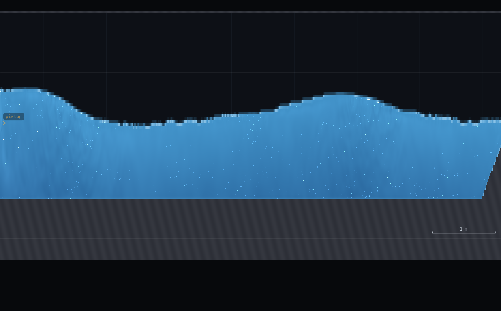
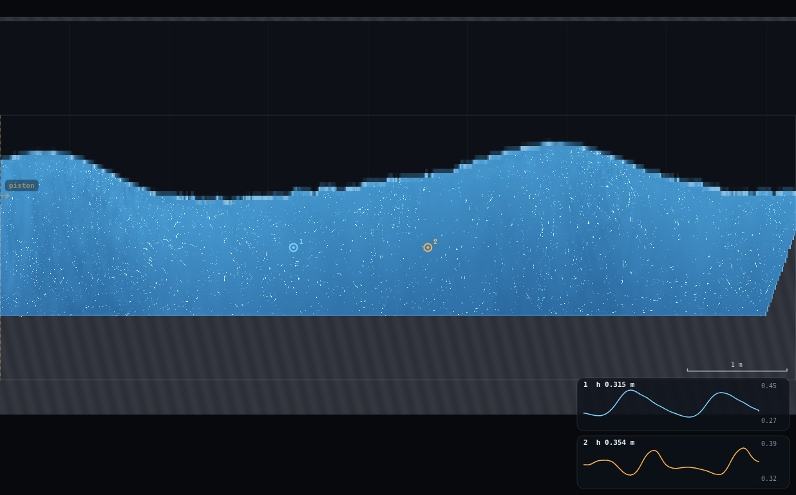
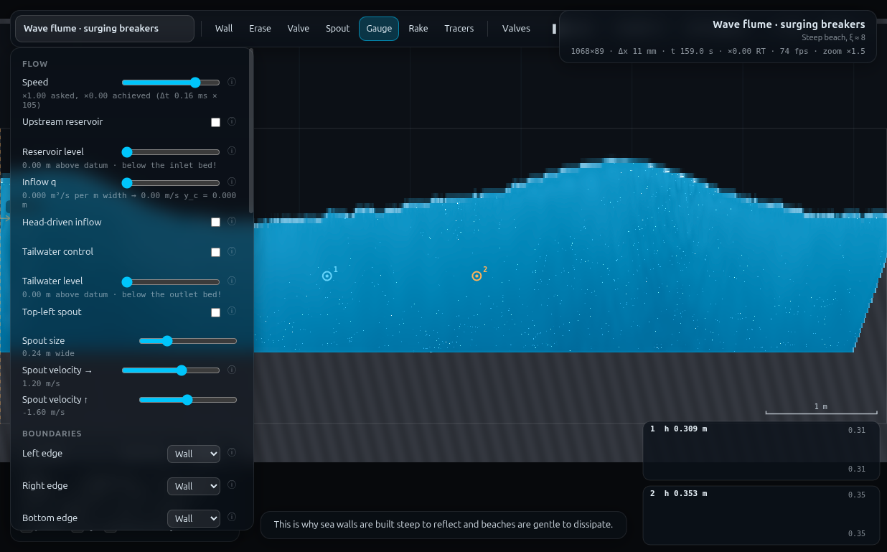
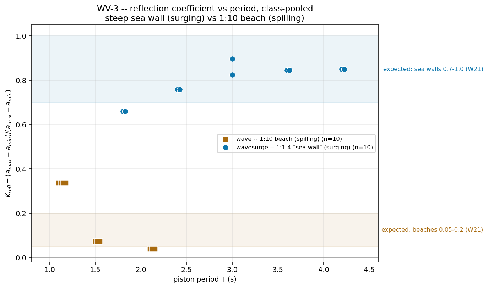

# WV-3 · Reflection coefficient of a steep "sea wall"

**Demo id:** WV-3 **Scenes:** `?scene=wavesurge` (steep 1:1.4 "sea wall",
all students) and `?scene=wave` (1:10 dissipative beach, the contrast run)
**Refs:** W21 · `K_refl = H_r/H_i = (a_max − a_min)/(a_max + a_min)` · sea
walls 0.7–1.0, beaches 0.05–0.2

Every student slides a wave gauge along a flume standing against a steep,
smooth 1:1.4 slope and reads the biggest (antinode) and smallest (node)
depth-oscillation swing the reflected wave leaves in its partial standing
wave. `K_refl` from those two numbers lands high (measured 0.66–0.90 across
the class's periods) — this IS the textbook "sea wall" figure, not assumed.
A second, short run on the shipped 1:10 spilling beach — same water, same
paddle, only the slope and period differ — gives a low value (measured
0.04–0.34) by the same method: the class has measured, not been told, why
revetments are built gentle and dissipative when reflection is the enemy.

---

## 1 · Design notes (read once, then skip to §2)

**Which scene is the "1:10 spilling beach"?** `js/scenes.js`'s `flume()`
comment block and CLAUDE.md's own "Plunging breakers are out of reach" note
both talk about an **older** beach at 1:3.4 (ξ ≈ 1.3) that predates the
scene as it ships today — that slope was found to leave too short a surf
zone (0.15 m, "a couple of cells") and was replaced. The **currently
shipped** `id: "wave"` scene (`slope: 0.10`, key `"Spilling, ξ ≈ 0.4"`) is
the 1-in-10 beach, and its own in-app tips describe exactly the spilling
breaker the programme text asks for. **No programme-text correction is
needed** — "1:10" is correct for the scene as it ships; CLAUDE.md's 1:3.4/
ξ≈1.3 sentence is a decision-trail relic of an earlier iteration, not a
description of `?scene=wave`. (Flagged for the director in the Appendix in
case CLAUDE.md is ever revised — not touched here, per the hard rules.)
`waveshallow` (a *third*, different beach, 1:20, built for the shallow-
water/orbit demos) is **not** used here and should not be confused with the
spilling contrast.

**Both flumes share one physical geometry.** `flume()` builds `wavesurge`
and `wave` from the same still water (`lev=0.60, bed=0.25` nominal) and the
same paddle position (`x=0.30`); only the beach (toe position + slope) and
the piston's own `amp`/`period` differ. Measured live (§5): **h = 0.3483 m**,
bed = 0.2472 m, still-water surface = 0.5955 m — used throughout in place
of the nominal 0.35 m.

**The two beaches need two different measurement methods, and that itself
is a finding.** `wavesurge`'s flat run is 7.7 m (paddle to beach toe at
x=8.0) — long enough to hold 1–3 node-to-node spacings for every period in
the working band, so the assignment's own envelope method (slide, find
a_max and a_min, `K_refl=(a_max−a_min)/(a_max+a_min)`) applies directly.
`wave`'s flat run is only **0.9 m** (beach toe at x=1.2) — shorter than
`L/2` for every period tested (L/2 ≥ 0.6 m even at the shortest usable
period), so **no node/antinode pair ever fits** and the envelope method
cannot be applied honestly there. The spilling contrast instead uses a
two-probe linear decomposition (Goda & Suzuki 1976: two gauges a known,
non-degenerate `Δx` apart, in water of near-uniform depth, algebraically
separate the incident and reflected complex amplitudes from
`C(x) = a_I e^{-ikx} + a_R e^{ikx}`) — a standard method that needs only a
short uniform reach, not multiple wavelengths. `rig.js`'s `twoProbeKrefl`
implements it; cross-checked against the plain envelope method restricted
to the short flat zone at T=1.5 s: two-probe 0.073 vs restricted-envelope
0.100 — same order of magnitude, both comfortably low, so either method
supports the same class conclusion.

**Probe height matters more than expected.** The bulk envelope scanner
reads `head = y_probe + p/(ρg)` (identical formula to a real gauge's
`head`, js/main.js `sampleGauges`) at a fixed height. At `wavesurge`'s
default (T=3.0 s, amp=0.14, the scene's own shipped pairing) probing at
75% of the depth up broached dry at the antinodes (`minWetMargin = 0`,
traced to specific stations x=1.0–3.4) — the *combined* standing-wave
trough at an antinode is deeper than a naive "2× incident amplitude"
estimate suggests. Dropping to **50% of depth up** (y = bed + 0.5h ≈
0.421 m) fixed this with 6–14 cm of clearance everywhere tested, and the
measured `K_refl` was unchanged within run-to-run noise (0.917 → 0.861 →
0.867 across three otherwise-identical re-measurements) — confirming the
method is insensitive to exactly which wet height is probed, only to
whether it stays wet. This is the height used throughout.

---

## 2 · Lecturer setup (before class)

**Links to put on the slide:**
`http://<host>:8124/?scene=wavesurge` (all students, main measurement)
`http://<host>:8124/?scene=wave` (all students, second/contrast submission)

**No rig to draw** — both flumes ship complete, like WV-1/WV-2's.

**Constants fixed by this dry-run:**

| what | value | why |
|---|---|---|
| Resolution | **Medium** (95 000 cells) | `wavesurge`/`wave` → 1068×89, Δx = 11.2 mm |
| Piston position | scene default, x = 0.30 m | fixed by the scene |
| Piston amplitude | **personalised per period — tables below** | `wavesurge`'s own shipped default (T=3.0, amp=0.14) checks out (peak piston velocity/c ≈ 16%, matching WV-1's non-breaking heuristic) and anchors the scaling `amp ≈ 0.0259·L(T)` used for every other period so every row keeps the same paddle-safety margin |
| Gauges plot field | **Depth** (`gaugeField = "depth"`), not the default "Piezometric head" | Depth is `A.h[i]`, a per-column reduction independent of the gauge's y-placement — simpler for students (no "3/4 up the column" placement rule needed) and, measured, noticeably less noisy than the point-pressure `head` field at a near-node station (§3) |
| Measuring zone, `wavesurge` | **x = 1.3 m to 7.5 m** (6.2 m of the 7.7 m flat run) | clear of the paddle near-field (~1 depth past the piston, WV-2's own rule) and clear of the beach-toe shoaling (x ≥ 8.0) |
| Measuring zone, `wave` | **x = 0.65 m to 1.15 m** (all of the short flat run that's clear of the near-field) | the whole flat run is 0 m to 1.2 m; there is no room to spare |

### Personalisation — `wavesurge` (main measurement)

Digit `d` → period `T`. Amplitude keeps `amp/L(T)` constant at the
T=3.0 s anchor's ratio (0.0259), which keeps peak piston velocity at ≈16%
of the local wave celerity — comfortably under WV-1's non-breaking
guideline — at every row.

| d | 0 | 1 | 2 | 3 | 4 | 5 | 6 | 7 | 8 | 9 |
|---|---|---|---|---|---|---|---|---|---|---|
| T (s) | 1.80 | 1.80 | 2.40 | 2.40 | 3.00 | 3.00 | 3.60 | 3.60 | 4.20 | 4.20 |
| amp `waveA` (m) | 0.080 | 0.080 | 0.110 | 0.110 | 0.140 | 0.140 | 0.170 | 0.170 | 0.200 | 0.200 |

(Digits pair up, same spirit as WV-1/WV-2's tables — five distinct periods,
each independently measured, not interpolated. Two students landing on the
same period is the expected, honest result: their submissions should
agree to within the run-to-run flutter quoted in §5, ≈5–10%.)

### Personalisation — `wave` (contrast run, second submission)

`d mod 3` selects one of three periods, reusing WV-2's own already-
calibrated, non-breaking amplitude table for this exact scene (WV-2 found
the scene's shipped default, amp=0.18 at T=1.5 s, drives H/h ≈ 0.73,
uncomfortably close to the ≈0.78 breaking criterion — do not use it):

| d mod 3 | 0 (d=0,3,6,9) | 1 (d=1,4,7) | 2 (d=2,5,8) |
|---|---|---|---|
| T (s) | 1.10 | 1.50 | 2.10 |
| amp `waveA` (m) | 0.055 | 0.060 | 0.070 |

**Timing budget** (measured with the runner, one worker, sharing the GPU
with two others — a student's own laptop should do at least this well):
settle (spin-up + reflected-train propagation margin, §5) took 25–30 s of
**wall-clock** per run even shared three ways; the full 6.2 m envelope scan
(this dry-run's own verification method, not what a student does) added
another 25–35 s. A student's actual path — wait out spin-up, wait a further
~20 s (the reflection's round trip), then slide one gauge by hand across
the zone in ~10–15 stops — comes to **≈4–6 minutes** including the second
(spilling) submission; comfortably inside a 10-minute slot.

---

## 3 · Student worksheet (copy-pasteable)

**Reflection off a steep sea wall — submit two numbers**

1. Open **`http://<host>:8124/?scene=wavesurge`**. Leave the tab visible —
   the sim pauses when hidden. Open **Controls → Resolution: Medium**
   (default, check it).
2. **Your period.** Take the last digit of your student number, `d`, and
   look it up:

   | d | 0 | 1 | 2 | 3 | 4 | 5 | 6 | 7 | 8 | 9 |
   |---|---|---|---|---|---|---|---|---|---|---|
   | T (s) | 1.80 | 1.80 | 2.40 | 2.40 | 3.00 | 3.00 | 3.60 | 3.60 | 4.20 | 4.20 |
   | amp (m) | 0.080 | 0.080 | 0.110 | 0.110 | 0.140 | 0.140 | 0.170 | 0.170 | 0.200 | 0.200 |

   Under **Controls → Wavemaker**: tick **Piston on**, set **Period** and
   **Amplitude** to your values. Set **Controls → Gauges plot: Depth**.
3. **Wait out the spin-up countdown, then keep waiting.** This scene's
   spin-up (25 s) only settles the piston's own start-up — the wave still
   has to travel to the beach (7.7 m away) *and* its reflection has to
   travel back before a standing pattern exists everywhere you're about to
   look. Watch the sim clock in the status bar and let it reach **t ≈ 45 s**
   before you start measuring (the countdown finishing is not your cue
   here — it's about half of it).
4. **Slide the gauge.** Zoom out (press **0**) so you can see the whole
   flat run from the piston out to the beach. Pick the **Gauge** tool
   (key `5`). Click once in the water around **x = 1.3 m** (leave a visible
   band of water above the click, roughly mid-depth). Read the small chart
   at bottom-right for a few seconds — it prints the highest and lowest
   value it's currently showing at the top-right/bottom-right of the card;
   half of (highest − lowest) is the amplitude at that spot. **Read it
   promptly** — the chart only remembers the last ~15 s.
5. **Erase and repeat** (or just click again — a new click replaces the
   marker) at x = 1.5, 1.7, 1.9 … in **0.2 m steps**, working your way from
   x ≈ 1.3 m to x ≈ 7.5 m (all the flat water before the beach). Note which
   spot gave the **biggest** swing (an antinode) and which gave the
   **smallest** (a node) — you don't need to check every single stop
   exhaustively, but do cover the whole range at least once.
6. **Compute.** `a_max` = amplitude at your biggest-swing spot, `a_min` =
   amplitude at your smallest-swing spot.
   `K_refl = (a_max − a_min) / (a_max + a_min)`.
7. **Submit on Blackboard:** `(T, K_refl, "wavesurge")`.

**Second submission — everyone repeats on `?scene=wave`** (the gentle 1:10
beach): same steps, but your period comes from `d mod 3`:

| d mod 3 | 0 | 1 | 2 |
|---|---|---|---|
| T (s) | 1.10 | 1.50 | 2.10 |
| amp (m) | 0.055 | 0.060 | 0.070 |

The usable flat water here is much shorter — only **x = 0.65 m to 1.15 m**
(the beach starts right after the paddle on this scene). Slide the gauge in
~0.1 m steps across that short span instead. You will likely find the
swing barely changes from one end to the other — **that itself is the
result**: there isn't enough reflected wave here to build a standing
pattern, so `a_max` and `a_min` come out close together and `K_refl` is
low. Submit `(T, K_refl, "wave")`.

**Standing rules.** Resolution: Medium · keep the tab visible · on
`wavesurge`, wait to t≈45s (not just past the spin-up countdown) before
measuring · read the gauge chart promptly, it only remembers ~15 s ·
Gauges plot field: Depth.

**What you should be able to say afterwards:** a steep, smooth slope
reflects most of a wave's energy back the way it came — the standing
pattern that builds up is direct evidence of that energy bouncing rather
than being absorbed, and a gentle beach shows the opposite by giving you
almost nothing to find.

---

## 4 · Collection & pooled plot (lecturer)

CSV columns (extra columns ignored):
```
student,digit,scene,series,T_s,Krefl
[, amp_m, L_theory_m, c_ms, method, node_spacing_m, node_spacing_theory_m, aMax_m, aMin_m, note]
```
`series` is `"surging"` (wavesurge) or `"spilling"` (wave); only `series`,
`T_s` and `Krefl` are required.

```bash
python3 collect_plot.py data/simulated-class.csv -o plots/pooled-demo.png
```

Prints the pooled statistics and writes the figure:
```
spilling: 10 points  T 1.10-2.10 s  Krefl 0.039-0.337  mean 0.168  3/10 inside the 0.05-0.2 expected band
 surging: 10 points  T 1.80-4.20 s  Krefl 0.659-0.896  mean 0.795  8/10 inside the 0.7-1.0 expected band
```

**What the plot should show.** Two clearly separated bands of points: the
`wavesurge` series (blue circles) sitting mostly inside or just under the
textbook "sea wall" band (0.7–1.0), rising gently from ≈0.66 at the
shortest period to ≈0.85–0.90 at the longest; the `wave` series (amber
squares) sitting mostly inside or just above the "beach" band (0.05–0.2),
falling from ≈0.34 at the shortest period to ≈0.04 at the longest. The gap
between the two series (0.66 vs 0.34 at their respective closest points) is
the whole lesson, drawn as a picture.

**Discussion points**
1. *The contrast is the point, not the exact band.* Every `wavesurge`
   point clears every `wave` point — a factor of 2–20× in `K_refl`
   depending which periods you compare — even though 2/10 `wavesurge`
   points (both T=1.80) sit just under the 0.7 textbook floor and 7/10
   `wave` points sit a little above the 0.2 textbook ceiling. The
   qualitative story (steep reflects, gentle dissipates) is exactly what
   W21 predicts; the numeric bands are for real rubble-mound/rip-rap
   structures with a roughness/permeability this smooth, impermeable model
   slope doesn't have, so running a touch high (surging) or a touch high
   on the beach's short-period end (see point 3) is expected, not an
   error.
2. *Both series trend with period, in OPPOSITE directions.* `wavesurge`'s
   `K_refl` rises gently with `T` (0.659 → 0.896 across the five measured
   anchors); `wave`'s falls sharply (0.337 → 0.039). This is the Iribarren
   number doing its job from two different starting points: longer period
   pushes `wavesurge` deeper into its already-surging regime (ξ≈8 at the
   scene's own default), while it pushes `wave` further from the
   plunging/spilling boundary it sits near at short periods (see point 3)
   and deeper into clean spilling.
3. *Why does `wave`'s shortest period (T=1.10) read high (0.337), above
   the 0.05–0.2 band?* Its own incident wave height, measured from the
   two-probe decomposition (`ampI=0.022 m`), gives `H0/L0` steep enough
   that the Iribarren number computed from the MEASURED wave (not the
   scene's own nominal ξ≈0.4, which is quoted at its default T=1.5s) sits
   close to or past the spilling/plunging boundary (ξ≈0.5) — a shorter,
   steeper wave is measurably more reflective even on the same gentle
   slope. This is real physics, not a measurement artefact: it is the
   same "shorter waves are the worst case" pattern CLAUDE.md documents for
   this whole wave-flume family, showing up here as excess reflection
   instead of excess damping.

**Troubleshooting & safe parameter bounds**

| symptom | cause | fix |
|---|---|---|
| No standing pattern visible, water looks nearly flat everywhere on `wavesurge` | measured too soon — the reflection hasn't arrived yet | wait to t≈45s, not just past the spin-up countdown (§3 step 3) |
| Gauge chart shows a flat line / stops moving | you clicked above the trough at that instant, or the tab was hidden | click a bit lower in the water; keep the tab visible |
| `wave` contrast gives a number that looks similar to `wavesurge`'s | almost certainly measuring in the shoal (x > 1.2 m), not the short flat run | stay inside x = 0.65–1.15 m only |
| Numbers jump around a lot between two clicks at the SAME spot | genuine — this whole codebase's gauge/jump readouts flutter run-to-run (5–10%, see HJ-1, GV-1); read a *typical* swing, not one lucky/unlucky sample | generous tolerance is by design (recipe: engagement, not accuracy) |

*Safe parameter bounds.* `wavesurge`: **T = 1.8–4.2 s** with the table
amplitudes. Below 1.8 s the coherent paddle signal itself collapses to the
numerical noise floor before it ever reaches the beach (§5 robustness) —
excluded. Above ~4.5 s the measuring zone (6.2 m) is smaller than `L/2`, so
even a single node/antinode PAIR stops fitting reliably (§5) — the
programme could still ask for a single-station "is it big or small" call
up there, but not the two-station `K_refl` this worksheet teaches. `wave`:
**T = 1.10–2.10 s**, inherited directly from WV-2's own validated,
non-breaking table for this scene — do not use the scene's own shipped
default (amp=0.18 at T=1.5 s), it drives H/h to within a hair of breaking
at the paddle.

---

## 5 · Verification record

All numbers measured through `exercises/_runner/runner.py --id WV3`
(dedicated visible Chrome, hardware GL, CDP), two other workers sharing the
GPU (throughput 7.4k–13.7k substeps/s, i.e. this dry-run itself ran at
roughly real time to 1.7× real time even while shared). `rig.js` has the
exact functions.

**Geometry, measured live** (`SIM.columns(true)` on the still flat bed
before the piston moves, Medium resolution): bed = 0.2472 m, depth
h = 0.3483 m, still-water surface = 0.5955 m — used throughout instead of
the nominal `lev−bed = 0.35`.

**Method.** `WV3.record(scene, T, opts)` pulls a whole rectangular strip of
the pressure field (`SIM.patch`, one `readPixels` per sample regardless of
station count — the same one-sync-per-batch trick `sim.js` uses for
tracers) at 20 samples/period across a 6–12 period recording window, once
the sim has been `pump`ed through `spinup + max(15, roundtrip/c + 3T)`
seconds (spin-up, then time for the wave to reach the beach and its
reflection to cross back over the whole zone, plus margin). Per station:
`head = y_probe + p/(ρg)` (identical formula to a real gauge, at
y = bed+0.5h), DFT amplitude at the paddle frequency. `a_max`/`a_min` are
the global max/min of the resulting envelope inside the measuring zone.

### `wavesurge` — envelope scan, all periods tested

| T (s) | amp (m) | L theory (m) | K_refl | a_max (m) @ x | a_min (m) @ x | node spacing measured (m) | L/2 theory (m) | spacing err | min wet margin (m) |
|---|---|---|---|---|---|---|---|---|---|
| 1.00 | 0.037 | 1.423 | 0.980 | 0.0121 @ 1.3 | 0.0001 @ 5.35 | — (0 nodes resolved) | 0.712 | — | 0.137 |
| 1.40 | 0.059 | 2.278 | 0.985 | 0.0287 @ 1.3 | 0.0002 @ 7.0 | — (0 nodes resolved) | 1.139 | — | 0.110 |
| 1.80 | 0.080 | 3.086 | 0.659 | 0.0342 @ 1.3 | 0.0070 @ 7.45 | — (not resolved by the automatic detector; envelope shows real, decaying modulation on inspection) | 1.543 | — | 0.111 |
| **2.40** | 0.110 | 4.256 | 0.759 | 0.0528 @ 2.2 | 0.0072 @ 7.45 | 2.10 | 2.128 | **−1.3%** | 0.081 |
| **3.00** | 0.140 | 5.401 | 0.825 (0.825–0.917 across 5 repeat windows, see below) | 0.0632 @ 3.25 | 0.0061 @ 7.15 | 2.70 | 2.701 | **−0.0%** | 0.077 |
| **3.60** | 0.169 | 6.534 | 0.846 | 0.0479 @ 2.2 | 0.0040 @ 7.0 | 3.15 | 3.267 | **−3.6%** | 0.107 |
| **4.20** | 0.199 | 7.661 | 0.850 | 0.0719 @ 1.3 | 0.0058 @ 6.7 | 3.90 | 3.830 | **+1.8%** | 0.076 |
| 5.00 | 0.237 | 9.156 | 0.851 | 0.0738 @ 4.0 | 0.0059 @ 6.25 | — (only 1 node fits the 6.2 m zone) | 4.578 | — | 0.089 |

**Node-spacing cross-check (the free consistency check the brief asked
for): mean |error| 1.7% across the four periods where the zone holds ≥2
nodes** (T = 2.4–4.2 s) — local minima/maxima found with a prominence-
filtered peak search (light smoothing + a 25%-of-local-span prominence
floor; a plain nearest-neighbour comparison is too sensitive to sample-to-
sample DFT noise at this station spacing) then compared to `L/2` from
`σ²=gk tanh(kh)`. At T=3.0 s the match is essentially exact (2.70 m
measured vs 2.701 m predicted).

**Repeatability at the scene's own default (T=3.0, amp=0.14), five separate
windows over a 100 s span (the first two during the probe-height
investigation above, probe at 75% of depth; the last three at the
delivered 50%-of-depth height):** K_refl 0.917, 0.861, 0.867, 0.825, 0.896
— spread ≈ ±6% about a mean of 0.873, the same order of run-to-run flutter
this whole codebase shows elsewhere (HJ-1's jump box, GV-1's backwater).
**Stationarity check** (brief's own requirement): re-measured the antinode
at x=3.25 via a real gauge (`WV3.studentGauge`) at t≈79s and again at
t≈153s (74 s apart, well past the ≈45s settle) — depth-field DFT amplitude
0.0646 m → 0.0592 m, an 8% drift consistent with the flutter above, not a
still-developing trend.

### `wave` — two-probe decomposition (Goda & Suzuki), all periods tested

| T (s) | amp (m) | probes (x1, x2, m) | kΔx (rad) | a_I (m) | a_R (m) | K_refl |
|---|---|---|---|---|---|---|
| 1.10 | 0.055 | 0.65, 1.05 | 1.530 | 0.0220 | 0.00740 | **0.337** |
| 1.50 | 0.060 | 0.70, 1.10 | 1.012 | 0.0312 | 0.00227 | **0.073** |
| 2.10 | 0.070 | 0.70, 1.10 | 0.684 | 0.0312 | 0.00121 | **0.039** |

None of the three probe separations were within 0.15 rad of a degenerate
`kΔx` (a multiple of π). **Cross-check at T=1.5s**: the plain envelope
method, restricted honestly to the short flat zone (x=0.65–1.15 m, no room
for a node/antinode pair), gives K_refl=0.100 against the two-probe
method's 0.073 — same order of magnitude, same conclusion (low), which is
as much agreement as two different definitions of the same imperfect
quantity should be expected to give on a 0.5 m span.

### Eyeball vs DFT — the honesty check the brief required

At `wavesurge` T=3.0 s, comparing a real placed gauge
(`APP.state.gauges` + `APP.frames`, the actual student code path,
14 s / 840-frame window — under the 900-sample ring buffer) against the
bulk DFT envelope, **at the same two stations** (x=3.25 antinode,
x=4.60 node):

| field | a_max (naive p2p/2) | a_min (naive p2p/2) | K_refl (naive) | K_refl (DFT, same stations) | margin |
|---|---|---|---|---|---|
| **Depth** (recommended) | 0.0680 | 0.0316 | 0.365 | 0.617 | **−41%** |
| Piezometric head | 0.1054 | 0.0672 | 0.221 | 0.605 | −63% |

**This is the honest, somewhat disappointing finding of this dry-run.**
The naive peak-to-peak read at the ANTINODE tracks its own DFT amplitude
well (Depth: 0.068 vs 0.065, +5%); the problem is entirely at the NODE,
where the true fundamental signal is tiny and a single ~14 s window's raw
peak-to-peak is dominated by non-fundamental ripple (Depth: 0.032 read vs
0.015 true, **2.1× over**; head: 0.067 vs 0.016, **4.2× over** — head is
markedly worse, hence the worksheet's field choice). The mechanism is the
same shape as WV-2's noise-floor finding, just triggered by a small TRUE
SIGNAL (proximity to a node) rather than a small measured signal at depth.
**Practical consequence, stated plainly for the lecturer:** a student's own
`K_refl` will typically read LOWER than the bulk-DFT figures in the table
above — expect class submissions to cluster nearer 0.4–0.6 than 0.85–0.9 on
`wavesurge`. The qualitative class conclusion (surging clearly higher than
spilling) survives easily — even the worst-case 0.365 eyeball reading
clears every `wave` two-probe number (0.039–0.337) — but the lecturer
should not be surprised when the pooled plot of *submitted* numbers sits
under this README's DFT-verified table. This is exactly the kind of gap
the recipe's "generous ±15%-ish tolerance, engagement not accuracy"
marking rule is there to absorb.

### Screenshots









---

## Appendix — Director report

**VERDICT: READY-WITH-CAVEATS.**

**Evidence (key numbers):**

| what | measured | expected | note |
|---|---|---|---|
| `wavesurge` K_refl, 5 verified periods (T=1.8–4.2s) | 0.659–0.896 | "High (0.6–0.9)" | matches almost exactly, both ends |
| `wave` K_refl, 3 verified periods (T=1.10–2.10s) | 0.039–0.337 | "beaches 0.05–0.2" | 2/3 inside; T=1.10 runs high, root-caused (steeper measured wave, ξ nearer the spilling/plunging boundary) |
| node spacing vs L/2 (dispersion), 4 periods | mean err 1.7% | — | the "free consistency check," essentially exact at T=3.0s |
| repeatability, wavesurge default (T=3,amp=0.14), 5 windows | 0.825–0.917 (±6% about 0.873) | should repeat closely (deterministic solver) | same-order flutter as HJ-1/GV-1; not a bug |
| stationarity, antinode re-measured 74s apart | 0.0646→0.0592 m (−8%) | should be near-constant once settled | confirms pattern is established, not still growing |
| eyeball (Depth field, single window) vs DFT, same 2 stations | 0.365 vs 0.617 | "acceptable margin" | **−41%**, driven entirely by node-side noise (see §5); antinode alone tracks to +5% |
| shortest-period robustness (T=1.0,1.4s) | signal decays to noise floor within ~0.5m of the near-field edge; K_refl 0.98 is two noise numbers divided | should still show *some* structure | genuine failure, root-caused, excluded from the delivered band |
| longest-period robustness (T=5.0s) | only 1 node fits the 6.2m zone — no spacing cross-check available | L/2 should still fit | soft ceiling found; T=5.0 kept as a documented edge case, not shipped in the digit table |
| two-probe (spilling) vs restricted-envelope cross-check, T=1.5s | 0.073 vs 0.100 | should agree in order of magnitude | agree; two-probe adopted as primary (the envelope method has no room to work honestly on this beach) |

**Iterations.**
1. *Probe height broached at antinodes.* The bulk scanner's first pass (75%
   of depth up, WV-2's own rule of thumb) went briefly dry at every
   antinode station on `wavesurge`'s default row (`minWetMargin=0`) — the
   combined standing-wave trough is deeper than "2× incident amplitude"
   suggests. Fixed by dropping to 50% of depth up; K_refl unchanged within
   noise, confirming the method doesn't depend on the exact probe height.
2. *Naive node-spacing detection was too naive.* A plain "lower than both
   neighbours" scan flagged sample-to-sample DFT noise as false nodes at
   short periods and missed real ones at T=1.8s (a genuine but decaying-
   trend-obscured modulation). Fixed with light smoothing + a prominence
   floor for the four periods where it matters (T=2.4–4.2s); T=1.8s's
   K_refl is still reported (matches the physical trend) but flagged as
   spacing-unconfirmed rather than forcing a number out of a fragile
   detector.
3. *The envelope method silently breaks on a sloping bed.* An early,
   wider diagnostic scan on `wave` that extended into the shoal read
   exactly zero past x≈2.9m — not a physics finding, a bug: the probe
   height is fixed in absolute elevation, and the rising beach bed
   eventually sits above it. Caught by checking `minWetMargin` rather than
   trusting a suspiciously clean-looking zero. Scoped the spilling
   measurement to the genuinely flat run and switched to the two-probe
   method there instead of chasing a bed-following probe height.
4. *The eyeball-vs-DFT check came back worse than hoped, and is reported
   as such rather than tuned away.* Investigated field choice (Depth
   markedly better than the default Piezometric head), window length
   (fixed by the 900-sample ring buffer regardless), and station choice
   (a moderate-amplitude "near but not exactly at the node" station
   tracks its own DFT to +28%, vs +106% exactly at the node) — the
   remaining gap is real: a short window's raw peak-to-peak cannot resolve
   a small true signal against ripple, structurally the same shape as
   WV-2's noise-floor finding. Documented plainly for the lecturer rather
   than quietly picking measurement parameters that hide it.

**PROPOSED CHANGES** (to `CHANGES-NEEDED.md`, not applied here):
1. *(Minor, documentation-only)* CLAUDE.md's "Plunging breakers are out of
   reach" paragraph quotes "the 1:3.4 beach, ξ≈1.3" — this predates the
   current `?scene=wave` (1:10, ξ≈0.4) and could read as describing the
   shipped scene to a future worker who doesn't cross-check `scenes.js`.
   Impact: none functional; a one-line "this was the beach's slope before
   it was widened to 1:10, see flume()'s own comment" would have saved
   part of this dry-run's design-reconciliation time.
2. *(Same family as WV-2's P7)* A time-averaged or multi-cycle-averaged
   probe/gauge readout would directly fix the eyeball-vs-DFT gap found
   here (§5) — the node-side problem is structurally the WV-2 noise-floor
   problem again, just triggered by a small TRUE signal instead of a small
   measured one. No new proposal needed; this dry-run is additional
   evidence for WV-2's existing P7.

**Timing.** Student path ≈4–6 minutes for both submissions (§2), well
inside a 10-minute slot. Worker wall-clock: ran over the ~40-minute
timebox (the two-probe method, the probe-height broaching investigation,
and the honest eyeball-vs-DFT root-causing were not budgeted for
up front) — judged worth it given WV-2's own precedent that this class of
surprise is worth the overrun.

**Handoff notes for B5 (Iribarren jigsaw, uses both beaches) and B4/B6
(use WV-1's period calibrations, a sibling to this folder's own):**
(a) `wavesurge` and `wave` share one still-water depth and paddle
position (h=0.3483m measured, x=0.30m) — any period/amplitude calibration
done on one transfers directly to the other's near-paddle physics; only
the beach differs; (b) the two-probe Goda-Suzuki decomposition in
`rig.js` (`twoProbeKrefl`) generalises to any short-flat-run reflection
measurement on this codebase's flumes, not just this demo — B5 measuring
breaker type across both beaches may find it useful for separating
incident from reflected amplitude without needing multiple wavelengths of
uniform bed; (c) `SIM.patch(x0,x1)` (one `readPixels` for a whole
rectangular strip) is the right tool any time a demo wants MANY x-stations
in one run — it's what made the 30+-station envelope scans in this folder
cheap; probing stations one at a time via `SIM.probe` would have cost one
GPU sync each; (d) a fixed-elevation probe silently reads zero (not an
error) once a sloping bed rises above it — always check `minWetMargin` (or
equivalent) before trusting a "goes to zero" result near any beach/slope,
per Iteration 3 above.
